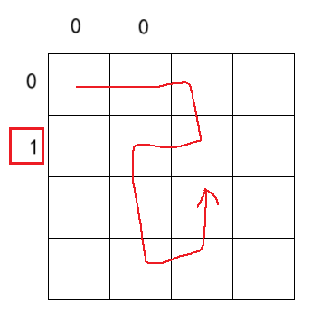

# 1 全排列问题 dfs原理和模版

## 搜索的概念

搜索，是一种枚举，通过穷举所有的情况来找到最优解，或者统计合法解的个数。因此，搜索有时候也叫作暴搜。

搜索一般分为深度优先搜索(DFS)与宽度优先搜索(BFS)。

举个例子，全排列问题例如`n=3`时可以用三层循环枚举三个空位，当所有空位都不相同时就得到了一种结果。

```cpp
#include<iostream>
using namespace std;

int main() {
    for (int i = 1; i <= 3; i++)
        for (int j = 1; j <= 3; j++)
            for (int k = 1; k <= 3; k++)
                if (i != j && j != k && k != i)
                    cout << i << ' ' << j << ' ' << k << endl;
    return 0;
}
```

但`n`不止等于3，还能等于4，甚至等于10，代码不支持写这么多的循环，写了这么多循环还要做同等数量的判断或用别的数据结构。因此这么多的循环并不能行。因此还得想其他办法。

除了循环还可以画树状图：


通过对树状图的所有情况的枚举，可以发现全排列问题可以转化成树形结构后，再进行一次遍历，遍历时提取信息即可。

所以搜索的本质：对这个**树形结构**（有的书把它称做**决策树**）来一次**遍历**，直到把**所有的情况全部收集**。

所以做搜索题（特别是深度优先搜索）分两个步骤：

1. 画决策树
2. 根据决策树写代码

既然是对树的遍历，树的遍历还涉及两个重要的概念：

* 回溯：当在搜索的过程中，遇到走不通或者走到底的情况时，就回头。例如遍历树的过程中的某层递归结束。
* 剪枝：剪掉在搜索过程中，剪掉重复出现或者不是最优解的分支。 

在对全排列问题分析时也用到了剪枝：


在树的数据结构的学习中还会遇到深度优先遍历和宽度优先遍历的概念，它们和深度优先搜索、宽度优先搜索的区别：
遍历是形式，搜索是目的。不过，在一般情况下，我们不会去纠结概念的差异，两者可以等同。

## 全排列问题 洛谷

[P1706 全排列问题 - 洛谷 | 计算机科学教育新生态 ](https://www.luogu.com.cn/problem/P1706)

之前已经提到过3层循环解决3个数的全排列问题：

```cpp
#include<iostream>
using namespace std;

int main() {
    for (int i = 1; i <= 3; i++)
        for (int j = 1; j <= 3; j++)
            for (int k = 1; k <= 3; k++)
                if (i != j && j != k && k != i)
                    cout << i << ' ' << j << ' ' << k << endl;
    return 0;
}
```

显然不能用这种方法去枚举所有情况。尝试使用决策树：


可以发现，在填3个空格的时候，可以先填第1个空，有3种填法：`1 _ _`、`2 _ _`、`3 _ _`，这样这个问题就变成了子问题：用数字填剩下的两个空。

因此可以想到用递归实现：**每层递归管理一个格子**，且**递归内用循环枚举**`[1,3]`表示所有的情况来填当前格子。当**递归深度**超过3时则说明填完了一个情况，应结束函数的进行。因为递归的本质是自己调用自己，而且是在同一个栈空间内申请空间运行的函数，所以上层递归函数结束运行后对下层递归函数除了**公共的全局变量或传址的形参**外，几乎不会有任何影响，这样就完成了**回溯**。

为了实现每个数字只用1次，还需要一个标记数组`vis`标记每个数字的状态。定义`bool`数组`flag`，若`flag[i]==1`，说明这个数字用过，则应该避免使用这个数字填当前格子。

同时还需要一个数组`ans`用于记录结果。

### 参考程序

```c
#include<stdio.h>

int flag[10];
int ans[10];

//深度优先搜索
void dfs(int n,int depth){
	if(depth>n){
		int i=0;
		for(i=1;i<=n;i++){
			printf("%5d",ans[i]);
		}
		printf("\n");
		return;
	}//递归层数到达限制，处理结果
	int i=1;
	for(i=1;i<=n;i++){
		if(flag[i]==1)
			continue;
		flag[i]=1;//标记状态，下层枚举时跳过这层 
		ans[depth]=i;//记录答案 
		dfs(n,depth+1);//前往下一层 
		flag[i]=0;//回到之前的状态
		//depth因为是函数附属的形参所以自带回溯
	}
}

int main() {
    int n;
	scanf("%d",&n);
	dfs(n,1);
	return 0;
}
```

通过参考程序复原决策树

但这个算法的时间复杂度一般都是平方甚至是指数级，若递归太深还会导致栈溢出。所以dfs也有很大的局限性。为了降低复杂度和减少栈溢出，有很多技巧（有的大佬称之为剪枝）可以进行。

### 根据决策树分析时间复杂度

深度优先搜索只看代码的话很难分析时间复杂度，所以需要从背后的原理，也就是决策树来分析。


根据决策树，最后一层的叶结点数是$A_n^n=n!$，然后是处理结果时用到了$n$次输出，再然后是每层递归都有$n$次循环，因为标记变量的存在，使得每层递归的循环次数可能呈现$\{n,n-1,\cdots,2,1\}$的趋势，所以时间复杂度方程为$\frac{n(n+1)}{2}+n\times n!$，将上升慢的多项式剔除后，最终的时间复杂度是$O(n\times n!)$。

根据测试，这个代码最多能在1秒的时间内完成$n=9$的运算，再往上就会超时，测试平台是洛谷。

### dfs通用模版

模拟两层循环的dfs模版：

```c
void dfs(int depth, 其他参数){//depth用于标记递归深度，可以没有
    if(depth太深不给往下走了或其他情况){
        整理状态;
        return;
    }
    if(其他情况（如果有的话，虽然可以放在一个if里处理）){
        整理状态;
        return;
    }
    //...
    for(初始情况;是否枚举完了所有情况;){
        if(情况1不符合条件)
            continue;
        if(情况2不符合条件)
            continue;
        //...
        标记状态;
        处理当前情况;
        dfs(depth+1，其他参数);
        将标记的状态回溯到原来的样子;
    }
}
```

个人更喜欢用这个，因为在比赛的环境下，自己并不能一下子想到所有不符合条件的情况或状态，所以用这个模版的话想到一个添加一个，也不用修改之前的判断。

当然，模版并不唯一，只要能理解整个思路，以及整理好实际问题的所有状态，就能用dfs解决问题。

> dfs的7个步骤：
>
> 1. 确定状态，即决定递归函数的形参用什么。
> 2. 确定非法状态，某个状态不符合要求（比如递归深度太大），则结束函数。
> 3. 枚举状态。
> 4. 确定非法路径。
> 5. 更新状态。
> 6. 前往下层递归。
> 7. 回溯。


# 2 填棋盘

这类题可以比喻为地上有若干个坑，每两个坑或者多个坑之间彼此都有联系，如何填坑才能保证坑全部填完。

## 素数环OJ

[2110：【例5.1】素数环](http://ybt.ssoier.cn:8088/problem_show.php?pid=2110)

即在有`n`个坑位的环中填数字，其中任意两个相邻的整数之和为素数。

所以填数的条件有2个：

1. 这个坑的左边和右边都没填过。
2. 这个坑的左边或右边有1个没填过，另一个填过的坑和当前数互为质数。
3. 两边的坑都被填过，但都和当前数互为质数。

所以在搜索过程中，需要分别对左边和右边的坑进行一次判断。

参考程序：

```c
#define _CRT_SECURE_NO_WARNINGS 1

/*
http://ybt.ssoier.cn:8088/problem_show.php?pid=2110
*/

#include<iostream>
#include<cmath>
#define endl "\n"
using namespace std;

bool flag[31] = { 0 };
int n = 0;
int ans[31] = { 0 };//数据范围不超过30，所以数组开31个空间

bool prime(int x) {//判断素数
	if (x == 2)
		return true;
	if (x < 2)
		return false;
	int i = 2;
	while (i <= sqrt(x) && x % i != 0)
		i++;
	if (x % i == 0)
		return false;
	return true;
}

inline int judg(int x) {//防止数据越界
	if (x > n)
		return 1;
	if (x < 1)
		return n;
	return x;
}


void dfs(int depth) {
	if (depth == n+1) {//所有空位都填满了
		flag[0] = true;
		return;
	}
	for (int i = 1; i <= n; i++) {
		if (flag[i])//这个数字用过
			continue;
        
        //上一个空填有数字，并且i和那个数字的和不是素数
		if (ans[judg(depth - 1)] != 0 && !prime(i + ans[judg(depth - 1)]))
			continue;
		if (ans[judg(depth + 1)] != 0 && !prime(i + ans[judg(depth + 1)]))
			continue;
		ans[depth] = i;
		flag[i] = true;
		dfs(depth + 1);
		if (!flag[0]) {//如果凑齐了一个环，就不回溯，等所有递归解除回到main函数
			flag[i] = false;
			ans[depth] = 0;
		}
	}
}

int main()
{
	cin >> n;
	dfs(1);
	for (int i = 1; i <= n; i++)
		cout << ans[i] << ' ';
	return 0;
}
```


### 新的dfs模版

```c
void dfs(int depth, 其他参数){//depth用于标记递归深度，可以没有
    if(depth太深不给往下走了或其他情况){
        整理状态;
        return;
    }
    if(其他情况（如果有的话，虽然可以放在一个if里处理）){
        整理状态;
        return;
    }
    //...
    for(初始情况;是否枚举完了所有情况;){
        if(符合条件){
            标记状态;
            处理当前情况;
            dfs(depth+1，其他参数);
            将标记的状态回溯到原来的样子;
        }
    }
}
```


## 八皇后问题 状态压缩

[1213：八皇后问题](http://ybt.ssoier.cn:8088/problem_show.php?pid=1213) 

很经典的搜索与回溯题。递归枚举行，每层递归枚举列，标记对角线，路径不合适再退出递归进行回溯，直到填满8个坑。

### 朴素解法

说是朴素，其实是通过枚举的方式来标记横、竖和两条对角线。在第一次拿到这个题，不知道状态压缩的时候需要知道怎么填。

```c
#define _CRT_SECURE_NO_WARNINGS 1

#include <iostream>
using namespace std;
int vis[9][9], queue[9][9];//vis标记位置，queue记录王后位置
int dx[] = { 0,1,1,1,0,-1,-1,-1 },//8个方向
dy[] = { 1,1,0,-1,-1,-1,0,1 };
int cnt = 0;

void mark(int depth, int r, int flag) {//标记状态
	int x = depth, y = r;
	for (int i = 0; i < 8; i++) {//枚举方向
		while (x > 0 && x < 9 && y > 0 && y < 9) {
			vis[x][y] += flag;//为不影响其他状态，采用叠加的方式
			x += dx[i];
			y += dy[i];
		}
		x = depth, y = r;
	}
}

void dfs(int depth) {
	if (depth > 8) {
		cout << "No. " << ++cnt << endl;
		for (int i = 1; i <= 8; i++) {
			for (int j = 1; j <= 8; j++)
				cout << queue[j][i] << ' ';//样例是沿左上到右下的对角线翻转180°
			cout << endl;
		}
		return;
	}
	for (int i = 1; i <= 8; i++) {
		if (vis[depth][i] > 0)
			continue;
		queue[depth][i] = 1;//记录王后位置
		mark(depth, i, 1);//标记行、列、对角线
		dfs(depth + 1);
		queue[depth][i] = 0;//回溯
		mark(depth, i, -1);//释放标记
	}
}

int main() {
	dfs(1);
	return 0;
}
```

### 状态压缩及N皇后问题

如图所示。对角线的状态还可以继续压缩。


因为递归的原因，递归深度很高的情况下，低深度的行即使不用标记，也不会影响整体枚举。

根据方案改进的N皇后问题参考程序：

```c
#define _CRT_SECURE_NO_WARNINGS 1

#include <iostream>
#include<vector>
using namespace std;
int n = 8;
int* diagonal1 = NULL;//记录左上到右下对角线情况
int* diagonal2 = NULL, //记录右上到左下对角线情况
* col = NULL;//记录列的情况
int cnt = 0;

void vis(int depth, int i, int flag) {
	col[i] = flag;
	diagonal1[depth - i + n] = flag;
	diagonal2[depth + i - 1] = flag;
}

void dfs(int depth, vector<vector<int>>& queue) {
	if (depth > n) {
		cout << "No. " << ++cnt << endl;
		for (int i = 1; i <= n; i++) {
			for (int j = 1; j <= n; j++)
				cout << queue[j][i] << ' ';
			cout << endl;
		}
		return;
	}
	for (int i = 1; i <= n; i++) {
		if (col[i] > 0)
			continue;
		//检测两条对角线是否被标记
		if (diagonal1[depth - i + n] > 0)
			continue;
		if (diagonal2[depth + i - 1] > 0)
			continue;

		queue[depth][i] = 1;
		vis(depth, i, 1);
		dfs(depth + 1, queue);
		vis(depth, i, 0);
		queue[depth][i] = 0;
	}

}

int main() {
	//cin >> n;
	diagonal1 = (int*)malloc(sizeof(int) * n * 2);
	if (diagonal1 == NULL) return 0;
	for (int i = 0; i < n * 2; i++)
		diagonal1[i] = 0;

	diagonal2 = (int*)malloc(sizeof(int) * n * 2);
	if (diagonal2 == NULL) return 0;
	for (int i = 0; i < n * 2; i++)
		diagonal2[i] = 0;

	col = (int*)malloc(sizeof(int) * n + sizeof(int));
	if (col == NULL) return 0;
	for (int i = 0; i <= n; i++)
		col[i] = 0;

	vector<vector<int>>queue(n + 1, vector<int>(n + 1));
	dfs(1, queue);
	free(diagonal1);
	free(diagonal2);
	free(col);
	return 0;
}
```

## 棋盘问题 坑位无规律

[1114. 棋盘问题 - AcWing题库](https://www.acwing.com/problem/content/1116/) 

类似八皇后问题，但没有斜线限制。

所以可以设置表示状态的形参：列，棋子数

根据八皇后问题得出的理论，行不用做标记。但若决定放棋子在某位置，则下一层搜索要从下一行开始。

同一列可能存在多个可选择的点，而且若采用八皇后问题的固定一行搜索一行的思路，棋子放完就完成一种排列方式，则因为棋子数小于行数，会存在有的行没有考虑进去的情况。故需要遍历整个二维数组。

例如这个样例：

```
4 3
##.#
#.#.
####
####//用八皇后的枚举方式，这一行会被忽视
```


参考程序：

```c
#include<iostream>
using namespace std;
int n,k;
char pct[20][20];
bool col[20]={false};
int ans=0;

void dfs(int dep,int num){
	if(num>k){
		++ans;return;
	}
	for(int i=dep;i<=n;i++){
		for(int j=1;j<=n;j++){
			if(pct[i][j]=='.') continue;
			if(col[j]) continue;
			col[j]=1;//标记完列就算放了棋子，题目没问放哪，就省去这个记录
			dfs(i+1,num+1);//从下一行开始搜
			col[j]=0;
		}
	}
}

int main()
{
	while(cin>>n>>k,n!=-1){
		for(int i=1;i<=n;i++)
			for(int j=1;j<=n;j++)
				cin>>pct[i][j];
		ans=0;
		for(int i=1;i<=n;i++) col[i]=0;
		dfs(1,1);
		cout<<ans<<'\n';
	}
	return 0;
}
```

## 数独

[P1784 数独 - 洛谷](https://www.luogu.com.cn/problem/P1784)

递归枚举每个点，最多有81层递归，只要不在函数里面申请大量的数组，其他的辅助数组全部放在全局变量不占用递归的空间，还是够用的。

搜索用的递归函数的形参用`(h,l)`，即某个点的具体位置。在搜之前先检查点是否合法，即若`l`超过了8或9，则`h++,l=0;`。若`h`超过了`8`或`9`，则说明找到了答案，没必要再找下去。此时需要用一个标记变量辅助递归函数结束进程，或直接用`exit`。

递归函数内部枚举要填的数。注意一个数在对应的行、列和九宫格用过的记录要用数组标记，不要用键值对、哈希表等封装的工具，否则很可能超时。

用数组表示的话，`h`和`l`要从下标0开始，只有这样才能用`h/3`和`l/3`表示数字所在的宫格的位置。

参考程序：

```cpp
#ifndef _CRT_SECURE_NO_WARNINGS
#define _CRT_SECURE_NO_WARNINGS 1
#endif

#include <bits/stdc++.h>
#include <unordered_map>
using namespace std;

int pct[10][10];
bool H[10][10], L[10][10], G[10][10][10];
bool flag = 0;

void dfs(int h, int l) {
    if (l >= 9) {
        h++; l = 0;
        if (h >= 9) {
            flag = 1;
            return;
        }
    }
    if (flag)
        return;
    if (pct[h][l]) {
        dfs(h, l + 1);
        return;
    }
    for (int i = 1; i <= 9; i++) {
        if (H[h][i] || L[l][i] || G[h / 3][l / 3][i])
            continue;
        H[h][i] = L[l][i] = G[h / 3][l / 3][i] = 1;
        pct[h][l] = i;
        dfs(h, l + 1);
        if (flag)
            return;
        H[h][i] = L[l][i] = G[h / 3][l / 3][i] = 0;
        pct[h][l] = 0;
    }
}

int main() {
    for (int i = 0; i < 9; i++) 
        for (int j = 0; j < 9; j++) {
            cin >> pct[i][j];
            if (pct[i][j]) {
                H[i][pct[i][j]] = L[j][pct[i][j]]
                    = G[i / 3][j / 3][pct[i][j]] = 1;
            }
        }
    dfs(0, 0);
    for (int i = 0; i < 9; i++) {
        for (int j = 0; j < 9; j++) {
            cout << pct[i][j] << ' ';
        }
        cout << endl;
    }
    return 0;
}
```


# 3 （类）迷宫问题

这类问题最大的特点是给定一个迷宫（一般是特殊的矩阵或图的邻接矩、邻接表等），寻找从起点到终点的路径，或判断这样的路径是否存在，以及求起点到终点的最短路径等。

如果用深搜的话，每层递归就好像身在迷宫的某个位置（状态），根据各种限制条件和准许的移动方向移动到下一个位置。

解决迷宫问题除了深搜，还可以用广搜，启发式搜索。这里主要介绍深搜在这种迷宫问题中的应用。

## letters

[1212：LETTERS](http://ybt.ssoier.cn:8088/problem_show.php?pid=1212)

每层递归表示一个格子，走向下个格子时有4个方向，根据限制条件比如界外、遍历过和墙壁的格子不能走来选择路径，找出能走的最远的路。


```c
#ifndef _CRT_SECURE_NO_WARNINGS
#define _CRT_SECURE_NO_WARNINGS 1
#endif
#include<iostream>
using namespace std;

char pct[21][21] = { '\0' };
//不知道给的是小写字母还是大写字母，所以全部的ASCII字符都标记
bool vis[128] = { false };
int x, y;
int dx[] = { 0,0,1,-1 },//右左下上4个方向
dy[] = { 1,-1,0,0 };
int maxx = 0;

void dfs(int depth, int sx, int sy) {//sx, start x
    //想不到什么非法状态，于是不做判断
    //递归深度也想不到怎么限制，因为样例有可能把
    //所有的格子都走一次
	for (int i = 0; i < 4; i++) {//枚举能走的方向
		//下一步的落脚点
		int nx = sx + dx[i], ny = sy + dy[i];
        
        //越界判断
		if (nx < 0 || nx >= x)
			continue;
		if (ny < 0 || ny >= y)
			continue;
        
        //判断是否来过
		if (vis[pct[nx][ny]] == true)
			continue;
        
		vis[pct[nx][ny]] = true;
		dfs(depth + 1, nx, ny);
		vis[pct[nx][ny]] = false;
	}
	maxx = max(maxx, depth);//每层递归都只有4个方向，图也有大小限制，所以不用考虑溢出的情况，直接统计最大值
}

int main() {
	cin >> x >> y;
	for (int i = 0; i < x; i++)
		for (int j = 0; j < y; j++)
			cin >> pct[i][j];
    
    //在c语言中，char型数据当整型用时返回ASCII码
    //标记起点
	vis[pct[0][0]] = true;
	dfs(1, 0, 0);
	cout << maxx;
	return 0;
}
```

## 数字接龙 蓝桥真题 标记路径技巧

[5.数字接龙 - 蓝桥云课](https://www.lanqiao.cn/problems/19712/learning/?page=1&first_category_id=1&status=3) 

这道题是在迷宫问题的基础上加限制，即在原有方向的基础上再加限制条件——不能穿过对角线，只能按规定的格子走。

这其实是好事，因为加了限制后就不用担心会出现走重复路线的情况引起超时，可大胆地使用dfs。

根据判断对角线的方法，可以分成2种做法，但他们都是一样的标记对角线，核心思路都是一样的。

1. 用四维数组。

例如`vis[sx][sy][nx][ny]`指的是从(sx,xy)到(nx,ny)这条路径有没有被走过。对这种多维数组，只要赋予下标准确含义，理解它并不难。

但判断对角线是否走过的话要注意这种情况：


所以判断一个对角线是否走过最好正向和反向都判断，或正向反向都标记。

参考程序：

```c
#include<iostream>
#include<cstring>
#include<string>
using namespace std;
#define endl '\n'
typedef unsigned long long ull;
int n, k;
int pct[11][11];//picture
int dx[] = { -1,-1,0,1,1,1,0,-1 }, //如果题目给了明确方向，最好按他给的来
dy[] = { 0,1,1,1,0,-1,-1,-1 };
bool vis[11][11] = { 0 };//标记点
bool visd[11][11][11][11] = { 0 };//标记路径
string tmp, ans;
bool flag = 0;

void dfs(int sx, int sy, int kk) {
	if (sx == n && sy == n && tmp.size() == n * n - 1) {
		flag = 1;
        //根据测试，ans第一次赋值即为字典序最小。
        //这里是做题时考虑到可能找到更小的于是对
        //所有情况都做一次判断
		if (ans > tmp || ans.empty())
			ans = tmp;
		return;
	}
	for (int i = 0; i < 8; i++) {
		int nx = sx + dx[i], ny = sy + dy[i];
		if (nx<1 || nx>n || ny<1 || ny>n)
			continue;
		if (kk + 1 == k)
			kk = -1;
		if (vis[nx][ny]) continue;
		if (pct[nx][ny] != kk + 1) continue;
        //正向、反向都判断
		if (visd[sx][ny][nx][sy]) continue;
		if (visd[nx][sy][sx][ny]) continue;

		vis[nx][ny] = 1;
		tmp += char(i + '0');
		visd[sx][sy][nx][ny] = 1;
		//visd[nx][ny][sx][sy] = 1;//因为路径要满足序列，所以不可能反向
		dfs(nx, ny, kk + 1);
		vis[nx][ny] = 0;
		visd[sx][sy][nx][ny] = 0;
		//visd[nx][ny][sx][sy] = 0;
		tmp.erase(tmp.size() - 1, 1);
	}
}

int main() {
	cin >> n >> k;
	for (int i = 1; i <= n; i++)
		for (int j = 1; j <= n; j++)
			cin >> pct[i][j];
	vis[1][1] = 1;
	dfs(1, 1, 0);
	if (flag)
		cout << ans;
	else
		cout << -1;
    return 0;
}

```

2. 用键值对。

STL里有映射map和键值对pair，用于保存两个元素之间的关系。

对于这个题，可以尝试用这种方式标记路径。

```c
map<pair<pair<int,int>,pair<int,int> >,bool>mark;
```

这种键值对嵌套键值对的玩法可能会想不太清楚，这是我第一次做这个题的时候选用的标记方式。

参考程序：

```c
#include<iostream>
#include<string>
#include<map>
using namespace std;
#define endl '\n'

int n, k;
int pct[11][11];//picture
int dx[] = { -1,-1,0,1,1,1,0,-1 }, dy[] = { 0,1,1,1,0,-1,-1,-1 };
bool vis[11][11] = { 0 };
string tmp, ans;
bool flag = 0;
map<pair<pair<int, int>, pair<int, int> >, int>mark;

void dfs(int sx, int sy, int kk) {
	if (sx == n && sy == n && tmp.size() == n * n - 1) {
		flag = 1;
		if (ans.empty())
			ans = tmp;
		return;
	}
	for (int i = 0; i < 8; i++) {
		int nx = sx + dx[i], ny = sy + dy[i];
		if (nx<1 || nx>n || ny<1 || ny>n)
			continue;
		if (kk + 1 == k)
			kk = -1;
		if (vis[nx][ny]) continue;
		if (pct[nx][ny] != kk + 1) continue;
        //map在用[]访问时会生成一个新的键值对，但生成的值默认是false，对这里不影响
		if (mark[{ {nx, sy}, { sx,ny } }] == 1) continue;
		if (mark[{ {sx, ny}, { nx,sy } }] == 1) continue;

		vis[nx][ny] = 1;
		tmp += char(i + '0');
		mark[{ {sx, sy}, { nx,ny }}] = 1;
		mark[{ {nx, ny}, { sx,sy }}] = 1;

		//cout << tmp << endl;
		dfs(nx, ny, kk + 1);
		vis[nx][ny] = 0;
        if(flag) return;
		mark[{ {sx, sy}, { nx,ny }}] = 0;
		mark[{ {nx, ny}, { sx,sy }}] = 0;
		tmp.erase(tmp.size() - 1, 1);
	}
}

int main() {
	cin >> n >> k;
	for (int i = 1; i <= n; i++)
		for (int j = 1; j <= n; j++)
			cin >> pct[i][j];
	vis[1][1] = 1;
	dfs(1, 1, 0);
	if (flag)
		cout << ans;
	else
		cout << -1;
    return 0;
}
```

不能仅通过两点被标记就判断路径不可走从而造成回溯，从而错过正确答案的机会。例如这种情况：


```c
//已证实的错误方案
bool judg(int nx, int ny, int sx, int sy) {
	//判断是否为交叉线以及交叉线是否能走 
	if ((nx == sx && ny != sy) || (nx != sx && ny == sy))
		return 1;
	if (nx != sx && ny != sy) {
		if (!vis[nx][sy] && !vis[sx][ny])
			return 1;
		if (!vis[nx][sy] && vis[sx][ny])
			return 1;
		if (vis[nx][sy] && !vis[sx][ny])
			return 1;
	}
	return 0;
}
```

> 会出现交叉搜索的情况只有方向1、3、5、7。
>
> 无法通过全部样例的情况：

```c
#include<iostream>
#include<string>
using namespace std;

int a[20][20];
bool vis[20][20];
int n,k;
//方向数组
int dx[] = { -1,-1,0,1,1,1,0,-1 }, dy[] = { 0,1,1,1,0,-1,-1,-1 };
string res;//最终的字符串

void dfs(int x,int y,int pre,string s,int dep){
    if(x==n&&y==n&&dep==n*n){
        if(res.empty()) res=s;
        return;
    }
    for(int i=0;i<8;i++){
        int bx=x+dx[i],by=y+dy[i];
        if(bx<1||bx>n||by<1||by>n) continue;
        if(vis[bx][by]) continue;
        //防止交叉搜索，只有4个方向才有可能出现交叉的情况
        if(i==1&&vis[x-1][y]&&vis[x][y+1]) continue;
        if(i==3&&vis[x+1][y]&&vis[x][y+1]) continue;
        if(i==5&&vis[x+1][y]&&vis[x][y-1]) continue;
        if(i==7&&vis[x-1][y]&&vis[x][y-1]) continue;
        //保证路径数值为0,1，...，k-1
        if((a[bx][by]<k&&a[bx][by]==pre+1)||
           (pre+1==k&&a[bx][by]==0)){
            vis[bx][by]=1;
            dfs(bx,by,a[bx][by],s+to_string(i),dep+1);
            //最优性剪枝
            if(res.size()!=0) return;
            vis[bx][by]=0;
        }
    }
}

int main(){
    cin>>n>>k;
    for(int i=1;i<=n;i++)
        for(int j=1;j<=n;j++)
            cin>>a[i][j];
    string emp;
    vis[1][1]=1;
    dfs(1,1,0,emp,1);
    if(res.empty()) cout<<-1;
    else cout<<res;
    return 0;
}
```

## 路径之迷 蓝桥真题

[11.路径之谜 - 蓝桥云课](https://www.lanqiao.cn/problems/89/learning/?page=1)

[P8642 [蓝桥杯 2016 国 AC\] 路径之谜（疑似错题） - 洛谷](https://www.luogu.com.cn/problem/P8642)

和前面一样的走迷宫，只在状态设计上有独特的点，但整体并没有不好想的地方。


小明每走一步就射掉一个靶子，让我们找出小明走到出口时所有靶子都被射完的唯一路径。

所以搜索的**状态**有这几个：

`(x,y)`，北边的靶子数，西边的靶子数，每个格子是否走过。

因为要求的是具体怎么走，所以还需要添加一个**路径追踪数组**来记录来时的格子。

参考程序：

```c
#include<iostream>
#include<string>
#include<ctime>
#include<cstdlib>
using namespace std;
int row[21],col[21];//每行、每列各自的靶子数
int pct[21][21],route[21][21][2];//记录路径用
bool vis[21][21];//标记格子
int n;
int dx[]={-1,0,1,0},dy[]={0,1,0,-1};

bool judg(){//判断靶子是否被射完
	for(int i=1;i<=n;i++){
		if(row[i])
			return false;
		if(col[i])
			return false;
	}
	return true;
}
	
void dfs(int x,int y){
	if(x==n&&y==n&&judg()){
		vis[0][0]=1;
		int sk[500]={0},psk=0;//简易栈追踪路径
		sk[++psk]=pct[x][y];
		while(pct[x][y]){
			int tx=route[x][y][0],ty=route[x][y][1];
			sk[++psk]=pct[tx][ty];
			x=tx;y=ty;
		}
		while(psk>0){
			cout<<sk[psk--]<<' ';
		}
		return;
	}
	for(int i=0;i<4;i++){
		int nx=x+dx[i],ny=y+dy[i];
		if(nx<1||nx>n||ny<1||ny>n) continue;
		if(vis[nx][ny]) continue;
		if(row[nx]==0) continue;
		if(col[ny]==0) continue;
        
		vis[nx][ny]=1;
		route[nx][ny][0]=x;
		route[nx][ny][1]=y;
		--row[nx];
		--col[ny];
		dfs(nx,ny);
		if(vis[0][0]) return;
		vis[nx][ny]=0;
		//route[nx][ny][0]=0;//只要找到正确的路，
		//route[nx][ny][1]=0;//即使不回溯也不影响
		++row[nx];
		++col[ny];
	}
}

int main(){
	cin>>n;
	for(int i=1;i<=n;i++)
		cin>>col[i];
	for(int i=1;i<=n;i++)
		cin>>row[i];
	for(int i=1,cnt=0;i<=n;i++)
		for(int j=1;j<=n;j++)
			pct[i][j]=cnt++;//标记格子序号
	col[1]--;//处理小明在起点的格子的情况
	row[1]--;
	dfs(1,1);
	return 0;
}
```

2025年6月4日，洛谷对数据进行了加强，需要加2个剪枝才能通过：

1. 若走到某个格子时，该格子在西边对应的靶子全部被射完，但该格子北边的格子还剩余格子，则最后的结果一定非法：
   往南走，则剩余的格子再无清0的可能；
   往北走，则再无走到终点的可能。
   同理该格子在北边对应的靶子全部被射完，但改格子西边的格子还剩余格子，则最后的结果一定非法：
   往西走，则剩余的格子再无清0的可能；
   往东走，则再无走到终点的可能。

   

   

2. 走到某个格子，发现该格子西北方向的格子，这些格子的某个格子的靶子数正好为1，则需要往回走射掉这个靶子，但射掉这个靶子之后再无移动的可能，甚至都走不到这个格子。

   

带剪枝的新的参考程序：

```cpp
#define _CRT_SECURE_NO_WARNINGS 1
#include<bits/stdc++.h>
using namespace std;

int tu[22][22];
bool vis[22][22];
int xi[22], bei[22];
vector<int>ans;
int n;
int dx[] = { 0,0,1,-1 },
	dy[] = { 1,-1,0,0 };
bool flag;

bool judg() {//判断是否所有的靶子都被射掉
	for (int i = 0; i < n; i++)
		if (xi[i])
			return false;
	for (int i = 0; i < n; i++)
		if (bei[i])
			return false;
	return true;
}

bool judg2(int nx) {//判断西北角的西边的所有靶子
	for (int i = 0; i < nx; i++)
		if (xi[i])
			return true;
	return false;
}

bool judg3(int ny) {//判断西北角的北边的所有靶子
	for (int i = 0; i < ny; i++)
		if (bei[i])
			return true;
	return false;
}

bool judg4(int nx,int ny) {//判断西北角的所有靶子
	for (int i = 0; i < nx; i++)
		if (xi[i]==1)
			return true;
	for (int i = 0; i < ny; i++)
		if (bei[i] == 1)
			return true;
	return false;
}

bool judg5(int nx, int ny) {
	for (int i = 0; i < nx; i++)
		if (xi[i] == 1)
			return true;
	for (int i = 0; i < ny; i++)
		if (bei[i] == 1)
			return true;
	return false;
}

void dfs(int sx,int sy) {
	if (sx==n-1&&sy==n-1&&judg()) {
		flag = 1;
		return;
	}
	if (flag)
		return;
	for (int i = 0; i < 4; i++) {
		int nx = sx + dx[i], ny = sy + dy[i];
		if (nx < 0 || ny < 0 || nx >= n || ny >= n)
			continue;
		if (!xi[nx] || !bei[ny])
			continue;
		if (vis[nx][ny])
			continue;
		if (xi[nx] == 1 && judg2(nx))
			continue;
		if (bei[ny] == 1 && judg3(ny))
			continue;
		if (judg4(nx, ny))
			continue;
		xi[nx]--; bei[ny]--;
		vis[nx][ny] = 1;
		ans.push_back(tu[nx][ny]);
		dfs(nx, ny);
		if (flag)
			return;
		xi[nx]++; bei[ny]++;
		vis[nx][ny] = 0;
		ans.pop_back();
	}
}

int main() {
	ios::sync_with_stdio(false);
	cin.tie(0); cout.tie(0);
	//freopen("test.txt", "r", stdin);

	cin >> n;
	for (int i = 0; i < n; i++){
		cin >> xi[i];
		for (int j = 0; j < n; j++)
			tu[i][j] = j * n + i;
	}
	for (int i = 0; i < n; i++)
		cin >> bei[i];
	xi[0]--; bei[0]--;
	vis[0][0] = 1;
	ans.push_back(tu[0][0]);
	dfs(0, 0);
	for (auto& x : ans)
		cout << x << ' ';
	return 0;
}
```


# 4 剪枝

深搜（特别是抽象深搜）可以看成遍历一个搜索树。进行剪枝的条件是自己**已经熟悉遍历整个树的流程**，但为了节省时间，部分子树有选择性地进行放弃遍历。

这里部分OJ未公开，但题目可以展示。

其实全排列问题就用到了剪枝。即全排列问题用了标记变量，表示当前的数只能使用1次，这样就避免重复使用。这种剪枝可以认为是一种状态标记剪枝或提前终止无效分支。遗憾的是几乎所有资料都没有提及这几种，提的最多的是以下几种剪枝技巧。

## 可行性剪枝

可行性剪枝：在搜索过程中，及时对当前状态进行检查，如果**发现分支已经无法到达递归边界**，就执行回溯。

### 自然数的拆分 利用形参进行回溯

[P2404 自然数的拆分问题 - 洛谷](https://www.luogu.com.cn/problem/P2404)

[1318：【例5.3】自然数的拆分](http://ybt.ssoier.cn:8088/problem_show.php?pid=1318) 

例如这个样例：

```
7=1+1+1+1+1+1+1
7=1+1+1+1+1+2
7=1+1+1+1+3
7=1+1+1+2+2
7=1+1+1+4
7=1+1+2+3
7=1+1+5
7=1+2+2+2
7=1+2+4
7=1+3+3
7=1+6
7=2+2+3
7=2+5
7=3+4
```

后面输出的数都不比前面的小，又都能保证全部加起来等于7。

所以用到可行性剪枝。

参考程序：

```c
#ifndef _CRT_SECURE_NO_WARNINGS
#define _CRT_SECURE_NO_WARNINGS 1
#endif
#include<iostream>
using namespace std;
int ans[101] = { 0 };
int total = 0;

void dfs(int depth, int n, int sum, int ls) {
	if (sum == 0) {
		++total;
		cout << n << "=";
		for (int i = 1; i < ans[0]; i++)
			cout << ans[i] << "+";
		cout << ans[ans[0]] << endl;
		return;
	}
	if (depth > n || sum < 0)
		return;

	for (int i = ls; i < n; i++) {
		ans[++ans[0]] = i;//没有明显的条件限制
		dfs(depth + 1, n, sum - i, i);
		--ans[0];//回溯
	}
}

int main() {
	int n = 0;
	cin >> n;
	dfs(1, n, n, 1);
	return 0;
}
```

发现参考程序可以进一步被优化。例如n作为全局变量，sum记录枚举的数的和，当递归到下一层时，`sum+i`作为实参传递给下一层，回来之后，sum还是sum。

因为sum是形参，可以理解为局部变量，局部变量出了自己的作用域就用不了了，而每层递归的形参和上层递归的关系只有上层递归传值给这层递归。利用这个原理，可以实现自动回溯。

```c
#ifndef _CRT_SECURE_NO_WARNINGS
#define _CRT_SECURE_NO_WARNINGS 1
#endif
#include<iostream>
using namespace std;
int ans[101] = { 0 };
int total = 0;
int n = 0;

void dfs(int depth, int sum) {
	if (sum > n)
		return;
	if (sum == n) {
		cout << n << "=";
		for (int i = 1; i < depth - 1; i++)
			cout << ans[i] << "+";
		cout << ans[depth - 1] << endl;
		return;
	}

	for (int i = ans[depth - 1]; i < n; i++) {
		ans[depth] = i;
		dfs(depth + 1, sum + i);
	}
}

int main() {
	cin >> n;
	ans[0] = 1;
	dfs(1, 0);
	return 0;
}
```

### 子集和问题(subsum) 后缀和预判性剪枝

**题目描述**

子集和问题的一个实例为$<S,c>$。其中，$S=\{ x_1， x_2，…， x_n\}(n<7000)$是一个正整数的集合，$c$是一个正整数。子集和问题判定：是否存在$S$的一个子集$S_1$，使得子集$S_1$的所有元素的和等于$c$。

**输入格式**

第1行有2个正整数$n$和$c$，$n$表示$S$的个数，$c$是子集和的目标值，题目保证$c$在`int`能处理的数据范围内。
接下来的1 行中，有$n$个正整数，表示集合$S$中的元素。

**输出格式**

输出子集和问题的解。当问题无解时，输出“No Solution!”。

**输入输出样例** #1

**输入** #1

```
5 10 
2 2 6 5 4
```

**输出** #1

```
2 2 6
```

全排列问题：即逐步枚举集合中的元素进行相加（或减去目标值$c$）。但由于$n$的数量级太大，如果不剪枝的话会超时。

超时的程序：

```cpp
#ifndef _CRT_SECURE_NO_WARNINGS
#define _CRT_SECURE_NO_WARNINGS 1
#endif

#include <iostream>
#include <algorithm>
#include <vector>
#include <string>
using namespace std;
int sn, c;
bool flag = false;
vector<int>a;
vector<bool>used;
vector<int>ans;

void dfsTL(int c) {//超时的解法
    if (c < 0)
        return;
    if (c == 0) {
        for (auto x : ans)
            cout << x << ' ';
        flag = 1;
    }
    for (size_t i = 1; i <= sn; i++) {
        if (used[i])continue;
        used[i] = 1;
        ans.push_back(a[i]);
        dfsTL(c - a[i]);
        if (flag)
            return;
        ans.pop_back();
        used[i] = 0;
    }
}

int main() {
    cin >> sn >> c;
    a.resize(sn + 1, 0);
    used.resize(sn + 1, false);
    for (int i = 1; i <= sn; i++)
        cin >> a[i];
    dfsTL(c);
    if (!flag)
        cout << "No solution!";
    return 0;
}
```

后缀和优化：**利用后缀和来预判**，如果后续的值全部加起来依旧小于$c$，则将这一部分剪掉。如果整个集合的所有元素全部加起来小于$c$，则没有找的必要。

也就是说用到了后缀和来进行可行性剪枝。

同时为了可以减少枚举的数量，之前选过的数没必要再选。

参考程序：

```cpp
#include <iostream>
#include <algorithm>
#include <vector>
#include <string>
using namespace std;

int sn, c;
bool flag = false;
vector<int>a, sum;
vector<int>ans;

void dfs(int li, int tot, int dep) {//前(后)缀和优化
	if (tot > c) return;
	if (tot == c) {
		for (auto x : ans)
			cout << x << ' ';
		exit(0);
	}
	//可行性剪枝：若tot + sum[li] < c，说明剩下的元素即使全选也无法满足条件，所以可以剪枝
	if (tot + sum[li] < c)
		return;
	for (int i = li; i <= sn; i++) {//剪枝
		ans.push_back(a[i]);
		dfs(i + 1, tot + a[i], dep + 1);
		ans.pop_back();
	}
}

int main() {
	cin >> sn >> c;
	a.resize(sn+1, 0);
	sum = a;
	for (int i = 1; i <= sn; i++) {
		cin >> a[i];
		sum[sn - i + 1] = a[i];
		if (i > 1)
			sum[sn - i + 1] += sum[sn - i + 2];
	}
	if (sum[1] < c) {
		cout << "No Solution!";
		return 0;
	}
	dfs(1, 0, 1);
	return 0;
}
```

### 飞机降落 蓝桥真题

[17.飞机降落 - 蓝桥云课](https://www.lanqiao.cn/problems/3511/learning/?page=1&first_category_id=1&status=2) 

[P9241 [蓝桥杯 2023 省 B\] 飞机降落 - 洛谷](https://www.luogu.com.cn/problem/P9241)

给你若干架飞机，问**谁先降落谁后降落**，才能保证所有飞机都能顺利降落。所以这是一道**枚举全排列**的问题，可参考全排列问题的模板。但需要根据限制条件判断当前飞机是否完成降落，也就是在全排列的基础上加一个可行性剪枝。

跑道占用的原理：

假设在某个时间段`[T1,T2]`，前一架飞机0号在`[T1,T2]`还在降落，此时跑道无法用于降落。这时来了一架飞机1号，这个飞机根据`t[1]`和`d[1]`和`[T1,T2]`能确定降落时间和是否可以降落：

* 假设`t[1]>T2`，则降落的时间在时间轴上看与`[T1,T2]`存在空挡。
* 假设`t[1]<=T2`且`t[1]+d[1]>=T2`，根据题目中“一架飞机降落完毕时，另一架飞机可以立即在同一时刻开始降落”，此时飞机完全可以接着占用跑道。

* 假设`t[1]+d[1]<T2`，则这架飞机无法撑到前一架飞机降落完，所以不可能降落。


根据分析，在实现全排列算法的基础上，还要加一个可行性剪枝。

为了能实现这个剪枝，还需要在递归函数的形参中加一个变量`last`或将这个变量设置为全局，用于传递上一架飞机的飞行时间。

于是在全排列算法中加入可行性剪枝：当`last>t[i]+d[i]`成立时，第`i`架飞机无法完成降落，需要舍去这部分搜索。

既然决定了加形参`last`表示上一架飞机降落的用时，那进行下一层递归时要传参表示当前飞机降落的耗时。首先可以知道，第1架飞机降落时`last=0`。若`last!=0`：

* 当`last>t[i]`且`last<t[i]+d[i]`时，或``last>=t[i]`且`last<t[i]+d[i]`时，前一架飞机在降落时`i`飞机还没到，或`i`飞机到时刚好完成降落，这时两架飞机占用跑道的时间是`last+l[i]`。
* 当`last<t[i]`时，说明前一架飞机降落完成时，`i`飞机还没到，这时虽然跑道有空闲时间，但依旧不能拿来给别的飞机用，而是等`i`飞机到场。因此`i+1`飞机需要等待的`i`飞机的降落时间是`t[i]+l[i]`。

所以`i`飞机的降落时间是`max(last,t[i])+l[i]`，即形参`last`对应的实参是`max(last,t[i])+l[i]`。

决策树直接照搬全排列的即可。

参考程序：

```c
#include<iostream>
using namespace std;
int n,T;
int t[11],d[11],l[11];
int vis[11]={0};
int flag=0;

//depth表示当前飞机，last表示上一架飞机降落用时
void dfs(int depth,int last){
    if(depth==n+1){
        flag=1;return;
    }
    for(int i=1;i<=n;i++){
        if(vis[i]) continue;//飞机已经安排过了
        if(last>t[i]+d[i]) continue;//这架飞机无法撑到燃料耗尽
        vis[i]=1;
        dfs(depth+1,max(last,t[i])+l[i]);//见上方分析
        vis[i]=0;
    }
}

int main(){
    cin>>T;
    while(T--){
        cin>>n;
        for(int i=1;i<=n;i++)
            cin>>t[i]>>d[i]>>l[i];
        dfs(1,0);
        cout<<(flag==1?"YES":"NO")<<endl;
        flag=0;
    }
    return 0;
}
```


### 组合的输出

[1317：【例5.2】组合的输出](http://ybt.ssoier.cn:8088/problem_show.php?pid=1317) 

[1440：【例题1】数的划分 ](http://ybt.ssoier.cn:8088/problem_show.php?pid=1440) 

可行性剪枝的一个例子。举1为根结点的树的例子，画红圈的都是不要的结点，应该剪去。


参考程序

剪去结点的方法很多，比如在内层循环中作判断：

```c
#include<iostream>
#include<cstdio>
using namespace std;

int n, r, num[101];
bool vis1[101] = { 0 };
void dfs1(int dep)
{
	if (dep == r + 1)
	{
		for (int i = 1; i < dep; i++)
			printf("%3d", num[i]);
		printf("\n");
		return;
	}
	for (int i = 1; i <= n; i++)
	{
		if (!vis1[i]&&i>num[dep-1])//这层递归填进去的答案比上一层大
		{
			vis1[i] = 1;
			num[dep] = i;
			dfs1(dep + 1);
			vis1[i] = 0;
		}
	}
}

int main()
{
	cin >> n >> r;
	dfs1(1);
	return 0;
}
```

或者对内部的循环的枚举范围进行限制：

```c
#include<iostream>
#include<cstdio>
using namespace std;

int n, r, num[101];
bool vis1[101] = { 0 };
void dfs1(int dep) {
	if (dep == r + 1) {
		for (int i = 1; i < dep; i++)
			printf("%3d", num[i]);
		printf("\n");
		return;
	}
	//从上一层的最大数开始枚举，很不错的剪枝 
	for (int i = num[dep - 1] + 1; i <= n; i++) {
		if (!vis1[i]) {
			vis1[i] = 1;
			num[dep] = i;
			dfs1(dep + 1);
			vis1[i] = 0;
		}
	}
}

int main() {
	cin >> n >> r;
	dfs1(1);
	return 0;
}
```

可以的话尽量用第2种思路，第2种思路直接规避掉了很多不必要的判断。

两种思路都是可行性剪枝：在搜索过程中，及时对当前状态进行检查，如果发现分支已经无法到达递归边界，就执行回溯。

类比人在道路上行走时，远远看到前方是一个死胡同，就应该立即折返绕路，而不是走到路的尽头再返回。 比如递归记录的状态前两个是`(1,5)`，则后面只能选1，但因为`(1,1,5)`和`(1,5,1)`重复不可选，所以及时折返。

此外，类似这类的题目，条件的范围限制是一个区间，此时可行性剪枝也被称为“上下界剪枝”。

## 最优化剪枝

最优性剪枝：在最优化问题的搜索过程中，如果**当前花费的代价已经超过当前搜到的最优解**，那么无论采取多么优秀的策略到达递归边界，都不可能更新答案。此时可以**停止对当前分支的搜索**，执行回溯。

### 工作分配问题(job) 最优化剪枝+优化搜索顺序

**题目描述**

设有$n$件工作分配给$n$个人。将工作$i$分配给第$j$个人所需的费用为$c_{ij}$。试设计一个算法，为每一个人都分配一件不同的工作，并使总费用达到最小。

**输入格式**

2行。  
第1行有1个正整数$n(1\leq n\leq 20)$。接下来的$n$行，每行$n$个数，第$i$行表示第$i$个人各项工作费用。

**输出格式**

将计算出的最小总费用输出。

**输入输出样例** #1

**输入** #1

```
3 
4 2 5 
2 3 6 
3 4 5
```

**输出** #1

```
9
```

填坑问题，给出$n^2$个坑的权值组成的矩阵，矩阵每行每列只能填一个坑，问怎样填坑使权值和最小？

如果总费用大于已知答案，则没必要再进行枚举。因为找的是最小值，所以当达到递归边界时肯定是更新最小值，此时大于已知答案的世界线走到递归边界，也不会被采用，所以进行了最优化剪枝。

还可以对所有要枚举的状态先进行排序优化搜索顺序。但根据自己测试，不排序也能在规定1秒内完成任务，所以这一步是锦上添花的作用。

> 优化搜索顺序：在一些搜索问题中，搜索树的各个层次、各个分支之间的顺序不是固定的。不同的搜索顺序会产生不同的搜索树形态，其规模大小也相差甚远。

参考程序：

```cpp
#ifndef _CRT_SECURE_NO_WARNINGS
#define _CRT_SECURE_NO_WARNINGS 1
#endif

#include <iostream>
#include <algorithm>
#include <vector>
#include <string>
using namespace std;
int n;
int c[21][21];
int ans = 0x3f3f3f3f;
bool vis[21] = { 0 };

void dfs(int cost, int dep) {
	if (ans < cost) return;//最优化剪枝，将这步剪枝注释掉会超时 
	if (dep == n + 1) {
		ans = min(cost, ans);
		return;
	}
    //进行优化搜索顺序在枚举之前进行
	for (int i = 1; i <= n; i++) {
		if (vis[i]) continue;
		vis[i] = 1;
		dfs(cost + c[dep][i], dep + 1);
		vis[i] = 0;
	}
}

int main() {
	cin >> n;
	for (int i = 1; i <= n; i++)
		for (int j = 1; j <= n; j++)
			cin >> c[i][j];
	dfs(0, 1);
	cout << ans;
	return 0;
}
```

## 排除等效冗余

排除等效冗余：在搜索过程中，若能够判定从搜索树的当前节点上沿着某几条不同分支到达的子树是等效的，那么只需要对其中的一条分支执行搜索。

### 有重复元素的枚举

因为OJ属于个人题库，暂时没法公开测试，所以拷贝题目。

**题目描述**

设$R=\{r_1,r_2,\cdots,r_n\}$是要进行排列的$n$个元素。其中元素$r_1,r_2,\cdots,r_n$可能相同。试设计一个算法，列出$R$的所有不同排列。

**输入格式**

第1行是元素个数$n$，$1\leq n\leq 500$。接下来的1行是待排列的$n$个元素。

**输出格式**

计算出的n个元素的所有不同排列输出，每种排列一行。

最后一行是1个整数，表示排列总数。

**样例** #1

**样例输入** #1

```
4
aacc
```

**样例输出** #1

```
aacc
acac
acca
caac
caca
ccaa
6
```

**提示**

aacc的全部排列方式：  
```cpp
aacc
acac
acca
caac
caca
ccaa
```
一共6种。

处理有重复元素的排列问题，可以通过排除等效冗余来避免生成重复的排列。比如，在递归的过程中，每次**选择一个未被使用的元素**来填入当前位置，但如果**有重复的元素**，那么就**需要确保同一层递归中**，**相同的元素只被选择一次**。

比如，当处理到某个位置的时候，如果当前可选元素中有多个相同的字符，那么当第一个字符被选过之后，后面的相同的字符就可以跳过，从而避免生成重复的排列。

所以判断一个元素是否选中，可以看前面的相同字符是否用过。若前面的元素用过，则标记数组`vis`的记录应该是`0`，因为发生了回溯。

比如aacc有4个字符，他的排列过程：


这里样例aacc，第1个a放在第1个位置的所有情况都已经枚举完毕，第2个a和第1个a得到的效果是一样的，所以需要排除，同样的情况还有第3个c。

所以有重复元素的排列问题需要先对原数组进行排序，然后在排列问题上加这样一句进行剪枝：

```cpp
if (i > 0 && st[i] == st[i - 1] && !vis[i - 1])
			continue;
```

最终参考程序：

```cpp
#ifndef _CRT_SECURE_NO_WARNINGS
#define _CRT_SECURE_NO_WARNINGS 1
#endif

#include<iostream>
#include<string>
#include<algorithm>
#include<vector>
using namespace std;
int n;
string st;
string ans;
vector<bool>vis;
int cnt;

void dfs(int dep) {
	if (dep == n) {
		cout << ans << endl;
		++cnt;
		return;
	}
	for (int i = 0; i < st.size(); i++) {
		if (vis[i]) continue;
		if (i > 0 && st[i] == st[i - 1] && !vis[i - 1])
			continue;
		vis[i] = 1;
		ans += st[i];
		dfs(dep + 1);
		ans.pop_back();
		vis[i] = 0;
	}
}

int main() {
	cin >> n >> st;
	sort(st.begin(), st.end());//排列
	vis.resize(n + 1, 0);
	dfs(0);
	cout << cnt;
	return 0;
}
```

### 最佳调度问题 多重剪枝

**题目描述**

假设有$n$个任务由$k$个完全相同且可并行（操作系统原理的术语，这里可以理解为$k$台机器同时打开的时候，每台机器能独立完成一个完整的任务，同一时刻所有机器能同时进行$k$个任务）工作的机器完成。一台机器完成任务$i$需要的时间为$t_i$。试设计一个算法找出完成这$n$个任务的最佳调度，使得完成全部任务的时间最早。

**输入格式**

第一行有 2 个正整数$n$和$k$。第 2 行的 $n$ 个正整数是 $n$ 个任务完成分别需要的时间。

**输出格式**

将计算出的完成全部任务的最早时间输出。

**输入输出样例** #1

**输入** #1

```
7 3 
2 14 4 16 6 5 3
```

**输出** #1

```
17
```

将$n$个任务分成$k$组由$k$台机器完成，所以这题可以用枚举排列的思路：

通过递归枚举所有的任务，在递归函数中枚举可用的机器，将任务安排给某台机器，机器完成所有任务的时间更新。虽然这题没给数据量，但这种朴素的搜索方式很容易超时。

#### 简单剪枝（排除等效冗余，超时）

```cpp
#ifndef _CRT_SECURE_NO_WARNINGS
#define _CRT_SECURE_NO_WARNINGS 1
#endif

#include <iostream>
#include <vector>
#include <algorithm>
#include <queue>
#include <climits>
using namespace std;
//朴素深搜

vector<int> a;
vector<int>machine;
int n, k;
int ans = 0x3f3f3f3f;

void dfs(int dep) {
    if (dep > n) {
        int tmp = 0;
        for (int i = 1; i <= k; i++)
            tmp = max(tmp, machine[i]);
        ans = min(ans, tmp);
        return;
    }
    for (int i = 1; i <= k; i++) {
        machine[i] += a[dep];
        dfs(dep + 1);
        machine[i] -= a[dep];
    }
}

int main() {
    cin >> n >> k;
	a.resize(n + 1, 0);
    machine.resize(k + 1, 0);
    for (int i = 1; i <= n; ++i) 
        cin >> a[i];
    dfs(1);
    cout << ans;
    return 0;
}
```

尝试剪枝：如果某一台机器的预计时间和之前的机器的预计时间相同，则没必要再进行枚举（排除等效冗余）。

剪枝参考程序（但依旧超时）：

```cpp
#ifndef _CRT_SECURE_NO_WARNINGS
#define _CRT_SECURE_NO_WARNINGS 1
#endif

#include <iostream>
#include <vector>
#include <algorithm>
#include <queue>
#include <climits>
using namespace std;

vector<int> a;
vector<int>machine;
int n, k;
int ans = 0x3f3f3f3f;

void dfs(int dep) {
    if (dep > n) {
        int tmp = 0;
        for (int i = 1; i <= k; i++)
            tmp = max(tmp, machine[i]);
        ans = min(ans, tmp);
        return;
    }
    for (int i = 1; i <= k; i++) {
        //排除等效冗余：是否有机器和i机器的预计时间相同
        bool flag = 0;
        for (int j = 1; j < i; j++) 
            if (machine[j] == machine[i]) {
                flag = 1; break;
            }
        if (flag)
            continue;
        machine[i] += a[dep];
        dfs(dep + 1);
        machine[i] -= a[dep];
    }
}

int main() {
    cin >> n >> k;
	a.resize(n + 1, 0);
    machine.resize(k + 1, 0);
    for (int i = 1; i <= n; ++i) 
        cin >> a[i];
    dfs(1);
    cout << ans;
    return 0;
}
```

#### 用贪心策略进行最优性剪枝和优化搜索顺序

每个任务有$k$个选择，所以朴素dfs的时间复杂度是$O(k^n)$。如果测试样例是`(3,20)`则有$3^{20}\approx 3.5\times10^9$，无法在1秒钟内完成处理。

如果用贪心进行最优解预测的话，时间复杂度虽然还是$O(k^n)$，但部分无法得到最优解的路径不会被枚举。这和之前的工作分配问题和子集和问题一样，如果之后的路径无法得到比现在更优的解，就进行剪枝。

贪心策略可以这样设计：

从$k$台机器中选择预计运行时间最短的那台，将新的任务加到这台机器中。重复相同操作直到所有任务都安排完毕。最后看哪台机器预计运行时间最长，那台机器的运行时间就是这$n$个任务完成的最短时间。

从$k$台机器中找时间最短的那台，可以尝试堆优化。

还可以对所有任务先进行降序排序，再进行贪心策略。假设不进行排序，则耗时最大的任务很可能放在最后进行，此时容易出现别的机器都完成了任务，但这台机器却还在运行的情况。这种情况无法得到最优解（相当于进行了一次优化搜索顺序）。

> 在任务调度问题中，对任务进行降序排序的目的是为了应用**最长处理时间优先**（Longest Processing Time, LPT）的贪心策略。这种策略已被证明在多机调度问题中能提供较优的近似解。

所以堆优化的贪心参考程序：

```cpp
int greedy() {//贪心优化
    //还可以先将任务进行降序排序再枚举 
	sort(a.rbegin(), a.rend() - 1);//降序排序，下标从1开始
    priority_queue<int>pq;//大堆存储相反数当成小堆用
    for (int i = 1; i <= k; i++)
        pq.push(0);
    for (int i = 1; i <= n; i++) {//每次选预计工作时间最短的机器
        int tmp = -pq.top();
        pq.pop();
        tmp += a[i];
        pq.push(-tmp);
    }
    int max_time = 0;
    while (pq.size()) {//最大值即为完成所有任务的时间
        max_time = max(max_time, -pq.top());
        pq.pop();
    }
    return max_time;
}
```

也可以不用贪心，而是将之前的结果和现在的结果进行对比。

所以进一步剪枝后的最终参考程序：

```cpp
#ifndef _CRT_SECURE_NO_WARNINGS
#define _CRT_SECURE_NO_WARNINGS 1
#endif

#include <bits/stdc++.h>
using namespace std;

vector<int> a;
vector<int>machine;
int n, k;
int ans = 0x3f3f3f3f;

int greedy() {//贪心优化
    //还可以先将任务进行降序排序再枚举 
	sort(a.rbegin(), a.rend() - 1);//数组下标从1开始
    priority_queue<int>pq;//大堆存储相反数当成小堆用
    for (int i = 1; i <= k; i++)
        pq.push(0);
    for (int i = 1; i <= n; i++) {//每次选预计工作时间最短的机器
        int tmp = -pq.top();
        pq.pop();
        tmp += a[i];
        pq.push(-tmp);
    }
    int max_time = 0;
    while (pq.size()) {//最大值即为完成所有任务的时间
        max_time = max(max_time, -pq.top());
        pq.pop();
    }
    return max_time;
}

void dfs(int dep) {
    if (dep > n) {
        int tmp = 0;
        for (int i = 1; i <= k; i++)
            tmp = max(tmp, machine[i]);
        ans = min(ans, tmp);
        return;
    }
    for (int i = 1; i <= k; i++) {
        //最优性剪枝：如果当前结点无法得到最优解则跳过
        if (machine[i] + a[dep] >= ans)
            continue;

        //排除等效冗余的剪枝：是否有机器和i机器的预计时间相同
        bool flag = 0;
        for (int j = 1; j < i; j++) 
            if (machine[j] == machine[i]) {
                flag = 1; break;
            }
        if (flag)
            continue;
        
        machine[i] += a[dep];
        dfs(dep + 1);
        machine[i] -= a[dep];
    }
}

int main() {
    cin >> n >> k;
	a.resize(n + 1, 0);
    machine.resize(k + 1, 0);
    for (int i = 1; i <= n; ++i) 
        cin >> a[i];
    //注释掉贪心预测也能过所有测试样例
    ans = greedy();//是否用贪心进行预测性剪枝取决于问题能否解决
    dfs(1);
    cout << ans;
    return 0;
}
```

总的看下来，最佳调度问题的最优解用到了排除等效冗余、最优性剪枝和优化搜索顺序。

## 优化搜索顺序

优化搜索顺序：在一些搜索问题中，搜索树的各个层次、各个分支之间的顺序不是固定的。不同的搜索顺序会产生不同的搜索树形态,其规模大小也相差甚远。

因此大多数时候应当先选择一个搜索分支规模比较小的搜索顺序，快速拿到一个最优解之后，用最优性剪枝去减掉别的分支。也就是说，优化搜索顺序大多数时候都是配合其他剪枝技能来进行优化的。

但有一种情况会使得剪枝没有意义，那就是搜的就是搜索树的叶结点。

这个在**最佳调度问题**和**工作分配问题**有对应的例题。这里补充新的题。

### 小木棍 多重剪枝

[1442：【例题3】小木棍](http://ybt.ssoier.cn:8088/problem_show.php?pid=1442) 

> 需要注意：信奥一本通这里的测试用例不保证所有测试样例都$\leq50$，所以需要辨别。这里只讨论剔除所有$>50$的数据的情况。

“他把这些木棍随意砍成几段，直到每段的长都不超过50”从这句话中可以得到的信息是原来的木棍都是一样长，而且是所有木棍长度的约数。

这就说明，需要猜测最小的原木棍长度来判断，猜测范围是所有小木棍中最长的，到所有木棍的总和（可能一开始就只有1根）。确定一个目标长度后，可以按照这个长度开始枚举所有的小木棍。

可以按顺序挑选木棍，当已选的木棍的长度大于目标长度时换别的木棍；当已选的木棍的长度等于目标长度时，将它们标记后，从头开始继续挑选。直到所有木棍都挑选完毕时，便知道了最小的长度。

其中所有木棍可以先进行逆序排序，进行优化搜索顺序，否则会使搜索树的子树变多变大。这里“已选的木棍的长度大于目标长度时换别的木棍”用到了可行性剪枝：这种情况可能无法到达递归边界。

参考程序（仅限一本通）：

```cpp
#ifndef _CRT_SECURE_NO_WARNINGS
#define _CRT_SECURE_NO_WARNINGS 1
#endif

#include <bits/stdc++.h>
using namespace std;

vector<int>stick(1,0);
vector<bool>vis(1, 0);
int sum = 0, n = 0;
bool flag = 0;

void dfs(int lt,int len, int aiml) {
	if (len > aiml)//可行性剪枝
		return;
	if (len == aiml) {//找到了一组木棍后，从头开始找（或开辟新栈帧去找）
		if (!n)
			flag = 1;
		dfs(1, 0, aiml);
		return;
	}
	for (int i = lt; i < stick.size(); i++) {
		if (vis[i]) continue;
		vis[i] = 1;
		n--;
		dfs(lt + 1, len + stick[i], aiml);
		vis[i] = 0;
		n++;
		//排除等效冗余，即
        //1. flag表示所有木棍都找完。
        //2. 已经结束所有递归，但
        //3. 若这条路径符合目标长度，则会标记对应的木棍，并开辟新栈帧继续搜索，
		//再回溯到这里时，继续进行下去已无意义，此时直接回收即可
        //
		if (flag||len == 0 || len + stick[i] == aiml)
			return;
	}
}

int main() {
	int T;
	cin >> T;
	while (T--) {
		int tmp;
		cin >> tmp;
		if (tmp <= 50) {
			stick.push_back(tmp);
			sum += tmp;
			++n;
		}
	}
	vis.resize(stick.size(), 0);
	sort(stick.rbegin(), stick.rend() - 1);//优化搜索顺序
	for (int i = stick[1]; i <= sum; i++) {
		if (sum % i == 0) {
			dfs(1,0, i);
		}
		if (flag) {
			cout << i;
			return 0;
		}
	}
	return 0;
}
```

如果是[P1120 小木棍 - 洛谷](https://www.luogu.com.cn/problem/P1120)，则这个在一本通行得通的代码在洛谷上会超时。原因是多了很多等效冗余，或者说等效冗余排除不彻底。比如这个样例：

```
9
5 2 1 5 2 1 5 2 1
```

通过逆序排序后的木棍：

```
5 5 5 2 2 2 1 1 1
```

假设目标长度为6，选了第1个5的木棍，则同样长度的木棍和长度为2的木棍每根都会搜索一次。

优化方案：利用计数排序，不仅使排序对代码的影响降低到最小，而且配合可行性剪枝，一次就能剪掉一类木棍代表的子树。比如目标长度依旧为6，选了第1个5的木棍，再选第2个5的木棍时长度超过目标长度6，则跳过这一类木棍，2的木棍同样如此。

参考程序：

```cpp
#ifndef _CRT_SECURE_NO_WARNINGS
#define _CRT_SECURE_NO_WARNINGS 1
#endif

#include <bits/stdc++.h>
using namespace std;
/*
https://www.luogu.com.cn/problem/P1120
*/
vector<int>stick(51, 0);//计数排序，也叫鸽巢原理
int sum = 0, n = 0;
bool flag = 0;
int maxl;

void dfs(int lt, int len, int aiml) {
	if (flag)
		return;
	if (len == aiml) {
		if (!n)
			flag = 1;
		if (flag)
			return;
		dfs(maxl, 0, aiml);
		return;
	}
	for (int i = lt; i > 0; i--)
		if (stick[i]) {
			if (len + i > aiml)//可行性剪枝
				continue;
			--stick[i];
			--n;
			dfs(i, len + i, aiml);
			stick[i]++;
			++n;
			if (flag || len == 0 || len + i == aiml)//排除等效冗余
				return;
		}
}

int main() {
	int T;
	cin >> T;
	for (int i = 1, x; i <= T; i++) {//计数排序优化搜索顺序
		cin >> x;
		if (x <= 50) {
			stick[x]++;
			n++;
			maxl = max(maxl, x);
			sum += x;
		}
	}
	for (int i = maxl; i <= sum; i++) {
		if (sum % i == 0) 
			dfs(maxl, 0, i);
		if (flag) {
			cout << i;
			return 0;
		}
	}
	return 0;
}
```

但即使是这样，依旧有很多等效冗余。比如这个样例：

```cpp
9
5 2 1 5 2 1 5 2 1
```

在确认`(5,1)`能组成长度为6的木棍时，后续还要遍历2次长度为`(5,1)`的搜索。目前仍未找到最佳方案，以后有机会再补充。

### 小猫爬山

[P10483 小猫爬山 - 洛谷](https://www.luogu.com.cn/problem/P10483)

状态压缩dp+记忆化搜索，这里可以用暴搜，但要剪枝。

最先想到的是每次安排一只猫在已有的车上，若装不下，就新开一辆车。

这个可以这样实现：每层递归枚举一只猫猫，递归内的循环枚举车，选择合适的车给猫安排上。

若出现猫无法安排在已有的车上时，在循环结束后再新增一辆车（优化搜索顺序），并将这层递归的猫猫给安排上，下一层枚举车的时候这辆车也会被算上。但这么做很可能出现一只猫一辆车的情况，这种最坏的情况是我们不想要的，因此需要做严格的限制，也就是剪枝。

剪枝策略：

1. 先随便搜一条路径的最终答案出来。之后用这个答案进行最优化剪枝：若后续的安排方式中出现了比第一次求出的最终答案要的车还多，则剪枝；否则更新最终答案。
2. 新增车的优化搜索顺序显然不够，因此先安排比较重的猫，再从剩下的猫中选。这一步可以用排序。

```cpp
#ifndef _CRT_SECURE_NO_WARNINGS
#define _CRT_SECURE_NO_WARNINGS 1
#endif

#include <bits/stdc++.h>
using namespace std;

int n, w;
vector<int>a;
vector<int>car;
int cnt = 1, ans = 0x3f3f3f3f;

void dfs(int dep) {
    //剪枝：最优性剪枝
    if (cnt > ans)
        return;

    if (dep > n) {
        ans = min(ans, cnt);
        return;
    }
    for (int i = 1; i <= cnt; i++) {
        //剪枝：可行性剪枝
        if (car[i] + a[dep] > w)
            continue;
        car[i] += a[dep];
        dfs(dep + 1);
        car[i] -= a[dep];
    }
    //剪枝：优化搜索顺序2，先安排已有的车，不够再开新车。
    ++cnt;
    car.push_back(a[dep]);
    dfs(dep + 1);
    car.pop_back();
    --cnt;
}

int main() {
    freopen("test.txt", "r", stdin);
    cin >> n >> w;
    a.resize(n + 1, 0);
    car.resize(cnt + 1, 0);//开始只有1辆缆车
    for (int i = 1; i <= n; i++)
        cin >> a[i];

    //剪枝：优化搜索顺序
    sort(a.rbegin(), a.rend() - 1);

    dfs(1);
    cout << ans;
    return 0;
}
```


## 记忆化搜索

记忆化搜索：可以**记录每个状态的搜索结果**，在**重复遍历**一个状态时直接检索并返回。这好比我们对图进行深度优先遍历时，标记一个节点是否已经被访问过。

记忆化搜索更关注状态是否能用，而记忆化搜索在记忆化剪枝的基础上还要记录数据方便状态转移。前者服务于深搜，后者基本是动态规划的概念。

### 通过斐波那契数列体验记忆化搜索

[509. 斐波那契数 - 力扣（LeetCode）](https://leetcode.cn/problems/fibonacci-number/)

斐波那契数列的递推公式：$F_n=F_{n-1}+F_{n-2},n>1$。

这个数列可以通过递归，也可以通过搜索，甚至还可以用常数时间复杂度的打表。这里用搜索。这个题应该是这里收录的题里最好画决策树的一题。


因此可以快速地实现搜索的递归方程：

```cpp
class Solution {
public:
    int dfs(int n){
        if(n<2)
            return n;
        return dfs(n-1)+dfs(n-2);
    }
    int fib(int n) {
        return dfs(n);
    }
};
```

但后来发现里面好多决策树的子树，它们已经被遍历过了，却还是被搜了多次。


因此可以做这样的处理：

1. **外置一个备忘录**`dp[i]`并初始化。这个备忘录可以是数组，可以是哈希表或别的数据结构。
2. **第一次遍历这个结点时**，在遍历（递归）结束前**将搜索到的答案记录在备忘录中**。
3. 下一次遍历某个子树时，**先检测备忘录内是否有现成的答案而非初始值**，**有就直接取值即可**。

这个备忘录不能出现非法的值，或者说存有非法的值也不影响后续的搜索。比如这里，0严格来说并不非法，但初始化为0可以不被条件表达式判断识别。

记忆化搜索能将阶乘级别或指数级别的时间复杂度降低到$O(n^2)$或常数级别。但不是所有的递归和暴力搜索都能用记忆化搜索。

只有递归过程中**出现了完全相同的子问题**（或**决策树子树**），才能用记忆化搜索来优化。

> 记忆化搜索本质是动态规划。详见[动态规划合集——动态规划基本原理-CSDN博客](https://blog.csdn.net/m0_73693552/article/details/146384660?spm=1001.2014.3001.5501)

参考程序2：记忆化搜索（剪枝）

```cpp
class Solution {
public:
    int dfs(vector<int>&dp,int n){
        if(dp[n])//若当前结点有遍历过则返回曾经的结果即可
            return dp[n];
        if(n<2)
            dp[n]=n;//在递归结束前先记录这个值。
        else
            dp[n]=dfs(dp,n-1)+dfs(dp,n-2);
        return dp[n];
    }
    int fib(int n) {
        vector<int>dp(n+1,0);
        return dfs(dp,n);
    }
};
```

### Function 洛谷

[P1464 Function - 洛谷](https://www.luogu.com.cn/problem/P1464)

既是递归，也是记忆化搜索。反正就是用备忘录。

还有就是要用`long long`，否则最后两个样例过不了。

```cpp
#include<bits/stdc++.h>
using namespace std;
typedef long long LL;

LL dp[21][21][21];

LL w(LL a, LL b, LL c) {
    if (a <= 0 || b <= 0 || c <= 0) {
        return 1;
    }
    else if (a > 20 || b > 20 || c > 20) {
        if (dp[20][20][20])
            return dp[20][20][20];
        else 
            return dp[20][20][20] = w(20, 20, 20);
    }
    else if (a < b && b < c) {
        if (dp[a][b][c])
            return dp[a][b][c];
        LL& x = dp[a][b][c - 1];
        if (!x)
            x = w(a, b, c - 1);
        LL& y = dp[a][b - 1][c - 1];
        if (!y)
            y = w(a, b - 1, c - 1);
        LL& z = dp[a][b - 1][c];
        if (!z)
            z = w(a, b - 1, c);
        return x + y - z;
    }
    else {
        if (dp[a][b][c])
            return dp[a][b][c];
        LL& x = dp[a - 1][b][c];
        if (!x)
            x = w(a - 1, b, c);
        LL& y = dp[a - 1][b - 1][c];
        if (!y)
            y = w(a - 1, b - 1, c);
        LL& z = dp[a - 1][b][c - 1];
        if (!z)
            z = w(a - 1, b, c - 1);
        LL v = dp[a - 1][b - 1][c - 1];
        if (!v)
            v = w(a - 1, b - 1, c - 1);
        LL& u = dp[a][b][c];
        u = x + y + z - v;
        return u;
    }
}

int main() {
    LL a, b, c;
    while (cin >> a >> b >> c, a + b + c != -3)
        printf("w(%lld, %lld, %lld) = %lld\n", a, b, c, w(a, b, c));
    return 0;
}
```

### 天下第一 洛谷

[P5635 【CSGRound1】天下第一 - 洛谷](https://www.luogu.com.cn/problem/P5635)

从研究样例出发：

```
4 5 9 a b p
9 5 4 (a+b)%p b (a+b+b)%p
9 4 3 (a+b)%p (a+b+b)%p
3 4 7
3 7 10
0 7//cbw赢
```

所以`(x,y)`通过运算对应的结果只有一种。而且可能会遍历很多次，需要用记忆化搜索优化。

规定：`dp[i][j]`表示初始数对为`(i,j)`时的最终结果。则它的状态：

0：比赛未开始
1：cbw赢
2：zhouwc赢
3：平局

记忆化搜索首先默认游戏一开始为平局，然后递归，只要递归函数的最终返回值不是3就出现输赢。通过`dp[x][y]=dfs((x+y)%p,(x+y+y)%p)`可以模拟两个回合。

注意记忆化搜索用的数组用`char`，否则内存会爆。

```cpp
#ifndef _CRT_SECURE_NO_WARNINGS
#define _CRT_SECURE_NO_WARNINGS 1
#endif

#include<bits/stdc++.h>
using namespace std;

int p;
int dp[10001][10001];

int dfs(int x, int y) {
    if (dp[x][y])
        return dp[x][y];
    if (!x)
        return dp[x][y] = 1;
    if (!y)
        return dp[x][y] = 2;
    dp[x][y] = 3;
    return dp[x][y] = dfs((x + y) % p, (x + y + y) % p);
}

void ac() {
    int x, y;
    cin >> x >> y;
    int ch = dfs(x, y);
    if (ch == 1)
        cout << 1;
    else if (ch == 2)
        cout << 2;
    else
        cout << "error";
    cout << endl;
}

int main() {
    int T; cin >> T>>p;
    while (T--) 
        ac();
    return 0;
}
```

### 滑雪 洛谷

[P1434 [SHOI2002\] 滑雪 - 洛谷](https://www.luogu.com.cn/problem/P1434)

[1280：【例9.24】滑雪](http://ybt.ssoier.cn:8088/problem_show.php?pid=1280)

题目问的是从一个格子出发，最多能滑多少格。

数据量是$100\times 100$，我觉得如果是暴力枚举每一个格子的话，最大递归层数能达到10000层。但没想到别的好办法，只能硬着头皮试试暴力搜索，没准能过。

当然一个起点的最大滑行长度是固定的，而且这个点会多次被遍历，所以可以用记忆化搜索。

递归函数设计：假设从当前起点开始能滑行的距离只有1。当发现某个格子比当前格子少时，就做决策：搜这个格子能得到更多的滑行距离，还是不搜，前者进行下一层递归，后者什么也不做。最后遍历完所有方向以及回收所有的递归函数后，返回最终结果并记录在`dp`表中。

因为大小有限，所以每个格子必定能搜完，设置递归边界也就没有必要。

参考程序：

```cpp
#include<bits/stdc++.h>
using namespace std;
int r, c;
int pct[101][101];
int dp[101][101];
int dx[] = { 0,0,1,-1 }, dy[] = { 1,-1,0,0 };

int dfs(int x,int y) {
    //剪枝：记忆化
    if (dp[x][y])
        return dp[x][y];
    int len = 1;
    for (int i = 0; i < 4; i++) {
        int nx = x + dx[i], ny = y + dy[i];
        //剪枝：可行性剪枝
        if (nx<1 || nx>r || ny<1 || ny>r)
            continue;;
        if (pct[nx][ny] >= pct[x][y])
            continue;
        len = max(len, dfs(nx, ny)+1);
    }
    return dp[x][y] = len;
}

int main() {
    cin >> r >> c;
    for (int i = 1; i <= r; i++)
        for (int j = 1; j <= c; j++)
            cin >> pct[i][j];
    int ans = 1;
    for (int i = 1; i <= r; i++)
        for (int j = 1; j <= c; j++)
            ans=max(ans,dfs(i,j));
    cout << ans;
    return 0;
}
```


### L3-025 那就别担心了 pintia

[L3-025 那就别担心了 - 团体程序设计天梯赛-练习集](https://pintia.cn/problem-sets/994805046380707840/exam/problems/type/7?page=1&problemSetProblemId=1336215880692482060) 

这个是对有向有环图的搜索，问从图的一个端点到另一个端点的方法数。

用普通的深搜，最后一个样例会超时。这里用记忆化搜索：每层递归深度都记录从起到到该点的来过的次数。

但要注意，不只是终点有出度，其他分支也有可能有，所以需要另外判断。

参考程序：

```cpp
#include<bits/stdc++.h>
using namespace std;
vector<vector<int> >pct;
vector<int>dp;
int n,m;
int A,B;
bool flag=0;

int dfs(int start){
    if(start==B)
        return 1;
    if(dp[start])
        return dp[start];
    bool testB=1;//假设某个结点它能到终点
    for(int i=1;i<=n;i++){
        if(pct[start][i]==0)
            continue;
        int tmp=dfs(i);
        if(tmp)
            testB=0;//某个结点到不了终点，则做记录
        dp[start]+=tmp;
    }
    if(testB)
        flag=1;
    return dp[start];
}

int main(){
    cin>>n>>m;
    pct.resize(n+1,vector<int>(n+1,0));
    dp.resize(n+1,0);
    for(int i=1,x,y;i<=m;i++){
        cin>>x>>y;
        pct[x][y]=1;
    }
    cin>>A>>B;
    cout<<dfs(A)<<' '<<(flag==0?"Yes":"No");
    return 0;
}
```


# OJ汇总

0. 坐镇c位

[P1706 全排列问题 - 洛谷 | 计算机科学教育新生态 ](https://www.luogu.com.cn/problem/P1706)

1. 填棋盘

[2110：【例5.1】素数环](http://ybt.ssoier.cn:8088/problem_show.php?pid=2110)

[1213：八皇后问题](http://ybt.ssoier.cn:8088/problem_show.php?pid=1213) 

[1114. 棋盘问题 - AcWing题库](https://www.acwing.com/problem/content/1116/) 

[P1784 数独 - 洛谷](https://www.luogu.com.cn/problem/P1784)

2. （类）迷宫问题

[1212：LETTERS](http://ybt.ssoier.cn:8088/problem_show.php?pid=1212)

[5.数字接龙 - 蓝桥云课](https://www.lanqiao.cn/problems/19712/learning/?page=1&first_category_id=1&status=3) 

[11.路径之谜 - 蓝桥云课](https://www.lanqiao.cn/problems/89/learning/?page=1)

3. 剪枝

[1318：【例5.3】自然数的拆分](http://ybt.ssoier.cn:8088/problem_show.php?pid=1318) 

[17.飞机降落 - 蓝桥云课](https://www.lanqiao.cn/problems/3511/learning/?page=1&first_category_id=1&status=2) 

[1317：【例5.2】组合的输出](http://ybt.ssoier.cn:8088/problem_show.php?pid=1317) 

[1442：【例题3】小木棍](http://ybt.ssoier.cn:8088/problem_show.php?pid=1442) 

[P1120 小木棍 - 洛谷](https://www.luogu.com.cn/problem/P1120)

[P10483 小猫爬山 - 洛谷](https://www.luogu.com.cn/problem/P10483)

4. 记忆化搜索

[509. 斐波那契数 - 力扣（LeetCode）](https://leetcode.cn/problems/fibonacci-number/)

[P1464 Function - 洛谷](https://www.luogu.com.cn/problem/P1464)

[P5635 【CSGRound1】天下第一 - 洛谷](https://www.luogu.com.cn/problem/P5635)

[P1434 [SHOI2002\] 滑雪 - 洛谷](https://www.luogu.com.cn/problem/P1434)

[L3-025 那就别担心了 - 团体程序设计天梯赛-练习集](https://pintia.cn/problem-sets/994805046380707840/exam/problems/type/7?page=1&problemSetProblemId=1336215880692482060) 
