# 0 广度优先搜索介绍

有一种搜索算法，在搜索时从起点出发，每次枚举和上一层有关联的树或图的第1层结点，枚举完之后又会尝试枚举更深层，每层都尽量枚举完毕再进行下一层的枚举。在实现时通过**队列**或**双端队列**作为辅助。

这个就是广度优先搜索（breadth first search，简称bfs）算法。

队列参考[数据结构队列和循环队列-CSDN博客](https://blog.csdn.net/m0_73693552/article/details/143633940?spm=1001.2014.3001.5501)。

## 细胞 通过遍历连通块体验bfs

[1329：【例8.2】细胞](http://ybt.ssoier.cn:8088/problem_show.php?pid=1329) 

这里的连通块可以理解为题目给的表示地图的矩阵中，一片符合某种特征的区域。

### 参考程序

细胞这题是连通块问题。可以用枚举的方式去遍历所有连通块。

当**找到其中一个连通块的一角时**，便**从这一角展开地毯式搜索**，**直到弄清连通块的全貌**，**就算是找齐了一个连通块**。在遍历连通块的所有细节时也不忘做好标记，防止枚举其他连通块时被已经找到的连通块波及。

找清楚连通块的全貌可以用深搜，也可以用广搜。

按这种格式无法从信奥一本通的oj网站获取数据，暂找不到原因。

```cpp
	scanf("%d%d", &n, &m);
	getchar();
	for (i = 0; i < n; i++) {
		for (j = 0; j < m; j++) {
			scanf("%c",&pct[i][j]);
		}
		getchar();
	}
```

参考程序：

```c
#include<stdio.h>
#include<stdlib.h>

int n, m;
char pct[101][101] = { '\0' };
int ans = 0;
int dx[] = { 0,0,1,-1 }, dy[] = { 1,-1,0,0 };//遍历地图的4个方向
int cap = 100;//队列容量
typedef struct Point {//为方便开辟队列建的结构体
	int x; int y;
}point;

//广度优先搜索
void bfs(int sx, int sy) {
	++ans;
	int i = 0, j = 0;

	int qf = 0, qb = 0;//队列的队首queue front、队尾 queue back
	point* q = (point*)malloc(sizeof(point) * cap);//表示队列的数组 
	//队列开100个肯定不够用，后面需要扩容

	if (q == NULL)
		return;
	//入队
	q[++qb].x = sx, q[qb].y = sy;
	pct[sx][sy] = '0';
	while (qf < qb) {
		point tp = q[++qf];//出队兼访问队首 

		for (i = 0; i < 4; i++) {
			int nx = tp.x + dx[i], ny = tp.y + dy[i];
			if (nx < 0 || nx >= n)
				continue;
			if (ny < 0 || ny >= m)
				continue;
			if (pct[nx][ny] == '0')
				continue;

			//如果队列满了就扩容，这也是用数组表示队列尴尬的地方
			while (qb + 1 >= cap) {
				point* tmp = (point*)realloc(q, sizeof(point) * cap * 2);
				if (tmp == NULL)
					return;
				q = tmp;
				cap *= 2;
			}
            
            //将有关联的点入队
			q[++qb].x = nx, q[qb].y = ny;
			pct[nx][ny] = '0';
		}

	}
	free(q);
}

int main() {
	int i = 0, j = 0;
	scanf("%d%d", &n, &m);
	for (i = 0; i < n; i++)
		scanf("%s", pct[i]);
	for (i = 0; i < n; i++)
		for (j = 0; j < m; j++)
			if (pct[i][j] != '0')
				bfs(i, j);
	printf("%d", ans);

	return 0;
}
```

用数组表示队列尴尬的情况：用循环队列的话迟早会遇到队内有元素但是`qb==qf`的情况，而一旦`qb`回到数组起点重新利用原来的空间，则数组几乎不可能再次扩容。所以遇到复杂的情况导致容量不够的话只能扩容，直到问题解决或扩容失败。

所以在做bfs的题时我更喜欢用STL的工具`queue`。`queue`可以理解为别人做出来的相对完整的数据结构物理模型，表现上是c++的一个类，通过接口函数来和内部的数据产生联系。

用`queue`的参考程序。

```c
#include<iostream>
#include<string>
#include<queue>
#include<map>
using namespace std;
typedef long long ll;
ll pct[101][101];
int n, m, vis[101][101];
int dx[] = { 1,-1,0,0 }, dy[] = { 0,0,1,-1 };
ll ans;
char tmp;

void bfs(int x, int y) {
	++ans;
	queue<pair<int, int> >q;//队列存储键值对来存储信息
	q.push({ x,y });//入队
	vis[x][y] = 1;
	while (q.size()) {
		for (int i = 0; i < 4; i++) {
			int nx = q.front().first + dx[i], 
            ny = q.front().second + dy[i];//next point
            
            //越界检测，和dfs一样，不符合条件就跳过当前情况
			if (nx<1 || nx>n || ny<1 || ny>m)
				continue;
			if (!vis[nx][ny] && pct[nx][ny]) {
				q.push({ nx,ny });
				vis[nx][ny] = 1;
			}
		}
		q.pop();
	}
}

int main() {
	ios::sync_with_stdio(false);//优化cin和cout使得效率和scanf，printf无限接近
	cin >> n >> m;
	for (int i = 1; i <= n; i++)
		for (int j = 1; j <= m; j++) {
			cin >> tmp;//cin一般情况下不接收换行符
			pct[i][j] = tmp - '0';
		}
	for (int i = 1; i <= n; i++)
		for (int j = 1; j <= m; j++)
			if (pct[i][j] && !vis[i][j])
				bfs(i, j);
	cout << ans;
	return 0;
}
```

### bfs模板

广搜模板并不固定，重要的是理解原理。

```c
void bfs(起点信息){
    建立队列;
    起点入队;
    标记起点;
    while(队列没空){
        获取队首信息;
        for(枚举方向){
            获取下一个点的信息;
            if(情况1不符合条件)
                continue;
            if(情况2不符合条件)
                continue;
            ...
            处理当前点的信息;
            将当前点入队;
        }
        弹出对首;
    }
}
```

# 1 bfs的最短路特性

bfs每次都会从当前点向外扩展一层，所以会具有一个**最短路的特性**。因此，宽搜不仅能搜到所有的状态，而且还**能找出起始状态距离某个状态的最小步数**。 但是，前提条件是每次扩展的代价都是正边权并且都是相同的数，最常见的就是1。宽搜常常被用于解决边权为正数且相同的最短路问题，无论是树、图，还是矩阵。 

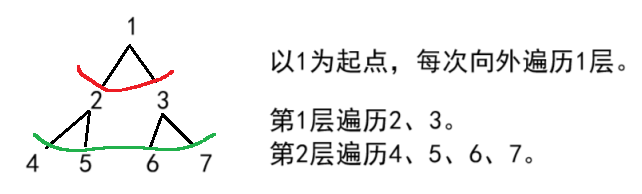

## 马的遍历 求两点的最短路径

[P1443 马的遍历 - 洛谷](https://www.luogu.com.cn/problem/P1443)

给矩阵的大小和马的起点，问马走到每个点的最小步骤。

马能走的点：

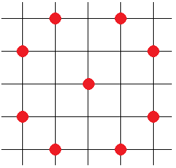

将所有的走法保存为计算机能识别的数据：

```cpp
int dx[]={-2,-1,1,2,2,1,-1,-2},
dy[]={1,2,2,1,-1,-2,-2,-1};
```

当马的当前坐标`(x,y)`加上`dx[i]`和`dy[i]`后即可得到下一个点的坐标`(x+dx[i],y+dy[i])`。但要判断是否越界。

这里的`bfs`在最坏的情况是矩阵的所有点都会遍历一次，所以时间复杂度是$O(n\times m)$。

参考程序（使用STL的`queue`）：

```cpp
#include<bits/stdc++.h>
using namespace std;
int n,m;
int pct[410][410];
int dx[]={-2,-1,1,2,2,1,-1,-2},
dy[]={1,2,2,1,-1,-2,-2,-1};

void bfs(int x,int y){
    queue<pair<int,int>>q;//pair是键值对
    q.push({x,y});//起点入队
    while(q.size()){
        int sx=q.front().first,sy=q.front().second;
        q.pop();
        for(int i=0;i<8;i++){//枚举和开头的点有关的点
            int nx=sx+dx[i],ny=sy+dy[i];
            if(nx<1||nx>n||ny<1||ny>m)
                continue;
            if(pct[nx][ny])//bfs的最短路特性使得只遍历一次便能知道从起点到该点的最短距离
                continue;
            pct[nx][ny]=pct[sx][sy]+1;
            q.push({nx,ny});
        }
    }
    
}

int main(){
    int x,y;
    cin>>n>>m>>x>>y;
    bfs(x,y);
    for(int i=1;i<=n;i++){
        for(int j=1;j<=m;j++)
            if(i==x&&j==y)
                printf("%-5d",0);
            else if(!pct[i][j])
                printf("%-5d",-1);
            else
                printf("%-5d",pct[i][j]);
        cout<<endl;
    }
    return 0;
}
```


## 最少步数 求两点的最短路径

[1330：【例8.3】最少步数](http://ybt.ssoier.cn:8088/problem_show.php?pid=1330) 

中国象棋里马和象的走法结合在一起，使得棋子能走的方向有12个。俩棋子的终点都是`(1,1)`，最短路径基本确定，因此可以假设俩棋子都从`(1,1)`出发，到达各自的终点需要的步数。
其中需要满足的要求：

1. 不能越界，`sn[1][1]=0`用于表示起点到自身的距离为0; 
2. 该点曾经到达过。若没到达过，由bfs的特点，**第一次到达时即为该点到起点的最小距离**，因此没有必要从其他点再抵达这个点。

参考程序：

```c
#include<iostream>
#include<queue>
#include<map>
using namespace std;
int sn[101][101];//step num，步数
int dx[] = { 1,2,2,2,2,1,-1,-2,-2,-2,-2,-1 },
dy[] = { 2,2,1,-1,-2,-2,-2,-2,-1,1,2,2 };//12个方向

void bfs(int x, int y) {
	queue<pair<int, int> >q;
	q.push({ x,y });
	while (q.size()) {
		for (int i = 0; i < 12; i++) {//遍历12个方向
			int nx = q.front().first + dx[i],
				ny = q.front().second + dy[i];
			if (nx < 1 || nx>100 || ny < 1 || ny>100)
				continue;
			if (sn[nx][ny] == 0) {//判断这个点没来过
                
                //记忆化搜索
				sn[nx][ny] = sn[q.front().first][q.front().second] + 1;
				q.push({ nx,ny });
			}
		}
		q.pop();
	}
}

int main() {
	int x1, y1, x2, y2;
	cin >> x1 >> y1 >> x2 >> y2;
	bfs(1, 1);
	cout << sn[x1][y1] << '\n' << sn[x2][y2];
	return 0;
}
```


## 迷宫问题 求最短路径的走法

[1255：迷宫问题](http://ybt.ssoier.cn:8088/problem_show.php?pid=1255) 

给一个邻接矩阵，矩阵中的1组成的连通块表示墙壁，整个图就是一个迷宫。详见下文的（类）迷宫问题。

利用bfs的最短路的特性，在遍历每个点时，标记那个点到起点的距离和上个点的位置。访问路径时用栈进行回溯即可。

```c
#include<iostream>
#include<queue>
#include<stack>
using namespace std;
int maze[6][6] = { 0 };
struct point {
	int x;
	int y;
	point(int _x = 0, int _y = 0) {//默认构造函数
		x = _x; y = _y;
	}
};
point route[6][6] = { {0,0} };//route数组保存之前的点的信息

void bfs() {
	int dx[] = { 0,0,1,-1 }, dy[] = { 1,-1,0,0 };
	bool vis[6][6] = { false };
	queue<point>q;
	q.push({ 1,1 });
	vis[1][1] = true;
	route[1][1] = { -1,-1 };//设置边界

	while (q.size()) {
		for (int i = 0; i < 4; i++) {
			int nx = q.front().x + dx[i],
				ny = q.front().y + dy[i];
			if (nx <= 0 || nx > 5)
				continue;
			if (ny <= 0 || ny > 5)
				continue;
			if (vis[nx][ny])
				continue;
			if (maze[nx][ny] == 1)
				continue;
			vis[nx][ny] = 1;
			route[nx][ny] = q.front();//搜索过程中记录前驱
			if (nx == 5 && ny == 5) {
				return;
			}
			q.push({ nx,ny });
		}
		q.pop();
	}
}


int main() {
	for (int i = 1; i <= 5; i++) {
		for (int j = 1; j <= 5; j++) {
			cin >> maze[i][j];
		}
	}
	bfs();
	stack<point>sk;//利用栈实现逆序寻路
	sk.push({ 5,5 });
	int fx = sk.top().x, fy = sk.top().y;//通过标记的前驱进行回溯
	while (fx != -1 && fy != -1) {
		int tx = fx, ty = fy;
		fx = route[tx][ty].x; 
        fy = route[tx][ty].y;
		if (fx != -1 && fy != -1)
			sk.push({ fx,fy });
	}
	while (sk.size()) {
		cout <<'('<< sk.top().x-1 << ", " << sk.top().y-1 << ')' << endl;
		sk.pop();
	}

	return 0;
}
```


# 2 （类）迷宫问题

见dfs的介绍[深度优先搜索（dfs）题目合集-CSDN博客](https://blog.csdn.net/m0_73693552/article/details/144000898?spm=1001.2014.3001.5501)。

bfs解决迷宫问题和dfs不同的是，dfs是走到死胡同无路可走时回到第一个交叉口，更换方向再走，经历不知道多少个死胡同或一个死胡同都没经历过就找到了出口。所以`dfs`很容易超时是因为同一个格子dfs能走若干次。

而bfs解决迷宫问题，就如同每次标记和当前格子有关联的所有格子，并按队列的顺序依次遍历每个被标记的格子，通过这个被标记的格子来寻找新的未被标记的格子。从上帝视角看，就像遍历完迷宫的一个拐弯处后，回到另一个拐弯处继续遍历。但bfs在第一次找到终点时就能确定起点到终点的最短路径和最短距离。

目前遇到的迷宫问题，只要是能通过俯视的视角观看全局，都是抽象成矩阵的形式存储。也有的迷宫比如[1250：The Castle](http://ybt.ssoier.cn:8088/problem_show.php?pid=1250)，墙用每个格子存储的二进制位表示；[1248：Dungeon Master](http://ybt.ssoier.cn:8088/problem_show.php?pid=1248)，三维迷宫。

## kotori和迷宫

[kotori和迷宫](https://ac.nowcoder.com/acm/problem/50041)

这个迷宫只有路障和终点，和后面的迷宫比起来相对比较简单易懂。

但要注意的是，在找到一个终点后，除了做好基本的记录工作，还要当成墙壁一样跳过。

```cpp
#include<bits/stdc++.h>
using namespace std;

int n, m;
vector<string>pct;
vector<pair<int, int> >E;
int minn = 0x3f3f3f3f;
int dx[] = { 0,0,1,-1 }, dy[] = { 1,-1,0,0 };

void bfs(vector<vector<int> >& dp, int sx, int sy) {
    queue<pair<int, int> >q;
    q.push({ sx,sy });
    while (!q.empty()) {
        sx = q.front().first;
        sy = q.front().second;
        for (int i = 0; i < 4; i++) {
            int nx = sx + dx[i], ny = sy + dy[i];
            if (nx < 0 || nx >= n || ny < 0 || ny >= m)
                continue;
            if (pct[nx][ny] == '*')
                continue;
            if (dp[nx][ny])
                continue;
            dp[nx][ny] = dp[sx][sy] + 1;
            if (pct[nx][ny] == 'e') {
                E.push_back({ nx,ny });
                minn = min(minn, dp[nx][ny]);
                continue;
            }
            q.push({ nx,ny });
        }
        q.pop();
    }
}

int main() {
    cin >> n >> m;
    int sx = 0, sy = 0;
    string st;
    for (int i = 0, flag = 0; i < n; i++) {
        cin >> st;
        for (int j = 0; j < m; j++) {
            if (flag)
                break;
            if (st[j] == 'k')
                sx = i, sy = j, flag = 1;
        }
        pct.push_back(st);
    }
    vector<vector<int> >dp(pct.size(), vector<int>(pct[0].size(), 0));
    bfs(dp, sx, sy);
    if (E.size())
        cout << E.size() << ' ' << minn;
    else
        cout << -1;
    return 0;
}
```

## 多维迷宫

[1248：Dungeon Master](http://ybt.ssoier.cn:8088/problem_show.php?pid=1248)  

这个题可以理解为三维迷宫的求两点最短路径的问题。处理方法和二维的图是一样的，注意方向即可。

参考程序：

```c
#include<iostream>
#include<queue>
#include<map>
using namespace std;

int l, w, h;//long，wide，hight
char sp[50][50][50];//space，空间
int t[50][50][50];//time，时间
int dx[] = { 1,0,-1,0,0,0 }, dy[] = { 0,1,0,-1,0,0 },
dz[] = { 0,0,0,0,1,-1 };//六个方向
int sx, sy, sz;//起点
int ans;//耗时
typedef struct Point {
	int x; int y; int z;
}P;

void bfs(int x, int y, int z) {
	queue<P>q;
	q.push({ x,y,z });
	t[x][y][z] = 1;
	while (q.size()) {
		for (int i = 0; i < 6; i++) {
			int nx = q.front().x + dx[i],
				ny = q.front().y + dy[i],
				nz = q.front().z + dz[i];
			if (nx<0 || nx>l || ny<0 || ny>w || nz<0 || nz>h)
				continue;//越界判断
			if (t[nx][ny][nz] == 0 && (sp[nx][ny][nz] == '.' || sp[nx][ny][nz] == 'E')) {
				t[nx][ny][nz] = t[q.front().x][q.front().y][q.front().z] + 1;
				if (sp[nx][ny][nz] != 'E')
					q.push({ nx,ny,nz });
				else
					ans = t[nx][ny][nz] - 1;
			}
		}
		if (ans)//第一次找到终点则得到最短时间，停止搜索
			return;
		else
			q.pop();
	}
}

int main() {
	ios::sync_with_stdio(false);
	while (cin >> l >> w >> h, l && w && h) {
		for (int i = 0; i < l; i++)
			for (int j = 0; j < w; j++)
				for (int k = 0; k < h; k++) {
					cin >> sp[i][j][k];
					if (sp[i][j][k] == 'S') {
						sx = i; sy = j; sz = k;
					}
				}
		bfs(sx, sy, sz);
		if (ans)
			cout << "Escaped in " << ans << " minute(s)." << '\n';
		else
			cout << "Trapped!\n";
		ans = 0;
		for (int i = 0; i < l; i++)
			for (int j = 0; j < w; j++)
				for (int k = 0; k < h; k++)
					sp[i][j][k] = t[i][j][k] = 0;
	}
	return 0;
}
```

## The Castle 特殊状态的迷宫

[1250：The Castle](http://ybt.ssoier.cn:8088/problem_show.php?pid=1250) 

这个迷宫问题可以理解为每个格子都有可能能被到达，但两个格子之间有可能无法互通。

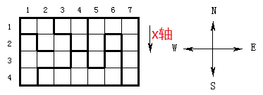

例如`(1,1)`无法一步跨越到`(2,2)`，而是要顺着墙壁走至少8步，但他们算作一个连通块。

样例给的数字表示了该点四周的墙壁信息，只要两点之间存在墙壁，则两点之间无法直接到达。存储墙壁信息的载体可以用四维数组表示，也可以用键值对嵌套键值对，具体参考[深度优先搜索（dfs）题目合集-CSDN博客](https://blog.csdn.net/m0_73693552/article/details/144000898?spm=1001.2014.3001.5501) 的数字接龙。

这里用键值对嵌套键值对。

参考程序：

```c
#include<iostream>
#include<queue>
#include<map>
using namespace std;
int m, n;//m行n列，上北下南
int pct[52][52], vis[52][52];
int num, mar;//max area;
int dx[] = { 1,0,-1,0 }, dy[] = { 0,1,0,-1 };//南东北西, 这个顺序不能乱
map<pair<pair<int, int>, pair<int, int> >, bool >ma;//记录通道的信息

void bny(int x, int y) {//binary，转换成二进制判断房间(x,y)与周围是否有通道
	int tnum = pct[x][y];
	string st;
	while (tnum) {
		char ch = tnum % 2 + '0';
		tnum /= 2;
		st = ch + st;
	}
	while (st.size() < 4)//不足的数位需要补齐
		st = '0' + st;

	for (int i = 0; i < 4; i++) {
		int nx = x + dx[i], ny = y + dy[i];
		if (nx<1 || nx>m || ny<1 || ny>n)
			continue;
		if (st[i] == '0')
			ma[{ {x, y}, { nx,ny }}] = true;//标记通道
	}
}

void bfs(int x, int y) {
	int area = 0;
	queue<pair<int, int> >q;
	q.push({ x,y });
	vis[x][y] = 1;
	while (q.size()) {
		for (int i = 0; i < 4; i++) {
			int nx = q.front().first + dx[i],
				ny = q.front().second + dy[i];
			if (nx<1 || nx>m || ny<1 || ny>n)
				continue;
			if (!vis[nx][ny] &&//没来过+无墙壁，
				ma.count({ {q.front().first,q.front().second} ,{nx,ny} })) {
				q.push({ nx,ny });
				vis[nx][ny] = 1;
			}
		}
		q.pop();
		area++;
	}
	mar = max(mar, area);
}

int main() {
	ios::sync_with_stdio(false);
	cin >> m >> n;
	for (int i = 1; i <= m; i++)
		for (int j = 1; j <= n; j++) {
			cin >> pct[i][j];
			bny(i, j);//存储该房间的所有通道信息
		}

	for (int i = 1; i <= m; i++)
		for (int j = 1; j <= n; j++)
			if (!vis[i][j]) {
				++num;
				bfs(i, j);
			}
	cout << num << '\n' << mar;
	return 0;
}
```

# 3 抽象广搜 遍历搜索树

这类题属于个人总结。就是题型看着特别抽象，实际上需要将题目表述的问题转化成搜索树（或决策树），然后用dfs或bfs遍历这个树即可。

## 抓住那头牛

[1253：抓住那头牛](http://ybt.ssoier.cn:8088/problem_show.php?pid=1253) 

[P1588 [USACO07OPEN\] Catch That Cow S - 洛谷](https://www.luogu.com.cn/problem/P1588)

将所有点根据走法可以抽象成一个决策树，决策树的每个结点可以通过3种方式移动到下一个结点，通过bfs求得每个结点到起点的最短距离。注意需要剪枝或标记重复的数，否则容易出现相同的树。

不用记忆化搜索是担心内存不够用（指10w个数据）。

例如样例`(5,17)`：

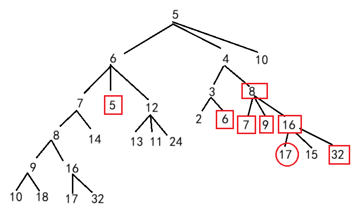

参考程序：

```c
#include<bits/stdc++.h>
using namespace std;

inline int move(int nx, int i) {
    return i == 1 ? nx + 1 : (i == 2 ? nx - 1 : nx * 2);
}

void bfs(vector<int>& dp, int x, int y) {
    vector<bool>vis(100001, 0);
    queue<int>q;
    q.push(x);
    vis[x] = 1;
    while (q.size()) {
        int sx = q.front();
        q.pop();
        for (int i = 1; i <= 3; i++) {
            int nx = 0;
            nx = move(sx, i);
            if (nx < 0 || nx>100000)
                continue;
            if (vis[nx])
                continue;
            vis[nx] = 1;
            dp[nx] = dp[sx] + 1;
            if (nx == y) 
                return;
            q.push(nx);
        }
    }
}

void ac() {
    int x, y;
    cin >> x >> y;
    vector<int>dp(100001, 0);
    bfs(dp, x, y);
    cout << dp[y] << endl;
}

inline void luogu() {
    int T; cin >> T;
    while (T--) {
        ac();
    }
}

inline void ybt() {
    ac();
}

int main() {
    luogu();//洛谷的OJ AC
    //ybt();//一本通的OJ AC
    return 0;
}
```


## 八数码难题

[P1379 八数码难题 - 洛谷](https://www.luogu.com.cn/problem/P1379)

例如样例`283104765`：

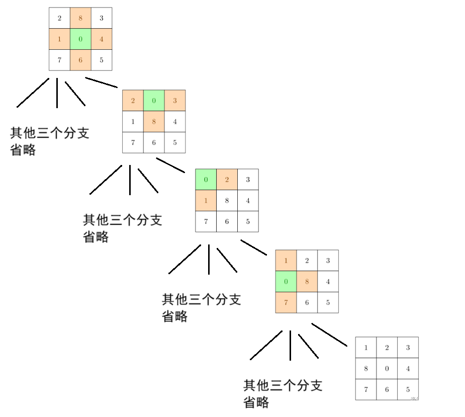

此时题目就可以用搜索树表示整个问题，用普通的bfs或dfs剪枝就能做。这里用bfs：

首先每个九宫格都可以用长度为9的字符串表示，这样表示并不会影响某个位置的数字在九宫格的具体位置的获取，因为可以这样访问：`st[3*i+j]`，`0<=i,j<3`。

知道从一维的`string`对象中访问九宫格具体位置数字的方法后，就可以用`queue<string>q`对这个搜索树进行广搜了。在搜索过程中，可以用映射`map`或哈希表`unordered_map`来记录从起点到某个状态的路径长度。

参考程序（哈希表）：

```cpp
#include<bits/stdc++.h>
#include<unordered_map>
using namespace std;
typedef vector<int> vi;
unordered_map <string, int>mp;
unordered_map <string, bool>vis;

string aim = "123804765";
int dx[] = { 0,0,1,-1 },
dy[] = { 1,-1,0,0 };

void bfs(string st) {
    queue<string>q;
    q.push(st);
    vis[st] = 1;
    while (q.size()) {
        st = q.front();

        //找0的位置
        int sx = 0, sy = 0;
        for (int i = 0; i < 3; i++)
            for (int j = 0; j < 3; j++)
                if (st[3 * i + j] == '0')
                    sx = i, sy = j;

        //枚举4个方向
        for (int i = 0; i < 4; i++) {
            int nx = sx + dx[i], ny = sy + dy[i];
            if (nx < 0 || nx >= 3 || ny < 0 || ny >= 3)
                continue;
            string tmp2 = st;
            swap(st[3 * sx + sy], st[3 * nx + ny]);
            if (vis[st]) {
                swap(st[3 * sx + sy], st[3 * nx + ny]);
                continue;
            }
            vis[st] = 1;
            mp[st] = mp[tmp2] + 1;
            if (st == aim)
                return;
            q.push(st);
            swap(st[3 * sx + sy], st[3 * nx + ny]);
        }
        q.pop();
    }
}

void ac() {
    string st; cin >> st;
    mp[aim] = 0;
    bfs(st);
    cout << mp[aim];
}

int main() {
    ac();
    return 0;
}
```

如果不给用STL，只能用c语言，则这个题瞬间变得复杂很多，因为代码量急剧增大。


# 4 多源bfs

之前的问题都是**问题抽象成的图只存在一个起点**，可以大致称呼为**单源最短路问题**。

但有一类问题，这类问题中存在多个起点，这时的最短路问题就是**多源最短路问题**。解决这类问题，可以用多源bfs。

多源最短路问题的边权都为正数并且相同时（最常见的是1），此时就可以用多源bfs解决。

多源bfs思路：

1. **初始化时**，**将所有源点都加入到队列中**（单源最短路则是1个点）。
2. 正常进行bfs算法。

## 矩阵距离

[矩阵距离](https://ac.nowcoder.com/acm/problem/51024)

求每个矩阵元素到1的距离相对比较难，因为不知道选哪个为1的矩阵元素。但可以利用正难则反，从1出发求每个矩阵元素到那个矩阵元素的最短距离。

这里就用到上题提到的多源bfs：将所有权值为1的点加入队列，再正常进行bfs。

```cpp
#include<bits/stdc++.h>
#include<unordered_map>
using namespace std;

int n,m;
vector<vector<int> >pct,dp;
int dx[]={0,0,1,-1},dy[]={1,-1,0,0};

void bfs() {
    queue<pair<int,int> >q;
    for(int i=1;i<=n;i++)//将所有权值为1的点加入队列
        for(int j=1;j<=m;j++)
            if(pct[i][j]){
                q.push({i,j});
                dp[i][j]=0;
            }
    while(q.size()){
        int sx=q.front().first,sy=q.front().second;
        for(int i=0;i<4;i++){
            int nx=sx+dx[i],ny=sy+dy[i];
            if(nx<1||nx>n||ny<1||ny>m)
                continue;
            if(pct[nx][ny])
                continue;
            if(dp[nx][ny]<0x3f3f3f3f)
                continue;
            dp[nx][ny]=dp[sx][sy]+1;
            q.push({nx,ny});
        }
        q.pop();
    }
}

void ac() {
    cin>>n>>m;
    pct.resize(n+1,vector<int>(m+1,0));
    dp.resize(n+1,vector<int>(m+1,0x3f3f3f3f));
    for(int i=1;i<=n;i++){
        string st;cin>>st;
        for(int j=1;j<=m;j++)
            pct[i][j]=st[j-1]-'0';
    }
    bfs();
    for(int i=1;i<=n;i++){
        for(int j=1;j<=m;j++)
            cout<<dp[i][j]<<' ';
        cout<<endl;
    }
}

int main() {
    ac();
    return 0;
}
```

## 刺杀大使

[P1902 刺杀大使 - 洛谷](https://www.luogu.com.cn/problem/P1902)

读题：

1. 防御迷阵是个矩阵，除了第1行和最后1行，其他都有权值。只要能走到第`n`行就是走出迷阵，类比迷宫的话就是走到了出口。
2. “选择任意多的人从任意的门进入”表示第1行的所有门都可以进入，因此可以用多源bfs，将第1行的格子作为起点。
3. “士兵受到的伤害值”为“路径上所有房间的伤害值中的最大值”、“部队受到的伤害值为所有士兵的伤害值中的最大值”表示每个路径都用一串数字表示，其中最大者最能代表当前路径的情况。
4. 问所有的路径中对部队伤害最小的那条路径。

所以这题可以认为是第1行的所有格子都是起点，第n行的所有格子都是终点的迷宫。可以通过多源`bfs`搜到最短路径。

但$n,m\leq 1000$表示图的大小有$1000\times 1000$，如果真的用多源bfs的话一定会超时。

若仔细读题的话会发现，题目要求的是所有路径的伤害值中最小的那个，而每个路径的伤害值是这个路径的所有特征数字中最大的那个，也就是**最大值最小问题**。或所有路径中，选一条能通关，并且伤害值尽可能小的路径。

尽管我们不知道路径有多少，但根据每个格子的最大值和最小值可以得到所有路径的最大伤害值。所以可以枚举所有伤害值，根据这个伤害值去找合适的路径。因为是从最小值枚举到最大值，具有二段型，所以这个枚举过程可以通过二分算法来优化。

无论是最大值最小问题无脑用二分找左端点，还是出于题目要求，即使能通关，也要找伤害最小的那条，所以存在一个范围（区间）的伤害值，这个伤害值都能通关，则求这个范围的左端点。但根据题意，这个右端点即为最大值，所以如果伤害值支持通关的话，就要一直向左收缩，直到找到最小的那个伤害值。

所以解题思路：

1. 在输入数据时找到所有伤害值的最大值。
2. 利用这个最大值枚举伤害值，同时用二分算法优化，寻找答案所在区间的左端点。
3. 根据这个伤害值进行多源bfs，直到找到最后的伤害值。

因为多源bfs可能会遍历所有的路径，所以时间复杂度是$O(nm\log n)$。根据数据范围可以得到循环遍历次数大概为$1000\times 1000\times 10=10^7$，可以在1秒钟内完成。

参考程序：

```cpp
#include<bits/stdc++.h>
using namespace std;

int n,m;
vector<vector<int> >pct;
int dx[]={0,0,1,-1},dy[]={1,-1,0,0};

bool bfs(int mid){//根据这个伤害值去枚举路径
	queue<pair<int,int> >q;
	vector<vector<bool> >vis(n+1,vector<bool>(m+1,0));
	for(int i=1;i<=m;i++){//多源bfs
		q.push({1,i});
		vis[1][i]=1;
	}
	
	while(q.size()){
		int sx=q.front().first,sy=q.front().second;
		for(int i=0;i<4;i++){
			int nx=sx+dx[i],ny=sy+dy[i];
			if(nx<=1||nx>n||ny<1||ny>m)//防越界
				continue;
			if(pct[nx][ny]>mid)//格子的伤害值大于指定伤害值就跳过
				continue;
			if(vis[nx][ny])//防止重复走过相同路径
				continue;
			vis[nx][ny]=1;
			if(nx>=n)
				return 1;
			q.push({nx,ny});
		}
		q.pop();
	}
	return false;
}

int main(){
	cin>>n>>m;
	pct.resize(n+1,vector<int>(m+1,0));
	int r=0;
	for(int i=1;i<=n;i++){
		for(int j=1;j<=m;j++){
			cin>>pct[i][j];
			r=max(r,pct[i][j]);//找最大的伤害值
		}
	}
	int l=0;
	while(l<r){//二分枚举所有伤害值
		int mid=(l+r)/2;
		if(bfs(mid))
			r=mid;
		else
			l=mid+1;
	}
	cout<<l;
	return 0;
}
```


# 5 双端（01）BFS

之前曾提到过，无论是单源bfs，还是多源bfs，都是用于解决边权为正的同时，还完全相同的图的问题。边权完全相同的最短路问题，所有的结果呈现单调不下降的趋势。每个后续的点只能从之前的点拓展来。

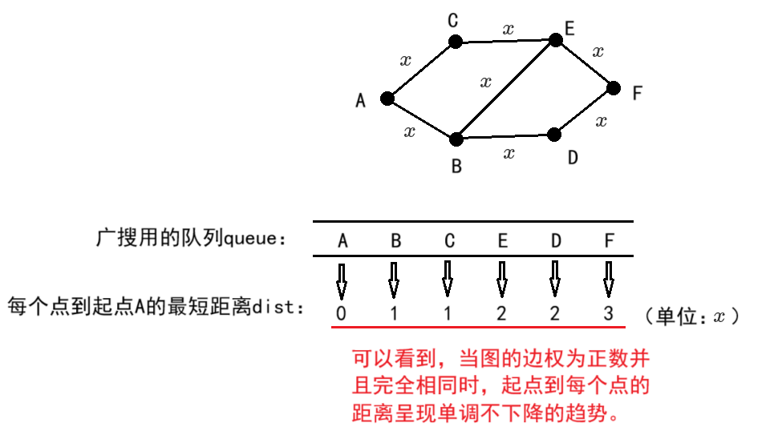

如果边权不全相同，则和起点直接接触的点不一定是最短距离，若不通过其他点更新当前点，则会产生错误，直观感受就是最后的结果不单调。例如下图，从A点到B点的最短距离是8，但因为和A直连，所以被错误的认为B到A的最短距离是10。

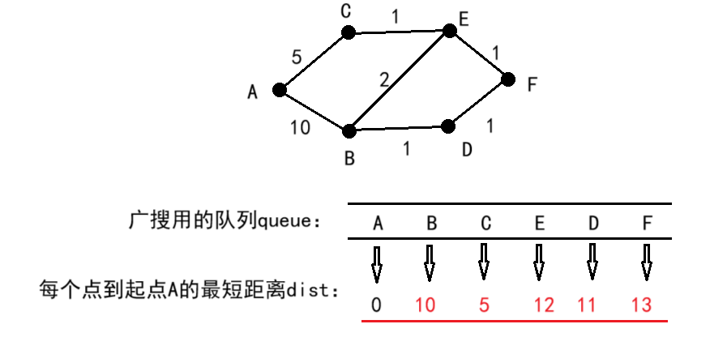


造成这样的原因是点在放进队列中时，并不知道这个点的最优解。所以求这类问题时需要利用一点贪心策略或最优子结构，在图论中的最短路算法会用的很频繁，比如dijistra算法的松弛操作。

除了边权不完全相同的问题，还有一类问题是边权既有1，又有0。此时为了求从起点到终点的最短路，能获得之前的单源最短路问题的单调不递减的结果，**边权为0的结点放在队首**，**为1的放在队尾**。待之前的点更新完最短路时，再通过已有的最短路更新。

或者说，边权为0时，相当于另一个起点。这就相当于从起点走到这个点的代价是0，比如下图的`A`到`C`。于是将它当成起点来看待（多源bfs的思路）。

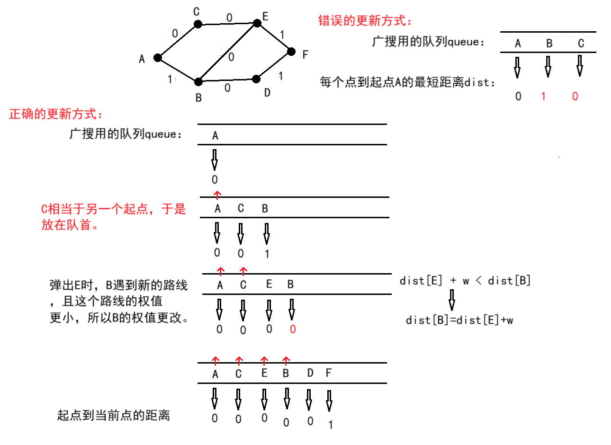

所以双端bfs，有的资料又称为01bfs，在实现时依赖双端队列`deque`或同等操作的数组或别的数据结构。只有这种类似特性的数据结构，才能支持对边权不同的情况进行分类处理。

还有一个要注意的点是：因为每条边的边权不同，多个顶点可能要进行很多次更新才能得到最优解。但有的问题因为实际情况的限制，不得不对结点更新次数做限制。这个在后文的OJ中有提到。

## 小明的游戏

[P4554 小明的游戏 - 洛谷](https://www.luogu.com.cn/problem/P4554)

题目大意是矩阵表示的平面图中，两个格子之间的符号若不相同，则两个格子交流的费用为1，否则为0。

根据上文分析，这个图的权值既有1，又有0，适合使用双端bfs。

使用双端bfs时需要注意：

1. 遍历时遇到了更新过的点，（严谨的话）需要进行更新操作。

2. 若在循环过程中发现了终点，将它更新后不要立即停止搜索，而是放回双端队列，当队头为终点或所有结点遍历完成时再结束函数。因为不保证第1次更新时终点到起点的距离就是最优解，需要等其他结点对终点进行更新。

> 但这题比较特殊，因为这题中，只要两个不同字符贴在一起，则最短路一定是1，无论怎么更新。因此即使不进行更新行为，依旧不会影响。所以即使第1次遇到终点，无论终点是和不同的字符接触，还是在一堆相同字符的中心，只要首遇，一定是最优解。

参考程序：

```cpp
#ifndef _CRT_SECURE_NO_WARNINGS
#define _CRT_SECURE_NO_WARNINGS 1
#endif

#include<bits/stdc++.h>
using namespace std;
const int N = 510;

int dx[] = { 0,0,1,-1 }, dy[] = { 1,-1,0,0 };
char pct[N][N];
int n, m,ex,ey;

void bfs(int sx, int sy, vector<vector<int> >&dp, vector<vector<bool> >&vis) {
	deque<pair<int, int> >dq;
	dq.push_back({ sx,sy });
	vis[sx][sy] = 1;
	while (dq.size()) {
		sx = dq.front().first, sy=dq.front().second;
		dq.pop_front();
		if (sx == ex && sy == ey)//剪枝：1. 只有1个点；2.从队列中遍历到终点
			return;
		for (int i = 0; i < 4; i++) {
			int nx = sx + dx[i], ny = sy + dy[i];
			if (nx < 0 || nx >= n || ny < 0 || ny >= m)
				continue;
			int tmp = pct[sx][sy] != pct[nx][ny];
			if (vis[nx][ny]) {
                //01bfs的情况：非首遇，则(nx,ny)在队列中，严谨的话需要更新最短距离
				if (dp[sx][sy] + tmp < dp[nx][ny])
					dp[nx][ny] = dp[sx][sy] + tmp;
				continue;
			}
				
			vis[nx][ny] = 1;
			if (dp[sx][sy] + tmp >= dp[nx][ny])
				continue;
			dp[nx][ny] = dp[sx][sy] + tmp;
			//若遇到终点，不能退出，因为不保证刚才更新的结果是最优解
            //虽然这个题是个例外，但其他01bfs可能需要严谨
			//if(nx==ex&&ny==ey) return;
			if (tmp)
				dq.push_back({ nx,ny });
			else
				dq.push_front({ nx,ny });
		}
	}
}

void ac() {
	vector<vector<bool> >vis(n, vector<bool>(m, 0));
	vector<vector<int> >dp(n, vector<int>(m, 0x3f3f3f3f));
	for (int i = 0; i < n; i++) {
		string st;
		cin >> st;
		for (int j = 0; j < m; j++) {
			pct[i][j] = st[j];
		}
	}
	int sx, sy; cin >> sx >> sy >> ex >> ey;
	dp[sx][sy] = 0;
	bfs(sx, sy,dp,vis);
	cout << dp[ex][ey] << endl;
}

int main() {
	while (cin >> n >> m,n&&m) 
		ac();
	return 0;
}
```

在做后文的[P4667 [BalticOI 2011\] Switch the Lamp On 电路维修 (Day1) - 洛谷](https://www.luogu.com.cn/problem/P4667)时，我意识到01bfs目前的用法就是求最短路，而`vis`数组会让同一个点只更新最多2次，一旦图稍微大一点，更新的这两次都不是最优解，则这个题会出错。

所以尝试更换策略：当01bfs产生更新行为时，就将更新的这个点插入队列。这样做尽管要多费点时间，但胜在更严谨。若这种策略出现超时的情况，则必须加其他剪枝策略进行限制。这种思路的参考程序如下：

```cpp
#include<bits/stdc++.h>
using namespace std;
const int N = 510;

int dx[] = { 0,0,1,-1 }, dy[] = { 1,-1,0,0 };
char pct[N][N];
int n, m, ex, ey;

void bfs(int sx, int sy, vector<vector<int> >& dp) {
	deque<pair<int, int> >dq;
	dq.push_back({ sx,sy });
	//vis[sx][sy] = 1;
	////01bfs：这里采用最优解更新时将这个点重新放回队列的策略
	////因此这里的标记数组便没有了存在的必要
	while (dq.size()) {
		sx = dq.front().first, sy = dq.front().second;
		dq.pop_front();

		for (int i = 0; i < 4; i++) {
			int nx = sx + dx[i], ny = sy + dy[i];
			if (nx < 0 || nx >= n || ny < 0 || ny >= m)
				continue;
			int tmp = pct[sx][sy] != pct[nx][ny];
            //产生更新行为就加入队列
			if (dp[sx][sy] + tmp >= dp[nx][ny])
				continue;
			dp[nx][ny] = dp[sx][sy] + tmp;

			if (tmp)
				dq.push_back({ nx,ny });
			else
				dq.push_front({ nx,ny });
		}
	}
}

void ac() {
	vector<vector<int> >dp(n, vector<int>(m, 0x3f3f3f3f));
	for (int i = 0; i < n; i++) {
		string st;
		cin >> st;
		for (int j = 0; j < m; j++) {
			pct[i][j] = st[j];
		}
	}
	int sx, sy;
	cin >> sx >> sy >> ex >> ey;
	dp[sx][sy] = 0;
	bfs(sx, sy, dp);
	cout << dp[ex][ey] << endl;
}

int main() {
	while (cin >> n >> m, n && m)
		ac();
	return 0;
}
```


## 电路维修

[P4667 [BalticOI 2011\] Switch the Lamp On 电路维修 (Day1) - 洛谷](https://www.luogu.com.cn/problem/P4667)

[1448：【例题1】电路维修](http://ybt.ssoier.cn:8088/problem_show.php?pid=1448)

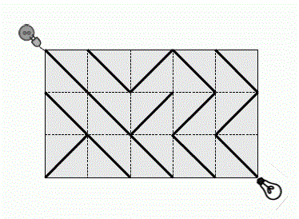

根据这个电路图可以知道，一个矩形的4个角都可以看成图的顶点。故可以假设有电线连接的两个点的权值为0，没有的则为1，这样，问题就转化成了从左上角到右下角的最短距离。

因为这个最短距离只有0、1两种情况，所以可以用01bfs来解决。

这个题的状态设计：

设`pct[i][j][5]`表示第`i`行、第`j`列的顶点的数据，0、1、2、3表示4个方向的权值，4表示起点到当前点的最短路。

洛谷的题并没有给具体的数据范围（后面可能补充，毕竟是国外的题），但一本通的OJ明确表示图的大小在$500\times 500$，这么大的图**不保证一个结点更新一两次就是最优解**，需要更新多次，所以[P4554 小明的游戏 - 洛谷](https://www.luogu.com.cn/problem/P4554)的限制点的访问次数的操作也就是`vis`数组在这里并不适用。因此采取的策略是**一旦当前点产生更新行为**，则**将这个点重新加入队列中**，用这个点再更新其他的点。

也有其他题解选择了保留限制更新次数的操作，这个取决于做题的人对题目的理解。从我的直觉出发，严谨点并不是坏事，只要不超时并且能解决问题，但如果是类似ACM区域赛或全球总决赛的那种，这点时间很可能影响排名，这个取决于当时的决策和取舍。

参考程序：

```cpp
#include<bits/stdc++.h>
#include<unordered_map>
using namespace std;

void ac() {
	int n, m;
	int dx[] = { -1,1,1,-1 }, dy[] = { 1,1,-1,-1 };
	auto bfs = [&](int sx, int sy, vector<vector<vector<int> > >& pct) {
		deque<pair<int, int> >dq;
		dq.push_front({ sx,sy });
		while (dq.size()) {
			sx = dq.front().first;
			sy = dq.front().second;
			dq.pop_front();
			for (int i = 0; i < 4; i++) {
				int nx = sx + dx[i], ny = sy + dy[i];
				if (nx<0 || nx>n || ny<0 || ny>m)
					continue;
				int tmp = pct[sx][sy][i];
				//在我第一次尝试这题时，按照习惯设置的第一次入队检测操作
				// 使得部分情况无法正常更新
				//if (pct[nx][ny][4] < 0x3f3f3f3f) {
				//	if (pct[nx][ny][4] > pct[sx][sy][4] + tmp)
				//		pct[nx][ny][4] = pct[sx][sy][4] + tmp;
				//	continue;
				//}
				if (pct[nx][ny][4] > pct[sx][sy][4] + tmp)
					pct[nx][ny][4] = pct[sx][sy][4] + tmp;
				else
					continue;
				if (tmp)
					dq.push_back({ nx,ny });
				else
					dq.push_front({ nx,ny });
			}
		}
	};
	cin >> n >> m;
	vector<vector<vector<int> > >pct;
	pct.resize
	(n + 1, vector<vector<int> >(m + 1, vector<int>(5, 1)));
	for (int i = 0; i <= n; i++)
		for (int j = 0; j <= m; j++)
			pct[i][j][4] = 0x3f3f3f3f;
	for (int i = 1; i <= n; i++) {
		string st; cin >> st;
		for (int j = 1; j <= m; j++) {
			if (st[j - 1] == '\\') {
				pct[i][j][3] = 0;
				pct[i + dx[3]][j + dy[3]][1] = 0;
			}
			else {
				pct[i][j - 1][0] = 0;
				pct[i + dx[0]][j - 1 + dy[0]][2] = 0;
			}
		}
	}
	pct[0][0][4] = 0;
	bfs(0, 0, pct);

	if (pct[n][m][4] == 0x3f3f3f3f)
		cout << "NO SOLUTION\n";
	else
		cout << pct[n][m][4] << endl;
}

int main() {
	////提交到一本通时将注释解开
	//int T; cin >> T;
	//while (T--)
		ac();
	return 0;
}
```


## CF590C Three States

[CF590C Three States - 洛谷](https://www.luogu.com.cn/problem/CF590C)

> 这题是Codeforces上的题，同样是国外的网站。若能成功注册则可以通过洛谷提交或直接到这个网站上提交，若不能则可以通过镜像网站[Virtual Judge](https://vjudge.net/)提交。
>
> 洛谷将这个题分类为紫题，主要是细节很多。

尝试直接求解：对所有荒地，求出它到所有国家的最短距离（bfs），最后根据所有的数据选出尽可能少的荒地，也就是求修的路中最短的那条。

1. 先不考虑怎么求修的路中最短的那条，若是有国家存在飞地（因为各种原因，和本国主要领土不接壤的额外领土），则需要将飞地也要考虑进去。例如样例`1..2.1`。
2. 两个国家连成一片，比如题目给的样例。
3. 测试样例太大（$1000\times 1000$）。

总结就是，直接求解的话很困难，于是尝试正难则反：找出所有国家修路修到任意点的最短距离（多次多源bfs），这样对每个荒地都能求出所有国家修路修到这个地方需要的最短距离。

同样需要注意细节：

1. 多源bfs扩展到国家的时候，记录的距离应该为0。
   因此图中每个点到4个周围的点的距离要么为1（多源bfs的起点到荒地、荒地到荒地），要么为0（荒地到别国，别国自己的领土到另一块领土，一个国家到另一个国家），所以除了用多源bfs，还需要用到01bfs。

> 举个例子，多源bfs枚举国家1到所有点的距离，则当枚举到某个荒地时，相当于从国家1修路修到当前荒地一共走的距离，但**统计的单位是荒地**；当修到和国家2（别国）接壤的荒地时，因为国家1已经把路全修完了，所以国家2再修这个路已经没有必要。因此从荒地到国家2的距离应该为0。然后别国自己的领土不需要修路，所以距离也是0。

2. 得到每个国家到每个点的最短距离时，如何更新结果？
   情况1：一个荒地严格来说被所有国家计算过本国到这个荒地的距离。举个例子：

   ```
   1 . 2
   . 3 .
   ```

   三个国家分别从本国修路修到`(0,1)`的荒地，但统计这个荒地的距离时只需要统计1个国家修路修到这个荒地的距离就行。所以求修路修到这个荒地时，统计的路径长度应该为`dis[1]+dis[2]+dis[3]-2`，`dis[i]`表示从`i`国修路修到这个荒地的最短距离，2是国家数减1，因为这题只有3个国家。

   情况2：虽然无法把路修到别国领土内部，但可以把路修到和别国领土接壤的荒地。因此对这个国家的领土，自己到自己的领土修路的长度为0，其他国家修路修到这个领土的距离，可以用那个国家修到和这个国家接壤的荒地的距离代替。所以求修路修到这个别国领土时，统计的路径长度应该为`dis[1]+dis[2]+dis[3]`，其中因为领土属于某个国家，所以必定有一个`dis[i]`为0。

   情况3：偶遇石头无法修路，直接更新为0即可。

所以整个程序的思路：

1. 对所有国家分别进行一次多源bfs和01bfs。
2. 枚举图上的每个点，利用这个点更新答案。要求不能出现石头，有一个国家没修到这个地方就不用这个点进行计算。

参考程序：

```cpp
#include<bits/stdc++.h>
using namespace std;

const int N = 1010;
const int Max = 0x3f3f3f3f;

int n, m;
char pct[N][N];
int dp[4][N][N];
int dx[] = { 0,0,1,-1 }, dy[] = { 1,-1,0,0 };

void bfs(int s) {
	deque<pair<int, int> >dq;
	//多源bfs
	for (int i = 1; i <= n; i++) {
		for (int j = 1; j <= m; j++) {
			if (pct[i][j] - '0' == s) {
				dq.push_front({ i,j });
				dp[s][i][j] = 0;
			}
		}
	}

	//01bfs
	while (dq.size()) {
		int sx = dq.front().first, sy = dq.front().second;
		dq.pop_front();
		for (int i = 0; i < 4; i++) {
			int nx = sx + dx[i], ny = sy + dy[i];
			if (nx<1 || nx>n || ny<1 || ny>m)
				continue;
			if (pct[nx][ny] == '#')
				continue;
			int tmp = pct[nx][ny] == '.' ? 1 : 0;
			if (dp[s][nx][ny]<Max) {//这个点搜过
				//更新最优解
				if (dp[s][sx][sy] + tmp < dp[s][nx][ny])
					dp[s][nx][ny] = dp[s][sx][sy] + tmp;
				continue;
			}
			dp[s][nx][ny] = dp[s][sx][sy] + tmp;
			if (tmp)
				dq.push_back({ nx,ny });
			else
				dq.push_front({ nx,ny });
		}
	}
}

void ac() {
	cin >> n >> m;
	for (int i = 1; i <= n; i++) {
		string st; cin >> st;
		for (int j = 1; j <= m; j++) 
			pct[i][j] = st[j - 1];
	}
	memset(dp, 0x3f, sizeof(dp));
	bfs(1);bfs(2);bfs(3);

	int ans = Max;
	for (int i = 1; i <= n; i++) {
		for (int j = 1; j <= m; j++) {
			if (pct[i][j] == '#')
				continue;
			int x = dp[1][i][j], y = dp[2][i][j], z = dp[3][i][j];
			if (x == Max || y == Max || z == Max)
				continue;
			if (pct[i][j] == '.')
				ans = min(ans, x + y + z - 2);
			else
				ans= min(ans, x + y + z);
		}
	}
	if (ans == Max)
		cout << -1;
	else
		cout << ans;
}

int main() {
	ac();
	return 0;
}
```

这题同样可以采用点产生更新行为就加进队列的操作，也只比上个参考程序慢几十毫秒。

核心bfs参考程序：

```cpp
void bfs(int s) {
	deque<pair<int, int> >dq;
	//多源bfs
	for (int i = 1; i <= n; i++) {
		for (int j = 1; j <= m; j++) {
			if (pct[i][j] - '0' == s) {
				dq.push_front({ i,j });
				dp[s][i][j] = 0;
			}
		}
	}

	//01bfs
	while (dq.size()) {
		int sx = dq.front().first, sy = dq.front().second;
		dq.pop_front();
		for (int i = 0; i < 4; i++) {
			int nx = sx + dx[i], ny = sy + dy[i];
			if (nx<1 || nx>n || ny<1 || ny>m)
				continue;
			if (pct[nx][ny] == '#')
				continue;
			int tmp = pct[nx][ny] == '.' ? 1 : 0;
            //产生更新行为就加入队列，否则就跳过
			if (dp[s][sx][sy] + tmp < dp[s][nx][ny])
				dp[s][nx][ny] = dp[s][sx][sy] + tmp;
			else
				continue;

			if (tmp)
				dq.push_back({ nx,ny });
			else
				dq.push_front({ nx,ny });
		}
	}
}
```


# 6 双向bfs

双向bfs的原理是从正反两个方向进行宽度优先搜索。这样做的目的是减少搜索量，提高搜索速度。

从初始状态和目标状态两个方向同时进行扩展，如果两棵搜索树在某个结点第一次发生重合，即可终止此搜索过程，则该结点所连接的两条路径所拼成的路径就是最优解。因此双向bfs特别适合一个起点和一个终点的图的问题。

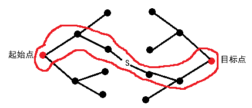

双向宽度优先搜索通常有两种搜索方法：

1. 两个方向交替扩展。
2. 选择结点个数较少的那个方向先扩展。

方法2只需要略加修改控制结构，每次循环时**只扩展正反两个方向中结点数目较少的那一个**，**可以使两边的发展速度保持一定的平衡**，从而减少总扩展结点的个数，加快搜索速度。

很明显，方法2优于方法1。

实现时以方法2为主。具体思路：

1. 准备两个队列`queue`或`deque`，以及相应的记录最短路和限制结点更新次数的`dp`数组、`vis`数组。
2. 搜索时起点和终点分别入队，选择队长短的也就是`q.size()`小的队列进行搜索。

也可以用纯c，手搓队列。具体思路：

设置两个队列`q[2][maxn]`，分别表示正向和逆向的扩展队列。
设置两个头指针`l[2]`分别表示正向和逆向将扩展结点的头指针。
设置两个尾指针`r[2]`分别表示正向和逆向的尾指针。

但个人觉得选择纯c手搓属于是为了追求极致的程序运行速度，平时使用时还是以现有的STL工具为主。

## Knight Moves

[1257：Knight Moves](http://ybt.ssoier.cn:8088/problem_show.php?pid=1257)

[1450：【例 3】Knight Moves](http://ybt.ssoier.cn:8088/problem_show.php?pid=1450) 

这个题因为图上没有什么限制，走法固定，起点和终点也都只有1个，因此普通的广搜也能做，也可以用双向bfs优化。

### 普通bfs

和边权完全相等的迷宫问题一样，正常拓展即可。普通bfs参考程序：

```cpp
#define _CRT_SECURE_NO_WARNINGS 1
/*
http://ybt.ssoier.cn:8088/problem_show.php?pid=1254
http://ybt.ssoier.cn:8088/problem_show.php?pid=1450

此题可用双向bfs优化。
这里是未优化的ac题解。
*/

#include<iostream>
#include<queue>
#include<stack>
using namespace std;
int l;
bool vis[301][301] = { false };
int step[301][301] = { 0 };
struct point {
	int x; int y; point(int _x = 0, int _y = 0) { x = _x; y = _y; }
};
point s, e;//start, end

void bfs() {
	int dx[] = { -2,-1,1,2,2,1,-1,-2 },
		dy[] = { 1,2,2,1,-1,-2,-2,-1 };
	queue<point>q;
	q.push(s);
	vis[s.x][s.y] = true;
	if (s.x == e.x && s.y == e.y)
		return;

	while (q.size()) {
		for (int i = 0; i < 8; i++) {
			int nx = q.front().x + dx[i],
				ny = q.front().y + dy[i];

			if (nx < 0 || nx > l)//l是4到300，所以l可能等于300
				continue;
			if (ny < 0 || ny > l)//所以棋盘真正的大小是301x301
				continue;
			if (vis[nx][ny] == true)
				continue;
			vis[nx][ny] = true;
			step[nx][ny] = step[q.front().x][q.front().y] + 1;
			if (nx == e.x && ny == e.y)
				return;
			q.push({ nx,ny });
		}
		q.pop();
	}

}

int main() {
	int n = 0;
	cin >> n;
	while (n--) {
		cin >> l;
		cin >> s.x >> s.y >> e.x >> e.y;
		bfs();
		cout << step[e.x][e.y] << endl;
		for (int i = 0; i <= 300; i++) {
			for (int j = 0; j <= 300; j++) {
				step[i][j] = 0; vis[i][j] = false;
			}
		}
	}
	return 0;
}
```

### 双向bfs

这题可用另外的优化方式：双向bfs。即对**起点和终点分别安排队列进行**bfs，当发现搜索的枝节重叠时，便将搜索的结果相加即可。

因为程序运行时实际上还是占用同一块cpu，所以双向dfs看上去并没有达到理论的最佳效率，在这个题也只是比普通dfs快几毫秒或几十毫秒。

双向bfs参考程序：

```cpp
#include <bits/stdc++.h>
using namespace std;

bool vis[2][303][303];
int dp[2][303][303];
int dbfs(int n, int stx, int sty, int edx, int edy) {
	if (stx == edx && sty == edy)//处理特殊情况
		return 0;
	queue<pair<int, int> >q[2];//q[0]、q[1]两个队列
	int dx[8] = { 1, 2, 2, 1, -1, -2, -2, -1 };//8个方向
	int dy[8] = { 2, 1, -1, -2, -2, -1, 1, 2 };
	int ans = 0;

	//起点和终点分别入队
	q[0].push({ stx,sty });
	q[1].push({ edx,edy });

	//普通bfs
	auto bfs = [&](queue<pair<int, int> >&q, int x) {//队列本体和队列编号
		int sx = q.front().first, sy = q.front().second;

		//双向bfs不用在这里进行出队操作， 因为需要用队列长度来调整进度

		for (int i = 0; i < 8; i++) {
			int nx = sx + dx[i], ny = sy + dy[i];

			//防止越界和单次更新
			if (nx<0 || nx>=n || ny<0 || ny>=n)
				continue;
			if (vis[x][nx][ny])
				continue;

			//边权始终为1，第一次遍历到当前点时即为最短路
			vis[x][nx][ny] = 1;
			dp[x][nx][ny] = dp[x][sx][sy] + 1;

			q.push({ nx,ny });
			if (vis[1 - x][nx][ny]) {//这个点被另一个队列搜过
				ans = dp[1 - x][nx][ny] + dp[x][nx][ny];
				return 1;
			}
		}
		return 0;
	};

	while (q[0].size() && q[1].size()) {
		//选择队长短的队列拓展
		if (q[0].size() < q[1].size()) {
			if (bfs(q[0], 0)) 
				break;
			q[0].pop();
		}
		else {
			if (bfs(q[1], 1))
				break;
			q[1].pop();
		}
	}
	return ans;
}

void ac() {
	int n;
	int sx, sy, ex, ey;
	cin >> n >> sx >> sy >> ex >> ey;
	int ans = dbfs(n, sx, sy, ex, ey);
	cout << ans << endl;
	memset(dp, 0, sizeof(dp));
	memset(vis, 0, sizeof(vis));
}

int main() {
	int T; cin >> T;
	while (T--) {
		ac();
	}
	return 0;
}
```

也可以不用STL，选择手搓队列。

```cpp
#include <iostream>
#include <cstring>
#include <cmath>
using namespace std;

struct qtp {
	int x, y;
} q[2][100000];//队列本体，也就是说这是2个队列。 
int test, ans, n, l[2], r[2];
int dis[2][301][301], v[2][301][301];//距离和标记
int dx[8] = { 1, 2, 2, 1, -1, -2, -2, -1 };
int dy[8] = { 2, 1, -1, -2, -2, -1, 1, 2 };

int expand(int k) {//k表示队列编号
	int t,i, j, x, y, d, tx, ty;
	x = q[k][l[k]].x;
	y = q[k][l[k]].y;
	d = dis[k][x][y];
	for (i = 0; i < 8; i++) {
		tx = x + dx[i];
		ty = y + dy[i];
		if (tx >= 0 && tx <= n &&
			ty >= 0 && ty <= n && !v[k][tx][ty]) {
			v[k][tx][ty] = 1;//标记
			r[k]++;
			q[k][r[k]].x = tx;
			q[k][r[k]].y = ty;//入队
			dis[k][tx][ty] = d + 1;
			if (v[1 - k][tx][ty]) {//判断另一个队列是否搜到这个点
				ans = dis[k][tx][ty] + dis[1 - k][tx][ty];
				return 1;
			}
		}
	}
	return 0;
}

void BFS() {
	if (q[0][1].x == q[1][1].x && q[0][1].y == q[1][1].y) {
		ans = 0;
		return;
	}
	v[0][q[0][1].x][q[0][1].y] = 1;//标记起点
	v[1][q[1][1].x][q[1][1].y] = 1;//标记终点
	l[0] = r[0] = 1;//初始化
	l[1] = r[1] = 1;//初始化
	while (l[0] <= r[0] && l[1] <= r[1]) {
		if (r[0] - l[0] < r[1] - l[1]) {//哪队的元素少就用哪队去搜
			if (expand(0)) return;
			l[0]++;//出队操作
		}
		else {
			if (expand(1)) return;
			l[1]++;
		}
	}
}
int main() {
	cin >> test;
	for (int i = 1; i <= test; i++) {
		memset(v, false, sizeof(v));
		memset(q, 0, sizeof(q));
		memset(dis, 0, sizeof(dis));
		cin >> n;
		n = n - 1;
		cin >> q[0][1].x >> q[0][1].y;//起点入队
		cin >> q[1][1].x >> q[1][1].y;//终点入队
		BFS();
		cout << ans << endl;
	}
	return 0;
}
```

双向bfs也可用于优化双端bfs和多源bfs。目前还没遇到类似的题，遇到了再补充。

# 7 Floodfill问题（涂色问题）

Floodfill算法，又称漫水填充，像素法，本质是在寻找具有相同性质的连通块。在[1329：【例8.2】细胞](http://ybt.ssoier.cn:8088/problem_show.php?pid=1329)，也就是最开头的那一题中，已经体验过通过bfs标记特定性质的的格子。

这类问题的特点是利用dfs或bfs标记某种特征的连通块，然后统计这种特征的连通块的数量或其他用途。在上文中也有用类似的连通块作为多源bfs的起点的操作。

## Lake Counting S 统计连通块数量

[P1596 [USACO10OCT\] Lake Counting S - 洛谷](https://www.luogu.com.cn/problem/P1596)

这题的水洼会向8个方向蔓延，所以需要方向数组来辅助遍历连通块。

```cpp
int dx[] = { -1,0,1,1,1,0,-1,-1 }, 
dy[] = { 1,1,1,0,-1,-1,-1,0 };
```

和[1329：【例8.2】细胞](http://ybt.ssoier.cn:8088/problem_show.php?pid=1329)一样，通过对整个图进行遍历，寻找没被遍历过的水洼的一角也就是`W`，找到后水洼加1，然后通过dfs或bfs遍历和这个`w`相连的所有`w`，并做好标记或涂色。

当遍历完成后，最后的数量即为水洼也就是连通块的数量。

```cpp
#include<bits/stdc++.h>
using namespace std;
int n, m;
char pct[101][101];
bool vis[101][101];
int dx[] = { -1,0,1,1,1,0,-1,-1 }, dy[] = { 1,1,1,0,-1,-1,-1,0 };

void bfs(int sx, int sy) {
	queue<pair<int, int> >q;
	q.push({ sx,sy });
	vis[sx][sy] = 1;
	//pct[sx][sy]='X';//部分题还会需要对这个地方进行更改，也就是涂色
	while (q.size()) {
		sx = q.front().first;
		sy = q.front().second;
		for (int i = 0; i < 8; i++) {
			int nx = sx + dx[i], ny = sy + dy[i];
			if (nx < 0 || nx >= n || ny < 0 || ny >= m)
				continue;
			if (pct[nx][ny] != 'W')
				continue;
			if (vis[nx][ny])
				continue;
			vis[nx][ny] = 1;
			q.push({ nx,ny });
		}
		q.pop();
	}
	return;
}

void ac() {
	cin >> n >> m;
	for (int i = 0; i < n; i++) {
		string st; cin >> st;
		for (int j = 0; j < m; j++)
			pct[i][j] = st[j];
	}
	int ans = 0;
	for (int i = 0; i < n; i++) {
		for (int j = 0; j < m; j++)
			if (pct[i][j] == 'W' && !vis[i][j]) {
				++ans;
				bfs(i, j);
			}
	}
	cout << ans;
}

int main() {
	ac();
	return 0;
}
```

## 填涂颜色 连通块内嵌连通块

[P1162 填涂颜色 - 洛谷](https://www.luogu.com.cn/problem/P1162)

这个题的大概意思就是，给的地图中外层全是0，内层有1组成的连通块，1组成的连通块内部还有一片0组成的连通块。

形象的比喻就是，在一片海中，有一个或若干个岛屿，岛屿还有内湖以及内海，内湖通过陆地或海滩与外海隔绝， 内海则有一角和外海有联系（参考现实中的渤海、地中海等）。

求内湖的情况时，可备份另一份同样的地图，然后标记外海和与外海接触的海滩或陆地，此时剩下的区域就是内海。

例如这个样例：

```
0 0 0 0 0 0
0 0 0 1 1 1
0 1 1 0 0 1
1 1 0 0 0 1
1 0 0 1 0 1
1 1 1 1 1 1
```

将外海拓展一圈：

```
0 0 0 0 0 0 0 0
0 0 0 0 0 0 0 0
0 0 0 0 1 1 1 0
0 0 1 1 0 0 1 0
0 1 1 0 0 0 1 0
0 1 0 0 1 0 1 0
0 1 1 1 1 1 1 0
0 0 0 0 0 0 0 0
```

将外层染色，即可暴露出内海。

```
3 3 3 3 3 3 3 3
3 3 3 3 3 3 3 3
3 3 3 3 1 1 1 3
3 3 1 1 0 0 1 3
3 1 1 0 0 0 1 3
3 1 0 0 1 0 1 3
3 1 1 1 1 1 1 3
3 3 3 3 3 3 3 3
```

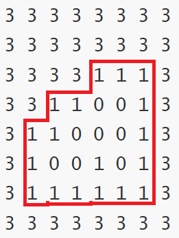

这个题只需要对外海涂色，然后对所有情况进行枚举即可。

```cpp
#include<bits/stdc++.h>
using namespace std;

int pct[33][33];
int n;
int dx[] = { 0,0,1,-1, },
dy[] = { 1,-1,0,0 };
bool vis[33][33];

void dfs(int sx, int sy) {
	if (sx<0 || sx>n + 1 || sy<0 || sy>n + 1)
		return;
	if (pct[sx][sy])
		return;
	pct[sx][sy] = 3;
	for (int i = 0; i < 4; i++)
		dfs(sx + dx[i], sy + dy[i]);
}

int main() {
	cin >> n;
	for(int i=1;i<=n;i++)
		for (int j = 1; j <= n; j++) 
			cin >> pct[i][j];
	dfs(0, 0);
	for (int i = 1; i <= n; i++) {
		for (int j = 1; j <= n; j++) {
			if (pct[i][j] == 3)
				cout << 0 << ' ';
			else if (pct[i][j] == 0)
				cout << 2 << ' ';
			else
				cout << pct[i][j] << ' ';
		}
		cout << endl;
	}
		
	return 0;
}
```

## 岛屿个数 蓝桥真题 将外层染色

[17.岛屿个数 - 蓝桥云课](https://www.lanqiao.cn/problems/3513/learning/?page=1&first_category_id=1&status=2&second_category_id=3)

这题问的是连通块的数量，而且有特殊的要求：若大的连通块内嵌一块0为主体的连通块，这块0为主体的连通块又内嵌一块小的连通块。例如题目给的样例：

```cpp
01111
11001
10101
10001
11111
```

第3行的第2个1就不能算作连通块本身。

所以这题的做法是通过深搜或广搜，将外海以及与外海接触的陆地给染成一样的颜色，之后再遍历地图，将没被标记的子岛屿标记。

做完这些准备工作后，就可以正常使用搜索算法遍历连通块了。

涂色用的代码在[P1162 填涂颜色 - 洛谷](https://www.luogu.com.cn/problem/P1162)的基础上，针对与外海接触的陆地也做涂色处理：

```cpp
void dfs(int sx, int sy) {
	if (sx<0 || sx>m + 1 || sy<0 || sy>n + 1)
		return;
	if (pct[sx][sy]) {
		pct[sx][sy] = 3;//与外海接触的陆地也进行处理
		return;
	}
	pct[sx][sy] = 3;
	for (int i = 0; i < 8; i++)//注意海水的蔓延方向是8个方向
		dfs(sx + dx[i], sy + dy[i]);
}
```

最终涂色后的情况：

```cpp
3333333
3333333
3330033
3301033
3300033
3333333
3333333
```

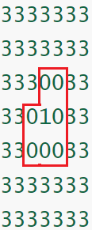

最终参考程序：

```cpp
#include<bits/stdc++.h>
using namespace std;

int n, m;
int pct[52][52], pct2[52][52];
bool vis[52][52];
int dx[] = { 0,0,1,-1,-1,-1,1,1 },//前4个方向代表右、左、上、下
dy[] = { 1,-1,0,0,1,-1,-1,1 };

void dfs(int sx, int sy) {
	if (sx<0 || sx>m + 1 || sy<0 || sy>n + 1)
		return;
	if (pct[sx][sy]) {//针对与外海接触的陆地也做染色处理
		pct[sx][sy] = 3;
		return;
	}
	pct[sx][sy] = 3;//将海染色
	for (int i = 0; i < 8; i++)
		dfs(sx + dx[i], sy + dy[i]);
}

void bfs(int sx, int sy) {
	queue<pair<int, int> >q;
	q.push({ sx,sy });
	vis[sx][sy] = 1;
	while (q.size()) {
		sx = q.front().first;
		sy = q.front().second;
		for (int i = 0; i < 4; i++) {
			int nx = sx + dx[i], ny = sy + dy[i];
			if (nx<1 || nx>m || ny<1 || ny>n)
				continue;
			if (vis[nx][ny])
				continue;
			if (pct2[nx][ny] == 0)
				continue;
			vis[nx][ny] = 1;
			q.push({ nx,ny });
		}
		q.pop();
	}
}

void ac() {
	cin >> m >> n;
	for (int i = 0; i <= m + 1; i++) 
		for (int j = 0; j <= n + 1; j++) {
			pct[i][j] = pct2[i][j] = 0;
			vis[i][j] = 0;
		}
	
	char ch;
	for (int i = 1; i <= m; i++) 
		for (int j = 1; j <= n; j++) {
			cin >> ch;
			if (ch == '1')
				pct[i][j] = pct2[i][j] = 1;
		}

	dfs(0, 0);//将pct染色，标记内岛屿
	for (int i = 1; i <= m; i++)
		for (int j = 1; j <= n; j++)
			if (pct[i][j] == 1)
				vis[i][j] = 1;
    
    //利用pct2，统计大岛屿数
	int cnt = 0;
	for (int i = 1; i <= m; i++)
		for (int j = 1; j <= n; j++) {
			if (!vis[i][j]&& pct2[i][j] == 1 ) {
				++cnt;
				bfs(i, j);
			}
		}
	cout << cnt << endl;
}

int main() {
	int T; cin >> T;
	while (T--)
		ac();
	return 0;
}
```


# 广度优先搜索OJ汇总

0. 坐镇c位

[1329：【例8.2】细胞](http://ybt.ssoier.cn:8088/problem_show.php?pid=1329) 

1. bfs的最短路特性

[P1443 马的遍历 - 洛谷](https://www.luogu.com.cn/problem/P1443)

[1330：【例8.3】最少步数](http://ybt.ssoier.cn:8088/problem_show.php?pid=1330) 

[1255：迷宫问题](http://ybt.ssoier.cn:8088/problem_show.php?pid=1255) 

2. （类）迷宫问题

[kotori和迷宫](https://ac.nowcoder.com/acm/problem/50041)

[1248：Dungeon Master](http://ybt.ssoier.cn:8088/problem_show.php?pid=1248)  

[1250：The Castle](http://ybt.ssoier.cn:8088/problem_show.php?pid=1250) 

3. 抽象搜索树

[P1588 [USACO07OPEN\] Catch That Cow S - 洛谷](https://www.luogu.com.cn/problem/P1588)

[P1379 八数码难题 - 洛谷](https://www.luogu.com.cn/problem/P1379)

4. 多源bfs

[矩阵距离](https://ac.nowcoder.com/acm/problem/51024)

[P1902 刺杀大使 - 洛谷](https://www.luogu.com.cn/problem/P1902)

5. 双端（01）bfs

[P4554 小明的游戏 - 洛谷](https://www.luogu.com.cn/problem/P4554)

[P4667 [BalticOI 2011\] Switch the Lamp On 电路维修 (Day1) - 洛谷](https://www.luogu.com.cn/problem/P4667)

[CF590C Three States - 洛谷](https://www.luogu.com.cn/problem/CF590C)（这题是这里唯一的紫题，难点就是细节特别多）

6. 双向bfs

[1450：【例 3】Knight Moves](http://ybt.ssoier.cn:8088/problem_show.php?pid=1450)  

7. Floodfill问题（涂色问题）

[P1596 [USACO10OCT\] Lake Counting S - 洛谷](https://www.luogu.com.cn/problem/P1596)

[P1162 填涂颜色 - 洛谷](https://www.luogu.com.cn/problem/P1162)

[17.岛屿个数 - 蓝桥云课](https://www.lanqiao.cn/problems/3513/learning/?page=1&first_category_id=1&status=2&second_category_id=3)
