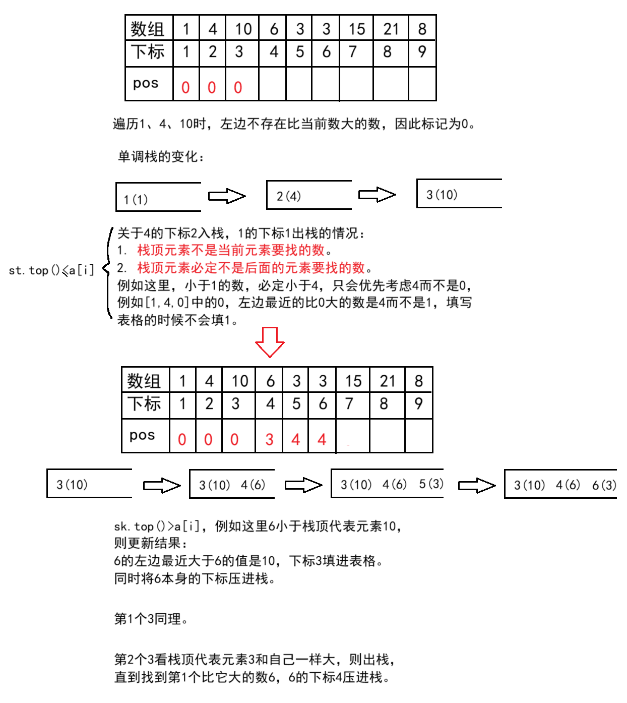

# 单调栈原理

单调栈，顾名思义，就是**具有单调性的数据结构栈**。它依旧是一个栈结构，只不过里面存储的数据是严格（非）递增或者严格（非）递减的。栈可以参考[栈的c语言实现-CSDN博客](https://blog.csdn.net/m0_73693552/article/details/143463685)，也可以使用STL的工具`stack`或`deque`模拟。

单调栈能解决以下四个问题（或者说是因为有这些问题，才出现的单调栈）：  

- 寻找当前元素左侧，离它最近，并且比它大的元素在哪；  
- 寻找当前元素右侧，离它最近，并且比它大的元素在哪；
- 寻找当前元素左侧，离它最近，并且比它小的元素在哪；  
- 寻找当前元素右侧，离它最近，并且比它小的元素在哪。  

虽然是四个问题，但是原理是一致的。因此，只要解决一个，举一反三就可以解决剩下的几个。  

## 单调递增栈解决最近最大问题

例如寻找当前元素**左侧**，离它**最近**，并且**比它大**的元素在哪 。

测试样例：

```
9
1 4 10 6 3 3 15 21 8
```

预期输出

```
0 0 0 3 4 4 0 0 8
```

利用单调栈解决：

从左往右遍历元素，构造一个单调递减的栈。插入当前位置的元素时：  
- 如果栈为空，则左侧不存在比当前元素大的元素；  
- 如果栈非空，插入当前位置元素时的栈顶元素就是所找的元素。  

注意，因为我们要找的是最终结果的位置。因此，栈里面存的是每个元素的下标。

这一整个流程可以看成贪心 + 栈，即贪心策略通过栈来模拟实现。

参考程序：

```cpp
#include<bits/stdc++.h>
using namespace std;

int main() {
	int n; cin >> n;
	vector<int>a(n + 1, 0), pos(n + 1, 0);
	for (int i = 1; i <= n; i++)
		cin >> a[i];

	//构建单调栈
	stack<int>sk;
	for (int i = 1; i <= n; i++) {
		while (sk.size() && a[sk.top()] <= a[i])//构建单调不递增的栈
			sk.pop();
		if (sk.size())//栈内有元素，则栈顶元素就是结果
			pos[i] = sk.top();
		sk.push(i);
	}

	for (int i=1;i<= n;i++)
		cout << pos[i] << ' ';
	return 0;
}
```

样例分析：



时间复杂度：这里看似2个循环，实际上在遍历的过程中只会进栈一次，出栈的部分相对于原来的数组，元素个数非常少几乎忽略不计，整体相当于遍历数组2次，也就是$O(2n)$，省略系数，时间复杂度就是$O(n)$。

寻找当前元素右侧，离它最近，并且比它大的元素在哪，这个在洛谷正好有个模板题：

[P5788 【模板】单调栈 - 洛谷](https://www.luogu.com.cn/problem/P5788)

比起找左侧，也只是将顺序进行逆向枚举。

```cpp
#include<bits/stdc++.h>
using namespace std;

int main() {
	int n; cin >> n;
	vector<int>a(n + 1, 0), pos(n + 1, 0);
	for (int i = 1; i <= n; i++)
		cin >> a[i];

	//构建单调栈
	stack<int>sk;
	for (int i = n; i >= 1; i--) {//找右侧则逆向枚举
		while (sk.size() && a[sk.top()] <= a[i])//构建单调不递增的栈
			sk.pop();
		if (sk.size())//栈内有元素，则栈顶元素就是结果
			pos[i] = sk.top();
		sk.push(i);
	}

	for (int i=1;i<= n;i++)
		cout << pos[i] << ' ';
	return 0;
}
```


## 最近最小问题和总结

只需要在上述代码的基础上更改`while`循环内不等式的符号即可。

例如寻找当前元素左侧，离它最近，并且比它小的元素在哪：

```cpp
//构建单调栈
stack<int>sk;
for (int i = 1; i <= n; i++) {//寻找左侧
	while (sk.size() && a[sk.top()] >= a[i])//构建单调不递减的栈
		sk.pop();
	if (sk.size())//栈内有元素，则栈顶元素就是结果
		pos[i] = sk.top();
	sk.push(i);
}
```

测试样例：

```
9
1 4 10 6 3 3 15 21 8
```

输出结果：

```
0 1 2 2 1 1 6 7 6
```

寻找当前元素右侧，离它最近，并且比它小的元素在哪，只需要在上个代码的基础上修改遍历方向即可。

```cpp
//构建单调栈
stack<int>sk;
for (int i = n; i >= 1; i--) {//找右侧则逆向枚举
	while (sk.size() && a[sk.top()] >= a[i])//构建单调不递减的栈
		sk.pop();
	if (sk.size())//栈内有元素，则栈顶元素就是结果
		pos[i] = sk.top();
	sk.push(i);
}
```

测试样例：

```
9
1 4 10 6 3 3 15 21 8
```

输出结果：

```
0 5 4 5 0 0 9 9 0
```

总结这4个问题用单调栈解决：

* 找左侧，正遍历；找右侧，逆遍历；
* 比它大，单调减；比它小，单调增。

# 单调栈OJ

## P1901 发射站 - 洛谷

[P1901 发射站 - 洛谷](https://www.luogu.com.cn/problem/P1901)


## SP1805 Largest Rectangle in a Histogram - 洛谷

[SP1805 HISTOGRA - Largest Rectangle in a Histogram - 洛谷](https://www.luogu.com.cn/problem/SP1805)


# 单调队列原理

单调队列，顾名思义，就是存储的元素要么单调（非）递增要么单调（非）递减的队列。

这里的队列和普通的队列不一样，是一个**双端队列**（支持两端插入、删除的队列），若不手动实现的话就需要使用STL的工具`deque`和其他类似的工具例如`list`。  

单调队列一般用于**解决滑动窗口内最大值最小值问题**，以及优化动态规划。滑动窗口见[用于枚举优化的同向双指针-CSDN博客](https://blog.csdn.net/m0_73693552/article/details/146941532)。

两个模板题OJ：

[1597：【 例 1】滑动窗口](http://ybt.ssoier.cn:8088/problem_show.php?pid=1597)

[P1886 滑动窗口 /【模板】单调队列 - 洛谷](https://www.luogu.com.cn/problem/P1886)

单调栈实际是使用数据结构栈 + 贪心来解决问题的，因此单调队列也是双端队列 + 贪心来解决问题。

以这个题为例，对于数组 `a[i]={3,1,15,10,7,2,5,14,14}` 以及 $k = 3$，设`q`为`deque`（或`list`）为模型的双端队列，则整个过程：

$$\def\arraystretch{1.2}
\begin{array}{|c|c|c|}\hline
\textsf{窗口位置} & \textsf{最小值} & \textsf{最大值} \\ \hline
\verb![3   1  15] 10   7   2   5   14   14 ! & 1 & 15 \\ \hline
\verb!3   [1  15 10]   7   2   5   14   14 ! & 1 & 15 \\ \hline
\verb!3   1  [15 10   7]   2   5   14   14 ! & 7 & 15 \\ \hline
\verb!3   1  15 [10   7   2]   5   14   14 ! & 2 & 10 \\ \hline
\verb!3   1  15 10   [7   2   5]   14   14 ! & 2 & 7 \\ \hline
\verb!3   1  15 10   7  [2   5   14]   14 ! & 2 & 14 \\ \hline
\verb!3   1  15 10   7   2   [5   14   14] ! & 5 & 14 \\ \hline
\end{array}
$$

当窗口的下标的长度为$k$时才会统计结果，所以只会从$k$处开始记录。但需要从头开始遍历，这里简单描述遍历找最大值的过程：

对数组`[3,1,15,10,7,2,5,14,14] `，遍历到3时队长不够，插入队尾，此时`q==deque<int>({3})`（也可以是`list`）。之后的情况进行分类讨论：

1. `a[i]<q.back();q==deque<int>({3})`

   例如遍历到1时，`q`的队尾有个3，因为计算机在运行这个可执行程序时无法确定后续是否有比1小的数（例如数组`a[i]`不是`{3,1,15,10,7,2,5,14,14}`而是`{3,1,0,-1}`，此时1在窗口`{1,0,-1}`就是最大值）。

   因此需要将1**插入队尾**，后续情况同样如此。此时队列整体呈现单调递减（`q==deque<int>({3,1})`）。

2. `a[i]>q.back();q==deque<int>({3,1})`

   遍历到15时，15**大于队尾**1，则**队尾元素必定不可能是之后某个窗口内的最大值**，因为后续滑动的过程中，1所在的窗口只有`{3,1,15}`和`{1,15,10}`，而且后续1还会被踢出窗口（`{15,10,7}`）。

   因此1需要**从队尾弹出**，队列变成`deque<int>({3})`。

   新的队尾3也是同样的道理，所以也被踢出队尾，**直到窗口内没有元素或队尾元素大于**`a[i]`（这里是15），此时将15**插入队尾**。

   此时**窗口合法**（指窗口长度为`k`且队列有元素），则**队首即为当前窗口的最大值**。

   遍历到10、7时满足情况1，因此插入队尾，队列`q==deque<int>({15,10,7})`依旧单调递减。所以队首还是最大值。

3. `q.size()>k;`

   对数组`[3,1,15,10,7,2,5,14,14] `，假设遍历到2，满足情况1，插入队列`q`，
   `q=deque<int>({15,10,7,2})`。因为窗口的长度超过规定的窗口长度`k`，所以窗口不合法，需要将队首元素15从**队首弹出**。

   窗口合法后，队首即为当前窗口最大值，所以窗口`{10,7,2}`的最大值是10.

4. `a[i]==q.back()`

   例如遍历到最后1个14，此时队列为`deque<int>({2,5,14})`，此时需要将队内14**从队尾弹出**，将新的14插入队列。这样无论后续是否还有元素，新的14依旧可以作为新的窗口的一部分。

但队列需要存储下标，此时可通过队首和队尾的下标之差判断窗口是否合法，否则无法判断窗口是否合法或需要额外的双指针。

[P1886 滑动窗口 /【模板】单调队列 - 洛谷](https://www.luogu.com.cn/problem/P1886)和[1597：【 例 1】滑动窗口](http://ybt.ssoier.cn:8088/problem_show.php?pid=1597)参考程序：

```cpp
#include<bits/stdc++.h>
using namespace std;

int main() {
	int n, k;
	cin >> n >> k;
	vector<int>a(size_t(n) + 1, 0);
	for (int i = 1; i <= n; i++)
		cin >> a[i];

	deque<int>q;
	//寻找窗口最小值
	for (int i = 1; i <= n; i++) {
		while (!q.empty() && a[q.back()] >= a[i])//构建单调递减队列
			q.pop_back();
		q.push_back(i);
		while (q.back()-q.front()+1 > k)//判断窗口是否合法，这也是为什么队列存的是下标
			q.pop_front();
		if (size_t(i) >= k)
			cout << a[q.front()] << ' ';
	}
	cout << endl; q.clear();
	//寻找窗口最大值
	for (int i = 1; i <= n; i++) {
		while (!q.empty() && a[q.back()] <= a[i])//构建单调递减队列
			q.pop_back();
		q.push_back(i);
		while (q.back() - q.front() + 1 > k)//判断窗口是否合法
			q.pop_front();
		if (size_t(i) >= k)
			cout << a[q.front()] << ' ';
	}

	return 0;
}
```


# 单调队列OJ举例

## P2251 质量检测 - 洛谷

[P2251 质量检测 - 洛谷](https://www.luogu.com.cn/problem/P2251)


