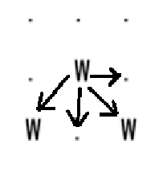
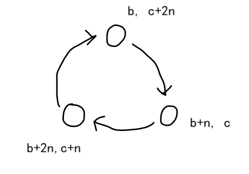

# 数据结构 并查集

建议先看[树概念及结构-CSDN博客](https://blog.csdn.net/m0_73693552/article/details/143655251)，因为并查集本质就是森林的合并。

## 森林的双亲表示法

对一棵树而言，除了根节点外，其余每个结点一定有且仅有一个双亲，双亲表示法就是根据这个特点存储树的，也就是把每个结点的双亲存下来。

因此，我们可以采用数组来存储每个结点的父亲结点的编号，这就实现了双亲表示法。


## 并查集能解决的问题

在有些问题中，我们需要维护若干个集合，并且基于这些集合要频繁执行下面的操作：  

- **查询操作**（`find`，可更换）：查找元素$x$属于哪一个集合。一般会在每个集合中选取一个元素作为代表，查询的是这个集合中的代表元素。
- **合并操作**（`unionn`）：将元素$x$所在的集合与元素$y$所在的集合合并成一个集合。合并2个元素需要有理由，这个理由在被合并的集合中的任意2个元素都适用。用`unionn`是为了避免和库中的关键字`union`冲突。
- **判断操作**（`issame`）：判断元素$x$和$y$是否在同一个集合。  

用其他数据结构例如哈希表、键值对等虽然能实现快速查找，但合并时需要遍历整个集合的元素，时间复杂度$O(N)$，$N$是被合并的集合的元素个数。因此哈希表并不能完美适配类似的问题。

并查集是一种用于维护元素所属集合的数据结构，实现为一个**森林**，其中每棵**树表示一个集合**，树中的**结点表示对应集合中的元素**，**根结点代表整个集合**。并查集在双亲表示法的基础上，根结点一般保存自身。


可以发现，这三个问题都是需要找到集合中的元素代表的集合是哪个。若每个集合可以表示成树，则问题可以转化成森林的操作：

- **查询操作**（`find`）：查找结点$x$的根结点。
- **合并操作**（`unionn`）：将结点$x$所在的树的根结点，作为结点$y$所在的树的一个子树。
- **判断操作**（`issame`）：判断结点$x$和$y$是否在同一个树上。  

而这些也是并查集作为数据结构对数据的操作。

## 并查集对数据的操作

在解决问题时，集合并不是一开始就已经成形，而是在解决问题的过程中根据需求逐渐合并形成的。因此使用并查集解决问题或维护数据需要做的操作：

1. 建立新的集合。这个是必做，开始时将每个元素都作为只有1个结点的树。
2. 合并操作。
3. 查询操作。
4. 判断操作。

**建立新的集合**：记`father[i]`表示 `i` 集合的代表元素也就是根结点。

```c
void make(vector<int>&father){
    for(size_t i=0;i<father.size();i++)
        father[i]=i;
}
```

**合并操作**：

```c 
//朴素思维，容易使x和y之间间隔的长度变得很长，加大访问难度
//（或集合变成静态链表的形式）因此一般不用
void unionn(int x,int y){
    father[x]=y;
}

//优化版本，直接将每个集合的代表元素进行拼接，若集合树的树高为2则忽略
void unionn(int x,int y){
    x=find(x);y=find(y);
    father[y]=x;
}

//更优雅的优化版本，原理都是一样的
void unionn(int x,int y){
    father[find(y)]=find(x);
}
```

**查询操作**：

朴素寻找，非递归。

```c
int find(int x){
	while(x!=father[x])
		x=father[x];
	return x;
}
```

朴素寻找，递归。

```cpp
int find(int x){
	if(x!=father[x])
		return find(father[x]);
	return x;
}
```

路径压缩（递归）。即查询的过程中，将所有结点的父结点改成根结点，防止数据成链的特殊情况。也有按秩合并，详细见《算法导论》，平时使用路径压缩即可。一般情况下路径压缩也是最常用的，除非有特殊需求。

```cpp
//路径压缩的查询操作
int find(int x){
	if(x!=father[x])
		father[x]=find(father[x]);
	return father[x];
}
//这个代码可以简写成2行或3行
int find(int x){
    return x==father[x]?x:(father[x]=find(father[x]));
}
```

**判断操作**：

```c
bool judg(int x,int y){
    return find(x)==find(y);
}
```

## 并查集OJ举例

### 并查集模板题

#### P3367 【模板】并查集 - 洛谷

[P3367 【模板】并查集 - 洛谷](https://www.luogu.com.cn/problem/P3367)

说是模板题，但数据量增大，查询操作只能用路径压缩。

```cpp
#include<bits/stdc++.h>
using namespace std;
vector<int>father;

int find(int x) {
	return x == father[x] ? x : (father[x] = find(father[x]));
}

int main() {
	int n, m;
	cin >> n >> m;
	father.resize(n + 1, 0);
	//建立新的集合
	for (int i = 1; i <= n; i++)
		father[i] = i;
	for (int i = 1, z, x, y; i <= m; i++) {
		cin >> z>>x>>y;
		if (z == 1) {
			//合并操作
			father[find(x)] = find(y);
		}
		else {
			//判断操作
			cout << (find(x) == find(y) ? "Y" : "N") << endl;
		}
	}
	return 0;
}
```


#### P1551 亲戚 - 洛谷

[1346：【例4-7】亲戚(relation)](http://ybt.ssoier.cn:8088/problem_show.php?pid=1346)  

可以利用并查集来维护亲戚关系，算是并查集的模板题。本题要输入的数据量相对较大，全部使用`cin`获取数据可能超时，所以用`scanf`配合路径压缩。

```c
#include<bits/stdc++.h>
using namespace std;
vector<int>father;

//路径压缩
int find(int x) {
	if (x != father[x])
		father[x] = find(father[x]);
	return father[x];
}

int main() {
	int n, m, q;
	cin >> n >> m;
	father.resize(n + 1, 0);
	//建立新的集合
	for (int i = 1; i <= n; i++)
		father[i] = i;

	while (m--) {
		int x, y;
		scanf("%d%d", &x, &y);
		x = find(x);
		y = find(y);
		//合并操作
		if (x != y)//个人感觉有没有这个影响不大
			father[x] = y;
	}
	cin >> q;
	while (q--) {
		int x, y;
		scanf("%d%d", &x, &y);
		//查询操作
		cout << (find(x) == find(y) ? "Yes" : "No") << "\n";
	}
	return 0;
}
```

[P1551 亲戚 - 洛谷](https://www.luogu.com.cn/problem/P1551)

原理都差不多，但数据量比[1346：【例4-7】亲戚(relation)](http://ybt.ssoier.cn:8088/problem_show.php?pid=1346)小，可以用`cin`。

```cpp
#include<bits/stdc++.h>
using namespace std;
vector<int>father;

//路径压缩查询操作
int find(int x) {
	return x == father[x] ? x : (father[x] = find(father[x]));
}

int main() {
	int n, m, p;
	cin >> n >> m >> p;
	father.resize(n + 1, 0);
	//建立新的集合
	for (int i = 0; i <= n; i++)
		father[i] = i;

	//按照最初关系进行合并
	for (int i = 1, x, y, fx, fy; i <= m; i++) {
		cin >> x >> y;
		//合并操作
		fx = find(x);
		fy = find(y);
		father[fx] = fy;
	}

	for (int i = 1, x, y; i <= p; i++) {
		cin >> x >> y;
		//判断操作
		if (find(x) == find(y))
			cout << "Yes\n";
		else
			cout << "No\n";
	}
	return 0;
}
```

### 二维问题转化为一维并查集

#### P1596 Lake Counting S洛谷

[P1596 [USACO10OCT\] Lake Counting S - 洛谷](https://www.luogu.com.cn/problem/P1596)

用广搜就能解决，这里用并查集。

输入整个图后，遍历到1个`w`，就遍历右边和下边的4个方向寻找`w`，找到一个就合并一个。合并时需要用一维坐标模拟二维坐标参与合并。不枚举8个方向，是因为左上部分可以被替代。



统计水坑数量时可以利用`father[i]=i`的特性，直接统计集合数。但需要将二维转换成一维，也可以用一维转换成二维。

```cpp
#include<bits/stdc++.h>
using namespace std;
vector<short>fa;

int find(int x) {
	return x == fa[x] ? x : (fa[x] = find(fa[x]));
}

int main() {
	int n, m;
	cin >> n >> m;
	vector<vector<char> >pct(n, vector<char>(m, 0));
	for (int i = 0; i < n; i++) {
		for (int j = 0; j < m; j++) {
			cin >> pct[i][j];
		}
	}
	//4个方向
	int dx[] = { 0,1,1,1 }, dy[] = { 1,1,0,-1 };

	//初始化并查集
	fa.resize(n * m, 0);
	for (int i = 1; i < n * m; i++)
		fa[i] = i;

	for (int i = 0, x, y; i < n; i++) {
		for (int j = 0; j < m; j++) {
			if (pct[i][j] == '.') {
				continue;
			}
			for (int k = 0; k < 4; k++) {
				x = i + dx[k];
				y = j + dy[k];
				if (x<0 || x>=n || y<0 || y>=m)
					continue;
				//合并操作，注意二维转一维时需要用行乘以列数
				if (pct[x][y] == 'W')
					fa[find(x * m + y)] = find(i * m + j);
			}
		}
	}
	int cnt = 0;
	for (int i = 0; i < n; i++) {
		for (int j = 0; j < m; j++) {
			if (pct[i][j] == '.')
				continue;
			//二维转一维
			if (fa[i * m + j] == i * m + j) {
				++cnt;
			}
		}
	}
	////也可以一维转二维
	//for (int i = 0; i < n * m; i++) {
	//	int x = i / m, y = i % m;
	//	if (pct[x][y] == 'W' && fa[i] == i)
	//		++cnt;
	//}

	cout << cnt;
	return 0;
}
```

#### 1329：【例8.2】细胞

同样的枚举连通块的题还有[1329：【例8.2】细胞](http://ybt.ssoier.cn:8088/problem_show.php?pid=1329)。这题原本是[广度优先搜索](https://blog.csdn.net/m0_73693552/article/details/147026131?sharetype=blogdetail&sharerId=147026131&sharerefer=PC&sharesource=m0_73693552&spm=1011.2480.3001.8118)的题，同样可以用并查集解决。

这里只给参考程序：

```cpp
#ifndef _CRT_SECURE_NO_WARNINGS
#define _CRT_SECURE_NO_WARNINGS 1
#endif

#include <bits/stdc++.h>
using namespace std;
int fa[50*70];
char pct[50][70];
int n,m;
int dx[]={0,1},dy[]={1,0};

int find(int x){
	return x==fa[x]?x:(fa[x]=find(fa[x]));
}

int main() {
	ios::sync_with_stdio(false);
	cin.tie(0);
	cin>>n>>m;
	for(int i=1;i<=n*m;i++)
		fa[i]=i;
	for(int i=0;i<n;i++){
		for(int j=0;j<m;j++){
			cin>>pct[i][j];
		}
	}
	
	for(int i=0;i<n;i++){
		for(int j=0;j<m;j++){
			if(pct[i][j]=='0')
				continue;
			for(int k=0;k<2;k++){
				int nx=i+dx[k],ny=j+dy[k];
				if(nx<0||nx>=n||ny<0||ny>=m)
					continue;
				if(pct[nx][ny]!='0')
					fa[find(nx*m+ny)]=find(i*m+j);
			}
		}
	}
	
	int cnt=0;
	for(int i=0;i<n;i++){
		for(int j=0;j<m;j++){
			if(pct[i][j]=='0')
				continue;
			if(fa[i*m+j]==i*m+j)
				++cnt;
		}
	}
	cout<<cnt;
	return 0;
}
```


[P1955 [NOI2015\] 程序自动分析 - 洛谷](https://www.luogu.com.cn/problem/P1955)


# 扩展域并查集

普通的并查集只能解决各元素之间仅存在一种相互关系，比如[P1551 亲戚 - 洛谷](https://www.luogu.com.cn/problem/P1551)题目中：

* $a$ 和 $b$ 是亲戚关系，$b$ 和 $c$ 是亲戚关系，这时就可以查找出 $a$ 和 $c$ 也存在亲戚关系。

但如果存在各元素之间存在多种相互关系，普通并查集就无法解决。比如下面的案例：

* $a$ 和 $b$ 是敌人关系，$b$ 和 $c$ 是敌人关系，但是 $a$ 和 $c$ 其实不是敌人关系，而是另一种朋友关系。

此时，就不仅仅是简单的敌人关系，还是出现一种朋友关系。一般的并查集的合并操作通常只能有1个理由。

## 借助敌人朋友关系理解扩展域并查集

扩展域并查集：对并查集进行扩展，即将**每个元素拆分成多个域**，每个域代表一种**状态或者关系**。通过**维护这些域之间的关系**，来处理复杂的约束条件。

例如敌人朋友问题，我们会将$n$个人的集合中，任一元素 $x$ 按照和其他人的关系，分成两个域，这2个域可以用2个数组或长度为$2n$的数组来模拟。

$x$在2个数组中都有对应的映射，以长度为$2n$的数组为例，在`[1,n]`的部分的映射是$x$，在`[n+1,2*n]`的部分的映射是$x+n$。2个映射互为敌人关系，可以理解为$x$和$x+n$是敌人关系或互为敌人的状态，也可以理解为2个域之间的关系为敌对。

按照这种设定，初始状态有 $2n$ 个单结点树的普通并查集中有2个元素 $x$ 和 $y$ （$1\leq x,y\leq n$），它们根据关系进行如下处理：

* $x$ 和 $y$ 是朋友，把 $x$ 和 $y$ 合并成一个集合（或树）；

* $x$ 和 $y$ 是敌人：那么 $x$ 和 $y$ 的敌人 $y + n$ 就是朋友，合并 $x$ 与 $y + n$；$y$ 和 $x$ 的敌人 $x + n$ 就是朋友，合并 $y$ 与 $x + n$。

这样就可以利用两个域，将所有的关系维护起来。这里借助模板题加深理解。

[P1892 [BalticOI 2003\] 团伙 - 洛谷](https://www.luogu.com.cn/problem/P1892)

> 做这类题的时候，若想不明白，则需要画图。

直接照搬上文的分析，对测试样例进行模拟，也就是画森林。

```
6
4
E 1 4
F 3 5
F 4 6
E 1 2
```

但需要注意的是，题目并没有告诉说朋友的敌人是敌人。例如样例1的`F 3 5`，若用扩展域并查集的话，并不能说明 3 和 11 是敌人，同理也不能说明 9 和 5 是敌人。

在认父结点时，下标需要统一。即：

假设`fa[i]`是一个长度为`2*n+1`的数组，被划分成2个域，域1是`[1,n]`，域2是`[n+1,2*n]`，因为实际的人数只有`n`个，因此在统计关系网个数时只会指定一个域去统计。

例如，这里若判断出敌人关系，则将域1的元素作为父结点进行集合的合并（`fa[find(x+n)]=find(y);`），这样判断出朋友关系时直接匹配域1即可（`fa[find(x)]=find(y);`）。之后统计关系网时直接统计域1的`find(i)=i`即可。


或者，若判断出敌人关系，则将域2的元素作为父结点进行集合的合并（`fa[find(x)]=find(y+n);`），但相应的，判断出朋友关系时需要匹配域2（`fa[find(x+n)]=find(y+n);`）。统计关系网时同样需要统计域2的`find(i)=i`。


2个匹配方式都能AC，但更推荐用第1个匹配方式，这个取决于个人习惯。

```cpp
#include<bits/stdc++.h>
using namespace std;

vector<int>fa;
inline int find(int x) {
	return x == fa[x] ? x : (fa[x] = find(fa[x]));
}

void ac1(int n, int T) {
	for (int i = 1; i <= T; i++) {
		char c; int x, y;
		cin >> c >> x >> y;
		if (c == 'E') {
			//这里需要统一，若更改的下标是y+n，则最后统计时选择朋友域1
			fa[find(y + n)] = find(x);
			fa[find(x + n)] = find(y);
		}
		else {
			fa[find(x)] = find(y);
		}
	}
	int cnt = 0;
	for (int i = 1; i <= n; i++) {
		if (find(i) == i)
			++cnt;
	}
	cout << cnt;
}

void ac2(int n, int T) {
	for (int i = 1; i <= T; i++) {
		char c; int x, y;
		cin >> c >> x >> y;
		//选择统计朋友域2
		if (c == 'E') {
			fa[find(x)] = find(y + n);
			fa[find(y)] = find(x + n);
		}
		else {
			fa[find(x + n)] = find(y + n);
		}
	}
	int cnt = 0;
	for (int i = n + 1; i <= 2 * n; i++) {
		if (find(i) == i)
			++cnt;
	}
	cout << cnt;
}

int main() {
	int n, T;
	cin >> n >> T;
	//建立新的集合，fa[x]=y表示的含义是x的朋友是y
	//[1,n]是朋友域1，[n+1,2*n]是朋友域2，两个朋友域互为敌人域。
	fa.resize(n * 2 + 1, 0);
	for (int i = 1; i <= 2 * n; i++)
		fa[i] = i;
	//2个都能通过全部测试样例
	//ac1(n, T);//匹配方案1
	ac2(n, T);//匹配方案2
	return 0;
}
```

（个人感觉）扩展域并查集在普通并查集的基础上，当已有的属性无法通过单一理由合并集合表示关系时，则通过在其他域的映射的间接合并来表示某种属性（例如这题就是敌人的敌人就是朋友）。

## P2024 食物链 - 洛谷 3个关系

[P2024 [NOI2001\] 食物链 - 洛谷](https://www.luogu.com.cn/problem/P2024)

约定：a 和 b 是捕食关系，b 和 a 是被捕食关系，都指的是 a 吃 b （$a\rightarrow b$）。

这题的代码实现很像模拟：按照输入顺序遍历每句话，判断这句话是否和之前的信息矛盾，有矛盾则统计，没有则维护这句话描述的关系。题解也是围绕描述关系展开。

这里的关系在题目中只有2个：同类和捕食。显然只有同类才支持将几个动物划分在一起。

> 回忆使用并查集的4个条件：0、解决问题需要将相关信息整理成集合。1、集合间有合并操作。2、需要查找某个元素是否属于某个集合。3、判断2个元素是否属于同一集合。

尽管这题看上去是模拟，但判断每句话的真假需要借助并查集。例如同类关系需要去印证这2个元素是否是同一集合。因此并查集合并的理由是元素（同类）之间是同类关系。

任意2个元素都有3种关系：同类关系、捕食关系和被捕食关系。可以将并查集扩展为3个域（这3个域怎么叫都行，例如按照约定，叫作同类域、捕食域和被捕食域，只要能确定同一元素在3个域中的映射之间的关系即可），元素 $x$ 在3个域内的映射的关系：$x\rightarrow x+n\rightarrow x+2n$，$x+2n\rightarrow x$，即一个闭环。


每句话中的2个元素$b$和$c$，若它们是同类关系，则它们在每个域中的映射需要做的处理：

* $b$所在的集合和$c$所在的集合合并。
* $b+n$所在的集合和$c+n$所在的集合合并。
* $b+2n$所在的集合和$c+2n$所在的集合合并。

若它们是捕食关系（$b\rightarrow c$）：

* $b$所在的集合和$c+2n$所在的集合合并。
* $b+n$所在的集合和$c$所在的集合合并。
* $b+2n$所在的集合和$c+n$所在的集合合并。



箭头表示捕食关系。$b \rightarrow c$ 表示$b$吃$c$，但3个域的关系是$b$ 吃 $b+n$，$b+n$ 吃 $b+2n$，
所以 $c$和 $b+n$ 可以按照同类的关系划分为同一个集合，表示$b$吃$c$（`find(b+n)==find(c)`）。

```cpp
#include<bits/stdc++.h>
using namespace std;
vector<int>fa;

int find(int x) {
	return x == fa[x] ? x : (fa[x] = find(fa[x]));
}

int main() {
	int N, K;
	cin >> N >> K;
	fa.resize(3 * N + 1, 0);
	for (int i = 1; i < 3 * N + 1; i++)
		fa[i] = i;
	int cnt = 0;
	while (K--) {
		int a, b, c;
		cin >> a >> b >> c;
		if (b > N || c > N || (a == 2 && c == b)) {
			++cnt;
			continue;
		}
		if (a == 1) {
			//存在捕食关系就不合法
			if (find(b) == find(c + 2 * N) || find(b) == find(c + N))
				++cnt;
			else {
				fa[find(b)] = find(c);
				fa[find(b + N)] = find(c + N);
				fa[find(b + 2 * N)] = find(c + 2 * N);
			}
		}
		else {
			//存在同类关系或对方反而吃自己则不合法
			if (find(b) == find(c)
				|| find(b) == find(c + N))
				++cnt;
			else {
				fa[find(b)] = find(c + 2 * N);
				fa[find(b + N)] = find(c);
				fa[find(b + 2 * N)] = find(c + N);
			}
		}
	}
	cout << cnt;
	return 0;
}
```


# 带权并查集

带权并查集在普通并查集的基础上，为每个结点增加了一个权值。这个权值可以表示当前结点与父结点之间的关系、距离或其他信息。

注意，由于查找时有路径压缩操作，一般情况最终这个权值表示的是当前结点相对于根结点的信息。而且是**先通过路径压缩**的方式对结点进行查询操作，这个结点和根结点之间的权值才有意义。

有了这样一个权值，就可以推断出集合中各个元素之间的相互关系。

所以除了表示结点和根结点关系的数组`father[i]`，还要有表示权值的其他数组。

例如之前的问题[P1892 [BalticOI 2003\] 团伙 - 洛谷](https://www.luogu.com.cn/problem/P1892)，虽然问题只问了能组成几个小团体，但要查询任意2人之间的关系，则普通并查集无法搞定。此时可以将朋友关系的权值设置为0，敌人关系设置为1，这样所有人的映射数据都在一个树内时，可以通过“朋友的朋友是朋友”判断任意2个人是朋友关系，但无法通过“朋友的敌人”的关系判断两人是什么关系。

## 权值为结点间距离的并查集

以距离问题为例，实现一个能够查询任意两点之间距离的并查集。权值暂定为**结点到父结点的距离**。

实现带权并查集的核心是在进行 `find` 和 `unionn` 操作时，不仅要维护集合的结构，还要维护结点的权值。

权值表示距离的带权并查集，这个数据结构的**初始化**：

```cpp
void make(vector<int>&father,vector<int>&dis){
    for(int i=1;i<=n;i++){
        father[i]=i;
        dis[i]=0;//这里要根据题意来初始化
    }
}
```

**查询操作**：

```cpp
int find(int x){
    if(father[x]==x)
        return x;
    int t=find(father[x]);//先执行这句，让根节点和x的父结点产生关系
    d[x]+=d[fa[x]];
    
    return fa[x]=t;
}
```

需要进行递归，让每个父结点都和根结点结合的同时更新它们和根结点的关系和权值，再更新当前结点和根结点的关系和权值。其实就是路径压缩的更改。


合并操作：

```cpp
void unionn(int x, int y, int w) {
    int fx = find(x), fy = find(y);
    if(fx != fy){//不在同⼀个集合中
        fa[fx] = fy;
        d[fx] = d[y] + w - d[x];//注意，可能会根据权值的意义有所改变
    }
}
```

`x` 所在集合与 `y` 所在集合合并，`x` 与 `y` 之间的权值（或距离）是 `w`，则`x`到新的根结点`fy`的距离则是`w+d[y]`。但合并时并没有说`x`和`y`有路径连接，因此`w+d[y]`实际应该是`x`到自身集合的根结点的距离`d[x]`加上`fx`到`fy`也就是新的根结点的距离，即`d[x]+d[fx]==w+d[y];`经过转换后即可得到`d[fx] = d[y] + w - d[x];`。


带权并查集的实现是多种多样的，基本上换一道题，实现的代码就要更改。因此，虽然个人会套用这个权值为结点的并查集模型，但最重要的还是根据问题设计合适的带权并查集，关注实现过程的思考方式，这才是通用的。

## P2024 食物链 - 洛谷

[P2024 [NOI2001\] 食物链 - 洛谷](https://www.luogu.com.cn/problem/P2024)

之前曾用3个关系的扩展域并查集解决，这里提供带权并查集的一种思路。

整体的思路依旧是模拟，但用的并查集不一样。

假设在食物链中 $a$ 吃 $b$，$b$ 吃 $c$， $c$ 吃 $a$，通过系数和下标将食物链拓展：


用权值0、1、2表示结点和根结点的3个关系：同类，捕食和被捕食。这样所有的动物都能用同一并查集表示关系。

在这个并查集模型下，判断任意2个结点$x$ 和 $y$ 之间的关系可通过作差取模来实现。

```cpp
(d[x]-d[y])%3==0;//同类关系
(d[x]-d[y])%3==1;//捕食关系，x吃y
(d[x]-d[y])%3==2;//被捕食关系，y吃x
```

因为`d[x]-d[y]`有可能是负数，所以进行补正操作：

```cpp
((d[x]-d[y])%3+3)%3==0;//同类关系
((d[x]-d[y])%3+3)%3==1;//捕食关系，x吃y
((d[x]-d[y])%3+3)%3==2;//被捕食关系，y吃x
```

例如$((a_1-a_2)\%3+3)\%3=0$，所以$a_1$和$a_2$是同类关系，$((b_1-a_2)\%3+3)\%3=2$，所以$b_1$和$a_2$是被捕食关系。

再结合判断语句为真时需要维护各个动物之间的关系：合并集合、判断2个元素的关系以及查找，所以可以使用并查集。再结合所有物种之间可以通过权值求得关系，因此所有物种都可通过“属于食物链”这一理由进行合并。


但需要注意，在这个模型下判断2个结点之间的权值关系需要2个结点都在同一集合，以上的距离关系才能成立，否则关系未知。

合并时需要注意的点：


若 $x$ 和 $y$ 是同类，则将$x$和$y$合并为同一集合时，权值关系应满足`((d[x]-d[y])%3+3)%3==0`。根据上图关系，将等式拆解：`(d[x]+d[fx]-d[y]+3)%3==0%3`，根据这个等式求得：`d[x]+d[fx]-d[y]+3==0`$\rightarrow$`d[fx]=d[y]-3-d[x]`，所以$w$为 -3 。但因为求权值的时候存在取模操作（指的是`((d[x]-d[y])%3+3)%3`），所以$w$只要是3的倍数都可以。

但若 $x$ 吃 $y$，在 $x$ 所在的集合和 $y$ 所在的集合合并后，应该满足`(d[x]-d[y]+3)%3==1;`，根据上图关系，将等式拆解：`(d[x]+d[fx]-d[y]+3)%3==1`，根据这个等式求得
`d[fx]=d[y]-2-d[x]`，所以判断出捕食关系时权值应该为-2。同样因为取模操作，所以合并时只要权值是$-2+3m(m\in N^*)$都可以。例如1、4、7、10、...。

参考程序：

```cpp
#include<bits/stdc++.h>
using namespace std;
vector<int>fa, d;
int n, k;

//查询操作
int find(int x) {
	if (x == fa[x])
		return x;
	int t = find(fa[x]);
	d[x] += d[fa[x]];
	return fa[x] = t;
}

//合并操作
void unionn(int x, int y, int w) {
	int fx = find(x), fy = find(y);
	if (fx != fy) {
		fa[fx] = fy;
		d[fx] = w + d[y] - d[x];
	}
}

int main() {
	cin >> n >> k;
	//权值为距离的带权并查集
	fa.resize(n + 1, 0);
	d = fa;
	for (int i = 1; i <= n; i++)
		fa[i] = i;

	int cnt = 0;

	//随机数验证数学推导得到的结论
	srand(size_t(time(0)));
	int Rand = rand() % (INT_MAX / 100);
	//这里有个很神奇的现象，只要把100换成别的小一点的数字，
	//是否AC完全凭运气
	while (k--) {
		int a, b, c;
		cin >> a >> b >> c;
		if (b > n || c > n || (a == 2 && b == c)) {
			++cnt;
			continue;
		}
		int fb = find(b), fc = find(c);
		if (a == 1) {
			if (fb == fc && ((d[b] - d[c]) % 3 + 3) % 3)
				++cnt;
			else {
				//无论数值多么离谱，只要满足w%3==0并且
				//-3+3*Rand在存储的数据范围内不溢出即可
				unionn(b, c, -3 + 3 * Rand);
			}
		}
		else {
			if (fb == fc && ((d[b] - d[c]) % 3 + 3) % 3 != 1)
				++cnt;
			else {
				//无论数值多么离谱，只要满足(w-2)%3==0并且
				//-2 + 3*Rand在存储的数据范围内不溢出即可
				unionn(b, c, -2 + 3 * Rand);
			}
		}
	}
	cout << cnt;

	return 0;
}
```

在判断捕食关系时还有一个细节：

之前的分析思路是$b$和$c$（即$x$和$y$），但如果更换顺序，即$c$和$b$（即$y$和$x$）的话则要重新计算。但整体思路都是一样的：


`((d[y]-d[x])%3+3)=1`$\rightarrow$`((d[y]-d[x]-d[fx])%3+3)=1`$\rightarrow$`d[fx]=d[y]+2-d[x]`。

也就是说若是按照$y$、$x$的顺序计算合并的权值的话，则权值应该为$2+3m(m\in N^*)$。

对比按照$x$、$y$的顺序计算合并的权值：$-2+3m(m\in N^*)$，它们的目的都是为了构建 $x$ 和 $y$ 的 $x$ 吃 $y$ 的关系，都是正确的。

能否AC全凭运气的代码：

```cpp
#define _CRT_SECURE_NO_WARNINGS 1
#include<bits/stdc++.h>
using namespace std;
vector<int>fa, d;
int n, k;

//查询操作
int find(int x) {
	if (x == fa[x])
		return x;
	int t = find(fa[x]);
	d[x] += d[fa[x]];
	return fa[x] = t;
}

//合并操作
void unionn(int x, int y, int w) {
	int fx = find(x), fy = find(y);
	if (fx != fy) {
		fa[fx] = fy;
		d[fx] = w + d[y] - d[x];
	}
}

int main() {
	cin >> n >> k;
	//权值为距离的带权并查集
	fa.resize(n + 1, 0);
	d = fa;
	for (int i = 1; i <= n; i++)
		fa[i] = i;

	int cnt = 0;

	//随机数验证数学推导得到的结论
	srand(size_t(time(0)));
	int Rand = rand() % (INT_MAX / 300);
	//这种解法下100也有可能出错
	while (k--) {
		int a, b, c;
		cin >> a >> b >> c;
		if (b > n || c > n || (a == 2 && b == c)) {
			++cnt;
			continue;
		}
		int fb = find(b), fc = find(c);
		if (a == 1) {
            //判断权值关系时是c，b，合并时却是b作为c的子树
			if (fb == fc && ((d[c] - d[b]) % 3 + 3) % 3)
				++cnt;
			else {
				//无论数值多么离谱，只要满足w%3==0并且
				//-3+3*Rand在存储的数据范围内不溢出即可
				unionn(b, c, 0 + 3*Rand);
			}
		}
		else {
			if (fb == fc && ((d[c] - d[b]) % 3 + 3) % 3 != 1)
				++cnt;
			else {
				//无论数值多么离谱，只要满足(w-2)%3==0并且
				//-2 + 3*Rand在存储的数据范围内不溢出即可
				unionn(b, c, 2 + 3* Rand);
			}
		}
	}
	cout << cnt;

	return 0;
}
```


[P1196 [NOI2002\] 银河英雄传说 - 洛谷](https://www.luogu.com.cn/problem/P1196)
