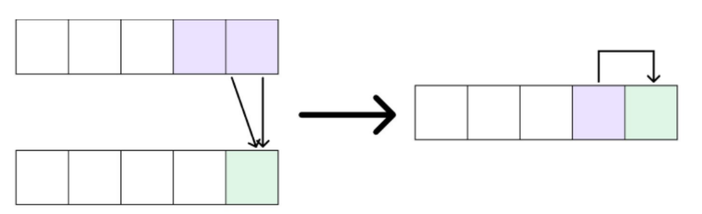

# 动态规划原理

从数塔问题出发理解动态规划。

## 1258：【例9.2】数字金字塔 动态规划原理

[1258：【例9.2】数字金字塔](http://ybt.ssoier.cn:8088/problem_show.php?pid=1258)

[P1216 [IOI 1994\] 数字三角形 Number Triangles - 洛谷](https://www.luogu.com.cn/problem/P1216)

### 深度优先搜索

问题要求的是从最高点按照规则走到最低点的路径的最大的权值和，路径起点终点固定，走法规则明确，可以考虑用搜索来解决。

定义递归函数`void Dfs(int x,int y,int Curr)`，其中`(x,y)`表示当前已从`(1,1)`走到`(x,y)`，目前已走路径上的权值和为`Curr`。同时用另一个变量`Ans`记录最大值。

当`x=N`时，到达递归出口，如果`Curr`比`Ans`大，则把`Ans`更新为`Curr`；
否则向下一行两个位置行走，即递归执行
`Dfs(x+1,y,Curr+A[x+1][y])`和`Dfs(x+1,y+1,Curr+A[x+1][y+1])`。

该方法实际上是把所有路径都走了一遍，由于每一条路径都是由`N-1`步组成，每一步有“左”、“右”两种选择，因此路径总数为$2^{N-1}$，
 所以该方法的时间复杂度为$O(2^{N-1})$，铁定超时。

```c
#include <iostream>
using namespace std;
int A[1005][1005], F[1005][1005], N, Ans;
void Dfs(int x, int y, int Curr) {
	if (x == N) {
		if (Curr > Ans)
			Ans = Curr;
		return;
	}
    //深度优先搜索是枚举所有情况，这里只有两个，而且用形参表示状态，回溯无难度
	Dfs(x + 1, y, Curr + A[x + 1][y]);
	Dfs(x + 1, y + 1, Curr + A[x + 1][y + 1]);
}
int main() {
	cin >> N;
	for (int i = 1; i <= N; i++)
		for (int j = 1; j <= i; j++)
			cin >> A[i][j];
	Ans = 0;
	Dfs(1, 1, A[1][1]);
	cout << Ans << endl;
	return 0;
}
```

### 记忆化搜索

为了避免重复搜索，我们在dfs的基础上开设全局数组`F[x][y]`记录从`(x,y)`出发到终点路径的最大权值和，一开始全部初始化为`-1`表示未被计算过。

在计算`Dfs(x,y)`时，首先查询`F[x][y]`，如果`F[x][y]`不等于`-1`，说明`Dfs(x,y)`之前已经被计算过，直接返回 `F[x][y]`即可，否则计算出`Dfs(x,y)`的值并存储在`F[x][y]`中。

由于`F[x][y]`对于每个合法的`(x,y)`都只计算过一次，
 而且计算是在$O(1)$内完成的，因此时间复杂度为$O(N^2)$。可以通过本题。

记忆化搜索的本质已经是动态规划。因为记忆化搜索也是记录走过的分支，相当于已经解决了子问题，再遍历这条路径时直接由子问题解决当前问题即可。

```c
#include <iostream>
#include <algorithm>
using namespace std;
int A[505][505],
F[505][505],N;
int Dfs(int x,int y) {
	if (F[x][y]== -1) {
		if (x==N)
			F[x][y]=A[x][y];
		else
			F[x][y]=A[x][y]+max(Dfs(x+1,y),Dfs(x+1,y+1));
	}
	return F[x][y];
}
int main() {
	cin >> N;
	for(int i = 1;i <= N;i ++)
		for(int j = 1;j <= i;j ++)
			cin >> A[i][j];
	for(int i = 1;i <= N;i ++)
		for(int j = 1;j <= i;j ++)
			F[i][j] = -1;
	Dfs(1,1);
	cout << F[1][1] << endl;
	return 0;
}
```

### 动态规划（顺推）

#### 动态规划原理

动态规划（Dynamic Programming，简称dp）是1951年美国数学家R.Bellman等人提出。具体详见[动态规划_百度百科](https://baike.baidu.com/item/动态规划/529408?fr=ge_ala)。

**简单总结就是**：

1. 一个**大问题拆分成若干子问题**，每个子问题的结果都是一个**状态**。

2. 由一个子问题解决另一个子问题选择的方法称为**决策**，在现实解决问题时我们都希望找到最优解，也就是**最优决策**。

3. 同一个大问题拆分成的子问题之间往往都有一样的规律。或者说，同一个大问题产生的**任意两个不同状态之间有相同的联系**。这个联系一般用数学公式表达，这个公式的专业术语叫**状态转移方程**。

4. 动态规划满足两个条件：
   * 最优化原理：**每一步决策都是最好的**解决方案，都是从很多方案中选择最好的方案。
   * 无后效性：每个状态除了第一个，都**只由前阶段的状态和决策决定**，和后续无关。

#### 题解分析

1、状态定义：
题目要求从`(1,1)`出发到最底层路径最大权值和，路径中是各个点串联而成，路径起点固定，终点和中间点相对不固定。因此定义`F[x][y]`表示从`(1,1)`出发到达`(x,y)`的路径最大权值和。
最终答案`Ans=max{F[N][1],F[N][2],...,F[N][N]}`。

2、状态转移方程&边界条件（或初始化方式）：
不去考虑`(1,1)`到`(x,y)`的每一步是如何走的，只**考虑最后一步是如何走**，根据最后一步是向
左还是向右分成以下两种情况：
向左：最后一步是从`(x-1,y)`走到`(x,y)`, 此类路径被分割成两部分，

> 第一部分是从`(1,1)`走到`(x-1,y)`，第二部分是从`(x-1,y)`走到`(x,y)`，
>
> 第一部分的最大权值和，此部分问题的性质与`F[x][y]`的定义一样，就是`F[x-1][y]`，
>
> 第二部分就是`A[x][y]`，两部分相加即得到此类路径的最大权值和为`F[x-1,y]+A[x,y]`；

向右： 最后一步是从`(x-1,y-1)`走到`(x,y)`,此类路径被分割成两部分，

>
> 第一部分是从`(1,1)`走到`(x-1,y-1)`，第二部分是从`(x-1,y-1)`走到`(x,y)`，分析方法如上。
>
> 此类路径的最大权值和为
> `F[x-1,y-1]+A[x,y]`；
>
> `F[x][y]`的计算需要求出上面两种情况的最大值。
>
> 综上，得到**状态转移方程**如下：
> `F[x][y]=max{F[x-1,y-1],F[x-1][y]}+A[x,y]`
>
> 与递归关系式还需要递归终止条件一样，这里我们需要对边界进行处理以防止无休止地进行下去。观察发现计算`F[x][y]`时需要用到`F[x-1][y-1]`和`F[x-1][y]`，是上一行的元素，随着递归的深入，
> 最终都要用到第一行的元素`F[1][1]`,  `F[1][1]`的计算**不能再使用状态转移方程来求**，而是应该直接赋予一个特值`A[1][1]`。这就是**边界条件**。

综上得：
**状态转移方程**：`F[x][y]=max{F[x-1][y-1],F[x-1][y]}+A[x,y]`
**边界条件**：`F[1][1]=A[1][1]`

>  分析该**动态规划的正确性**，分析该解法是否满足使用动态规划的两个前提。
>
> **最优化原理**：这个在分析状态转移方程时已经分析得比较透彻，明显是符合最优化原理的。
>
> **无后效性**：状态转移方程中，我们只关心`F[x-1][y-1]`与`F[x-1][y]`的值，计算`F[x-1][y-1]`时可能有多种不同的决策对应着最优值，选哪种决策对计算`F[x][y]`的决策没有影响，
> `F[x-1][y]`也是一样。这就是无后效性。
>
> 在以后的题目中可能不会提及，但处处都充斥着这两个前提的分析。

3、填表（或程序实现）：
由于状态转移方程就是**递归关系式**，边界条件就是递归终止条件，所以可以用递归来完成，递归存在重复调用，利用记忆化可以解决重复调用的问题，这就是方法二的**记忆化搜索**。

记忆化实现比较简单，而且不会计算无用状态，但**递归也会受到栈的大小**和**递推加回归执行方式的约束**，另外记忆化实现调用状态的顺序是按照实际需求而展开，没有大局规划，**不利于进一步优化**。

所以dp更常用的还是**迭代法**。状态用二维数组表示，也就是说可以通过循环的方式求出每个状态（通俗点称呼就是填表）。

计算`F[x][y]`用到状态`F[x-1][y-1]`与`F[x-1][y]`，这些元素在`F[x][y]`的上一行，也就是说要计算第`x`行的状态的值，必须要先把第`x-1`行元素的值计算出来，因此我们可以先把第一行元素`F[1][1]`赋为 `A[1][1]`，再从第二行开始按照行**从左到右递增**，**从上到下递增**的顺序通过循环计算出每一行的有效状态即可。时间复杂度为$O(N^2)$。

参考程序：

```c
#include <iostream>
#include <algorithm>
using namespace std;
int A[1005][1005], F[1005][1005], N;
int main() {
	cin >> N;
	for (int i = 1; i <= N; i++)
		for (int j = 1; j <= i; j++)
			cin >> A[i][j];
	F[1][1] = A[1][1];
	for (int i = 2; i <= N; i++)
		for (int j = 1; j <= i; j++)
			F[i][j] = max(F[i - 1][j - 1], F[i - 1][j]) + A[i][j];
	int ans = 0;
	for (int i = 1; i <= N; i++)
		ans = max(ans, F[N][i]);
	cout << ans << endl;
	return 0;
}
```

### 滚动数组优化

根据之前得到的**状态转移方程**：`F[x][y]=max{F[x-1][y-1],F[x-1][y]}+A[x,y]`，
**边界条件**：`F[1][1]=A[1][1]`，

发现在二维数组表示的转移方程中，每个状态都只和上一个状态有关。而且每个状态都只和前1个状态有关，和前2个以及之前的所有状态都无关。

所以可以将表示状态的dp表用一维数组表示。状态转移方程变为

`f[x]=max(f[x],f[x-1])+A[x,y]`。

> 这种不改变空间复杂度，但可以极大程度地优化空间复杂度的状态表示称作滚动数组优化。

在填表的时候，需要将循环从右往左枚举，才能保证每个状态都是正确的。



因为都是正数，所以不必考虑边界为0时造成的影响。如果存在负数，则可能需要对边界情况做判断，或取无穷小。

滚动数组优化参考程序：

```cpp
#include<bits/stdc++.h>
using namespace std;

int main() {
	int n;
	cin >> n;
	vector<vector<int> >A(1, vector<int>(2,0));
	vector<int>f(n+1,0);
	for (int i = 1; i <= n; i++) {
		A.push_back(vector<int>(i + 2, 0));
		for (int j = 1; j <= i; j++)
			cin >> A[i][j];
	}
		
	int ans = A[1][1];
	for (int i = 1; i <= n; i++) {
		for (int j = i; j >= 1; j--) {//逆向枚举
			f[j] = max(f[j], f[j - 1]) + A[i][j];
			ans = max(ans, f[j]);
		}
	}
	cout << ans;
	return 0;
}
```

整体来说滚动数组优化的步骤：

1. 先用二维或多维解决问题。
2. 若状态转移方程的状态只和上一层或上几层格子有关，则可以考虑优化。否则不能优化。
3. 若判断出可以优化，则将原来的二维和多维状态减少适当的维度，并看情况修改循环的枚举顺序。

当然不是所有的题都能做空间优化。

### 动态规划（逆推）

这里思路和之前是一样的，只是状态的设定不同。

以这个样例为例：

```
5
13
11 8
12 7 26
6 14 15 8
12 7 13 24 11
```

**自底向上计算**：（给出递推式和终止条件）

从底层开始，本身数即为最大数；

倒数第二层的计算，取决于底层的数据，每次都取最大：
$12+6=18，13+14=27，24+15=39，24+8=32$；
倒数第三层的计算，取决于底二层计算的数据，每次都取最大：
$27+12=39，39+7=46，39+26=65$，
倒数第四层的计算，取决于底三层计算的数据，每次都取最大：
$46+11=57，65+8=73$，
最后的路径：
`5—>13—>8->26—>15—>24`。

这是手搓简单情况，复杂情况人的效率远远不及计算机，需要交给计算机来做。

**数据结构及算法设计**：

图形转化：直角三角形，便于搜索：向下、向右。

用三维数组表示数塔：

`a[x][y][1]`表示行、列及结点本身数据,
`a[x][y][2]`能够取得最大值, 
`a[x][y][3]`表示前进的方向，0表示向下，1表示向右。

**算法实现**：

数组初始化，输入每个结点值及初始的最大路径、前进方向为`0`；从倒数第二层开始向上一层求最大路径，共循环`N-1`次；从顶向下，输出路径：究竟向下还是向右取决于列的值，若列的值比原先多则向右，否则向下。

```c
#include<iostream>
using namespace std;
int main()
{
	int n, x, y;
	int a[1001][1001][4]={0};
	cin >> n;
	for (x = 1; x <= n; x++)//输入数塔的初始值
		for (y = 1; y <= x; y++) {
			cin >> a[x][y][1];//1表示值
			a[x][y][2] = a[x][y][1];//2表示当前状态，未经计算时默认是原来的数
			a[x][y][3] = 0;//3表示路径走向，默认向下
		}
	for (x = n - 1; x >= 1; x--)//从倒数第二行开始推 
		for (y = 1; y <= x; y++)
			if (a[x + 1][y][2] > a[x + 1][y + 1][2]) {//选择最大路径值
				a[x][y][2] = a[x][y][2] + a[x + 1][y][2];
				a[x][y][3] = 0;
			}
			else {
				a[x][y][2] = a[x][y][2] + a[x + 1][y + 1][2];
				a[x][y][3] = 1;
			}
	cout << a[1][1][2] << endl;//输出数塔最大值
    
    ////枚举路径，这题可忽略
	//y = 1;
	//for (x = 1; x <= n - 1; x++){//输出数塔最大值的路径
	//	cout << a[x][y][1] << "->";
	//	y = y + a[x][y][3];//下一行的列数
	//}
    
	//cout << a[n][y][1] << endl;
	return 0;
}
```
