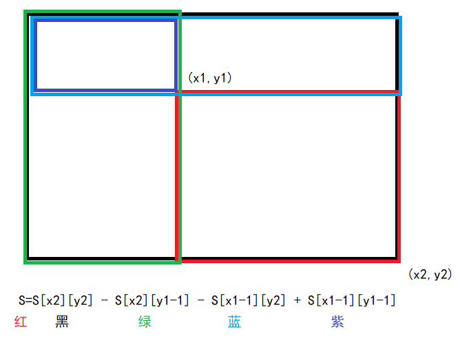
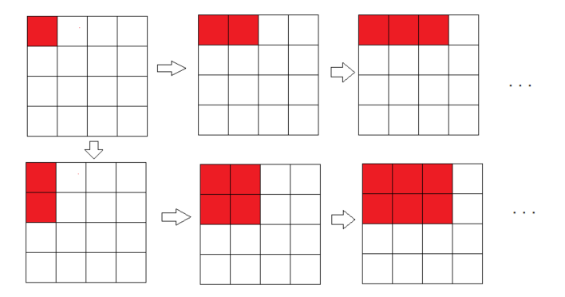
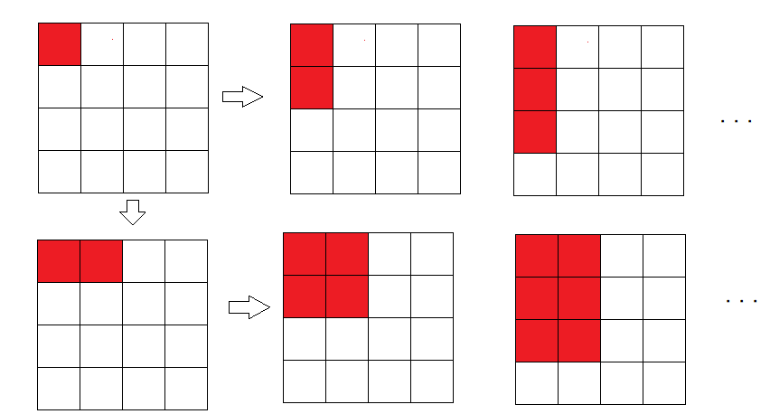
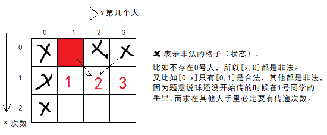
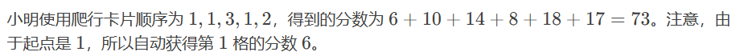
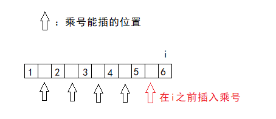

# 线性dp

线性dp的特点是状态转移只依赖于前一个或前几个状态，状态之间的关系可以通过线性描述。

线性dp通常可以用一维或多维数组存储状态。

## 最大子矩阵和和最大子段和

[1282：最大子矩阵](http://ybt.ssoier.cn:8088/problem_show.php?pid=1282) 

[1224：最大子矩阵](http://ybt.ssoier.cn:8088/problem_show.php?pid=1224) 

最大子矩阵和问题，即从一个任意大小的矩阵中找到一个小矩阵，使得和最大（或最小）。

比如这个矩阵：

```
 0 -2 -7  0
 9  2 -6  2
-4  1 -4  1
-1  8  0 -2
```

从中找到的子矩阵：

```
9  2
-4  1
-1  8
```

这个子矩阵的和最大，是15。

求这个问题，可以从一维开始优化。在后文只要没有提到动态规划（dp），都是贪心。

### 一维最大连续子序列和

[P1115 最大子段和 - 洛谷](https://www.luogu.com.cn/problem/P1115)

问题：给n个数，找出n个数中最大连续子序列和（区间累加和）。

这个问题需要枚举区间，可以尝试利用三重循环`i,j,k`，其中`i`、`j`表示区间的两个端点的可能取值，`k`表示右区间的实际取值。

因为是三层循环，时间复杂度会来到$O(n^3)$，在洛谷的OJ会超时。

```cpp
#define _CRT_SECURE_NO_WARNINGS 1

#include <bits/stdc++.h>
#define endl "\n"
using namespace std;

int main() {//朴素解法 时间复杂度O(N^3)
	int n;
	cin >> n;
    vector<int>a(n+1,0);
	for (int i = 1; i <= n; i++) {
		cin >> a[i];
	}
	int sum = 0;
	int maxx = -0x3f3f3f3f;
	for (int i = 1; i <= n; i++) {//左区间
		for (int j = i; j <= n; j++) {//右区间
			sum = 0;
			for (int k = i; k <= j; k++) {//k代表区间[i,k]
				sum += a[k];
			}
			maxx = max(sum, maxx);
		}
	}
	cout << maxx << endl;
    return 0;
}
```

### 一维的递推优化

[P1115 最大子段和 - 洛谷](https://www.luogu.com.cn/problem/P1115)

朴素解法中会发现很多区间出现重复枚举（区间`[i,j]`和`[i,j+1]`中的区间重复统计）。

优化方案：固定区间左端点，枚举左端点右边的所有端点并求和，同时记录最大的值。这样就得到了一个端点为左区间的所有情况。

这样减少了一层循环，使得时间复杂度优化为$O(n^2)$。但处理洛谷的这个OJ还是会超时。

```cpp
#define _CRT_SECURE_NO_WARNINGS 1

#include <bits/stdc++.h>
#define endl "\n"
using namespace std;

int main() {//朴素解法的优化（递推）时间复杂度O(N^2)
	int n;
	cin >> n;
    vector<int>a(n+1,0);
	for (int i = 1; i <= n; i++) 
		cin >> a[i];
	int sum = 0;
	int maxx = -0x3f3f3f3f;
	for (int i = 1; i <= n; i++) {//固定左端点
		sum = 0;
		for (int j = i; j <= n; j++) {//枚举区间
			sum += a[j];
			maxx = max(sum, maxx);
		}
	}
	cout << maxx << endl;
    return 0;
}
```

### 一维的前缀和优化

[P1115 最大子段和 - 洛谷](https://www.luogu.com.cn/problem/P1115)

和递推优化类似，但利用前缀和提前准备好。

时间复杂度为$O(n^2)$，依旧无法通过洛谷的OJ，但也算一种优化方式。

```cpp
#define _CRT_SECURE_NO_WARNINGS 1

#include <bits/stdc++.h>
#define endl "\n"
using namespace std;

int main() {//优化解法2 利用前缀和求区间和（类似优化解法1，但这个是提前准备好）
	int n;
	cin >> n;
    vector<int>a(n+1,0);
    vector<int>presum(n+1,0);//前缀和数组
	for (int i = 1; i <= n; i++) {
		cin >> a[i];
		presum[i] = presum[i - 1] + a[i];
	}
	int maxx = -0x3f3f3f3f;
	for (int i = 1; i <= n; i++) {
		for (int j = i; j <= n; j++) {
			int sum = presum[j] - presum[i - 1];//求[i,j]区间的和
			maxx = max(sum, maxx);
		}
	}
	cout << maxx << endl;
    return 0;
}
```

### 一维的dp思路

[P1115 最大子段和 - 洛谷](https://www.luogu.com.cn/problem/P1115)

1. 状态表示

研究子数组或子序列问题时，以某个位置为结尾，结合题意来定义状态表示。

因为以某个位置为结尾，可以拿到之前的所有子序列。而且长的子序列也可以通过短的子序列转移过来。

> 动态规划注重经验总结。如果能通过分治拆分成子问题来解决的问题和已知的经验重叠，那么可以很快解决这个问题。如果不是遇到过的问题，就要重新分析。

所以记`dp[i]`表示以`i`为结尾的最大连续子序列和。

2. 状态转移方程

**根据最后一步划分情况**。

当子序列长度为1时，`dp[i]=a[i]`。否则`dp[i]=dp[i-1]+a[i]`，即以`i-1`为结尾的所有子序列中最大值加上`a[i]`即为`dp[i]`的最大值。

而且会出现一种情况：某段子序列只有1个正数，其他数全是负数，加起来还不如正数的原始大小。

所以状态转移方程：`dp[i]=max(a[i],dp[i-1]+a[i]);`。即在两种情况中取最大值。

3. 初始化。

因为存在`dp[i-1]`，所以数组从下标1开始的话，下标0的数组首元素初始化为0，这样求子段和时不会造成影响。

4. 填表顺序

从左往右遍历。

5. 最终结果

整个数组中的最大值。但因为$-10^4\leq a[i]$，所以用单变量记录最大值时，那个变量需要初始化为一个很小的值作为负无穷大，或者直接初始化为`a[1]`。

参考程序：

```cpp
#include<bits/stdc++.h>
using namespace std;

int main() {
	int n;
	cin >> n;
	vector<int>a(n+1,0);
	vector<int>dp(a);
	for (int i = 1; i <= n; i++) 
		cin >> a[i];
	int ans = a[1];//-10^4<=a[i]
	for (int i = 1; i <= n; i++) {
		dp[i] = max(a[i], dp[i - 1] + a[i]);
		ans = max(ans, dp[i]);
	}
	cout << ans;
	return 0;
}
```


### 二维最大子矩阵问题

从一个任意大小的矩阵中找到一个子矩阵，使得和最大（或最小）。其实就是一维上升到二维。

朴素解法：枚举所有子矩阵（枚举左上点和左下点），针对左上到右下点之间的矩阵进行累加求和，找最大值。

这种解法要用到六个`for`循环，时间复杂度来到$O(n^6)$。这个复杂度能处理的数据更小了，处理[1282：最大子矩阵](http://ybt.ssoier.cn:8088/problem_show.php?pid=1282) 、[1224：最大子矩阵](http://ybt.ssoier.cn:8088/problem_show.php?pid=1224) 这两个OJ铁定超时。所以这个方法还需要优化。

```cpp
#define _CRT_SECURE_NO_WARNINGS 1

#include <iostream>
#define endl "\n"
using namespace std;

int main() {
	int a[101][101];
	int n;
	cin >> n;
	for (int i = 1; i <= n; i++) {
		for (int j = 1; j <= n; j++) {
			cin >> a[i][j];
		}
	}
	int maxx = a[1][1];
	//枚举左上点和右下点，得到矩阵范围，再将范围内的矩阵进行累加和
	for (int x1 = 1; x1 <= n; x1++) {//枚举左上角的点的行
		for (int y1 = 1; y1 <= n; y1++) {////枚举左上角的点的列

			for (int x2 = x1; x2 <= n; x2++) {//枚举右下角的点的行
				for (int y2 = y1; y2 <= n; y2++) {
					//遍历(x1,y1)到(x2,y2)之间的矩阵，进行子矩阵的累加和
					int sum = 0;
					for (int i = x1; i <= x2; i++) {
						for (int j = y1; j <= y2; j++) {
							sum += a[i][j];
						}
					}
					maxx = max(maxx, sum);
				}
			}
		}
	}
	cout << maxx;
    return 0;
}
```

### 二维子矩阵和的一维前缀和优化

枚举左上点和右下点，得到矩阵范围，再将范围内的矩阵进行累加和。经过优化，时间复杂度来到$O(n^5)$，可以通过 OJ [1282：最大子矩阵](http://ybt.ssoier.cn:8088/problem_show.php?pid=1282) 、[1224：最大子矩阵](http://ybt.ssoier.cn:8088/problem_show.php?pid=1224) 。

```cpp
#define _CRT_SECURE_NO_WARNINGS 1

#include <iostream>
#define endl "\n"
using namespace std;

int main() {//最大子矩阵的一维前缀和优化
	int a[101][101] = { 0 }, presum[101][101] = { 0 };
	int n = 0;
	cin >> n;
	for (int i = 1; i <= n; i++) {
		for (int j = 1; j <= n; j++) {
			cin >> a[i][j];
			presum[i][j] = presum[i][j - 1] + a[i][j];
		}
	}
	int maxx = a[1][1];
	//枚举左上点和右下点，得到矩阵范围，再将范围内的矩阵进行累加和
	for (int x1 = 1; x1 <= n; x1++) {//枚举左上角的点的行
		for (int y1 = 1; y1 <= n; y1++) {////枚举左上角的点的列

			for (int x2 = x1; x2 <= n; x2++) {//枚举右下角的点的行
				for (int y2 = y1; y2 <= n; y2++) {//枚举右下角的点的列

					//遍历(x1,y1)到(x2,y2)之间的矩阵，进行子矩阵的累加和
					int sum = 0;
					for (int i = x1; i <= x2; i++) {
						sum += presum[i][y2] - presum[i][y1 - 1];
					}
					maxx = max(maxx, sum);
				}
			}
		}
	}
	cout << maxx;
    return 0;
}
```

### 二维前缀和优化

二维前缀和可以理解为所有以$(1,1)$为左上角的矩阵的和。求法类似于求长方形中间某点和右下角的点组成的子矩形的面积。



经过二维前缀和优化，时间复杂度来到$O(n^4)$。

$O(n^5)$就可以通过 OJ [1282：最大子矩阵](http://ybt.ssoier.cn:8088/problem_show.php?pid=1282) 、[1224：最大子矩阵](http://ybt.ssoier.cn:8088/problem_show.php?pid=1224) ，$O(n^4)$没理由过不了。

```cpp
#define _CRT_SECURE_NO_WARNINGS 1

#include <iostream>
#define endl "\n"
using namespace std;

int main() {//二维前缀和优化
	int a[101][101] = { 0 }, presum[101][101] = { 0 };
	int n = 0;
	cin >> n;
	for (int i = 1; i <= n; i++) {
		for (int j = 1; j <= n; j++) {
			cin >> a[i][j];

			//二维前缀和求法
			presum[i][j] = presum[i][j - 1] + presum[i - 1][j] - presum[i - 1][j - 1] + a[i][j];
		}
	}
	int maxx = a[1][1];
	//时间复杂度O(N^4)
	for (int x1 = 1; x1 <= n; x1++) {//枚举左上角的点的行
		for (int y1 = 1; y1 <= n; y1++) {////枚举左上角的点的列

			for (int x2 = x1; x2 <= n; x2++) {//枚举右下角的点的行
				for (int y2 = y1; y2 <= n; y2++) {//枚举右下角的点的列

					//通过二维前缀和求x1,y1到x2,y2之间的矩阵和
					int sum = presum[x2][y2] - presum[x2][y1 - 1] - presum[x1 - 1][y2] + presum[x1 - 1][y1 - 1];
					maxx = max(maxx, sum);
				}
			}
		}
	}
	cout << maxx;
    return 0;
}
```

### 二维子矩阵和的dp思路

OJ [1282：最大子矩阵](http://ybt.ssoier.cn:8088/problem_show.php?pid=1282) 、[1224：最大子矩阵](http://ybt.ssoier.cn:8088/problem_show.php?pid=1224) 。

1. 状态定义

参考一维的动态规划思路，如果一维的数组每个元素都存储二维子矩阵的对应列（或行）的前缀和，则用一维的状态也能定义二维的子矩阵和。

所以设`dp[i]`表示以二维子矩阵的第`i`列（行）的某一段为结尾和右边的矩阵，这个矩阵的矩阵和。

2. 状态转移方程

从最后一个状态分析，每个子矩阵和有两种情况。

一种是子矩阵的最后一列（行）的前缀和即为最大值，再加之前的子矩阵和反而变小了；另一种是加了之前的子矩阵和才是最大值。两种情况选最大的那个即为当前的最优解。

所以转移方程：

`dp[i]=max(dp[i],dp[i-1]+dp[i])`。

无论是求了每列的前缀和，还是每行的，都是这个方程。

3. 填表顺序&初始化&最终结果

以求了每列的前缀和为例。

每次循环时，第1层也就是最外层枚举矩阵左上角在$x$轴的投影位置，第2层也就是次外层枚举矩阵左下角在$x$轴的投影的位置。二者相减再加1即为子矩阵在$x$轴投影的高度。

第3层每次先将`dp[i]`给初始化为每一列的对应高度的子矩阵的前缀和，再进行填表。

填表用的循环和第3层循环在同一层，所以理论的时间复杂度为$O(2n^3)$。

子矩阵的枚举顺序如图：



最终结果用一个变量`ans`捕获最大值即可。

参考程序：

```cpp
#include<bits/stdc++.h>
using namespace std;

int main() {
	int n; cin >> n;
	vector<vector<int> >sum(n + 1, vector<int>(n + 1));
	for (int i = 1, x; i <= n; i++)
		for (int j = 1; j <= n; j++) {
			cin >> x;//后续用到的只有前缀和数组，所以做了空间优化
			sum[i][j] = sum[i - 1][j] + x;//求每列的前缀和
		}
	vector<int>dp(n + 1, 0);
	int ans = sum[1][1];
	for (int x1 = 1; x1 <= n; x1++) {//子矩阵左上角在x轴的投影
		for (int x2 = x1; x2 <= n; x2++) {//子矩阵左下角在x轴的投影
			for (int i = 1; i <= n; i++)//子矩阵的每列的暂定最优解
				dp[i] = sum[x2][i] - sum[x1 - 1][i];
			for (int i = 1; i <= n; i++) {
				dp[i] = max(dp[i], dp[i] + dp[i - 1]);
				ans = max(ans, dp[i]);
			}
		}
	}
	cout << ans;
	return 0;
}
```

除了记录每列的前缀和，还可以记录每行的前缀和。思路和枚举列的前缀和一样，只是前缀和是每行的，且枚举方式变成了枚举行的前缀和。



参考程序：

```cpp
#include<bits/stdc++.h>
using namespace std;

int main() {
	int n; cin >> n;
	vector<vector<int> >sum(n + 1, vector<int>(n + 1));
	for (int i = 1, x; i <= n; i++)
		for (int j = 1; j <= n; j++) {
			cin >> x;
			sum[i][j] = sum[i][j - 1] + x;//矩阵每行的前缀和
		}
	vector<int>dp(n + 1, 0);
	int ans = sum[1][1];
	for (int y1 = 1; y1 <= n; y1++) {//子矩阵左上角在y轴的投影
		for (int y2 = y1; y2 <= n; y2++) {//子矩阵右上角在y轴的投影
			for (int i = 1; i <= n; i++)//子矩阵的每行的暂定最优解
				dp[i] = sum[i][y2] - sum[i][y1 - 1];
			for (int i = 1; i <= n; i++) {
				dp[i] = max(dp[i], dp[i] + dp[i - 1]);
				ans = max(ans, dp[i]);
			}
		}
	}
	cout << ans;
	return 0;
}
```


### 二维子矩阵和拆散成多个一维前缀和

注意到二维子矩阵和的dp思路中，若之前枚举过的更小的子矩阵的矩阵和小于0，则后续求最大子矩阵和时，之前小于0的结果反而会对后续结果造成影响。

> 以一维距离，假设一维序列是`{-3,-2,1,2}`，这个序列的最大子序列和是3，但前两个负数会对最后的结果造成影响。

而且之前的dp会预先初始化dp数组，虽然不会对整体时间复杂度造成影响，但如果能省略这n次循环，也能对算法的性能进行优化。

所以在dp的方式上做优化：求每一行的前缀和，之后递推枚举子矩阵的每一行，将每一行子矩阵进行叠加，发现之前的子矩阵和小于0时就先将变量初始化为0，再枚举后续的子矩阵。每枚举一行进行叠加时，记录最大值。

```cpp
#define _CRT_SECURE_NO_WARNINGS 1

#include <bits/stdc++.h>
using namespace std;

int main() {
	int presum[101][101] = { 0 };
	int n = 0;
	cin >> n;
	for (int i = 1, x; i <= n; i++) {
		for (int j = 1; j <= n; j++) {
			cin >> x;
			presum[i][j] = presum[i][j - 1] + x;//每行的一维前缀和
		}
	}
	int maxx = presum[1][1];
	for (int i = 1; i <= n; i++) {//固定一维前缀和的左端点以及确定子矩阵左上角在y轴的投影
		for (int j = i; j <= n; j++) {//确定一维前缀和的右端点及子矩阵右上角在y轴的投影
		int sum = 0;
			for (int k = 1; k <= n; k++) {//枚举行
				sum += presum[k][j] - presum[k][i - 1];//将[i,j]的一维前缀和叠加
				maxx = max(sum, maxx);
                
				if (sum < 0)//之前的子矩阵和会对后面的子矩阵造成影响
					sum = 0;
			}
		}
	}
	cout << maxx;
    return 0;
}
```


## 传球游戏（dp求方法数）

[P1057 [NOIP 2008 普及组\] 传球游戏 - 洛谷](https://www.luogu.com.cn/problem/P1057)

击鼓传花的游戏。

### 二维状态

1. 状态表示

某学生得到球只能从左边或右边的同学手里拿到。中间的同学（不是1号和$n$号）拿到球时，他应该是处于什么状态，要有一个状态表示他是哪位同学，只有知道球在谁手里，才能观察球怎样传递。所以状态具有后效性。

题目还提到传递若干次后回到自己手里，所以传递次数也是重要的研究对象。

> dp并没有表示固定什么样的问题，用一维数组、二维数组就能解决，只要能消耗越少的资源，更快更准确地解决问题，就是好的方法。

所以记`dp[i][j]`表示球传递了`i`次后，最终回到`j`手里时，共有多少种方案。所以要求的答案是`dp[m][1]`。

2. 转移方程

一般的线性dp都是根据最后一步来划分情况，这里就是`dp[i][j]`等于第`i`次传球时，球在`j`手上的方案数。

分类讨论：

* 中间的同学$2\leq j <n-1$，他的球可以从左边来，也可以从右边。所以
  `dp[i][j]=dp[i-1][j-1]+dp[i-1][j+1]`。
* 1号同学，他的球只能从$n$号同学和2号同学来。所以
  `dp[i][1]=dp[i-1][n]+dp[i-1][2]`。
* $n$号同学，他的球只能从$n-1$号同学和1号同学来。
  `dp[i][n]=dp[i-1][1]+dp[i-1][n-1]`。

所以转移方程`dp[i][j]=dp[i-1][j-1>=1?j-1:n]+dp[i-1][j+1<=n?j+1:n]`。

3. 初始化

在这题，初始状态是`dp[0][1]`，即球还没开始传，但是在第1个同学手上。这是一个合法的状态，所以需要初始化为1。

> 在求解方案数的题目时，会将默认的格子初始化为1，之后其他状态的方案数才能从这个默认的格子开始累加。若这个（些）默认的格子初始值为0，则怎么求方法数都没有意义，因为怎么递推都只能是0。

如图，`n==3`的情况。



`dp[1][1]`表示第1次传球到1号人的手上，所以他的球只能从2号同学和n号同学手中来，所以`dp[1][1]==0`。

而`dp[1][2]=dp[0][1]+dp[0][3]`表示第一次传球，传到2号同学的手中至少有1种方法，同理`dp[1][3]`（`dp[1][n]`）也是一样。所以`dp[0][1]`只有为1，才能保证后续的方案叠加才有意义。其他类似的求方法数的dp也需要有这种通过分析是合法但不可从其他格子（状态）转移过来的初始格子，才能解决问题。

4. 填表顺序

根据方程，每个状态依赖`i-1`即上一行，所以填表顺序用两层循环，第1层循环从左到右，表示传球次数。

第2层枚举每个人。

参考程序：

```cpp
#include<bits/stdc++.h>
using namespace std;

int n, m;
inline int f(int x) {
	if (x > n) return 1;
	if (x < 1) return n;
	return x;
}

int main() {
	cin >> n >> m;
	vector<vector<int> >dp(m+1,vector<int>(n+1,0));
	dp[0][1] = 1;
	for (int i = 1; i <= m; i++)
		for (int j = 1; j <= n; j++)
			dp[i][j] = dp[i - 1][f(j - 1)] + dp[i - 1][f(j + 1)];
	cout << dp[m][1];
	return 0;
}
```

### 滚动数组优化

根据转移方程`dp[i][j]=dp[i-1][j-1>=1?j-1:n]+dp[i-1][j+1<=n?j+1:n]`，发现每次状态转移都只和二维的前一层状态有关，所以可以只用两个数组做空间优化。

参考程序：

```cpp
#include<bits/stdc++.h>
using namespace std;
int last[31], dp[31];
int n, m;
int main() {
	cin >> n >> m;
	last[1] = 1;
	for (int i = 1; i <= m; i++) {
		for (int j = 1; j <= n; j++) {
			int l = j - 1 >= 1 ? j - 1 : n;
			int r = j + 1 <=n ? j + 1 : 1;
			dp[j] = last[l] + last[r];
			if (j > 3)
				last[j - 2] = dp[j - 2];
		}
		last[1] = dp[1];
		last[n-1] = dp[n-1];
		last[n] = dp[n];
	}
	cout << dp[1];
	return 0;
}
```


## 乌龟棋（NOIP2010提高组，多层状态的线性dp）

[P1541 [NOIP 2010 提高组\] 乌龟棋 - 洛谷](https://www.luogu.com.cn/problem/P1541)

样例的最优解：



这题其实就是飞行棋。但飞行棋因为是投骰子，所以有6种走法，但这里只有4种，而且每种的次数有限甚至没有。

这道题我最开始想到的是暴力枚举。即对所有卡片全排列，然后按照这个走法去走，看哪个走法得到的价值最大，但因数量太大铁定超时。

观察可以发现，每种走法都可以通过之前的最优解来推导，所以适合拆分成子问题，于是用dp来解。

1. 定义状态

题意是一个一维棋盘，和若干张4种不同类型的卡片，走到某个格子用掉4种卡，问最大价值。所以这个题可以定义五维数组`dp[i][a][b][c][d]`表示5种关联的状态，用`v[i]`表示第`i`个格子的奖励。

定义这么高维的数组首先要考虑的是内存问题。内存限制是125 MB，一个`int`是4 byte，则理论最多可以定义$125\times 1,024\times1,024 \div4=32,768,000$个`int`型变量，这还不考虑其他辅助变量和创建主函数的开销。而这个五维数组理论上要开的大小是$350\times40\times40\times40\times40=896,000,000$，所以肯定不能开五维数组。

观察发现，`i=a+2*b+3*c+4*d`，也就是说第1维是可以计算出来的，可以被优化。所以可以定义四维数组`dp[a][b][c][d]`。

> 这种通过状态间的规律优化掉部分维度的方法在后面还能遇到。

2. 转移方程

和其他线性dp一样，根据最后一步来划分。例如走到`(a,b,c,d)`，可以从之前的格子消耗卡片走到，当前的最优解可以从之前的最优解加上`(a,b,c,d)`得到的奖励分数。

从之前的状态走到`(a,b,c,d)`分4种情况：

* 最后一次使用1号卡片，`dp[a][b][c][d]=dp[a-1][b][c][d]+v[i]`。前提是卡片还有剩余，下面的情况同理。
* 最后一次使用2号卡片，`dp[a][b][c][d]=dp[a][b-1][c][d]+v[i]`。
* 最后一次使用3号卡片，`dp[a][b][c][d]=dp[a][b][c-1][d]+v[i]`。
* 最后一次使用4号卡片，`dp[a][b][c][d]=dp[a][b][c][d-1]+v[i]`。

四种情况取最大值即可。所以这4个方程组组合起来就是转移方程。

3. 初始化&填表顺序&最终结果

`dp[0][0][0][0]`为`v[1]`，因为一张卡都没用过，起点应该在第1个棋格内。

填表顺序是4层循环，分别表示4种卡片用掉几张的情况。而且要从0开始，因为没有某种卡片不影响用其他卡片走棋盘。

最终结果是用掉所有卡片得到的最大奖励，也就是

`dp[cnt[a]][cnt[b]][cnt[c]][cnt[d]]`。

参考程序：

```cpp
#include<bits/stdc++.h>
using namespace std;
int n, m;
int dp[41][41][41][41];
int cnt[5];

int main() {
	cin >> n >> m;
	vector<int>v(n + 1, 0);
	for (int i = 1; i <= n; i++)
		cin >> v[i];
	for (int i = 1, x; i <= m; i++) {
		cin >> x;
		++cnt[x];
	}
	dp[0][0][0][0] = v[1];
	for (int a = 0; a <= cnt[1]; a++)
		for (int b = 0; b <= cnt[2]; b++)
			for (int c = 0; c <= cnt[3]; c++)
				for (int d = 0; d <= cnt[4]; d++) {
					int& t = dp[a][b][c][d];
					int i = 1 + a + b * 2 + c * 3 + d * 4;
					if (a)
						t = max(t, dp[a - 1][b][c][d] + v[i]);
					if (b)
						t = max(t, dp[a][b - 1][c][d] + v[i]);
					if (c)
						t = max(t, dp[a][b][c - 1][d] + v[i]);
					if (d)
						t = max(t, dp[a][b][c][d - 1] + v[i]);
				}
	cout << dp[cnt[1]][cnt[2]][cnt[3]][cnt[4]];
	return 0;
}
```

## 乘积最大（NOIP 2000 提高组） 类区间dp

[P1018 [NOIP 2000 提高组\] 乘积最大 - 洛谷](https://www.luogu.com.cn/problem/P1018)

[1275：【例9.19】乘积最大](http://ybt.ssoier.cn:8088/problem_show.php?pid=1275)

[1821：【00NOIP提高组】乘积最大](http://ybt.ssoier.cn:8088/problem_show.php?pid=1821)

[1912：【00NOIP普及组】乘积最大](http://ybt.ssoier.cn:8088/problem_show.php?pid=1912)

一道很像区间dp的线性dp。

开始我以为是区间dp，但插入分界点之后发现分割出来的两个区间只能相乘，所以尝试对`dp`表进行初始化。但后来发现少考虑了一个限制因素也就是乘号的数量。

于是尝试更换思路：

1. 状态定义

设`dp[i][k]`表示前`i`个数字插入`k`个乘号，能得到最大的乘积。所以答案是`dp[n][k]`。

为方便后续表达，用`num[i]`表示第`i`个数，`a[i][j]`表示区间`[i,j]`这长度为`j-i+1`的数字。

2. 转移方程

同样是从最后一步出发，已知`i`是选中的区间的数字的长度，`k`是插入的乘号个数，在拿到这个题的时候首先会想到，我可以在`i`的前面插乘号，这样问题就变成了在`i-1`个数字中插入`k-1`个乘号得到最大值。此时问题可以转化为子问题进行解决，即解决`dp[i][k]`可以先解决`dp[i-1][k-1]`。



但也不一定插在最后一个，题目要求这`k`个乘号要填进去，比如先得到`dp[i-2][k-1]`、`dp[i-3][k-1]`等的解。

因为`k`个乘号不一定能填满全部空位，所以这些乘号的填法并不固定。可以假设一个新的变量`j`，表示在`num[j]`前插入一个乘号，表示`dp[i][k]`可以转化为得到`dp[j][k-1]`的最优解。

所以就有了`dp[i][k]=dp[j][k-1]*a[j+1][i]`，其中`j`可以在`[2,i]`中的`k-1`个空位中随意选择，这样，问题就变成了求`dp[j][k-1]`，也就是子问题。

所以转移方程：

`dp[i][k]=max(dp[i][k],dp[j][k-1]*a[j+1][i]);`

3. 初始化

首先`a[i][j]`表示区间`[i,j]`的数字，这个可以通过区间dp的枚举方式枚举区间，将区间的值转换为整数存储。

其次`dp[i][0]`表示一个乘号也没插入的情况，可以用`a[1][i]`初始化。

4. 填表

首先`k`也就是乘号个数的循环要放在最外面并且`[1,k]`升序循环，因为这样做可以先得到放进少量乘号的所有情况，之后再放乘号的时候可以利用放了少量乘号的最优解。

然后就是`i`。因为`i`个数字最多能放`i-1`个乘号，所以为了减少不必要的判断，`i`按`[1+k,n]`升序循环，这样可以不用关心研究的数字长度是否放得下`k`个乘号。

最后，为了使`dp[j][k-1]`能合法，`j`按`[k,i]`升序枚举。

还有很重要的一点，信奥一本通的题的数据量是砍过的，用`int`也能过，但洛谷上的OJ的数据量是`n<=40`，也就是说内置类型无法处理这个数字以及相关运算，必须使用高精度。

这里的高精度参考[高精度计算题目合集_高精度题目-CSDN博客](https://blog.csdn.net/m0_73693552/article/details/144000434)。实际写的时候为了能完美契合原来的代码，写的稍微有点复杂，可以根据情况选择删减。

```cpp
#ifndef _CRT_SECURE_NO_WARNINGS
#define _CRT_SECURE_NO_WARNINGS 1
#endif

#include<bits/stdc++.h>
using namespace std;

class Bignum {
public:
	Bignum(const char* st = "0") {
		num = st;
	}

	Bignum(const string& st) {
		num = st;
	}

	template<class Type1>
	Bignum(Type1 st) {
		num = to_string(st);
	}

	Bignum(const Bignum& st) {
		if (&st != this)
			this->num = st.num;
	}

	Bignum& operator=(const Bignum& st) {
		if (&st != this)
			this->num = st.num;
		return *this;
	}

	Bignum& operator=(const string& st) {
		this->num = st;
		return *this;
	}

	Bignum& operator=(const char* st) {
		this->num = st;
		return *this;
	}

	template<class Type2>
	Bignum& operator=(Type2 st) {
		this->num = to_string(st);
		return *this;
	}

	Bignum& operator+=(const Bignum& st) {
		string& a = this->num, b = st.num;
		if (a.size() < b.size())
			swap(a, b);
		if (a.size() != b.size())
			b = string(a.size() - b.size(), '0') + b;
		size_t up = 0;
		for (size_t i = a.size() - 1; i != -1; i--) {
			a[i] = a[i] - '0' + b[i] - '0' + up;
			up = a[i] / 10;
			a[i] %= 10;
			a[i] += '0';
		}
		if (up)
			a = to_string(up) + a;
		return *this;
	}

	Bignum& operator+=(const string& st) {
		string& a = this->num, b = st;
		if (a.size() < b.size())
			swap(a, b);
		if (a.size() != b.size())
			b = string(a.size() - b.size(), '0') + b;
		size_t up = 0;
		for (size_t i = a.size() - 1; i != -1; i--) {
			a[i] = a[i] - '0' + b[i] - '0' + up;
			up = a[i] / 10;
			a[i] %= 10;
			a[i] += '0';
		}
		if (up)
			a = to_string(up) + a;
		return *this;
	}

	Bignum& operator+=(const char* st) {
		string& a = this->num, b = st;
		if (a.size() < b.size())
			swap(a, b);
		if (a.size() != b.size())
			b = string(a.size() - b.size(), '0') + b;
		size_t up = 0;
		for (size_t i = a.size() - 1; i != -1; i--) {
			a[i] = a[i] - '0' + b[i] - '0' + up;
			up = a[i] / 10;
			a[i] %= 10;
			a[i] += '0';
		}
		if (up)
			a = to_string(up) + a;
		return *this;
	}

	template<class Type3>
	Bignum& operator+=(Type3 st) {
		string& a = this->num, b = to_string(st);
		if (a.size() < b.size())
			swap(a, b);
		if (a.size() != b.size())
			b = string(a.size() - b.size(), '0') + b;
		size_t up = 0;
		for (int i = a.size() - 1; i != -1; i--) {
			a[i] = a[i] - '0' + b[i] - '0' + up;
			up = a[i] / 10;
			a[i] %= 10;
			a[i] += '0';
		}
		if (up)
			a = to_string(up) + a;
		return *this;
	}

	Bignum operator+(Bignum st) {
		Bignum tmp = (st += *this);
		return tmp;
	}

	Bignum operator+(const string& st) {
		Bignum tmp = st;
		tmp += *this;
		return tmp;
	}

	Bignum operator+(const char* st) {
		Bignum tmp = st;
		tmp += *this;
		return tmp;
	}

	template<class T>
	Bignum operator+(T st) {
		Bignum tmp = st;
		tmp += *this;
		return tmp;
	}

	Bignum& operator*=(const Bignum& st) {
		if (st.num == "0" || this->num == "0") {
			this->num = "0";
			return *this;
		}
		string a = this->num;
		const string& b = st.num;
		string c(a.size() + b.size(), '0');
		for (size_t j = b.size() - 1, w, i; j != -1; j--) {
			w = 0;
			for (i = a.size() - 1; i != -1; i--) {
				c[i + j + 1] = (c[i + j + 1] - '0') + (a[i] - '0') * (b[j] - '0') + w;
				w = c[i + j + 1] / 10;
				c[i + j + 1] %= 10;
				c[i + j + 1] += '0';
			}
			c[j] = c[j] + w;
		}
		while (c[0] == '0' && c.size() > 1)
			c.erase(0, 1);
		this->num = c;
		return *this;
	}

	Bignum& operator*=(const string& st) {
		if (st == "0" || this->num == "0") {
			this->num = "0";
			return *this;
		}
		string a = this->num;
		const string& b = st;
		string c(a.size() + b.size(), '0');
		for (size_t j = b.size() - 1, w, i; j != -1; j--) {
			w = 0;
			for (i = a.size() - 1; i != -1; i--) {
				c[i + j + 1] = (c[i + j + 1] - '0') + (a[i] - '0') * (b[j] - '0') + w;
				w = c[i + j + 1] / 10;
				c[i + j + 1] %= 10;
				c[i + j + 1] += '0';
			}
			c[j] = c[j] + w;
		}
		while (c[0] == '0' && c.size() > 1)
			c.erase(0, 1);
		this->num = c;
		return *this;
	}

	Bignum& operator*=(const char* st) {
		string b = st;
		while (b[0] == '0' && b.size() > 1)
			b.erase(0, 1);
		if (b == "0" || this->num == "0") {
			this->num = "0";
			return *this;
		}
		string a = this->num;
		string c(a.size() + b.size(), '0');
		for (size_t j = b.size() - 1, w, i; j != -1; j--) {
			w = 0;
			for (i = a.size() - 1; i != -1; i--) {
				c[i + j + 1] = (c[i + j + 1] - '0') + (a[i] - '0') * (b[j] - '0') + w;
				w = c[i + j + 1] / 10;
				c[i + j + 1] %= 10;
				c[i + j + 1] += '0';
			}
			c[j] = c[j] + w;
		}
		while (c[0] == '0' && c.size() > 1)
			c.erase(0, 1);
		this->num = c;
		return *this;
	}

	template<class T>
	Bignum& operator*=(T st) {
		string b = to_string(st);
		while (b[0] == '0' && b.size() > 1)
			b.erase(0, 1);
		if (b == "0" || this->num == "0") {
			this->num = "0";
			return *this;
		}
		string a = this->num;
		string c(a.size() + b.size(), '0');
		for (size_t j = b.size() - 1, w, i; j != -1; j--) {
			w = 0;
			for (i = a.size() - 1; i != -1; i--) {
				c[i + j + 1] = (c[i + j + 1] - '0') + (a[i] - '0') * (b[j] - '0') + w;
				w = c[i + j + 1] / 10;
				c[i + j + 1] %= 10;
				c[i + j + 1] += '0';
			}
			c[j] = c[j] + w;
		}
		while (c[0] == '0' && c.size() > 1)
			c.erase(0, 1);
		this->num = c;
		return *this;
	}

	Bignum operator*(const Bignum& st) const {
		Bignum tmp = 1;
		(tmp *= st) *= *this;
		return tmp;
	}

	Bignum operator*(const string& st) const {
		Bignum tmp = 1;
		(tmp *= st) *= *this;
		return tmp;
	}

	Bignum operator*(const char* st) const {
		Bignum tmp = 1;
		(tmp *= st) *= *this;
		return tmp;
	}

	template<class T>
	Bignum operator*(T st) const {
		Bignum tmp = 1;
		(tmp *= st) *= *this;
		return tmp;
	}

	bool operator==(const Bignum& st) const {
		return st.num == this->num;
	}

	bool operator>(const Bignum& st) const {
		if (this->num.size() > st.num.size())
			return 1;
		if (this->num.size() == st.num.size())
			return this->num > st.num;
		return 0;
	}

	friend ostream& operator<<(ostream&, const Bignum&);
	friend istream& operator>>(istream&, Bignum&);
private:
	string num = "0";
};

ostream& operator<<(ostream& cout, const Bignum& st) {
	cout << st.num;
	return cout;
}
istream& operator>>(istream& cin, Bignum& st) {
	cin >> st.num;
	return cin;
}

int main() {
	int n, kk;
	cin >> n >> kk;
	string st;
	cin >> st;
	vector<int>num(st.begin(), st.end());
	for (auto& x : num)
		x -= '0';
	vector<vector<Bignum> >a(n + 1, vector<Bignum>(n + 1, 0)),
		dp(n + 1, vector<Bignum>(n + 1, 0));
	for (int len = 1; len <= n; len++) {
		for (int i = 1; i + len - 1 <= n; i++) {
			int j = i + len - 1;
			for (int k = i; k <= j; k++) {
				a[i][j] = a[i][j] * 10 + num[k - 1];
			}
		}
	}

	for (int i = 1; i <= n; i++)
		dp[i][0] = a[1][i];

	for (int k = 1; k <= kk; k++)
		for (int i = k + 1; i <= n; i++)
			for (int j = k; j < i; j++) {
				Bignum tmp = dp[j][k - 1] * a[j + 1][i];
				if (tmp > dp[i][k])
					dp[i][k] = tmp;
			}
	cout << dp[n][kk];
	return 0;
}
```

## 判断整除（数学推理寻找规律）

[1195：判断整除](http://ybt.ssoier.cn:8088/problem_show.php?pid=1195)

我在做出这题的时候，偶然搜一下这个题的题解，发现很多相同思路的。所以简单写个笔记。

1. 状态定义

设`dp[i][j]`表示前`i`个数无论怎么添加正负号，得到的和对`k`求模后的结果之一是`j`，这个结论是否正确。

同时记`a[i]`是序列的第`i`个数。

> 没错，这题的状态是`bool`值。若是在正式考试上考，我完全可以输出0或1来骗分。但线下练习的时候还是需要严谨。

2. 转移方程

从最后一步出发。若前`i-1`个数的和是`s`，分两种情况：

* 若最后一个数是加`a[i]`。
  * 为了方便后续推理，记`a[i]`为`x`。
    则`(s+x)%k=j`，所以`dp[i][j]`的一种结果是`dp[i-1][s%k]`。
    但问题就出在`s`不好求，所以需要简化成已知的`j`、`k`和`x`。
  * 数学上的推理：
    $(s+x)\%k=(s\%k+x\%k)\%k=j$，因为$j<k$，所以
    $(s\%k+x\%k)\%k=j\%k$，$s\%k+x\%k=j$，
    也就有了$s\%k=j-x\%k$，为了防止$j-x\%k$为负数，需要对它进行补正操作。
    所以$s\%k=(j-x\%k+k)\%k$。
  * 所以`dp[i][j]`的一种结果是`dp[i-1][(j-x%k+k)%k]`。
* 若最后一个数是加`-a[i]`。
  * 同样记`-a[i]`为`-x`。
    则`(s-x)%k=j`，所以`dp[i][j]`的一种结果是`dp[i-1][s%k]`。
  * 数学上的推理：
    $(s-x)\%k=(s\%k-x\%k)\%k=j\%k$
    $s\%k-x\%k=j$，
    $s\%k=(x\%k+j)\%k$。
  * 所以`dp[i][j]`的另一种结果是`dp[i-1][(x%k+j)%k]`。

题目要求的是求`dp[i][j]`表示前`i`个数对`k`取模为`j`这个结论是否正确，所以在两种情况中取或即可。

因此最终的转移方程是`dp[i][j]=dp[i-1][(j-x%k+k)%k]||dp[i-1][(x%k+j)%k]`。

3. 初始化

首先`dp[0][0]`表示前0个数的和对`k`取模的值是0，这个结论是正确的，所以这个要初始化为真。

4. 填表

因为`i-1`，所以这个题的状态来自上一层的格子，所以第1层枚举数。

然后第二个`[]`格子内的值可能取自上一层左边的格子，也可能是右边，所以枚举顺序无所谓。

但第1层要从`1`到`n`进行枚举，因为我试过，逆序枚举会出错。因为拿不到样例也就找不到原因。

5. 空间优化

可以用两个数组做空间优化。但这个题和传球游戏不同，不知道上一层格子哪个格子要用哪个格子不用，所以每次都需要将这一层的结果备份，这会增加程序运行时间。所以还不如不优化。

参考程序

```cpp
#include<bits/stdc++.h>
using namespace std;

int main() {
	int n, k;
	cin >> n >> k;
	vector<int>a(n + 1, 0);
	vector<vector<bool> >dp(n+1, vector<bool>(k+1,0));
	for (int i = 1; i <= n; i++)
		cin >> a[i];
	dp[0][0] = 1;
	for (int i = 1; i <= n; i++) {
		int& x = a[i];
		for (int j = k; j >= 0; j--) {
			dp[i][j] = dp[i - 1][(j - x % k + k) % k] || dp[i - 1][(x % k + j) % k];
		}
	}
	cout << (dp[n][k] ? "YES" : "NO");
	return 0;
}
```

## 山区建小学 dp套dp或dp套贪心

[P4677 山区建小学 - 洛谷](https://www.luogu.com.cn/problem/P4677)

[1197：山区建小学](http://ybt.ssoier.cn:8088/problem_show.php?pid=1197)

问题求的是距离和，想到以绝对值不等式为主的贪心。但问题是在`n`个村建`m`个学校，可以转化成`kk`（`kk<n`）个村建`mm`（`mm<m`）个学校的最小距离和问题，因此具有明显的最优子结构，而且是在一个数轴上，只依赖于前一个或前几个状态，因此尝试用线性dp的思路解决。

1. 状态定义

记`dp[i][j]`表示在前`i`个村庄建`j`个小学，所有村庄到学校的最短距离和。不难看出，当`j>=i`时，每个村都建1个或多个学校，此时`dp[i][j]=0`。

2. 转移方程

从最后一个学校的选址出发。

假设学校建在第`i`村之后，则问题转化成在前`i-1`村建`j-1`个学校，所有村庄到学校的最短距离和。也就是`dp[i][j]=dp[i-1][j-1]+dis`，`dis`是学校建立在某村时，其他村到这个村的学校的最小距离和。目前这个`dis`在分析阶段暂时不知道怎么求，先放着。

学校可以不建在最后1村，可以是`i-1`、`i-2`、...，因此引入一个变量`k`（`k<i`），则`dp[i][j]=min(dp[i][j],dp[k][j-1]+dis)`。

现在的问题是，这个`dis`怎么求。

* 从`dp[k][j-1]`最原始的定义出发：在前`k`个村庄建`j-1`个学校，所有村庄到学校的最短距离和。
  因此这个`dis`应该表示的是从第`k+1`个村到`i`村，这些村到建在某个属于`[k+1,i]`的村的学校的最小距离和。
  因此设`dis[i][j]`表示从第`i`村到第`j`村，这些村到建在某村的学校的距离之和。引用[贪心算法题目合集](https://blog.csdn.net/m0_73693552/article/details/144020981)中的结论绝对值不等式，每个村到位于中间的一个或两个村的距离之和最小，所以设`q[i][j]`为`i`村和`j`村的距离，则$dis_{i,j}=\Sigma_{k=i}^j(q_{k,\frac{i+j}{2}})$。
* 理性讨论：
  * 当`j-i+1`为奇数时，`i`为奇数，`j`为偶数，此时中位数是$\frac{i+j}{2}+1$或$\frac{i+j}{2}$，根据绝对值不等式的结论，这两个中位数在这里没有区别。
  * 当`j-i+1`为偶数时，`i`、`j`都为奇数，此时只有1个中位数。

因此，$dis_{i,j}=\Sigma_{k=i}^j(q_{k,\frac{i+j}{2}})$的式子成立。利用这个式子完善转移方程：`dp[i][j]=min(dp[i][j],dp[k][j-1]+dis[k+1][i])`。

* 除了$dis_{i,j}=\Sigma_{k=i}^j(q_{k,\frac{i+j}{2}})$，`dis[i][j]`还可以用前缀和实现。但这个思路较为复杂，需要把`dis[i][j]`也用动态规划的思路求解（详细见[这个博主的博客](https://blog.csdn.net/lq1990717/article/details/124089691?ops_request_misc=%7B%22request%5Fid%22%3A%22523942a38beec6a1237c670c4aa76c6c%22%2C%22scm%22%3A%2220140713.130102334..%22%7D&request_id=523942a38beec6a1237c670c4aa76c6c&biz_id=0&utm_medium=distribute.pc_search_result.none-task-blog-2~all~sobaiduend~default-1-124089691-null-null.142^v102^pc_search_result_base9&utm_term=1197：山区建小学&spm=1018.2226.3001.4187)，这里只是简单提一下），如果只是追求AC，完全可以用均值不等式的结论。
  * 已知状态定义：`dis[i][j]`表示从第`i`村到第`j`村，这些村到建在某村的学校的距离之和。这里均值不等式的结论：学校建在中点时，距离和最小的结论依旧生效。
  * 转移方程：依旧是从最后一村出发，`dis[i][j-1]`表示`[i,j-1]`的村子到建在`(i+j-1)/2`村的最小距离和，则要考虑的是第`j`个村子到第`(i+j-1)/2`的距离和是否能用于推导`dis[i][j]`，或引入第`j`个村子时村庄中心发生变化时，`dis[i][j-1]`是否能用于`dis[i][j-1]`的求解？
    按照这个博主的推导，无论`i+j`是奇数还是偶数，都可以达到结论：
    `dis[i][j]=dis[i][j-1]+q[1][j]-q[1][(i+j)/2]`。
  * 初始化&填表：`dis[i][j]`是用于辅助`dp[i][j]`的状态转移的，所以可以利用`dis`的转移方程或绝对值不等式的结论$dis_{i,j}=\Sigma_{k=i}^j(q_{k,\frac{i+j}{2}})$提前预处理。填表的循环用两层，第1层枚举区间左端点，第2层枚举区间右端点。如果是绝对值不等式的结论还需要第3层循环或用前缀和优化。一般从优化角度看，尽量用转移方程，毕竟多嵌套一个循环有超时的可能。这里按照绝对值不等式的结论$dis_{i,j}=\Sigma_{k=i}^j(q_{k,\frac{i+j}{2}})$的思路进行求解。

3. 初始化

首先是`q[i][j]`，表示第`i`村到第`j`村的距离，他存储有任意两村之间的距离，在输入数据后顺便完成。

其次是`dis[i][j]`，表示从第`i`村到第`j`村，这些村到某个建在某村的学校的距离之和。其中`dp[i][i]=0`，因为从自己村到自己村，学校就建在自家村子，所以距离和为0。

最后是`dp[i][j]`，表示在前`i`个村庄建`j`个学校，所有村庄到学校的最短距离和。求最短距离和也就是求最小值，需要将每个格子初始化为无穷大。例如：`dp[0][j]`表示没有村子，但又要建`j`所学校；`dp[i][0]`，因为没有学校，所以没有研究意义，这两种状态都是非法状态，直接初始化为无穷大不影响求最短距离即可。

当`j>=i`时，相当于每个村都有自己的学校，此时距离和为0，因此它们要初始化为`dp[i][j]=0`，`i<=j`。但在代码中这部分即使不初始化也不会有影响，因为没有格子会从这些格子转移。

`dp[i][1]`表示前`i`个村子修1所学校，这些村子到这个学校的距离之和，这个用`dis[1][i]`初始化。

4. 填表

3层循环，第1层`i`枚举村子，第2层`j`枚举学校。第3层枚举`[1,i]`，用于推导`dp[i][j]`。

5. 空间优化

硬要说空间优化的话，`q[j]`表示第1村到第`j`村的原始距离，这样每村之间的距离可以用前缀和数组表示。

参考程序：

```cpp
#include <bits/stdc++.h>
using namespace std;

void ac() {
	int n, m;
	cin >> n >> m;
	vector<vector<int> >q(n + 1, vector<int>(n + 1, 0)), dis(q),
		dp(n + 1, vector<int>(n + 1, 0x3f3f3f3f));
	for (int i = 1; i < n; i++) 
		cin >> q[i][i + 1];

	//求区间上任意两点的距离
	for (int i = 1; i <= n; i++) {
		for (int j = i + 1; j <= n; j++) {
			q[i][j] = q[i][j - 1] + q[j - 1][j];
			q[j][i] = q[i][j];
		}
	}

	for (int i = 1; i <= n; i++) {
		for (int j = i + 1; j <= n; j++) {
			////利用dis的转移方程
			//dis[i][j] = dis[i][j - 1] + q[1][j] - q[1][(i + j) / 2];
			//利用绝对值不等式的结论
			for (int k = i; k <= j; k++)
				dis[i][j] += q[k][(i + j) / 2];
		}
	}

	//初始化dp[i][1]，即只建1所学校的情况。
	for (int i = 1; i <= n; i++)
		dp[i][1] = dis[1][i];

	for (int i = 2; i <= n; i++) {//这里从1开始的话，第三层循环不会进
		for (int j = 1; j <= m; j++) {
			for (int k = i - 1; k >= 1; k--) {//这里省略了j>=i的情况
				dp[i][j] = min(dp[i][j], dp[k][j - 1] + dis[k + 1][i]);
			}
		}
	}
	cout << dp[n][m];
}

//自己开始学dp时弄的求解每个学校的具体位置的版本，
//根据中点的结论反推学校的位置
void ac2() {
	int dis[501][501] = { 0 },//村与村之间的距离
		c[501][501] = { 0 },//每个村到其中一所学校耗费的总路程
		dp[501][501][4] = { 0 };
	//dp[i][j][0]表示在i个村中修j所学校，每村到学校的最短距离，
	//dp[i][j][3]记录这个状态的最后一所学校建在哪一个村子
	//dp[i][j][1],dp[i][j][2]记录上个状态
	int n, m;
	cin >> m >> n;

	for (int i = 1; i < m; i++)
		cin >> dis[i][i + 1];//a表示从第i村到第i+1村的距离

	for (int i = 1; i <= m; i++)
		for (int j = i + 1; j <= m; j++) {
			dis[i][j] = dis[i][j - 1] + dis[j - 1][j];
			dis[j][i] = dis[i][j];//求任意两村的距离
		}

	for (int i = 1; i <= m; i++)
		for (int j = i + 1; j <= m; j++) {
			int mid = (i + j) >> 1;//可以证明在m个村中中间的村子建学校，
			//其他村到这个学校的距离之和最短（用数学归纳法证明） 
			c[i][j] = 0;
			for (int k = i; k <= j; k++)
				c[i][j] += dis[k][mid];//求从i到j之间所有村到学校的距离之和
		}

	for (int i = 1; i <= m; i++) {
		dp[i][1][0] = c[1][i];
		dp[i][1][3] = (i + 1) / 2;//这一所学校修在第(i+1)>>1村时距离和最小
	}

	for (int i = 1; i <= m; i++)
		for (int j = 2; j <= n; j++) {
			dp[i][j][0] = 0x3ffff;
			for (int k = j - 1, tm = 0; k <= i; k++) {
				if (dp[i][j][0] > dp[k][j - 1][0] + c[k + 1][i]) {
					dp[i][j][0] = dp[k][j - 1][0] + c[k + 1][i];
					dp[i][j][1] = k;
					dp[i][j][2] = j - 1;
					dp[i][j][3] = (k + 1 + i) / 2;//记最后一所学校所在的位置
				}
			}//例如dp[3][2][0]=min(dp[3][2][0],dp[2][2-1][0]+c[3][3])为在原有的方案和
			//新方案：在1、2村建1所学校，剩下第3村用一所学校
			//中选最优的那个方案。即先找之前的情况，再找现在的情况 
		}
	cout << dp[m][n][0];
	/*
	//输出每所学校所在的位置
	cout << endl;
	while (m && n)
	{
		cout << dp[m][n][3]<<' ';
		int i = dp[m][n][1], j = dp[m][n][2];
		m = i; n = j;
	}
	*/
}

int main() {
	ac();
	return 0;
}
```

