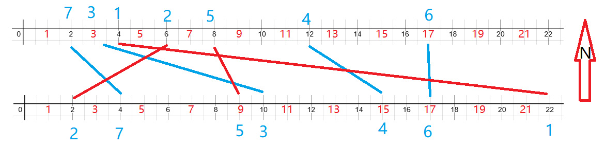

# 特殊线性dp——子序列和子串问题

最长上升子序列（简称LIS）、最长公共子序列（简称LCS）都是线性dp的一种。这个东西并不会直接考，但它们的套路被很多题目借鉴，比如解题思路、定义状态表示的方式、转移方程的推导技巧等。

## 最长不下降序列 基础模型

[B3637 最长上升子序列 - 洛谷](https://www.luogu.com.cn/problem/B3637)

[1259：【例9.3】求最长不下降序列](http://ybt.ssoier.cn:8088/problem_show.php?pid=1259) 

例如这个样例：

```
14
13 7 9 16 38 24 37 18 44 19 21 22 63 15
```

求的是不下降子序列，可以理解为从这组数中按顺序挑选合适的数重新组成新的序列，这个新序列的特点是非降序。

### 朴素dp

1. 状态定义

原序列中每个数，以及到这个数为止的最长子序列长度。

设`num[i][3]`表示这个序列的所有信息，

`num[i][0]`表示数列本身，

`num[i][1]`表示到`num[i][1]`为止的最长不下降子序列的长度，

`num[i][2]`表示`num[i][1]`作为最长不下降子序列时的前1个数在原序列中的位置。

2. 状态转移方程：

依旧是从最后一个数出发，假设找到某个数$t$，则在之前的数中找到这样一个数$t_j$：$t_j$本身是已经找到的最长不下降子序列的最后一个数，且记录有这个子序列的长度，则将$t$接在$t_j$后面，并更新长度。

则方程：

`num[i][1]=max(num[j][1]+1,num[i][1]);`

> 前提是`num[i][0]>=num[j][0]`，`i>j`。

`num[i][2]=j`。

> 这个严格来说不属于状态转移方程的一部分，而是用来记录路径的。

3. 初始化&填表&答案

每个数自身都能构成长度为1的子序列，所以`num[i][1]`初始化为1。

`j`是`i`之前的数，为了找到合适的` j`，在循环枚举` i `的同时，还要嵌套一层循环枚举 `j`，所以时间复杂度为 $O(n^2)$（两层循环）。

根据这个转移方程手搓的表（有的大佬叫它dp表）：

<table>
    <tr>
        <td>序号</td>
        <td>1</td>
        <td>2</td>
        <td>3</td>
        <td>4</td>
        <td>5</td>
        <td>6</td>
        <td>7</td>
        <td>8</td>
        <td>9</td>
        <td>10</td>
        <td>11</td>
        <td>12</td>
        <td>13</td>
        <td>14</td>
    </tr>
    <tr>
        <td>数值</td>
        <td>13</td>
        <td>7</td>
        <td>9</td>
        <td>16</td>
        <td>38</td>
        <td>24</td>
        <td>37</td>
        <td>18</td>
        <td>44</td>
        <td>19</td>
        <td>21</td>
        <td>22</td>
        <td>63</td>
        <td>15</td>
    </tr>
    <tr>
        <td>不下降子序列长度</td>
        <td>1</td>
        <td>1</td>
        <td>2</td>
        <td>3</td>
        <td>4</td>
        <td>4</td>
        <td>5</td>
        <td>4</td>
        <td>6</td>
        <td>5</td>
        <td>6</td>
        <td>7</td>
        <td>8</td>
        <td>3</td>
    </tr>
    <tr>
        <td>前驱</td>
        <td>0</td>
        <td>0</td>
        <td>2</td>
        <td>3</td>
        <td>4</td>
        <td>4</td>
        <td>6</td>
        <td>4</td>
        <td>7</td>
        <td>8</td>
        <td>10</td>
        <td>11</td>
        <td>12</td>
        <td>3</td>
    </tr>
</table>
可以看到，最长子序列的长度不一定是最后一个，所以需要在填表的同时寻找长度最长的末尾的数。

这个方程从前往后（如果是数组的话，则是按升序枚举，选择合适的数组成子序列）和从后往前找是一样的，这里的dp表就是从前往后找，参考程序也是。

```c
#include<bits/stdc++.h>
using namespace std;
int num[5001][3];
//num[i][0],num[i][1],num[i][2]分别表示
//数值本身，所属最长子序列长度（dp表），前驱（或前一个状态的最优解）
int n;
int maxx = -1, mp = 0;

void print(int mp) {
	if (mp == 0)
		return;
	int a = num[mp][0];
	print(num[mp][2]);
	cout << a << ' ';
}

void init() {
	cin >> n;
	for (int i = 1; i <= n; i++) {
		cin >> num[i][0];//数值本身
		num[i][1] = 1;//所属最长子序列长度（dp表）
		num[i][2] = 0;//前驱
	}
}

void acybt() {
	for (int i = 2; i <= n; i++) {
		for (int j = 1; j < i; j++) {
			if (num[i][0] >= num[j][0]) {//后面的数不比前面小
				if (num[j][1] + 1 > num[i][1]) {
					num[i][1] = num[j][1] + 1;
					num[i][2] = j;
				}
			}
			//这个判断放在if (num[i][0] >= num[j][0]){}内会出错
			//因为这样放的话只有找打大的才更新，若原始数组是降序，则
			//会一直找不到答案，maxx一直是初始值
			if (num[i][1] >= maxx) {
				maxx = num[i][1];
				mp = i;
			}
		}
	}
	cout << "max=" << maxx << endl;
	print(mp);//递归逆序输出
}

void acluogu() {
	for (int i = 2; i <= n; i++)
		for (int j = 1; j < i; j++) {
			if (num[i][0] > num[j][0]) {//后面的数比前面小
				if (num[j][1] + 1 > num[i][1]) {
					num[i][1] = num[j][1] + 1;
					num[i][2] = j;
				}
			}
			if (num[i][1] > maxx) {
				maxx = num[i][1];
				mp = i;
			}
		}
	cout << maxx << endl;
}

int main() {
	init();
	//acybt();//ybtac
	acluogu();//洛谷ac
	return 0;
}
```

这种序列是很多一维dp背后的模型，很多题拆解到最后求的就是这个序列。

### 贪心+二分优化

朴素dp的时间复杂度是$O(n^2)$，在1秒的时间内能处理$10^4$数量级的数据量，但$10^5$以及以上就很乏力。就比如这个OJ：

[【模板】最长上升子序列](https://ac.nowcoder.com/acm/problem/226831)

所以需要在朴素dp的基础上优化，或者找到更优的解决。

只研究长度的话，**只需要关心子序列的最后一个元素和长度**即可。根据这个性质可以得到另外的解法。

例如这个样例`[1,4,8,3,7,7,9]`，可以创建若干个长度的数据结构（数组或哈希表），分别记录长度为1、2等等的子序列的末尾元素（如果存在的话），比如：

* 长度为1的子序列的末尾：1、4、8
* 长度为2的子序列的末尾：4、8
* 长度为3的子序列的末尾：8

...

之后将3和已知的末尾的序列比较，比如这里3只能和1形成长度为2的子序列，所以将3也加进长度为2的子序列末尾。7也有长度为2或为3的情况，所以也加上。

* 长度为1的子序列的末尾：1、4、8
* 长度为2的子序列的末尾：4、8、3、7
* 长度为3的子序列的末尾：8、7

...

这里存在很严重的问题：同一个元素比如8，他同时存在3种长度的子序列的后面，而这种解法需要将新元素和已记录的子序列末尾进行比较，时间复杂度必定大于$O(n^2)$。

此时可以进行某种贪心策略：比如长度为2的序列的末尾有4、9、3、7，可以只保留3。因为新元素接在这4种情况的后面的话，3能更好的适配，比如7，能接在3、4后面，再比如10，只能接在9后面。所以为了能更好适配后续的序列，选择**同样长度但末尾尽可能小的数进行记录**，记这个数组为`r[i]`，表示长度为`i`的子序列的末尾里最小的一个。所以上面的情况可以优化成这个：

* 长度为1的子序列的末尾：1
* 长度为2的子序列的末尾：3
* 长度为3的子序列的末尾：7

因为某个长度为`j`的子序列末尾是`r[j]`，必定是长度为`j-1`的子序列新增一个大于或等于`r[j-1]`的元素组成新的子序列，不存在组成逆序对的可能。所以`r[i]`不下降。

利用`r[i]`不下降的原理，可以先将新元素和`r[i]`的最后一个元素比较，比`r[i]`大的话则接在`r[i]`的后面，否则通过二分算法查找新元素最匹配的子序列末尾，新元素应该找到尽可能小的大于等于新元素的位置，然后将原末尾进行替换。最后的答案就是`r[i]`的长度。

这个利用贪心和二分进行优化的dp时间复杂度为$O(n\log n)$，可以处理$10^6$的数量级的数组。

> 如果比赛时间和题目允许的话尽量用朴素dp，因为二分+贪心优化的dp的代码有很多细节要注意，代码的实现难度可能比朴素dp大。
>
> 还有一个很重要的原因是，因为这种算法存在后续元素替代之前的元素，来作为那个长度的末尾的情况，所以二分+贪心优化的dp无法还原最长上升子序列的样例。

所以OJ[【模板】最长上升子序列](https://ac.nowcoder.com/acm/problem/226831)的参考程序：

```cpp
#include<bits/stdc++.h>
using namespace std;

vector<int>a, r;
int n;

void init() {
	cin >> n;
	a.resize(n + 1, 0);
	r.push_back(0);
	for (int i = 1; i <= n; i++) 
		cin >> a[i];
	r.push_back(a[1]);
}

void ac() {
	for (int i = 1; i <= n; i++) {
		if (r.size() - 1 == 0 || a[i] > *(r.end() - 1))
			r.push_back(a[i]);
		else {
			//二分找左边界
			int ll = 1, rr = r.size() - 1;
			while (ll < rr) {
				int m = (ll + rr) / 2;
				if (r[m] < a[i])
					ll = m + 1;
				else
					rr = m;
			}
			r[ll] = a[i];
		}
	}
	cout << r.size() - 1;
}

int main() {
	init();
	ac();
	return 0;
}
```


### OJ

#### 友好城市

[1263：【例9.7】友好城市](http://ybt.ssoier.cn:8088/problem_show.php?pid=1263) 

由题意，画出草图：




蓝色的路线是最多申请数的情况。

可以看到，当北岸的城市序号为升序时，南岸的批准序号组合成了一个最长不下降子序列。

所以这题就变成了子序列问题。

从以上分析过程可以得出：当我们拿到一道题时，不要急于求解，而应先将题目的表面现象一层层象剥竹笋一样去掉，只留下最实质的内容。这时再来设计算法，往往能事半功倍。

```c
#ifndef _CRT_SECURE_NO_WARNINGS
#define _CRT_SECURE_NO_WARNINGS 1
#endif
/**/
#include<iostream>
#include<algorithm>
using namespace std;
struct Line {
	int n; int s;
	Line(int _n = 0, int _s = 0) { n = _n; s = _s; }
};

bool _f(Line a, Line b) { return a.n < b.n; }
inline void f(Line* a, int n) {
	sort(a + 1, a + n + 1, _f);

	//for (int i = 1; i <= n; i++) 
	//	cout << a[i].n << ' ' << a[i].s << endl;
}

int main() {
	Line a[10001];
	int dp[10001] = { 0 };
	int n, ans = 0;
	cin >> n;
	for (int i = 1; i <= n; i++) {
		cin >> a[i].s >> a[i].n;
		dp[i] = 1;
	}

	f(a, n);
	for (int i = 2; i <= n; i++)
		for (int j = 1; j < i; j++) {
			if (a[i].s >= a[j].s) {
				if (dp[i] < dp[j] + 1)
					dp[i] = dp[j] + 1;
			}
			ans = max(ans, dp[i]);
		}
	cout << ans;
	return 0;
}
```

#### 合唱队形

[P1091 [NOIP 2004 提高组\] 合唱队形 - 洛谷](https://www.luogu.com.cn/problem/P1091)

[1264：【例9.8】合唱队形](http://ybt.ssoier.cn:8088/problem_show.php?pid=1264)

正向和反向都求一次最长不下降子序列，得到每个元素在两个最长不下降子序列的情况。将两个情况叠加，最大的那个即为答案。

参考程序：

```cpp
#include<bits/stdc++.h>
using namespace std;

int main() {
	int n = 0, maxx = 0;
	int stu[101][3] = { 0 };
	cin >> n;
	for (int i = 1; i <= n; i++) {
		cin >> stu[i][0];
		stu[i][1] = stu[i][2] = 1;
	}
	for (int i = 1; i <= n; i++)
		for (int j = 1; j < i; j++)
			//题目要求的是最长递增子序列，不是最长不递减子序列
			if (stu[i][0] > stu[j][0] && stu[i][1] < stu[j][1] + 1)
				stu[i][1] = stu[j][1] + 1;

	for (int i = n; i >= 1; i--)
	{
		for (int j = i+1; j <=n; j++)
			//同最长递增子序列，但是反向
			if (stu[i][0] > stu[j][0] && stu[i][2] < stu[j][2] + 1)
				stu[i][2] = stu[j][2] + 1;
		maxx = maxx > (stu[i][1] + stu[i][2]) ? maxx : (stu[i][1] + stu[i][2]);
	}
	cout << n - maxx + 1;
	return 0;
}
```


## 最长公共子序列

最长公共子串（Longest Common Substirng，简称lcs，便于区分可加str变成lcstr）和最长公共子序列（Longest Common Subsequence，LCS，简称lcs）的区别为：子串是串（即字符串）的一个连续的部分，子序列则是从不改变序列的顺序，而从序列中去掉任意的元素而获得新的序列；也就是说，**子串中字符的位置必须是连续的**，**子序列则可以不必连续**。

这个和最长不下降子序列非常像，都是从一个大的集合中挑选出来组成的新的小集合。

### 最长公共子序列

1. **定义**

设序列$X = \{x_1,x_2,\cdots,x_m\}$和$Y=\{y_1,y_2,\cdots,y_n\}$，$LCS(X,Y)$表示$X$和$Y$的最长公共子序列。

2. **基本思路**
   通过比较两个序列的元素，从两个序列的开头开始逐步构建最长公共子序列。
3. **推导过程**
   * 当$m = 0$或$n = 0$时，即两个序列中有一个为空序列，那么它们的最长公共子序列长度为$0$，所以$LCS(X,Y)=0$。
   * 当$x_m=y_n$时，这意味着$X$的最后一个元素和$Y$的最后一个元素相同。此时，最长公共子序列$LCS(X,Y)$的长度等于$LCS(X - \{x_m\},Y-\{y_n\})$的长度加$1$。因为这个相同的元素一定在最长公共子序列中，所以$LCS(X,Y)=LCS(X - \{x_m\},Y - \{y_n\})+1$，或$LCS(X,Y)=LCS(X - \{x_m\},Y - \{y_n\})+x_m$，后者是为了求具体子序列的特殊需求。
     $X-\{x_m\}$指的是最长公共子序列$X$剔除$x_m$这个元素。
   * 当$x_m\neq y_n$时，最长公共子序列要么是$LCS(X - \{x_m\},Y)$，要么是$LCS(X,Y-\{y_n\})$，取这两者中的长度最大的那个，即$LCS(X,Y)=\max\{LCS(X - \{x_m\},Y),LCS(X,Y - \{y_n\})\}$。

4. **状态转移方程总结**
   设$dp[i][j]$表示$X$的前$i$个元素和$Y$的前$j$个元素的最长公共子序列长度，其中$i = 0,1,\cdots,m$，$j = 0,1,\cdots,n$。
   根据上文分析，状态转移方程：
   
   $dp[i][j]=\left\{\begin{matrix}dp[i - 1][j - 1]+1, & x_i = y_j\\ \max\{dp[i - 1][j],dp[i][j - 1]\}, & x_i\neq y_j\end{matrix}\right.$
   
   边界条件：当其中一个序列为空时，最长公共子序列长度为$0$。所以可以初始化$dp[0][j]=dp[i][0]=0$。

   当然，$dp[i][j]$也可表示子序列本身，只需要将$x_i=y_j$的情况替换即可。
   
   $dp[i][j]=\left\{\begin{matrix}dp[i - 1][j - 1]+x_m, & x_i = y_j\\ \max\{dp[i - 1][j],dp[i][j - 1]\}, & x_i\neq y_j\end{matrix}\right.$
   
   $dp[i-1][j-1]+x_m$表示将字符$x_m$尾插在$dp[i-1][j-1]$后。
   
5. **获取最长公共子序列**

   可以通过回溯来获得。但如果`dp[i][j]`的数据类型为`string`则大可不必，仅作为了解。

   - 设两个指针`i`和`j`，分别指向两个序列的末尾，即`i = m`，`j = n`。
   - 从二维数组`dp`的右下角元素`dp[m][n]`开始，根据状态转移方程的情况进行回溯。
   - 如果`dp[i][j] = dp[i - 1][j - 1] + 1`且`X[i] = Y[j]`（这里假设序列`X`和`Y`是从索引 1 开始存储元素的，实际比较的是`X`的第`i`个元素和`Y`的第`j`个元素），这说明当前位置的元素是最长公共子序列中的元素，将其记录下来（可以使用一个栈或者其他数据结构来存储，方便后续逆序输出得到正确顺序的子序列），然后同时将`i`和`j`指针都向前移动一位，即`i--`，`j--`。
   - 如果`dp[i][j] = max(dp[i - 1][j], dp[i][j - 1])`，这意味着最长公共子序列在这一步不是通过当前比较的两个元素得到的增长，而是来自于`X`序列去掉当前元素或者`Y`序列去掉当前元素后的情况。此时，需要比较`dp[i - 1][j]`和`dp[i][j - 1]`的大小：
     * 如果`dp[i - 1][j] > dp[i][j - 1]`，则将`i`指针向前移动一位，即`i--`，表示最长公共子序列更可能来自于`X`序列去掉当前元素后的情况。
     * 如果`dp[i - 1][j] < dp[i][j - 1]`，则将`j`指针向前移动一位，即`j--`，表示最长公共子序列更可能来自于`Y`序列去掉当前元素后的情况。
     * 如果`dp[i - 1][j] = dp[i][j - 1]`，可以任选一种情况移动指针，比如移动`i`指针使其自减1（这里的选择不影响最终结果，因为两种情况都有可能得到最长公共子序列，其中移动 i 找到的是X中相对集中的，移动 j 找的是Y中相对集中的）。

### OJ

#### 求最长公共子序列的长度或本身

[1265：【例9.9】最长公共子序列](http://ybt.ssoier.cn:8088/problem_show.php?pid=1265)

[牛可乐和最长公共子序列](https://ac.nowcoder.com/acm/problem/235624)

这两题求的是最长公共子序列。这两个题的思路可以用在其他的两个数组的dp。

根据上述描述，这两个OJ的参考程序：

```c
#include<bits/stdc++.h>
using namespace std;
//局部变量不可超过多少字节，全局变量就可以
// 因为全局变量存放的位置是静态区
//int dp[1001][1001] = { 0 };
//但Nowcoder的数据量在ybt会造成内存超限

int main() {
	string s1, s2;
	int n, m;
	while (cin >> s1 >> s2) {
		n = s1.size(), m = s2.size();
		vector<vector<int> >dp(n+1, vector<int>(m+1, 0));
		s1 = ' ' + s1;
		s2 = ' ' + s2;
		for (int i = 1; i <= n; i++)
			for (int j = 1; j <= m; j++)
				if (s1[i] == s2[j])
					dp[i][j] = dp[i - 1][j - 1] + 1;
				else
					dp[i][j] = max(dp[i][j - 1], dp[i - 1][j]);
		cout << dp[n][m] <<endl;
	}

	return 0;
}
```

如果数组`dp[i][j]`保存的不是`int`而是`string`，按照上述分析，不仅能求得公共子序列的长度，还能求得公共子序列本身。

遗憾的是，在Nowcoder的内存限制明显更大，但在一本通提交可以通过。

参考程序：

```cpp
#include<bits/stdc++.h>
using namespace std;

int main() {
	string s1, s2;
	int n, m;
	while (cin >> s1 >> s2) {
		n = s1.size(), m = s2.size();
		s1 = ' ' + s1;
		s2 = ' ' + s2;

		vector<vector<string> >dp(n + 1, vector<string>(m + 1, ""));
		for (int i = 1; i <= n; i++)
			for (int j = 1; j <= m; j++)
				if (s1[i] == s2[j])
					dp[i][j] = dp[i - 1][j - 1] + s1[i];
				else {
                    //甚至还能找字典序最大和最小的公共子序列
					if (dp[i][j - 1].size() > dp[i - 1][j].size())
						dp[i][j] = dp[i][j - 1];
					else
						dp[i][j] = dp[i - 1][j];
				}
		cout << dp[n][m].size() << endl;
	}
	return 0;
}
```

#### 编辑距离

[P2758 编辑距离 - 洛谷](https://www.luogu.com.cn/problem/P2758)

[1276：【例9.20】编辑距离](http://ybt.ssoier.cn:8088/problem_show.php?pid=1276)

参考最长公共子序列的分析思路的一个OJ。

1. 状态定义

借用最长公共子序列的思路，记`dp[i][j]`表示把`a`字符串的`[1,i]`区间的子串变成`b`字符串的`[1,j]`区间的子串，最少的操作数次数。

2. 转移方程

当`a[i]==b[j]`，仅需把`[1,i]`的`a`的子串变成`[1,j]`的` b`的子串即可，并不需要增加多余的操作。

当`a[i]!=b[j]`，按照题意有3种方式：

(1) 删掉`a[i]`，则是将`[1,i-1]`的`a`的子串变成`[1,j]`的` b`的子串，操作数也在`dp[i-1][j]`的基础上加1。即`dp[i-1][j]+1`。如果`a`的长度比`b`短，则是插入`b[j]`到`a[i]`，但方程本体不变。

(1) 删掉`b[i]`，则是将`[1,j-1]`的`b`的子串变成`[1,i]`的` a`的子串，操作数也在`dp[i][j-1]`的基础上加1。即`dp[i][j-1]+1`。如果`a`的长度比`b`长，则是插入`a[i]`到`b[j]`，但方程本体不变。

(3)将`a[i]`和`b[j]`的其中一个修改为与另一个相同，操作数加1，即`dp[i-1][j-1]+1`。

在3种方式中选最小的一个即可。

3. 初始化&填表&最终答案

这里需要结合实际意义。

`dp[i][j]`存在访问第0行和第0列的情况，而且第0行和第0列可以看成是`a`、`b`分别为空串的情况，所以需要将它们考虑进去。

第0行可以定义为`a`是空串的情况下，修改成`b`的最少操作数，这个情况可以将`b`的字符全部插入`a`，所以`dp[0][j]=j`。也有`b`是空串，`a`需要删除的字符数的含义在其中。

第0列和第0行同理，`dp[i][0]=i`。

`dp[0][0]`表示两个都是空串的情况下无需修改。

填表需要两层循环，都是升序。最终的答案是`dp[a.size()][b.size()]`。

参考程序：

```cpp
#ifndef _CRT_SECURE_NO_WARNINGS
#define _CRT_SECURE_NO_WARNINGS 1
#endif

#include<bits/stdc++.h>
using namespace std;

int main() {
	string a, b;
	cin >> a >> b;
	a = '_' + a; b = '_' + b;
	vector<vector<int> >dp(a.size(), vector<int>(b.size(), 0));
	for (int i = 0; i < b.size(); i++)
		dp[0][i] = i;
	for (int i = 0; i < a.size(); i++)
		dp[i][0] = i;

	for (int i = 1; i < a.size(); i++) {
		for (int j = 1; j < b.size(); j++) {
			if (a[i] == b[j])
				dp[i][j] = dp[i - 1][j - 1];
			else//三者选最小
				dp[i][j] = min(dp[i - 1][j - 1] + 1, min(dp[i - 1][j] + 1, dp[i][j - 1] + 1));
		}
	}
	cout << dp[a.size() - 1][b.size() - 1];
	return 0;
}
```


## 最长公共子串

因为子串一定是连续的，所以方程和最长公共子序列又有所不同。

1. **定义**
   设序列$X = \{x_1,x_2,\cdots,x_m\}$和$Y=\{y_1,y_2,\cdots,y_n\}$，最长公共子串是$X$和$Y$中连续的相同子序列。

2. **基本思路**
   同样从两个序列的开头开始比较元素，但要注意子串的连续性。

3. **推导过程**

> 1. 当$m = 0$或$n = 0$时，最长公共子串长度为$0$，即$LCStr(X,Y)=0$。
> 2. 当$x_m=y_n$时，在前一个状态（即$X$的前$m - 1$个元素和$Y$的前$n - 1$个元素的最长公共子串长度）基础上加$1$。所以$LCStr(X,Y)=LCStr(X - \{x_m\},Y - \{y_n\})+1$。
> 3. 当$x_m\neq y_n$时，这两个元素不能同时属于最长公共子串，所以当前最长公共子串长度为$0$，即$LCStr(X,Y)=0$。

4. **状态转移方程总结**
   设$dp[i][j]$表示$X$的前$i$个元素和$Y$的前$j$个元素的最长公共子串长度，其中$i = 0,1,\cdots,m$，$j = 0,1,\cdots,n$。
   则状态转移方程为：

- $dp[0][j]=dp[i][0]=0$（边界条件，当其中一个序列为空时，最长公共子串长度为$0$）
- $dp[i][j]=\left\{\begin{matrix}dp[i - 1][j - 1]+1, & x_i = y_j\\ 0, & x_i\neq y_j\end{matrix}\right.$

5. **寻找最长公共子串**

   因为子串是连续的，所以只需要记录最长公共子串的最后一个元素在$X$和$Y$中分别出现的位置$i_x$和$i_y$，根据记录的长度即可找到。

### 拓展：最长公共子串

因为没有具体的OJ，根据上方描述，给出参考程序：

```c
#ifndef _CRT_SECURE_NO_WARNINGS
#define _CRT_SECURE_NO_WARNINGS 1
#endif
/**/
#include<iostream>
using namespace std;
/*
ABCBDAB
BDCABA
*/
int dp[1001][1001] = { 0 };//局部变量不可超过多少字节，全局变量就可以


int main()
{
	string s1, s2;
	int maxl = 0;
	int imx = 0, jmy = 0;//为了找最长公共子串做准备
	cin >> s1 >> s2;
	int  n = s1.size(), m = s2.size();
	s1 = ' ' + s1;
	s2 = ' ' + s2;
	for (int i = 1; i <= n; i++)
		for (int j = 1; j <= m; j++)
		{
			if (s1[i] == s2[j]) {
				dp[i][j] = dp[i - 1][j - 1] + 1;

				////不一定是结尾，要另外记录
				//maxl = max(maxl, dp[i][j]);
				if (dp[i][j] > maxl) {
					maxl = dp[i][j];
					imx = i; jmy = j;
				}
			}
			else
				dp[i][j] = 0;
		}
	cout << maxl << endl;

	//找出那个公共子序列
	string s3;
	while (dp[imx][jmy]) {
		s3 = s1[imx] + s3;//因为是连续的
		imx--; jmy--;
	}
	cout << s3;

	return 0;
}

```
