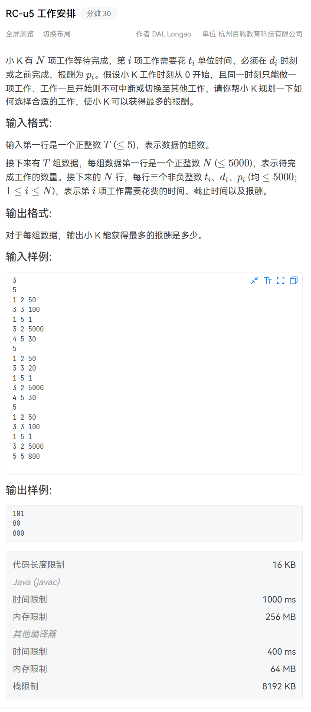
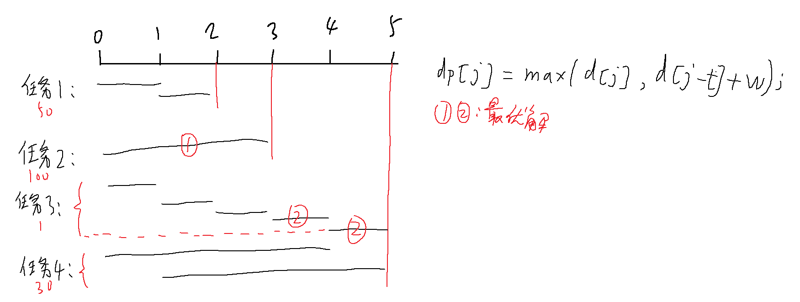

# RC-u5 工作安排



用时间轴（或者说甘特图）来安排所有任务就十分清晰。

以第1个样例为例：

```
5
1 2 50
3 3 100
1 5 1
3 2 5000
4 5 30
```

按截止时间排序（这么排是为了能安排任务在时间轴的位置），并排除非法任务后：

```
1 2 50
3 3 100
1 5 1
4 5 30
```

截取甘特图：



这样问题就变成了选择尽可能**将时间轴覆盖**，同时每个任务**只能选1段**可选时间完成，在满足这2个条件的情况下收益最高，如何选择。

用时间轴表示的话，可以发现到每个截止时刻的最大收益，在当前任务占用一段时间轴后，和任务之前的时间轴的最大收益有关，也就是子问题。所以可尝试用dp。

1. 状态定义。

`dp[j]`表示截止`j`时刻做任务能拿到的最大收益。但这个收益不一定是最后一刻才是最大的，因此dp遍历过程中的结果才是最优解。

2. 转移方程。

每个截止时刻的最大收益，在当前任务占用一段时间轴后，和这个任务之前的时间轴的最大收益有关。

因此可以猜想`dp[j]=max(dp[j],dp[j-t]+w)`。

`t`为以`j`为截止时间，某个任务的耗时，`w`则是这个任务的价值。

这样定义方程还有一个好处：可以从截止时间开始，依次枚举之前的所有可用于执行任务的时间，也方便之前的最优解转移。

3. 初始化&填表

求的是最大收益，收益也没有负数，所以全部初始化为0即可不影响。

之后是枚举所有任务，对每个任务在不同时间轴的安排带来的当下最优解用`dp[j]`进行记录，但要从截止时间逆向枚举，否则会出现完全背包那种同一个任务被多次重复的问题，且填表顺序是用之前的格子填现在的格子。

总的来说，看上去很像01背包问题，又很像组间互相独立的分组背包。

```cpp
#define _CRT_SECURE_NO_WARNINGS 1
#include<bits/stdc++.h>
using namespace std;
struct A {
    int t=0;
    int d=0;
    int p=0;
    bool operator<(const A& x)const {
        return d < x.d;
    }
};

void ac() {
    int n; cin >> n;
    vector<A>a;
    int max_D = 0;
    for (int i = 0, T, D, P; i < n; i++) {
        cin >> T >> D >> P;
        if (T > D)
            continue;
        max_D = max(max_D, D);
        a.push_back({ T,D,P });
    }
    sort(a.begin(), a.end());
    vector<int>dp(max_D+1, 0);
    for (auto& x : a) {
        for (int i = x.d; i >= x.t; i--) {
            dp[i] = max(dp[i], dp[i - x.t] + x.p);
        }
    }
    max_D = 0;
    for (auto& x : dp)
        max_D = max(max_D, x);
    cout << max_D << endl;
}

int main() {
    int T;
    cin >> T;
    while (T--)
        ac();
    return 0;
}
```

