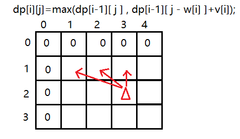

# 背包问题

背包问题是各种dp的经验总结，很多题目或多或少都有参考背包问题的思路。

背包问题大意是给定一些物品，每个物品都有限制选择的因素（比如体积）和价值，在不违反限制条件（比如背包容量）的情况下，选择物品使总价值最大。

背包问题有很多种变体，主要包括：

1. 01背包问题：每种物品只能选或不选（选0次或1次）。
2. 完全背包问题：每种物品可以选择无限次。
3. 多重背包问题：每种物品有数量限制。
4. 分组背包问题：物品被分为若干组，每组只能选一个物品。
5. 混合背包：以上四种背包问题混在一起。
6. 多维费用的背包问题：限定条件不止有体积，还会有其他因素（比如重量）。 

除了经典的总价值最大问题，还会有： 

1. 方案总数。 

2. 最优方案。

3. 方案可行性。 

4. 输出具体方案。 

因此，背包问题种类非常繁多，题型非常丰富。但是，尽管背包有很多变形，都是从01背包问题演化过来的。

# 01背包问题

[1267：【例9.11】01背包问题](http://ybt.ssoier.cn:8088/problem_show.php?pid=1267) 

[1294：Charm Bracelet](http://ybt.ssoier.cn:8088/problem_show.php?pid=1294)

[【模板】01背包](https://ac.nowcoder.com/acm/problem/226514)

[2. 01背包问题 - AcWing题库](https://www.acwing.com/problem/content/2/) 

[P1048 [NOIP 2005 普及组\] 采药 - 洛谷](https://www.luogu.com.cn/problem/P1048)

[1290：采药](http://ybt.ssoier.cn:8088/problem_show.php?pid=1290)

[1932：【05NOIP普及组】采药](http://ybt.ssoier.cn:8088/problem_show.php?pid=1932)

01背包问题大都可以归纳为这个问题：

有 $N$ 件物品和一个容量是 $V$ 的背包。每件物品只能使用一次。

第 $i$ 件物品的体积是 $w_i$，价值是 $v_i$。（weight，重量；value，价值）

求解将哪些物品装入背包，可使这些物品的总体积不超过背包容量，且总价值最大。
输出最大价值。

Nowcoder还附加了一问：若背包**恰好能装满**，求最多能装多大价值的物品？

01背包问题无论是什么贪心策略，到最后都能举出反例。所以贪心不可用于背包。

> 最常见的3种贪心策略：
>
> 1. 选价值最大的。例如这个样例：`V=5`，物品（`{质量,价值}`）：`{5,3}`，`{1,2}`，`{4,2}`，很明显贪心会选择`{5,3}`，但最优解是`{1,2}`加`{4,2}`。其他贪心策略这里就不举例。
> 2. 选重量最小的。
> 3. 选单位价值（$\frac{v_i}{w_i}$）最大的。

## 二维数组定义状态

尝试定义一维的状态：设`dp[i]`表示在`[1,i]`区间内挑选物品，所有的选法下，最大的价值。

假设无体积限制，则所有物品都选即为最大价值。

因为有体积限制，所以状态设计还要考虑体积，这样设计无法写出代码。所以体积也要定义在状态中，虽然后续有空间优化，但核心也要考虑体积。

### 不要求装满

1. 状态定义

记`dp[i][j]`表示前$i$个物品（部分或全部）恰好放进一个容量为$j$的背包可以获得的最大价值。

从最后一步出发，决策变成了第$i$件物品放与不放，如果放的话，则要腾出指定容量来放$i$物品。如果不放，则在`[1,i-1]`中选物品放进容量为`j`的背包。

> 或如果放`i`物品的话，大的背包问题变成子问题：有`n-1`件物品，每件都有自己的体积和价值，如何选择才能使`V-w[i]`的背包内的物品的价值最大。

在放与不放中选择价值最大的哪个。即

```c
dp[i][j]=max{
	dp[i-1][j-0*w[i]]+v[i],//不放
    dp[i-1][j-1*w[i]]+v[i]//放
}
```

2. 状态转移方程

`dp[i][j]=max(dp[i-1][j],dp[i-1][j-w[i]]+v[i])`，
   `dp[i-1][j]`表示不选`i`物品，`dp[i-1][j-w[i]]+v[i]`表示选。

3. 填表顺序&初始化&结果

> 目前接触的dp可以说都是填表也就是填数组。数组的每个元素都代表那个状态的解，如果填不对，会对后续的状态产生严重影响。

可以看到，将这个二维数组以网格的形式展开的话，数组元素`dp[i][j]`都是由上一行转移而来，且都是从自己上方的第1个元素开始选择。因此循环的时候二维数组的行是从上向下枚举，列是从右向左枚举，这样才能保证每个状态都来自于已经得到的过去的状态的最优解。

其中第0行表示没有物品，所以价值全是0。第1列虽然可以初始化，但不用管，因为枚举填表时，第1列也可以被填。




还可以先将`dp[i-1][j]`的状态先进行转移，再去左边的格子里寻找更合适的状态。若是这种，则内层循环可以是正序。

算法的空间复杂度为$O(N*V)$，还有优化空间，这就需要进行滚动数组优化。

[1267：【例9.11】01背包问题](http://ybt.ssoier.cn:8088/problem_show.php?pid=1267)、[2. 01背包问题 - AcWing题库](https://www.acwing.com/problem/content/2/)、[1290：采药](http://ybt.ssoier.cn:8088/problem_show.php?pid=1290)和[P1048 [NOIP 2005 普及组\] 采药 - 洛谷](https://www.luogu.com.cn/problem/P1048)、[1932：【05NOIP普及组】采药](http://ybt.ssoier.cn:8088/problem_show.php?pid=1932)参考程序：

```c
#include<iostream>
#include<vector>
using namespace std;

void acybt() {
	int m = 0, n = 0;
	vector<int>w, v;
	vector<vector<int> >dp;
	int ans = 0;
	cin >> m >> n;
	w.resize(n + 1, 0);
	v = w;
	dp.resize(n + 1, vector<int>(m + 1, 0));
	for (int i = 1; i <= n; i++)
		cin >> w[i] >> v[i];

	for (int i = 1; i <= n; i++)//枚举第几件物品放与不放时
		for (int j = m; j >= 1; j--)
			if (j >= w[i])//放与不放取决于背包的容量和价值
				dp[i][j] = max(dp[i - 1][j], dp[i - 1][j - w[i]] + v[i]);
			else
				dp[i][j] = dp[i - 1][j];
	/*
	//这样填表也行，因为用二维的话都是根据上一行的格子来填
	for (int i = 1; i <= n; i++)//枚举第几件物品放与不放时
		for (int j = 0; j <= m; j++) {
			dp[i][j] = dp[i - 1][j];
			if(j>=w[i])
				dp[i][j] = max(dp[i][j], dp[i - 1][j - w[i]] + v[i]);
		}
	*/
	cout << dp[n][m];
}

void acAcwing() {
	int m = 0, n = 0, * w = nullptr, * v = nullptr;
	int(*dp)[1001] = nullptr, ans = 0;

	//数组指针模拟二维数组
	dp = (int(*)[1001])malloc(sizeof(int) * 1001 * 1001);
	if (dp == nullptr)return;

	for (int i = 0; i < 1001; i++)
		for (int j = 0; j < 1001; j++)
			dp[i][j] = 0;

	w = (int*)malloc(sizeof(int) * 1001);
	if (w == nullptr)return;

	v = (int*)malloc(sizeof(int) * 1001);
	if (v == nullptr)return;

	cin >> n >> m;
	for (int i = 1; i <= n; i++)
		cin >> w[i] >> v[i];

	for (int i = 1; i <= n; i++)//枚举第几件物品放与不放时
		for (int j = m; j >= 1; j--)
			//要保证第i次循环中的状态dp[i][j]是由状态dp[i-1][j-w[i]]递推而来
			if (j >= w[i])//放与不放取决于背包的容量
				dp[i][j] = max(dp[i - 1][j], dp[i - 1][j - w[i]] + v[i]);
			else
				dp[i][j] = dp[i - 1][j];

	cout << dp[n][m];
	free(w);
	free(v);
	free(dp);
}

int main() {
	acybt();//一本通AC
	//acAcwing();//Nowcoder AC
	return 0;
}
```

对样例进行分析：

```
样例：
10 4(包容量m, 物品数量n)
2 1(物品占用容量, 物品价值)
3 3
4 5
7 9

01背包的转移方程：
dp[i][j]=max(dp[i-1][j],dp[i-1][j-w[i]]+v[i]), j>=w[i]
dp[i][j]=dp[i-1][j],                         , j<w[i]

第二个转移式是i-1，意思是第i种物品只能放一件，
要想得到最优解还得从之前的物品选择方案中选最优解
01背包的dp表：
	 1  2  3  4  5  6  7  8  9 10

1    0  1  1  1  1  1  1  1  1  1//这里表示了无论包容量有多大，都只放1件第1件物品
2    0  1  3  3  4  4  4  4  4  4//前两件物品中，背包容量许可时的最优解
3    0  1  3  5  5  6  8  8  9  9
4    0  1  3  5  5  6  9  9 10 12//最大值即为最优解
```

但这种二维的状态在[1294：Charm Bracelet](http://ybt.ssoier.cn:8088/problem_show.php?pid=1294)因为数据量太大用不了，所以需要优化。

### 要求装满

[【模板】01背包](https://ac.nowcoder.com/acm/problem/226514)

Nowcoder的第2问特供。

1. 状态表示

`dp[i][j]`表示在`[1,i]`区间内挑选物品，总体积为`j`的所有选法下的最大价值。

2. 转移方程

依旧沿用上文分析的方程。

`dp[i][j]=max(dp[i-1][j],dp[i-1][j-w[i]]+v[i])`

3. 初始化&填表&最终答案

`dp[0][0]`根据实际意义，此时没物品，总体积正好为0，所以直接初始化为0即可。

之后`dp[0][i]`表示没有物品的情况下还要填满`i`容量的背包，显然这些是无效的格子（状态），在之后的填表中若有格子用到了这些无效格子，则用到无效格子的格子也应该定义为无效格子表示当前容量的背包不能装满。

这些非法的格子可以初始化为非法的值，比如`-1`、`-0x3f3f3f3f`。之后有格子通过这些非法的格子推导而来时，也将这个格子初始化为这些非法值，因为之前的格子表示的背包没法装满，说明当前格子表示的背包也没法装满。推导时进行一下特判即可。

> 在数组中，我们可以赋予下标特殊的含义，但并不是代表第0行和第0列的空间没用，可以将它们赋值为不可能取值且不影响转移的数比如存在取`max`时用-1初始化，这样填表完成后，某个状态却是-1，则说明没有别的状态向这个状态转移，反馈到问题中就是这个状态不存在或没有别的状态转移到这个状态。
>
> 也可以取折中方案`-0x3f3f3f3f`，因为这是$-(2^{30}-1)$，`int`型数据在数据大到一定范围时会溢出，比如`2147483647+1==-2147483648`，因此取折中方案使溢出的可能性降到最小。
>
> 但如果是高精度计算，无穷小和无穷大可能都无法举例，这个时候需要初始化为第1个结果。

初始化为`-1`可能会做很多判断，所以将所有格子初始化为无穷小，用到这个无穷小的格子更新也还是负无穷。

填表顺序依旧不变。

最终答案只需要对结果`dp[n][m]`判断一下是否小于0即可，小于0则表示不能装满。初始化为负无穷可以省去很多判断。

[【模板】01背包](https://ac.nowcoder.com/acm/problem/226514)参考程序：

```cpp
#include<iostream>
#include<vector>
using namespace std;

void acNowcoder() {
	int m = 0, n = 0;
	vector<int>w, v;
	vector<vector<int> >dp;
	int ans = 0;
	cin >> n >> m;
	w.resize(n + 1, 0);
	v = w;
	dp.resize(n + 1, vector<int>(m + 1, 0));
	for (int i = 1; i <= n; i++)
		cin >> w[i] >> v[i];

	//01背包也能用这种转移
	for (int i = 1; i <= n; i++)//枚举第几件物品放与不放时
		for (int j = 0; j <= m; j++) {//都是上一个状态，枚举顺序可以是升序
			dp[i][j] = dp[i - 1][j];
			if (j >= w[i])
				dp[i][j] = max(dp[i][j], dp[i - 1][j - w[i]] + v[i]);
		}
	cout << dp[n][m] << endl;//第1问

	for (int i = 0; i <= n; i++)
		for (int j = 0; j <= m; j++)
			dp[i][j] = -0x3f3f3f3f;
	dp[0][0] = 0;
	for (int i = 1; i <= n; i++)
		for (int j = 0; j <= m; j++) {
			dp[i][j] = dp[i - 1][j];
			if (j >= w[i])
				dp[i][j] = max(dp[i][j], dp[i - 1][j - w[i]] + v[i]);
		}
	if (dp[n][m] < 0)
		cout << 0;
	else
		cout << dp[n][m];//第2问
}

int main() {
	acNowcoder();//Nowcoder AC
	return 0;
}
```

## 一维数组优化

一维数组优化，也可称为滚动数组优化，在之前的数字三角形（[动态规划合集——动态规划基本原理-CSDN博客](https://blog.csdn.net/m0_73693552/article/details/146384660?spm=1001.2014.3001.5501)）和传球游戏（[动态规划——线性dp_矩阵遍历、动态规划中的多维状态存储-CSDN博客](https://blog.csdn.net/m0_73693552/article/details/146384726?spm=1001.2014.3001.5501)）都有用到过类似的优化。关于01背包问题：

1. 状态定义：背包当前已有的物品的价值（空背包也算在内）。

转移：第$i$件物品放与不放，如果放的话，则要腾出指定容量来放$i$物品。在放与不放中选择价值最大的哪个。

2. 转移方程：`dp[i][j]=max(dp[i-1][j],dp[i-1][j-w[i]]+v[i])`;

`dp[i][j]`表示前`i`件物品恰好放进容量为`j`的背包中时拥有的最大价值。

`w[i]`表示第`i`件物品的容量，`v[i]`为价值。

`i`的性质决定了物品只能一件一件地枚举。这就意味着`i`这个阶段的最优解只能是放第`i`件物品时的价值。

`dp[i][j]`只和`dp[i-1][j]`和`dp[i-1][j-w[i]]+v[i])`，也就是在表格中只和上一行的最优解有关，完全可以先转移数据（或者说状态）再选择物品。

设 `dp[j]`表示重量不超过`j`的物品的最大价值，

则`dp[j]=max(dp[j],dp[j-w[i]]+v[i])`，`j>=w[i]`，`1<=i<=n`。

方程可以这样理解：

对于每件物品，01背包都有选与不选两种选择，`dp[j]`**始终保存着上个状态的最优解**，在枚举时就已经完成了从上一阶段到这一阶段的转移。所以：
```c
dp[j]=max(
    dp[j-0*w[i]]+0*v[i],//不选
	dp[j-1*w[i]]+1*v[i]//选
);
```

对比二维01背包：
`dp[i][j]=max(dp[i-1][j],dp[i-1][j-w[i]]+v[i])`;

空间复杂度降低（前者是$O(m*n)$，后者是$O(m)$，不考虑存放数据需求的空间），且一维直接给出容量为`m`的背包所能装的最大价值。

因为01背包在填表的时候都是要判断包是否能放下当前物品，从最开始的状态来看的话，当第1件物品放不下时，`dp[i][j]`（`j<w[i]`）始终为0。所以可以在第2层循环做一个状态压缩：

**状态压缩**：

```c
for (int i = 1; i <= n; i++)//按顺序对物品进行筛选，因为包只有一个
	for (int j = m; j >= w[i]; j--)//直接记录容量充足下的最优解(状态压缩)
		dp[j]=max(dp[j],dp[j-w[i]]+v[i]);
```

压缩的话内层的循环枚举范围从`[0,m]`进一步压缩至`[w[i],m]`。

用二维数组不能这样压缩，是因为无法将之前的格子顺利转移。

[1267：【例9.11】01背包问题](http://ybt.ssoier.cn:8088/problem_show.php?pid=1267)、[2. 01背包问题 - AcWing题库](https://www.acwing.com/problem/content/2/)、[1290：采药](http://ybt.ssoier.cn:8088/problem_show.php?pid=1290)和[P1048 [NOIP 2005 普及组\] 采药 - 洛谷](https://www.luogu.com.cn/problem/P1048)、[1932：【05NOIP普及组】采药](http://ybt.ssoier.cn:8088/problem_show.php?pid=1932)和[【模板】01背包](https://ac.nowcoder.com/acm/problem/226514)参考程序：

```c
#include<iostream>
#include<vector>
using namespace std;

int m = 0, n = 0;
vector<int>w, v;
vector<int>dp;

void acybt() {
	cin >> m >> n;
	w.resize(n + 1, 0);
	v = w; dp.resize(m + 1, 0);
	for (int i = 1; i <= n; i++)
		cin >> w[i] >> v[i];

	for (int i = 1; i <= n; i++)
		for (int j = m; j >= w[i]; j--)//这里遍历顺序要逆序，因为转移用到之前的格子
			dp[j] = max(dp[j], dp[j - w[i]] + v[i]);
	cout << dp[m];
}

void acAcwing() {
	cin >> n >> m;
	w.resize(n + 1, 0);
	v = w; dp.resize(m + 1, 0);
	for (int i = 1; i <= n; i++)
		cin >> w[i] >> v[i];

	for (int i = 1; i <= n; i++)
		for (int j = m; j >= w[i]; j--)//这里遍历顺序要逆序，因为转移用到之前的格子
			dp[j] = max(dp[j], dp[j - w[i]] + v[i]);
	cout << dp[m];
}

void acNowcoder() {
	cin >> n >> m;
	w.resize(n + 1, 0);
	v = w; dp.resize(m + 1, 0);
	for (int i = 1; i <= n; i++)
		cin >> w[i] >> v[i];

	for (int i = 1; i <= n; i++)
		for (int j = m; j >= w[i]; j--)//这里遍历顺序要逆序，因为转移用到之前的格子
			dp[j] = max(dp[j], dp[j - w[i]] + v[i]);
	cout << dp[m] <<endl;

	for (auto&i : dp)
		i=-0x3f3f3f3f;
	dp[0] = 0;
	for (int i = 1; i <= n; i++)
		for (int j = m; j >= w[i]; j--)//这里遍历顺序要逆序，因为转移用到之前的格子
			dp[j] = max(dp[j], dp[j - w[i]] + v[i]);
	if (dp[m] < 0)
		cout << 0;
	else
		cout << dp[m];
}

int main() {
	//acybt();//一本通AC
	//acAcwing();//Acwing AC
	acNowcoder();//Nowcoder AC
	return 0;
}
```

[1294：Charm Bracelet](http://ybt.ssoier.cn:8088/problem_show.php?pid=1294)是数据量加大的01背包，所以数组的类型需要用`long long`，此外还要用空间优化。

参考程序：

```cpp
#include<iostream>
#include<vector>
using namespace std;

void ac1(){
	int n,m;
	cin>>n>>m;
	vector<long long>w(n+1,0),c(n+1,0),dp(m+1,0);
	for(int i=1;i<=n;i++)
		cin>>w[i]>>c[i];
	for(int i=1;i<=n;i++)
		for(long long j=m;j>=w[i];j--)
			dp[j]=max(dp[j],dp[j-w[i]]+c[i]);
	cout<<dp[m];
}

int main() {
	ac1();
	return 0;
}
```


## 求01背包方案数

### 体积和价值等同的01背包

[P1164 小A点菜 - 洛谷](https://www.luogu.com.cn/problem/P1164)

[1291：数字组合](http://ybt.ssoier.cn:8088/problem_show.php?pid=1291) 

[1295：装箱问题](http://ybt.ssoier.cn:8088/problem_show.php?pid=1295)

[P1049 [NOIP 2001 普及组\] 装箱问题 - 洛谷](https://www.luogu.com.cn/problem/P1049)

这三个题可以看成是体积和价值一样的01背包。所以填满背包时物品的价值最大。但还是按照01背包的思路进行。

1. 状态表示

`dp[i][j]`表示：从前`i`个物品中挑选，总价值正好为`j`时，此时的方案数。

2. 转移方程

从最后一步划分，想办法求出`dp[i][j]`等于什么（似乎一直都是）。

若最后一个物品不选，则从`[1,i-1]`里去挑，产生最大价值的方法数就是从`[1,i-1]`里选择物品填满容量为`j`的背包的方法数。故`dp[i][j]=dp[i-1][j]`。

若选上最后一个物品，此时有了一个价值`w[i]`，需要从前面的`[1,i-1]`个物品去挑，填满容量为`j-w[i]`的背包的方法数，所以`dp[i][j]=dp[i-1][j-w[i]]`。这里和01背包不同，**问的是总方案数**，虽然都是`dp[i][j]`，但含义不同。

因为求的是总方案数，所以需要将二者累加。

所以最后的方程：

`dp[i][j]=dp[i-1][j]+dp[i-1][j-w[i]]`。

3. 初始化

根据实际含义来初始化，`dp[0][0]`表示无物品的情况下，凑成价值为0的方案数，这个应该初始化为1，否则接下来的方案推理无法进行。

之后`dp[0][j]`表示一个物品都没，却要凑出`j`的体积，很明显是非法状态并且无法实现，将它们初始化为0即可不影响后续的填格子。

`dp[i][0]`表示有`i`个物品，但一个都不选就能凑出价值为0的方案，所以初始化为1。但这个不必刻意初始化，因为填表的过程中就能完成状态转移。

4. 填表

二维的状态`dp[i][j]`的填表方式和01背包一样。

[P1164 小A点菜 - 洛谷](https://www.luogu.com.cn/problem/P1164)、[1291：数字组合](http://ybt.ssoier.cn:8088/problem_show.php?pid=1291)参考程序：

```cpp
#ifndef _CRT_SECURE_NO_WARNINGS
#define _CRT_SECURE_NO_WARNINGS 1
#endif

#include<iostream>
#include<vector>
using namespace std;

int m = 0, n = 0;
vector<int>w;
vector< vector<int> >dp;

void init() {
	cin >> n >> m;
	w.resize(n + 1, 0);
	dp.resize(n + 1, vector<int>(m + 1, 0));
	for (int i = 1; i <= n; i++)
		cin >> w[i];
}

void acluogu1() {
	dp[0][0] = 1;
	for (int i = 1; i <= n; i++)
		for (int j = 0; j <= m; j++) {
			dp[i][j] = dp[i - 1][j];
			if (j >= w[i])
				dp[i][j] += dp[i - 1][j - w[i]];
		}
	cout << dp[n][m];
}
void acluogu2() {
	dp[0][0] = 1;
	for (int i = 1; i <= n; i++)
		for (int j = m; j >= 0; j--) {
			//j=0表示容量为0的背包填满的方案数，需要转移。
			dp[i][j] = dp[i - 1][j];
			if (j >= w[i])
				dp[i][j] += dp[i - 1][j - w[i]];
		}
	cout << dp[n][m];
}

int main() {
	init();
	//acluogu1();//小A点菜AC，填表方式1
	acluogu2();//小A点菜AC
	return 0;
}
```

空间优化：因为每层的状态都只和上一层有关，而且都和`j-w[i]`的格子有关，所以和01背包一样，可以用空间优化。

但空间优化后第2层的顺序只能是逆向循环。如果是正向循环，则会将之前更新后的格子转移到当前格子，从实际意义来看就是已经选过的物品再选1次，循环到最后这个物品选择了`j/w[i]`次。

所以第2层正向循环是完全背包的方案数，只有完全背包才能进行这种任意选的行为。

因为只有一个数组，默认情况下状态已经完成转移，所以第2层循环可以为`m~w[i]`。

[P1164 小A点菜 - 洛谷](https://www.luogu.com.cn/problem/P1164)、[1291：数字组合](http://ybt.ssoier.cn:8088/problem_show.php?pid=1291)参考程序：

```cpp
#ifndef _CRT_SECURE_NO_WARNINGS
#define _CRT_SECURE_NO_WARNINGS 1
#endif

#include<iostream>
#include<vector>
using namespace std;

int m = 0, n = 0;
vector<int>w;
vector<int>dp;

void init() {
	cin >> n >> m;
	w.resize(n + 1, 0);
	dp.resize(m + 1, 0);
	for (int i = 1; i <= n; i++)
		cin >> w[i];
}

void acluogu() {
	dp[0] = 1;
	for (int i = 1; i <= n; i++)
		for (int j = m; j >= w[i]; j--)
			dp[j] += dp[j - w[i]];
	cout << dp[m];
}

int main() {
	init();
	acluogu();//小A点菜AC
	return 0;
}
```

[1295：装箱问题](http://ybt.ssoier.cn:8088/problem_show.php?pid=1295)和[P1049 [NOIP 2001 普及组\] 装箱问题 - 洛谷](https://www.luogu.com.cn/problem/P1049)问的是装入尽可能多的物品，使箱子的剩余空间最小。所以可以求不同容量的箱子能被装满的方法数，然后从最大容量开始找，第1个不为0的容量即为能装满的最大容量。

所以[1295：装箱问题](http://ybt.ssoier.cn:8088/problem_show.php?pid=1295)参考程序：

```cpp
#ifndef _CRT_SECURE_NO_WARNINGS
#define _CRT_SECURE_NO_WARNINGS 1
#endif

#include<iostream>
#include<vector>
using namespace std;

void ac1(){
	int v,n;
	cin>>v>>n;
	vector<int>a(n+1,0),dp(v+1,0);
	for(int i=1;i<=n;i++)
		cin>>a[i];
	dp[0]=1;
	for(int i=1;i<=n;i++)
		for(int j=v;j>=a[i];j--)
			dp[j]=dp[j]+dp[j-a[i]];
	int tmp=v;
	while(!dp[v])//找能装满的最大容量
		--v;
	cout<<tmp-v;
}

int main() {
	ac1();
	return 0;
}
```

### 体积和价值不同的01背包 AcWing

[11. 背包问题求方案数 - AcWing题库](https://www.acwing.com/problem/content/11/)

和小A点菜不同，这题的价格和体积并不相同，所以在考虑拿到最大价值的同时，还要考虑方法数。

1. 状态定义

设`dp[i][j]`表示从`[1,i]`区间选物品装进容量为`j`的背包里，产生最大价值的方案数。因为要求的是最大价值，所以还需要另一个状态`bk[i][j]`（back）表示从`[1,i]`区间选物品装进容量为`j`的背包里能产生的最大价值，借助`bk[i][j]`对`dp[i][j]`的推导进行辅助。

2. 转移方程

依旧是从最后一步出发。

根据上文知道`bk[i][j]`的转移方程：
`bk[i][j]=max(bk[i-1][j],bk[i-1][j-w[i]]+v[i])`

对`i`物品，若选择不装进背包，则问题拆分成子问题：从`[1,i-1]`中选择物品使得容量为`j`的背包产生最大价值的方法数。所以`dp[i][j]=dp[i-1][j]`。

若选择装进容量为`j`背包，则又要分两种情况讨论。

* 能产生更大的价值，则问题拆分成子问题：从`[1,i-1]`中选择物品使得容量为`j-w[i]`的背包产生最大价值的方法数。所以
  `dp[i][j]=dp[i-1][j-w[i]]`。
* 能产生和原来相同的价值，则将选择`i`物品的方法数和原来的方法数进行叠加。

所以，若不选，则`dp[i][j]=dp[i-1][j]`；
若选了，则当`bk[i-1][j-w[i]]+v[i]>bk[i][j]`时，`dp[i][j]=dp[i-1][j-w[i]]`；
当`bk[i-1][j-w[i]]+v[i]==bk[i][j]`，`dp[i][j]+=dp[i-1][j-w[i]]`；
这三个和`dp[i][j]`有关的方程即为状态转移方程，但个人感觉更像是转移方程组，它们代表3种不同的决策。

3. 初始化

和小A点菜一样，`dp[0][0]`表示没有物品的情况下填满容量为0的背包产生最大价值的方法数，所以`dp[0][0]=1`。

而`dp[0][j]`表示没有物品，却还要填满容量为`j`的背包，所以这种情况无法做到，但这题并没有要求一定要填满，所以只有不选这1种方法。

`dp[i][0]`则是有物品，但放进容量为`0`的背包，只有1个方法就是不选。但这个并不需要刻意初始化，填表的时候就会初始化。

而其他的格子初始化成什么值都无所谓， 因为它们的初始值最终都会被替代。

综上，只需要将`dp[0][i]`这一行初始化为1即可。

4. 填表

在`bk[i][j]`填表时顺便对`dp[i][j]`进行填表即可。

[11. 背包问题求方案数 - AcWing题库](https://www.acwing.com/problem/content/11/)参考程序：

```cpp
#ifndef _CRT_SECURE_NO_WARNINGS
#define _CRT_SECURE_NO_WARNINGS 1
#endif

#include<iostream>
#include<vector>
using namespace std;

int N, V;
vector<int>v, w;
vector< vector<int> >dp, bk;
const int M = 1e9 + 7;

void init() {
	cin >> N >> V;
	v.resize(N + 1, 0);
	w = v;
	//这里可以随意初始化，只要dp[0][i]为1就行
	dp.resize(N + 1, vector<int>(V + 1, 0x3fffff3f));
	bk = dp;
	for (int i = 1; i <= N; i++)
		cin >> v[i] >> w[i];
	for (int i = 0; i <= V; i++)
		dp[0][i] = 1;
}

void ac() {
	for (int i = 1; i <= N; i++) {
		for (int j = 0; j <= V; j++) {
			//一个不选
			dp[i][j] = dp[i - 1][j];
			bk[i][j] = bk[i - 1][j];
			if (j < v[i])
				continue;
			//选了能产生更高的价值
			if (bk[i][j] < bk[i - 1][j - v[i]] + w[i]) {
				dp[i][j] = dp[i - 1][j - v[i]];
				bk[i][j] = bk[i - 1][j - v[i]] + w[i];
			}
			//选了能产生相同的价值
			else if (bk[i][j] == bk[i - 1][j - v[i]] + w[i])
				dp[i][j] = (dp[i][j] + dp[i - 1][j - v[i]]) % M;
		}
	}
	cout << dp[N][V];
}

int main() {
	init();
	ac();
	return 0;
}
```

5. 空间优化：因为两个转移方程都只和上一行的格子有关系，所以进行空间优化。这样优化还有一个好处就是，若不选`i`物品，则免去了这种决策的转移过程。

[11. 背包问题求方案数 - AcWing题库](https://www.acwing.com/problem/content/11/)参考程序：

```cpp
#include<iostream>
#include<vector>
using namespace std;

int N,V;
vector<int>v,w;
vector<int>dp,bk;
const int M = 1e9 + 7;

void init() {
	cin >> N >> V;
	v.resize(N + 1, 0);
	w = v;
	dp.resize(V + 1, 0);
	bk = dp;
	for (int i = 1; i <= N; i++)
		cin >> v[i] >> w[i];
	for (int i = 0; i <= V; i++)
		dp[i] = 1;
}

void ac() {
	for (int i = 1; i <= N; i++) {
		for (int j = V; j >= v[i]; j--) {
			//选了能产生更高的价值
			if (bk[j] < bk[j - v[i]] + w[i]) {
				dp[j] = dp[j - v[i]];
				bk[j] = bk[j - v[i]] + w[i];
			}
			//选了能产生相同的价值
			else if (bk[j] == bk[j - v[i]] + w[i])
				dp[j] = (dp[j]+dp[j - v[i]])%M;
		}
	}
	cout << dp[V];
}

int main() {
	init();
	ac();
	return 0;
}
```

## 求01背包的具体方案

[12. 背包问题求具体方案 - AcWing题库](https://www.acwing.com/problem/content/12/) 

逆向枚举物品，若原本包内含有的物品的最大价值`dp[i][j]`，恰好等于拿走包内某物品后，剩余物品的最大价值和拿走的物品的和`dp[i-1][j-w[i]]+v[i]`，则这个物品便是获取最大价值时的最佳方案的一部分。所以可以通过枚举物品寻找最佳方案。

```c
void f(){
    for(int i=1,j=V;i<=N;i++)
        if(j>=w[i]&&dp[i][j]==dp[i-1][j-w[i]]+v[i]){
            cout<<i<<' ';//或用别的数据结构来记录
            j-=w[i];//取走该物品
        }
}
```

至于字典序是最大还是最小，取决于是按顺序枚举物品，还是逆序。如何枚举影响的是填表顺序，不影响最优解。

[12. 背包问题求具体方案 - AcWing题库](https://www.acwing.com/problem/content/12/) 参考程序：

```c
#ifndef _CRT_SECURE_NO_WARNINGS
#define _CRT_SECURE_NO_WARNINGS 1
#endif
/*
样例输入：
4 10
2 1
3 3
4 5
7 9
样例输出：
4 2//字典序最大
2 4//字典序最小
*/
#include<iostream>
using namespace std;
int N, V;//物品数，包的容积
int* w, * v;//物品的体积（质量），价值
int(*dp)[1001];
int path, p;

void Dicmax() {//求字典序最大的方案
	cin >> N >> V;
	w = (int*)malloc(4 * N + 4);
	if (w == nullptr) return;
	v = (int*)malloc(4 * N + 4);
	if (v == nullptr) return;
	dp = (int(*)[1001])malloc(4 * (N + 1) * 1001);
	if (dp == nullptr) return;
	for (int i = 0; i <= N; i++) {
		w[i] = v[i] = 0;
		for (int j = 0; j < 1001; j++)
			dp[i][j] = 0;
	}

	for (int i = 1; i <= N; i++) {
		cin >> w[i] >> v[i];
	}
	for (int i = 1; i <= N; i++)
		for (int j = V; j >= 1; j--) {
			if (j >= w[i])
				dp[i][j] = max(dp[i - 1][j], dp[i - 1][j - w[i]] + v[i]);
			else
				dp[i][j] = dp[i - 1][j];
		}
	//cout << dp[N][V] << endl;

	//回溯
	//最优解是dp[N][V]，于是从N开始枚举
	for (int i = N, j = V; i >= 1; i--)
		if (j >= w[i] && dp[i][j] == dp[i - 1][j - w[i]] + v[i]) {
			//path[++p] = i;//用栈记录路径
			cout << i << ' ';
			j -= w[i];
		}
	//while (p) cout << path[p--] << ' ';
	free(w); free(v); free(dp);
}

void Dicmin() {//求字典序最小的方案
	cin >> N >> V;
	w = (int*)malloc(4 * N + 8);
	if (w == nullptr) return;
	v = (int*)malloc(4 * N + 8);
	if (v == nullptr) return;
	dp = (int(*)[1001])malloc(4 * (N + 2) * 1001);
	if (dp == nullptr) return;
	for (int i = 0; i <= N+1; i++) {
		w[i] = v[i] = 0;
		for (int j = 0; j < 1001; j++)
			dp[i][j] = 0;
	}

	for (int i = 1; i <= N; i++)
		cin >> w[i] >> v[i];

	//物品从最后一件开始枚举时最优解是dp[1][V]
	for (int i = N; i >= 1; i--)
		for (int j = V; j >= 0; j--)
			if (j >= w[i])
				dp[i][j] = max(dp[i + 1][j], dp[i + 1][j - w[i]] + v[i]);//i+1为i之前的状态
			else
				dp[i][j] = dp[i + 1][j];

	//cout << dp[1][V] << endl;
	//回溯
	//最优解是dp[1][V]，于是从1开始枚举
	for (int i = 1, j = V; i <= N; i++)
		if (j >= w[i] && dp[i][j] == dp[i + 1][j - w[i]] + v[i]) {
			cout << i << ' ';
			j -= w[i];
		}
	free(w); free(v); free(dp);
}


int main() {
	ios::sync_with_stdio(false);
	//Dicmax();
	Dicmin();
	return 0;
}
```

## 01背包的其他变种

### 价值总和为指定值倍数的选择方法数

[P2946 [USACO09MAR\] Cow Frisbee Team S - 洛谷](https://www.luogu.com.cn/problem/P2946)

这个题让我意识到，01背包的限制不一定是体积这种简单的限制积累阈值的变量。比如这题就是限制价值等于`f`的倍数，所以理论上所有的物品都能选。因此可以从01背包的思路出发，但不能局限于01背包。

1. 状态表示

（先随便定义一个方案，再看可不可行，遇到陌生并且没学过的能拆分成若干个子问题的问题时似乎也只能这样做）`dp[i][j]`表示从`[1,i]`区间的奶牛中挑选，能力值总和为`j`时，一共有多少种方案。

> 为什么第二个状态不是`f`的`j`倍，因为前面选的奶牛的能力值不是`f`的倍数，说不定下一头的能力值加上后刚好就是。所以很难凑`f`的倍数，但总和还是很好求的。

这样求结果时，遍历所有能力值总和，当`j%f==0`时，将方法累加即可。虽然想法很好，但所有牛都选后，能力值总和是$2000\times10^5$，再加上$2000$头奶牛，相当于
`dp[2000][2000*100000]`，在空间上绝对会超，更不用说时间。所以只有优化状态的定义才能将思考进行下去。

仔细读题可以发现，我们并不关心这些牛的能力值总和是多少，只关心这个能力值总和`%j`的值是多少，即求余数，余数为0时即为理想的能力值，就能算进总的方法数里。

所以根据`(a+b)%f=(a%f+b%f)%f`，可以对整个转移方程进行优化。

所以可以定义状态`dp[i][j]`表示从`[1,i]`区间的奶牛中挑选，能力值总和对`f`取模的值为`j`时，一共有多少种方案。这样定义的话，最终答案是`dp[n][0]`，数组的大小也能在可接受范围。

但要注意一种情况：`0%f=0`，也就是说这种状态定义存在一种一头都不选的情况，但题目要求至少选1头，所以**真正的最终答案**是`dp[n][0]-1`。

2. 转移方程

根据最后一步划分情况，即针对`i`奶牛，选还是不选。

暂时假设`a[i]`为第`i`头奶牛的能力值，后面还能改。

* 若不选，则需要在`[1,i-1]`中选，能力值总和`%f`后也要等于`j`。
  所以`dp[i][j]=dp[i-1][j]`。
* 若选，则选完`i`这个牛之后，再从`[1,i-1]`这个区间选牛和`i`这头牛凑一队时，应该满足整体的能力值对`f`取模之后的值为`j`。用数学表达式的话就是
  `(j-(a[i]%f)+(a[i]%f))%f==j`，`j-(a[i]%f)`是`[1,i-1]`区间选的牛对`f`取模之后的能力值，`a[i]%f`是选第`i`头牛时对`f`取模的值，二者加起来得到的数再对`f`取模时应该为`j`。所以`dp[i][j]=dp[i-1][j-a[i]%f]`（先暂时这么假设，后面还要思考对不对）。

但`j-a[i]%f`存在负数的情况，将这些情况舍去之后，会少枚举很多情况，严重时会直接影响最终结果。

举个例子，假设某个样例中`f==5`，当前的`i`牛的能力值`a[i]%5=4`，此时若`j=1`，此时从`[1,i-1]`中选牛得到的能力值总和，再对`f`取模时，值也要为1。

但是`1-a[i]%5=-3`，也可以理解为在`[1,i-1]`中选牛，凑出模数为`-3`的情况。但c++取模一般是正数表示，并且数组的下标只能是正数，负数的话因为补码操作反而会存在越界的风险，所以肯定无法从`[1,i-1]`中选牛凑出整体能力值对`f`取模后的值为`-3`的情况。

但不要忘了，最终的目的是从`[1,i-1]`中选牛得到的能力值总和，再对`f`取模时，值也要为1。很容易就能发现，`a[i]%5=4,(4+2)%5=1`，也就是说，只要能从`[1,i-1]`选出若干头牛，它们的能力值之和对`f`取模后的值为2，同样也能达到目的。

即`-3+5`补正后的数`2`找得到的话，那么这个数`2`加上`a[i]%5=4`，再对`f`取模也能凑出`j=1`。这个对`j-a[i]%f`的补正操作可以这样进行：`((j-a[i]%f)%f + f)%f`。

分类讨论：当`j-a[i]%f`大于0时，它对`f`求模之后小于`f`，再加`f`之后整体再对`f`取模，值不会发生变化；当`j-a[i]%f`小于0时，这个值可能小于`-f`，对`f`取模之后属于`[-f,0]`区间，此时再加`f`后得到的结果再取模，得到的值是`[0,f]`。这样，即使`j-a[i]%f`为负数，也不需要进行多余的判断。

综上所述，若选了`i`这头牛，则达到要求的方法数
`dp[i][j]=dp[i-1][((j-a[i]%f)%f+f)%f]`。

因为是求的总方法数，所以二者相加即为转移方程：

`dp[i][j]=dp[i-1][j]+dp[i-1][((j-a[i]%f)%f+f)%f]`。

3. 初始化

初始化就可以根据实际意义。

第1行`dp[0][j]`表示没牛，要选牛将能力值叠加再对`f`取模得到`j`，只有`dp[0][0]=1`即`0%f==0`这一种方案，其他的都无法达到所以全都初始化为0。

4. 填表顺序

因为`((j-a[i]%f)%f+f)%f`这个补正操作，导致状态虽然转移自上一行，但无法确定是左边还是右边，所以内层循环的顺序也就无所谓。外层依旧是`1~n`枚举`n`头牛。

6. 空间优化

之前提到过，这题无法使用一个数组进行空间优化。

还是那个问题，因为`((j-a[i]%f)%f+f)%f`的存在，中间的部分格子的可能从上一行的左边转移，也可能从右边，这种特性给转移带来很大的麻烦。但也不是不能优化，而是效仿传球游戏（[动态规划——线性dp_crf 动态规划dp矩阵-CSDN博客](https://blog.csdn.net/m0_73693552/article/details/146384726?spm=1001.2014.3001.5501)中的题，因为转移方式有规律所以没有用`memcpy`），用两个数组表示之前的状态和需要更新的状态，这样的话需要重复对数组进行拷贝操作（因为不知道哪个状态再也用不上），从时间上来算的话不划算。所以还不如不优化。

参考程序：

```cpp
#include<iostream>
#include<vector>
using namespace std;

int f = 0, n = 0;
vector<int>r;
vector<vector<int> >dp;
const int M = 1e8;

void init() {
	cin >> n >> f;
	r.resize(n + 1, 0);
	dp.resize(n + 1, vector<int>(f, 0));
	for (int i = 1; i <= n; i++)
		cin >> r[i];
	dp[0][0] = 1;
}

void ac() {
	for (int i = 1; i <= n; i++) {
		for (int j = 0; j < f; j++) {//这里的顺序是[0,f-1]还是倒过来都无所谓
			dp[i][j] = (dp[i - 1][j]
				+ dp[i - 1][((j - r[i] % f) % f + f) % f])
				%M;
		}
	}
	cout << dp[n][0] - 1;
}

int main() {
	init();
	ac();
	return 0;
}
```

### 价值总和为指定值倍数的最大值

[1299：糖果](http://ybt.ssoier.cn:8088/problem_show.php?pid=1299)

和[P2946 [USACO09MAR\] Cow Frisbee Team S - 洛谷](https://www.luogu.com.cn/problem/P2946)个人认为是互补的。只是前者是求特殊01背包的方法数，而[1299：糖果](http://ybt.ssoier.cn:8088/problem_show.php?pid=1299)是求满足条件的最大值。

1. 状态定义

同样不能用这个状态：设`dp[i][j]`为在前`i`件产品中选择，使得总糖果数为`j`的最大价值。因为这样选的话，数组要开这么大：`dp[100][100*1000000]`，空间绝对不够。

题目还要求了求这个最大价值还得是`k`的倍数，所以可以模仿[P2946 [USACO09MAR\] Cow Frisbee Team S - 洛谷](https://www.luogu.com.cn/problem/P2946)的状态定义：

设`dp[i][j]`表示在前`i`件物品中选，总糖果数对`k`取模为`j`的所有方案中，总糖果数的最大值。这样数组的大小是`dp[100][100]`，在可接受的范围。这样定义状态的话，结果就是`dp[n][0]`，即在前`n`件物品中选，总糖果数对`k`取模为0的所有方案中，总糖果数的最大值。

2. 转移方程。

同样是从最后一件物品出发。

* 当第`i`件物品不选时，则问题变成从前`i-1`件中选，总糖果数对`k`取模为`j`的最大糖果数。因此：`dp[i][j]=dp[i-1][j]`。

* 当第`i`件物品选时，假设从前`i-1`件物品中选择的某个方案数的总糖果数为`t`，则选择地`i`件物品之后的总糖果数应该满足：

  `(t+a[i])%k=j`。所以`dp[i][j]=dp[i-1][t%k]+a[i]`。因为不知道`t`具体指哪一个（有可能不是`dp[i-1][j]`），所以需要通过数学的方式转化为已知的`a[i]`、`j`和`k`的表达式。

  数学上的推理：

  $(t+a_i)\%k=j$，因为$j<k$，所以

  $(t+a_i)\%k=j\%k\Leftrightarrow (t\%k+a_i\%k)\%k=j\%k$

  $\Leftrightarrow t\%k+a_i\%k=j\Leftrightarrow t\%k=j-a_i\%k$，

  为了防止出现负数，需要进行补正操作。因此

  $t\%k=(j-a_i\%k+k)\%k$。

  所以`dp[i][j]=dp[i-1][((j-a[i]%k+k)%k]+a[i]`。

* 求最大值的话，在两种情况取最大值选择即可。

3. 初始化&填表

首先`dp[0][0]`表示从前0件物品中选，对`k`取模的值为0的总糖果数，所以应该初始化为0。

然后`dp[0][k]`表示从前0件物品中选，对`k`取模的值为`j`的总糖果数，没有办法达到要求，所以定义为非法值，为了让它们不对后续的格子转移造成影响，于是初始化为无穷小。

填表方式和[P2946 [USACO09MAR\] Cow Frisbee Team S - 洛谷](https://www.luogu.com.cn/problem/P2946)一样即可。

参考程序：

```cpp
#include<bits/stdc++.h>
using namespace std;

int main(){
	int n,k;
	cin>>n>>k;
	vector<int>a(n+1,0);
	for(int i=1;i<=n;i++)
		cin>>a[i];
	vector<vector<int> >dp(n+1,vector<int>(k,0));
	for(int i=1;i<k;i++)
		dp[0][i]=-0x3f3f3f3f;
	for(int i=1;i<=n;i++){
		for(int j=0;j<k;j++){
			dp[i][j]=max(dp[i-1][j],dp[i-1][(j-a[i]%k+k)%k]+a[i]);
		}
	}
	cout<<dp[n][0];
	return 0;
}
```


## 01背包有关的OJ题汇总

在上文中遇到的OJ：

1. 01背包模板题

[1267：【例9.11】01背包问题](http://ybt.ssoier.cn:8088/problem_show.php?pid=1267) 

[2. 01背包问题 - AcWing题库](https://www.acwing.com/problem/content/2/) 

[P1048 [NOIP 2005 普及组\] 采药 - 洛谷](https://www.luogu.com.cn/problem/P1048)

[1290：采药](http://ybt.ssoier.cn:8088/problem_show.php?pid=1290)

[1932：【05NOIP普及组】采药](http://ybt.ssoier.cn:8088/problem_show.php?pid=1932)

[【模板】01背包](https://ac.nowcoder.com/acm/problem/226514)

[1294：Charm Bracelet](http://ybt.ssoier.cn:8088/problem_show.php?pid=1294)

2. 求方案数

[P1164 小A点菜 - 洛谷](https://www.luogu.com.cn/problem/P1164)

[1291：数字组合](http://ybt.ssoier.cn:8088/problem_show.php?pid=1291) 

[P1049 [NOIP 2001 普及组\] 装箱问题 - 洛谷](https://www.luogu.com.cn/problem/P1049)

[11. 背包问题求方案数 - AcWing题库](https://www.acwing.com/problem/content/11/)

3. 求具体方案

[12. 背包问题求具体方案 - AcWing题库](https://www.acwing.com/problem/content/12/)

4.  01背包变种（或和其他知识点一起考）

[P2946 [USACO09MAR\] Cow Frisbee Team S - 洛谷](https://www.luogu.com.cn/problem/P2946)

[1299：糖果](http://ybt.ssoier.cn:8088/problem_show.php?pid=1299)
