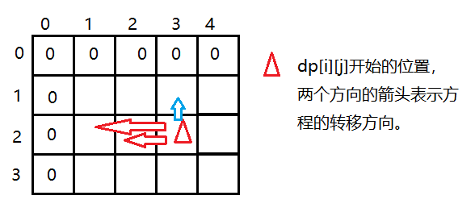

# 完全背包问题

有 $N$ 种物品和一个容量是 $V$ 的背包，每种物品都有无限件可用（但碍于
包的容量每件物品最多可装`floor(V/w[i])`件，即不超过`V/w[i]`的最大整数件，`w[i]`是1个第`i`种物品的质量）。

第 $i$ 种物品的体积是 $w_i$，价值是 $v_i$（weight，重量（体积）；value，价值）。

求解将哪些物品装入背包，可使这些物品的总体积不超过背包容量，且总价值最大。
输出最大价值。

## 二维数组定义状态（不要求装满）

[1268：【例9.12】完全背包问题](http://ybt.ssoier.cn:8088/problem_show.php?pid=1268)

[3. 完全背包问题 - AcWing题库](https://www.acwing.com/problem/content/3/)

[P1616 疯狂的采药 - 洛谷](https://www.luogu.com.cn/problem/P1616)

这个问题类似于01背包问题，不同的是每种物品有无限件。也就是从每种物品的角度考虑，与它相关的策略已并非取或不取两种，而是有取0件、取1件、取2件...等很多种。

1. 状态定义

令`dp[i][j]`表示前`i`种物品，每种选若干个，这些物品恰好放入一个容量为`j`的背包时的最大价值。

2. 转移方程

当只有1种物品的时候，没得选，包能塞多少就装多少。

当不止有1种物品时，假设前`i-1`种物品都已经选择好了最大价值的方案，第`i`种物品的：数量和最大价值的关系：

当`i`物品不选时，`dp[i][j]=dp[i-1][j]`，

当选1件`i`物品时，`dp[i][j]=max{dp[i-1][j],dp[i-1][j-w[i]]+v[i]}`

当选2件`i`物品时，

`dp[i][j]=max{dp[i-1][j],dp[i-1][j-w[i]]+v[i],dp[i-1][j-2*w[i]]+v[i]}`

$\cdots$
当选`k`件`i`物品时（`k=V/w[i]`），
`dp[i][j]=max{dp[i-1][j],dp[i-1][j-w[i]]+v[i],...,dp[i-1][j-k*w[i]]+k*v[i]}`

当选`k+1`件物品时，包已经放不下了，所以就不选。

在众多的方案每次都选择最大价值的那个。

所以**状态转移方程**：

```c
dp[i][j]=max{
    dp[i-1][j],
    dp[i-1][j-w[i]]+v[i],
    dp[i-1][j-2*w[i]]+2*v[i],
    ...
    dp[i-1][j-k*w[i]]+k*v[i]
}
```

3. 初始化&填表

`dp[0][j]`表示无物品的情况下容量为`j`的背包能存放的最大价值，直接初始化为0即可。

填表的循环方式是`i`在外层，之后`j`嵌套`k`。`i`表示某种物品，`j`表示背包容量，注意`j`要从0开始，确保不漏一个状态哪怕是非法状态，否则可能最后的答案不对。即确定好包的容量和物品的数量后对不同数量的同种物品进行枚举。

所以代码实现：

```cpp
for(int i=1;i<=n;i++)
    for(int j=0;j<=V;j++)//正向枚举和逆向枚举都能得到结果
        for(int k=0;k<=V/w[i];k++)
            if(j>=k*w[i])
                dp[i][j]=max(dp[i][j],dp[i-1][j-k*w[i]]+k*v[i]);
```

假设所有种类的物品平均被划分的个数是$K$，则时间复杂度是$O(N*V*K)$，当三个量的数量级相同时，这个算法的时间复杂度便来到$O(n^3)$，在数据量稍微大一点时（比如1000种物品放进容积为1000的包里）表现并不是特别理想。

但解决数量级小的OJ还是没问题的。

数量级小的比如[1268：【例9.12】完全背包问题](http://ybt.ssoier.cn:8088/problem_show.php?pid=1268)，参考程序之一：

```c
#include<iostream>
#include<vector>
using namespace std;

void ac1(){
	int dp[101][201]={0};
	int w[101]={0},v[101]={0};
	int n,V;
	cin>>V>>n;
	for(int i=1;i<=n;i++)
		cin>>w[i]>>v[i];
	for(int i=1;i<=n;i++)
		for(int j=0;j<=V;j++)
			for(int k=0;k<=V/w[i];k++)
				if(j>=k*w[i])
					dp[i][j]=max(dp[i][j],dp[i-1][j-k*w[i]]+k*v[i]);
	cout<<"max=";
	cout<<dp[n][V];
}

int main() {
	ac1();
	return 0;
}
```

但在[3. 完全背包问题 - AcWing题库](https://www.acwing.com/problem/content/3/)、[P1616 疯狂的采药 - 洛谷](https://www.luogu.com.cn/problem/P1616)，这个思路就不行了。所以还要继续优化。

## 二维数组定义状态（要求装满）

[【模板】完全背包](https://ac.nowcoder.com/acm/problem/226516)

和01背包一样，方程没有变化，变化的只有初始化。

即`dp[0][j]`除了`dp[0][0]=0`，其他都是初始化为无穷小。

参考程序（部分样例超时）：

```cpp
#include<iostream>
#include<vector>
using namespace std;

int N, V;
vector<int>w, v;
vector<vector<int> >dp;

void init() {
	cin >> N >> V;
	w.resize(N + 1, 0);
	v = w;
	dp.resize(N + 1, vector<int>(V + 1, 0));
	for (int i = 1; i <= N; i++)
		cin >> w[i] >> v[i];
}

void ac() {
    //第1问
	for (int i = 1; i <= N; i++)
		for (int j = 0; j <= V; j++) {
			for (int k = 0; k <= j / w[i]; k++)
				if (j >= k * w[i])
					dp[i][j] = max(dp[i][j],
						dp[i - 1][j - k * w[i]] + k * v[i]);
		}
	cout << dp[N][V]<<endl;
    
    //第2问
	for (int i = 0; i <= N; i++)
		for (int j = 0; j <= V; j++)
			dp[i][j] = -0x3f3f3f3f;
	dp[0][0] = 0;
	for (int i = 1; i <= N; i++)
		for (int j = 0; j <= V; j++) {
			for (int k = 0; k <= j / w[i]; k++)
				if (j >= k * w[i])
					dp[i][j] = max(dp[i][j], 
						dp[i-1][j - k * w[i]] + k * v[i]);
		}
	if (dp[N][V] < 0)
		cout << 0;
	else
		cout << dp[N][V];
}

int main() {
	init();
	ac();
	return 0;
}
```

很明显，三个循环的转移方程在处理[【模板】完全背包](https://ac.nowcoder.com/acm/problem/226516)时会超时，所以还需要进行优化。

## 二维数组定义状态优化

完全背包的**状态转移方程**：

```c 
dp[i][j]=max{
    dp[i][j],
    dp[i-1][j-w[i]]+v[i],
    dp[i-1][j-2*w[i]]+2*v[i],
    ...
    dp[i-1][j-k*w[i]]+k*v[i]
}
```

再看这个状态：前`i`种物品放进容量为`j-w[i]`的包时的最大价值`dp[i][j-w[i]]`的转移方程：

```c
dp[i][j-w[i]]=max{
    dp[i][j-w[i]],
    dp[i-1][j-2*w[i]]+v[i],
    dp[i-1][j-3*w[i]]+2*v[i],
    ...
    dp[i-1][j-(k+1)*w[i]]+k*v[i]
}
```

第一个方程中`j-k*w[i]`随着`k`增大无限接近于0，所以`dp[i-1][j-k*w[i]]`$\rightarrow$`dp[i-1][j]`。而第一个方程中`{}`内的表达式数量只比第二个方程的多1个`dp[i][j]`。所以两边都加一个`v[i]`：

```c
dp[i][j-w[i]]+v[i]=max{
    dp[i][j-w[i]]+v[i],
    dp[i-1][j-2*w[i]]+2*v[i],
    dp[i-1][j-3*w[i]]+3*v[i],
    ...
    dp[i-1][j-k*w[i]]+k*v[i]
}
```

对比三个方程，发现第一个方程的大部分式子可以用第三个方程等效替换：

```c
dp[i][j]=max{dp[i-1][j],dp[i][j-w[i]]+v[i]};
```

到这里，第一个转移方程经过数学思维的简单替换已经得到了很好的优化。但还是要注意就是`j-w[i]`可能不存在，即`j<w[i]`。

**初始化**：转移方程用二维数组代替。根据方程，转移方向如图：





假设红色三角形是`dp[i][j]`的位置，两个方向的箭头表示的是方程的转移方向。可以看到，当`dp[i-1][j]`是往低层的状态转移，而`dp[i][j-w[i]]`是同层状态往左。类比到二维数组就是，二维数组当前的值要么往上找，要么往左找，往上找是找最近的一个，而往左则不一定。

所以递推表（dp表）的**填表顺序**：是从左往右，从上往下，**保证每个状态都可以正常转移**。在程序中表现就是两个循环嵌套，标记循环状态的变量都是升序。

**代码实现**：

```c
//二选一即可
void f(){
    for(int i=1;i<=N;i++)
        for(int j=1;j<=V;j++)
            if(j>=w[i])
                dp[i][j]=max(dp[i-1][j],dp[i][j-w[i]]+v[i]);
    		else
                dp[i][j]=dp[i-1][j];
}

void f2(){
    for(int i=1;i<=N;i++)
        for(int j=0;j<=V;j++){
            dp[i][j]=dp[i-1][j];
            if(j>=w[i])
                dp[i][j]=max(dp[i-1][j],dp[i][j-w[i]]+v[i]);
        }
}
```

[3. 完全背包问题 - AcWing题库](https://www.acwing.com/problem/content/3/)参考程序：

```c
#include <iostream>
using namespace std;
int m, n;
int dp[1001][1001] = { 0 };
int w[1001] = { 0 }, v[1001] = { 0 };
int maxx = 0;

int main()
{
	cin >> n >> m;
	for (int i = 1; i <= n; i++)
		cin >> w[i] >> v[i];
	//枚举到第几号物品 (01背包是第几件)，因为可放数量不固定。
	for (int i = 1; i <= n; i++) {
		for (int j = 1; j <= m; j++) {//01背包是逆向
			if (j >= w[i])
				dp[i][j] = max(dp[i - 1][j], dp[i][j - w[i]] + v[i]);
			else
				dp[i][j] = dp[i - 1][j];
		}
	}

	cout << dp[n][m] << endl;
	return 0;
}
```

同样的，Nowcoder的这道OJ[【模板】完全背包](https://ac.nowcoder.com/acm/problem/226516)的第2问也是一样的方程，除了`dp[0][j]`初始化为无穷小，`dp[0][0]=0`。

AC参考程序：

```cpp
#ifndef _CRT_SECURE_NO_WARNINGS
#define _CRT_SECURE_NO_WARNINGS 1
#endif

#include<iostream>
#include<vector>
using namespace std;

int N, V;
vector<int>w, v;
vector<vector<int> >dp;

void init() {
	cin >> N >> V;
	w.resize(N + 1, 0);
	v = w;
	dp.resize(N + 1, vector<int>(V + 1, 0));
	for (int i = 1; i <= N; i++)
		cin >> w[i] >> v[i];
}

void ac() {
	//第1问
	for (int i = 1; i <= N; i++)
		for (int j = 0; j <= V; j++) {
			dp[i][j] = dp[i - 1][j];
			if (j >= w[i])
				dp[i][j] = max(dp[i][j], dp[i][j - w[i]] + v[i]);
		}
	cout << dp[N][V] << endl;
    
    //第2问
    //因为用的是同一个数组，为了将影响降到最小，
    //将数组还原为最初的状态
	for (int i = 0; i <= V; i++)
		dp[0][i] = -0x3f3f3f3f;
	for (int i = 1; i <= N; i++)
		for (int j = 0; j <= V; j++)
			dp[i][j] = 0;
	dp[0][0] = 0;
	for (int i = 1; i <= N; i++)
		for (int j = 0; j <= V; j++) {
			dp[i][j] = dp[i - 1][j];
			if (j >= w[i])
				dp[i][j] = max(dp[i][j], dp[i][j - w[i]] + v[i]);
		}
	if (dp[N][V] < 0)
		cout << 0;
	else
		cout << dp[N][V];
}

int main() {
	init();
	ac();
	return 0;
}
```

[P1616 疯狂的采药 - 洛谷](https://www.luogu.com.cn/problem/P1616)这题因为数据量太大，空间会超限。所以还需要继续优化。

## 用一维数组进行空间优化

观察二维状态的转移过程，以及状态转移方程：

`dp[i][j]=max(dp[i-1][j],dp[i][j-w[i]]+v[i]);`


发现在每次转移时可以先做初始化：`dp[i][j]=dp[i-1][j]`，

再用`max`进行判断，因为枚举到这一行时，上方的表已经填完。

因此定义状态`dp[j]`为包容量为`j`的包，塞哪些物品可以获得最大价值。

于是转移方程变成了

`dp[j]=max(dp[j],dp[j-w[i]]+v[i])`

但填表顺序也就是程序中的内层循环方向要升序，因为每个格子更新要用到左边的格子，只有左边的状态是最优解，才能保证正确更新。

同时为了优化循环次数，内层循环范围从`[1,V]`变成`[w[i],V]`。

[3. 完全背包问题 - AcWing题库](https://www.acwing.com/problem/content/3/)参考程序：

```c
#ifndef _CRT_SECURE_NO_WARNINGS
#define _CRT_SECURE_NO_WARNINGS 1
#endif

#include<iostream>
#include<vector>
using namespace std;

int N, V;
vector<int>w, v;
vector<int>dp;

void init() {
	cin >> N >> V;
	w.resize(N + 1, 0);
	v = w;
	dp.resize(V + 1, 0);
	for (int i = 1; i <= N; i++)
		cin >> w[i] >> v[i];
}

void ac() {
	//第1问
	for (int i = 1; i <= N; i++)
		for (int j = w[i]; j <= V; j++) {
				dp[j] = max(dp[j], dp[j - w[i]] + v[i]);
		}
	cout << dp[V] << endl;

	//第2问
	//因为用的是同一个数组，为了将影响降到最小，
	//将数组还原为最初的状态
	for (int i = 0; i <= V; i++)
		dp[i] = -0x3f3f3f3f;
	dp[0] = 0;
	for (int i = 1; i <= N; i++)
		for (int j = w[i]; j <= V; j++) 
				dp[j] = max(dp[j], dp[j - w[i]] + v[i]);
		
	if (dp[V] < 0)
		cout << 0;
	else
		cout << dp[V];
}

int main() {
	init();
	ac();
	return 0;
}
```

[P1616 疯狂的采药 - 洛谷](https://www.luogu.com.cn/problem/P1616)

这题和01背包的采药对应，但每种草药无限选，而且因为数据量大，只能用空间优化。

翻译成完全背包问题，部分要素：

采药时间`==`体积，价值不变，等待时间`==`背包容量。

但需要注意一种情况，背包容量是$10^7$，假设某种物品的体积和价值分别是$1$和$10^4$，则全选这个物品的总价值是$10^{11}$，所以`int`无法存储这么大的数，需要用`long long`。

参考程序：

```cpp
#include<bits/stdc++.h>
using namespace std;

int main(){
    int V,N;
    cin>>V>>N;
    vector<long long>w(N+1,0),v(w);
    vector<long long>dp(V+1,0);
    for(int i=1;i<=N;i++)
        cin>>w[i]>>v[i];
    for(int i=1;i<=N;i++)
        for(int j=w[i];j<=V;j++)
            dp[j]=max(dp[j],dp[j-w[i]]+v[i]);
    cout<<dp[V];
    return 0;
}
```


## 完全背包二进制优化

二进制优化的具体思路：

将第$i$种物品分成若干件物品，其中每件物品有一个系数，这件物品的费用和价值均是原来的费用和价值乘以这个系数。使这些系数分别为 $1,2,4,...,2^{k-1},
\frac{V}{w_i}-2^{k}+1$，且$k$是满足$\frac{V}{w_i}-2^k+1>0$的最大整数。

这些系数已经可以组合出$[1,[\frac{V}{w_i}]]$内的所有数字。例如，如果$[\frac{V}{w_i}]$为13，就将这种物品分成系数分别为`{1,2,4,6}`的四件物品。

分成的这几件物品的系数和为$[\frac{V}{w_i}]$，表明不可能取多于$[\frac{V}{w_i}]$件的第`i`种物品。

每种物品都按类似的方法去分，就将 $i$ 种物品分成了约$\Sigma (\log_2 [\frac{V}{w_i}]+1)$种物品，将原问题转化为了时间复杂度为$O(V\cdot [\log_2 [\frac{V}{w_i}]])$的01背包问题，是很大的改进。代价是额外申请了多余的空间，算是空间换时间的一种做法。

> 记$[\frac{V}{w_i}]$为$n_i$。
>
> 数列$\{1,2,4,...,2^{k-1},n_i-2^{k}+1\}$一共有$k+1$项，
>
> 设前$k$项的和为$S$，根据等比数列前$n$项和公式，
>
> $S=\frac{1-2^{k}}{1-2}=2^{k}-1$，于是$k=\log_2(S+1)$。
>
> 已知$n_i\geq S$，所以第$i$种物品分成了$[\log_2n_i]+1$（大于$\log_2 n_i$的最小整数）种系数为2的若干次幂的物品。
>
> 所有物品也就分成了$\Sigma ([\log_2n_i]+1)$种。

多余的空间也可以根据$[\ \log_2 [\frac{V}{w_i}]\ ]+1$进行计算。例如$[\frac{V}{w_i}]\leq 20$，则每种物品最多能分成`{1,2,4,8,5}`这5个不同系数的物品，最多有$T$种类似的物品，所以用到的空间最多为$5T$。

[1268：【例9.12】完全背包问题](http://ybt.ssoier.cn:8088/problem_show.php?pid=1268)参考程序之一：

```c
#include <iostream>
using namespace std;
int m, n;
int dp[201] = { 0 };
int w[10001] = { 0 }, v[10001] = { 0 };
int num;
int main() {
	cin >> m >> n;
    
    //在读取数据的阶段用二进制优化
	for (int i = 1, tw, tv, s, tn; i <= n; i++) {//tw: template weight
		tn = 1;
		cin >> tw >> tv;//template wight
		s = m / tw;//完全背包每种物品的上限
		while (s >= tn) {
			w[++num] = tn * tw;
			v[num] = tn * tv;
			s -= tn;
			tn *= 2;
		}
		w[++num] = s * tw;
		v[num] = s * tv;
	}
    
	//01背包的状态转移方程
	for (int i = 1; i <= num; i++)
		for (int j = m; j >= w[i]; j--)
			dp[j] = max(dp[j], dp[j - w[i]] + v[i]);
	cout << "max=" << dp[m];
	return 0;
}
```

## 求完全背包的方案数

### 体积和价值同数值

[1273：【例9.17】货币系统](http://ybt.ssoier.cn:8088/problem_show.php?pid=1273)

[1293：买书](http://ybt.ssoier.cn:8088/problem_show.php?pid=1293)

这两个OJ都可以看成是体积和价值同数值的物品，装满容量有限的背包的方法数。

[1273：【例9.17】货币系统](http://ybt.ssoier.cn:8088/problem_show.php?pid=1273)是问不同纸币的面额组成新面额的方法数。

借用之前01背包的方法数的思路：

1. 状态定义：`dp[i][j]`表示从`[1,i]`中选物品，使得价值恰好为`j`的方法数。
2. 转移方程：从最后一个状态出发。

`i`面值的纸币都有不选或选到底两种决策，所以

```cpp
dp[i][j]= dp[i-1][j]+//不选
	dp[i-1][j-w[i]]+//选1个
    dp[i-1][j-2*w[i]]+//选两个
    ...
```

发现

```cpp
dp[i][j-w[i]]= dp[i-1][j-w[i]]+//不选
	dp[i-1][j-2*w[i]]+//选1个
    dp[i-1][j-3*w[i]]+//选两个
    ...
```

将相同的部分替换，即可得到转移方程

`dp[i][j]=dp[i-1][j]+dp[i][j-w[i]]`。

3. 初始化：`dp[0][0]`表示从0个物品中选择物品凑成0的方法数，默认不选所以为1。
4. 填表：两层循环，外层枚举物品，内层枚举要凑成的价值`j`，其中内层需要正向枚举。
5. 最终答案：`dp[n][m]`。
6. 空间优化：可进行空间优化和枚举范围优化。

参考程序：

```cpp
#ifndef _CRT_SECURE_NO_WARNINGS
#define _CRT_SECURE_NO_WARNINGS 1
#endif

#include<bits/stdc++.h>
using namespace std;

void ac1() {
	int n, m;
	cin >> n >> m;
	vector<long long>w(n + 1, 0);
	vector<vector<long long> >dp(n + 1, vector<long long>(m + 1, 0));
	for (int i = 1; i <= n; i++)
		cin >> w[i];
	dp[0][0] = 1ll;
	for (int i = 1; i <= n; i++)
		for (int j = 0; j <= m; j++) {
			dp[i][j] = dp[i - 1][j];
			if (j >= w[i])
				dp[i][j] += dp[i][j - w[i]];
		}
	cout << dp[n][m];
}

void ac2() {
	int n, m;
	cin >> n >> m;
	vector<long long>w(n + 1, 0);
	vector<long long>dp(m + 1, 0);
	for (int i = 1; i <= n; i++)
		cin >> w[i];
	dp[0] = 1ll;
	for (int i = 1; i <= n; i++)
		for (int j = w[i]; j <= m; j++) {
			dp[j] += dp[j - w[i]];
		}
	cout << dp[m];
}

int main() {
	//ac1();//朴素求解
	ac2();//空间优化
	return 0;
}
```

[1293：买书](http://ybt.ssoier.cn:8088/problem_show.php?pid=1293)是[1273：【例9.17】货币系统](http://ybt.ssoier.cn:8088/problem_show.php?pid=1273)的样例缩小版，因为只有4种价格的书。思路也是一样的，这里贴个参考程序就行。

```cpp
#include<iostream>
#include<vector>
using namespace std;

void ac1(){
	int n;
	cin>>n;
	int a[5]={0,10,20,50,100};
	vector<int>dp(n+1,0);
	dp[0]=1;
	for(int i=1;i<=4;i++)
		for(int j=1;j<=n;j++)
			if(j>=a[i])
				dp[j]=dp[j]+dp[j-a[i]];
	cout<<dp[n];
}

int main() {
	ac1();
	return 0;
}
```

### 体积和价值不同数值

目前没有遇到类似的题目。所以这里仅作为个人的想法。

和01背包一样，同样需要一个朴素的完全背包问题进行辅助。

例如样例

```
5 5
2 2
5 10
3 4
2 1
1 2
```

最大价值是10，方案数是2。

参考程序：

```cpp
#ifndef _CRT_SECURE_NO_WARNINGS
#define _CRT_SECURE_NO_WARNINGS 1
#endif

#include<bits/stdc++.h>
using namespace std;

void f1() {
	int N, V;
	cin >> N >> V;//物品数量、背包容量
	vector<int>w(N + 1, 0), v(w);
	for (int i = 1; i <= N; i++)
		cin >> w[i] >> v[i];//体积、价值

	//dp[i][j]：前i个物品任选，组成最大价值的方法数；bk[j]：最大价值
	vector<vector<int> >dp(N+1, vector<int>(V + 1, 0)), bk(dp);
	dp[0][0] = 1;

	for (int i = 1; i <= N; i++) {
		for (int j = 0; j <= V; j++) {
			bk[i][j] = bk[i - 1][j];
			dp[i][j] = dp[i - 1][j];
			if (j < w[i]) continue;
			if (bk[i][j] < bk[i][j - w[i]] + v[i]) {
				bk[i][j] = bk[i][j - w[i]] + v[i];
				dp[i][j] = dp[i][j - w[i]];
			}
			else if (bk[i][j] == bk[i][j - w[i]] + v[i])
				dp[i][j] += dp[i][j - w[i]];
		}
	}
	cout << bk[N][V] << ' ' << dp[N][V] << endl;
}

void f2() {
	int N, V;
	cin >> N >> V;//物品数量、背包容量
	vector<int>w(N + 1, 0), v(w);
	for (int i = 1; i <= N; i++)
		cin >> w[i] >> v[i];//体积、价值

	//dp[j]：组成最大价值的方法数；bk[j]：不超过j的最大价值
	vector<int>dp(V + 1, 0), bk(dp);
	dp[0] = 1;

	for (int i = 1; i <= N; i++) {
		for (int j = w[i]; j <= V; j++) {
			if (bk[j] < bk[j - w[i]] + v[i]) {
				bk[j] = bk[j - w[i]] + v[i];
				dp[j] = dp[j - w[i]];
			}
			else if (bk[j] == bk[j - w[i]] + v[i])
				dp[j] += dp[j - w[i]];
		}
	}
	cout << bk[V] << ' ' << dp[V] << endl;
}


int main() {
	//f1();
	f2();//空间优化
	return 0;
}
```

## 求完全背包的具体方案

同样是没遇到类似的题目，所以是个人想法。

在得到最大价值后，还可以通过回溯的方式记录选择了哪些物品。

以二维数组为例，在计算完`dp`数组后，可以从包的容量`V`开始，对于每一种物品`i`，若
`dp[i][j]==dp[i][j-w[i]]+v[i]`，说明该物品中的一件是包里物品的最优方案的一部分。此时可以取出物品`V-=w[i]`，再继续看包内还有没有i物品。

如果`j<w[i]`或`dp[i][j]!=dp[i][j-w[i]]+v[i]`，则这件物品没了，换`i+1`物品。

这个过程和01背包的思路很像，都是回溯，不同的是同一件物品可能有多个，所以需要用循环来判断。

参考程序：

```c
#include <iostream>
using namespace std;
int m, n;
int dp[1001][1001] = { 0 };
int w[1001] = { 0 }, v[1001] = { 0 };
int maxx = 0;

int main()
{
	cin >> n >> m;
	for (int i = 1; i <= n; i++)
		cin >> w[i] >> v[i];
	//枚举到第几号物品 (01背包是第几件)，因为可放数量不固定。
	for (int i = 1; i <= n; i++) {
		for (int j = 1; j <= m; j++) {//01背包是逆向
			if (j >= w[i])
				dp[i][j] = max(dp[i - 1][j],
					dp[i][j - w[i]] + v[i]);
			else
				dp[i][j] = dp[i - 1][j];
		}
	}
	cout << dp[n][m] << endl;

	//回溯求具体方案
	int j = m;
	for (int i = n; i >= 1; i--) {
		int flag = 0;
		//和01背包不同的点是这个因为会装很多件相同的，
		//所以用循环去判断，01背包是用if
		while (j >= w[i] && dp[i][j] == dp[i][j - w[i]] + v[i]) {
			cout << i << ' ';
			j -= w[i];
			flag = 1;
		}
		if (flag == 1)
			cout << endl;
	}

	return 0;
}
```


## 完全背包的变种

### Buying Hay S（限定条件变更）

[P2918 [USACO08NOV\] Buying Hay S - 洛谷](https://www.luogu.com.cn/problem/P2918)

分析出属于完全背包的要素：

重量`==`价值，开销`==`体积，但要求的是最小开销，也就是价值是负面效果。

1. 状态定义

`dp[i][j]`表示从`[1,i]`中挑选，总重量至少为`j`时的最小开销。

2. 转移方程

> 完全背包的3种限定情况：
>
> 1. 体积不超过`j`，说明在前`i`个物品中挑选，总重小于等于`j`，所以$j\geq v_i$。所以用第2个状态时需要做判断，或直接$j<v_i$砍掉这部分枚举。
> 2. 体积正好为`j`，说明前`i`个物品中挑出来的总重要等于`j`，此时需要判断`dp[i][j]`中某些状态是否合法（例如`dp[0][i]`），不合法的情况可以初始化为`-1`、负无穷和正无穷，防止这些不合法的状态影响判断。
> 3. 体积至少为`j`，说明挑出来的物品的体积大于等于`j`，也就是说$j-w_i<0$也是合法情况。
>    例如这里的买干草，假设`[1,i]`公司中，第`i`个公司的草的单位重量刚好大于`j`，则最优解就是第`i`个公司的草。
>    但问题是dp表，也就是数组不能用负数表示下标，所以根据问题求的最小开销，将`dp[i][0]`记录`j<w[i]`时的情况。所以处理这种合法的状态但无法用dp表存储的情况，需要进行特殊判断例如`max(0,j-w[i])`放在0这个特殊位置，要么另外开一个数组或变量存储。

完全背包问题，根据最后一种情况划分位置，所有的决策：

```cpp
dp[i][j]=dp[i-1][j],
dp[i][j]=dp[i-1][max(0,j-w[i])]+v[i],
...
```

完全背包可以只保留地1个，其他的用一个式子表示。

所以最终转移方程：

```cpp
dp[i][j]=min(dp[i-1][j],dp[i][max(0,j-w[i])]+v[i]);
```

3. 初始化&填表顺序

因为是求最小开销，所以不能初始化为0，因为开销再小也不为负数。

将非法状态初始化为正无穷，除了`dp[0][0]`，它有特殊含义。

填表时和朴素完全背包一致。

参考程序：

```cpp
#include<bits/stdc++.h>
using namespace std;

void ac1() {
	int n, h;
	cin >> n >> h;
	vector<int>p(n + 1, 0), c(p);
	vector<vector<int> >dp(n + 1, vector<int>(h + 1, 0x3f3f3f3f));
	for (int i = 1; i <= n; i++)
		cin >> p[i] >> c[i];
	dp[0][0]=0;
	for (int i = 1; i <= n; i++) 
		for (int j = 0; j <= h; j++)
			dp[i][j] = min(dp[i - 1][j], dp[i][max(0, j - p[i])] + c[i]);
	cout << dp[n][h];
}

void ac2() {
	int n, h;
	cin >> n >> h;
	vector<int>p(n + 1, 0), c(p);
	vector<int>dp(h + 1, 0x3f3f3f3f);
	for (int i = 1; i <= n; i++)
		cin >> p[i] >> c[i];
	dp[0] = 0;
	for (int i = 1; i <= n; i++)
		for (int j = 0; j <= h; j++)
			dp[j] = min(dp[j], dp[max(0, j - p[i])] + c[i]);
	cout << dp[h];
}

int main() {
	//ac1();//二维状态
	ac2();//空间优化
	return 0;
}
```

### 纪念品（股票问题 贪心+dp）

[P5662 [CSP-J2019\] 纪念品 - 洛谷](https://www.luogu.com.cn/problem/P5662)

这个题源自于生活中的股票，简单来说就是囤积商品后，在未来看市场价格选择将囤积的商品卖出去，用于赚取利润。这便是股票问题，通过买卖操作来赚钱。

股票问题中重要的结论：在股票问题中，任意一笔跨天的交易，都可以转换为连续的某天买，隔天卖的形式。这可以看成一种相对成熟的**贪心策略**，以后的（类）股票问题都可以参考这个思路。

因为题目有一个某个纪念品允许当天买当天卖的不赚钱的操作，所以跨天的交易可以拆解成连续几天的交易。在后面的解题中可以进行贪心策略：只需要考虑连续两天的交易即可，比如第1天买进，第2天是否卖出即可。否则第1天买，后面还要选时间卖，算法很难设计。

虽然题目给的样例和这里的贪心策略不一样，但题目可以转换成这个谈心策略。

这里分析的都是1个纪念品的情况，若是多个纪念品，每个纪念品在每天都有不同的价格，利用贪心策略，第1天选择买，第2天选择卖，同理第2天买、第3天卖的操作，第3天买、第4卖天的操作......第`i`天买、第`i+1`天买。

研究任意两天，第1天买纪念品的时候不能超过当天拥有的金币数，在这基础上可以无限购买，第2天卖出的物品还能赚取利润，相当于每个物品的价值是利润，可以发现，这两天的交易就是一个完全背包问题。

所以整个问题被拆分成了`T-1`次完全背包问题，但价值是两天的差价，每次完全背包的答案是之前的本金加背包问题求得的利润。

这里省略完全背包的分析过程。参考程序：

```cpp
#include<bits/stdc++.h>
using namespace std;

void ac1() {
	int T, N, M;
	cin >> T >> N >> M;
	vector<vector<int> >p(T + 1, vector<int>(N + 1, 0));
	for (int i = 1; i <= T; i++)
		for (int j = 1; j <= N; j++)
			cin >> p[i][j];

	//完全背包
	auto backdp = [&](vector<int>& v1, vector<int>& v2, int m) {
		vector<int>dp(M + 1, 0);
		for (int i = 1; i <= N; i++)
			for (int j = v1[i]; j <= m; j++)
				dp[j] = max(dp[j], dp[j - v1[i]] + v2[i] - v1[i]);
		return dp[m]+m;
	};

	//贪心
	for (int i = 1; i < T; i++)
		M = backdp(p[i], p[i + 1], M);
	cout << M;
}

int main() {
	ac1();
	return 0;
}
```


## 完全背包的OJ汇总

1. 模板题

[1268：【例9.12】完全背包问题](http://ybt.ssoier.cn:8088/problem_show.php?pid=1268)

[3. 完全背包问题 - AcWing题库](https://www.acwing.com/problem/content/3/)

[P1616 疯狂的采药 - 洛谷](https://www.luogu.com.cn/problem/P1616)

[【模板】完全背包](https://ac.nowcoder.com/acm/problem/226516)

2. 求完全背包的方案数

[1273：【例9.17】货币系统](http://ybt.ssoier.cn:8088/problem_show.php?pid=1273)

[1293：买书](http://ybt.ssoier.cn:8088/problem_show.php?pid=1293)

3. 完全背包的变种

[P2918 [USACO08NOV\] Buying Hay S - 洛谷](https://www.luogu.com.cn/problem/P2918)

[P5662 [CSP-J2019\] 纪念品 - 洛谷](https://www.luogu.com.cn/problem/P5662)
