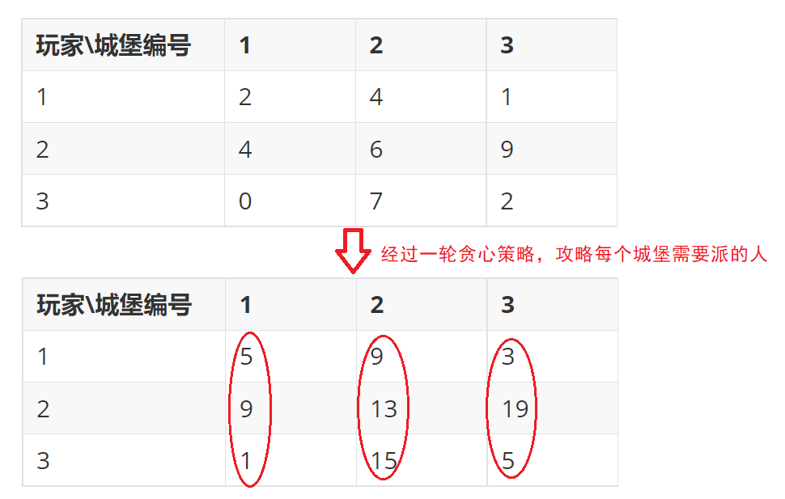

# 分组背包问题

`N`件物品和一个容量为`V`的背包。第`i`件物品的体积是`w[i]`，价值是`v[i]`。这些物品被划分为若干组，每组中的物品互相冲突，最多选一件。求解将哪些物品装入背包可使这些物品的体积总和不超过背包容量，且价值总和最大。

其实01背包就是特殊的分组背包，每个物品都是一组，每组一个物品。

## 分组背包思路

[P1757 通天之分组背包 - 洛谷](https://www.luogu.com.cn/problem/P1757)

[1272：【例9.16】分组背包](http://ybt.ssoier.cn:8088/problem_show.php?pid=1272)

1. 状态定义

> 回顾之前的状态表示：`dp[i][j]`表示从前`i`个物品中挑选，在体积（重量）不超过`j`的情况下的最大价值。
>
> 01背包的每个物品都只有挑和不挑两种情况，但分组背包并不能每个物品都做一次选择，因为分组机制的存在，同一组里选了物品的话，之后不能再考虑本组的物品。这样无法针对每个物品来定义分组背包的状态。

`dp[i][j]`表示从前`i`组物品中，每组挑选1种，在体积（重量）不超过`j`的情况下的最大价值。

2. 转移方程

根据最后1组来划分情况。假设从第`i`组选物品，组内的物品都有各自的重量`w[i][k]`和体积`v[i][k]`。

若不在这个组选物品，则`dp[i][j]=dp[i-1][j]`。

若选择该组的1号物品，则问题变成求在`[1,i-1]`区间的组别中选物品，在重量不超过`j-w[i]`的情况下的最大价值，所以`dp[i][j]=dp[i-1][j-w[i][1]]+v[i][1]`。

若选择该组的2号物品，则`dp[i][j]=dp[i-1][j-w[i][2]]+v[i][2]`。

在这些方式中选最大值即可。

3. 初始化&填表&最终答案

初始化因为没有负数的价值，所以全部初始化为0即可。

填表：从上往下每一行。第二维的顺序无所谓，但空间优化的话要从大到小。

参考程序：

```cpp
#ifndef _CRT_SECURE_NO_WARNINGS
#define _CRT_SECURE_NO_WARNINGS 1
#endif

#include<bits/stdc++.h>
using namespace std;

void ac1() {
	int n, m;
	int cnt = 0;
	cin >> m >> n;
    //cin>>cnt;cnt=0;//提交到一本通用
	struct Item {
		int w = 0; int v = 0;
	};
	vector<vector<Item> >item(n+1);
	vector<vector<int> >dp(n+1,vector<int>(m+1,0));
	for (int i = 1,a,b,c; i <= n; i++) {
		cin >> a >> b >> c;
		cnt = max(c, cnt);
		item[c].push_back({ a,b });
	}
	for (int i = 1; i <= cnt; i++) 
		for (int j = 0; j <= m; j++) {
			dp[i][j] = dp[i - 1][j];
			for (auto& x : item[i]) 
				if (j >= x.w)
					dp[i][j] = max(dp[i][j], dp[i-1][j - x.w] + x.v);
		}
	cout << dp[cnt][m];
}

void ac2() {
	int n, m;
	int cnt = 0;
	cin >> m >> n;
    //cin>>cnt;cnt=0;//提交到一本通用
	struct Item {
		int w = 0; int v = 0;
	};
	vector<vector<Item> >item(n + 1);
	vector<int>dp(m + 1, 0);
	for (int i = 1, a, b, c; i <= n; i++) {
		cin >> a >> b >> c;
		cnt = max(c, cnt);
		item[c].push_back({ a,b });
	}
	for (int i = 1; i <= cnt; i++)
		for (int j = m; j >=0; j--) {
			for (auto& x : item[i])
				if (j >= x.w)
					dp[j] = max(dp[j], dp[j - x.w] + x.v);

		}
	cout << dp[m];
}

int main() {
	ac1();
	//ac2();//空间优化
	return 0;
}
```

[1272：【例9.16】分组背包](http://ybt.ssoier.cn:8088/problem_show.php?pid=1272)这题相比[P1757 通天之分组背包 - 洛谷](https://www.luogu.com.cn/problem/P1757)给定了组数，除此之外无区别。


## 分组背包OJ

[P5322 [BJOI2019\] 排兵布阵 - 洛谷](https://www.luogu.com.cn/problem/P5322)

> 这题的难点是怎样将题目转化成自己熟悉的题型。

首先进行贪心策略，针对对每个玩家在每个城堡的布局，给出能赢这个玩家需要分配的人数。

比如这个样例：




分配人数时一个城堡一个城堡地考虑，针对一个城堡，只要决定了在这里放多少个人，则可以决定最后的得分。比如2号城堡放人的话，放13和放14是一样的效果，所以要放的话就放13，或者放15保证拿下所有玩家，即在`{9,13,15}`中选择要放的人数。其他城堡同理。

每个城堡的攻略方案中挑一个，计算当前城堡能拿到的总分。回忆之前的某句话： 每组的物品中选一个，计算能拿到的最大价值。

所以经过这么一翻译后，这个问题变成了分组背包问题：有`n`组物品，每组有`s`个物品，每组物品都有各自的价值，自己的背包容量只有`m`，问怎么拿物品才能得到最大价值。

但在用分组背包问题解决这题的时候，需要将每个城堡的攻略方案进行排序，这样分配指定的人能得到对应的分，比如2号城堡每个玩家分配的人数是`{9,13,15}`，分配13个人，能同时攻略`{9,13}`，13是该城堡的第2方案，所以能拿到`2*2=4`分。

参考程序：

```cpp
#ifndef _CRT_SECURE_NO_WARNINGS
#define _CRT_SECURE_NO_WARNINGS 1
#endif

#include<bits/stdc++.h>
using namespace std;

void ac1() {
	int n, m, s;
	cin >> s >> n >> m;//玩家人数、城堡数、士兵数
	vector<vector<int> >dp(n + 1, vector<int>(m + 1, 0)),
		a(n + 1, vector<int>(s + 1, 0));

	//贪心策略预处理
	for (int i = 1; i <= s; i++)
		for (int j = 1; j <= n; j++) {
			cin >> a[j][i];
			a[j][i] = a[j][i] * 2 + 1;
		}
	for (int i = 1; i <= n; i++)
		sort(a[i].begin() + 1, a[i].end());
	//分组背包
	for (int i = 1; i <= n; i++)
		for (int j = 0; j <= m; j++) {
			dp[i][j] = dp[i - 1][j];
			for (int k = 1; k <= s&&a[i][k]<=j; k++) 
				dp[i][j] = max(dp[i][j], dp[i - 1][j - a[i][k]] + i * k);
		}
	cout << dp[n][m];
}

void ac2() {
	int n, m, s;
	cin >> s >> n >> m;//玩家人数、城堡数、士兵数
	vector<vector<int> >a(n + 1, vector<int>(s + 1, 0));
	vector<int>dp(m + 1, 0);

	//贪心策略预处理
	for (int i = 1; i <= s; i++)
		for (int j = 1; j <= n; j++) {
			cin >> a[j][i];
			a[j][i] = a[j][i] * 2 + 1;
		}
	for (int i = 1; i <= n; i++)
		sort(a[i].begin() + 1, a[i].end());

	//分组背包
	for (int i = 1; i <= n; i++)
		for (int j = m; j >= 1; j--) {
			for (int k = 1; k <= s && a[i][k] <= j; k++)
				dp[j] = max(dp[j], dp[j - a[i][k]] + i * k);
		}
	cout << dp[m];
}

int main() {
	//ac1();
	ac2();//空间优化
	return 0;
}
```

## 分组背包OJ汇总

1. 模板题

[P1757 通天之分组背包 - 洛谷](https://www.luogu.com.cn/problem/P1757)

[1272：【例9.16】分组背包](http://ybt.ssoier.cn:8088/problem_show.php?pid=1272)

2. 分组背包变种

[P5322 [BJOI2019\] 排兵布阵 - 洛谷](https://www.luogu.com.cn/problem/P5322)
