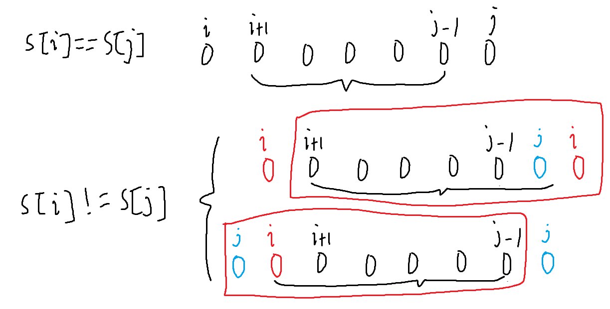
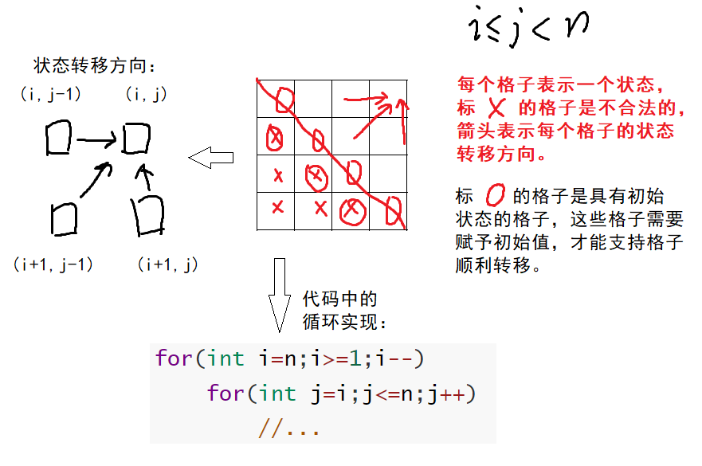
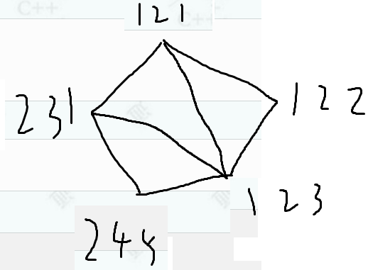
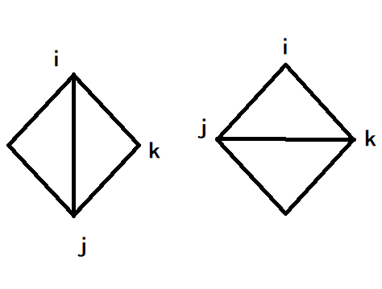

# 区间类dp

区间类dp用左、右区间来描述状态，通过小区间向大区间转移状态来解决问题，而且通常都是求大区间的最优解。

常见的区间dp分两类：

1. 基于区间的左、右端点进行讨论。
2. 基于区间上某个分界点，将区间划分为两个区间进行讨论。

## 基于区间的左、右端点

### 洛谷p1435 回文串

[P1435 IOI 2000 回文字串 - 洛谷](https://www.luogu.com.cn/problem/P1435) 

例如`Ab3bd`，`b3d`已经是回文，后面跟着个`d`，此时在`b3bd`前头插一个`d`变成`db3bd`。这个时候再尾插一个`A`，就变成了`Adb3bdA`，也就是说最少插2次。

问整个字符串最少插几次变回文，所以需要枚举区间，可以尝试用区间dp的思想解决。

1. 状态表示。

大区间变成回文串，在两端的字符相同时需要小区间也是回文串，所以可以设`f[i][j]`表示`[i,j]`区间的字符串变成一个回文串的最小需要插入的字符数。

所以最终结果是`f[1][n]`，即整个区间变成回文串需要插入的次数。

2. 状态转移方程

根据左、右端点的情况进行讨论。

当`s[i]==s[j]`时，字符串两头已经相等，所以让`[i,j]`变成回文串，需要使`[i+1,j-1]`插入字符变成回文，所以`f[i][j]=f[i+1][j-1]`。

当`s[i]!=s[j]`时，此时需要插入1个字符来让它变成回文，这时有两种插入方式：

* 将字符`s[i]`插在`s[j]`右边，此时`[i+1,j]`经过`f[i+1][j]`次插入字符时已经变成回文串（假设已经变成），再插入一个字符，`f[i][j]=f[i+1][j]+1;`。
* 将字符`s[j]`插在`s[i]`左边。所以`f[i][j-1]=f[i][j-1]+1;`。



因为求的是最小插入次数，所以在所有情况中求最小值。

所以得到方程：
```cpp
f[i][j]=f[i+1][j-1], s[i]==s[j]
f[i][j]=min{f[i+1][j]+1,f[i][j-1]+1}, s[i]!=s[j]
```

3. 填表顺序

区间类dp有两种填表方式。

第一种，因为`[i,j]`是一个区间，所以$i\leq j$。从二维平面看的话，只有对角线以及右上半部分的格子（状态）能用。

根据方程，`[i,j]`由状态`[i+1,j-1]`、`[i+1,j]`、`[i,j+1]`转移而来，在二维平面中，如果`i`表示行，`j`表示列，则`i`只有从左往右枚举，`j`从下往上枚举才能保证状态转移。

而且$i\leq j$，所以`j`从`i`开始枚举。



这种方式可能会做很多判断，不同的题枚举方式可能会发生变化。所以区间类dp还有另外的填表顺序。

第二种，第1层循环枚举区间长度，第2层循环枚举左端点。在第2层循环中根据区间长度获取右端点。区间类dp更多用第二种枚举方式。

```cpp
for(int len=1;len<=n;len++)//区间长度
    for(int i=1;i+len-1<=n;i++){//左端点，i+len-1表示右端点
        int j=i+len-1;//右端点
        //...
    }
```

4. 初始化

在对角线上的格子（状态）可能会用到$i>j$的格子，长度为1和`f[i][i+1]`的格子都有可能，所以需要初始化。而长度为1的区间不需要插入字符，本身可以算作是回文串，所以`f[i][i]==0`。

所以外层循环可能从1开始，也可能从2开始。

参考程序1，两层循环，外层枚举左端点，内层枚举右端点：

```cpp
#include<bits/stdc++.h>
using namespace std;

const int N = 1010;
int f[N][N];
int main() {
	string st;
	cin >> st;
	st = '_' + st;
	for (int i = st.size()-1; i >= 1; i--) {
		for (int j = i; j <= st.size()-1; j++) {
			if (st[i] == st[j])
				f[i][j] = f[i + 1][j - 1];
			else
				f[i][j] = min(f[i + 1][j], f[i][j - 1]) + 1;
		}
	}
	cout << f[1][st.size()-1];
	return 0;
}
```

参考程序2，外层循环枚举区间长度，内层循环枚举左端点的位置：

```cpp
#include<bits/stdc++.h>
using namespace std;

const int N = 1010;
int f[N][N];
int main() {
	string st;
	cin >> st;
	st = '_' + st;
	for (int len = 2; len<=st.size()-1; len++) {//有的问题可以从1开始
		for (int i = 1; i+len-1<=st.size()-1; i++) {
			int j = i + len - 1;
			if (st[i] == st[j])
				f[i][j] = f[i + 1][j - 1];
			else
				f[i][j] = min(f[i + 1][j] + 1, f[i][j - 1] + 1);
		}
	}
	cout << f[1][st.size()-1];
	return 0;
}
```

### 洛谷p2858 奖励奶牛

[P2858 [USACO06FEB\] Treats for the Cows G/S - 洛谷](https://www.luogu.com.cn/problem/P2858)

这题是每次从两个端点的零食中取1个零食，同时更新区间的长度，越晚取的零食拥有越高的价值，问如何取才能使价值最大。

首先尝试贪心，每次选择价值最小的一端取出零食。

例如样例`{1,3,1,5,2}`，每次取最小的1个端点的值，得到的价值是$1\times1+2\times2+3\times3+1\times4+5\times5=43$。

但如果是另一个样例例如`{4,1,5,3}`，同样是贪心策略，得到的价值是

$3\times1+4\times2+1\times3+5\times4=32$，但最优解其实是

$4\times1+1\times2+3\times3+5\times4=35$。因为贪心策略只看中眼前的最优解，反而将价值最小的1放后面。

因为和区间有关，所以能联想到这题可能是区间类dp。

1. 确定状态

记`dp[i][j]`表示将区间`[i,j]`的零食全部取走能拿到的最大价值。

2. 转移方程

决策只有两个，取左边还是取右边。

如果是取左边，则`dp[i][j]=dp[i+1][j]+a[i]*(n-len+1)`，其中`len`是区间`[i,j]`的长度。例如一开始取零食时，价值是$(n-n+1)\times a[i]$。

如果是取右边，则`dp[i][j]=dp[i][j-1]+a[j]*(n-len+1)`。

所以在两种决策中选价值最大的一种即可。

最终方程：

```cpp
dp[i][j]=max(dp[i+1][j]+a[i]*(n-len+1),dp[i][j-1]+a[j]*(n-len+1));
```

3. 填表顺序

转移方程是将区间短的状态转移为区间长的状态，所以区间长度从1开始枚举。之后按照区间类dp的枚举方式进行枚举即可。

4. 初始化

`dp[i][i]=n*a[i]`，表示零食只剩下1个时，它的价值。其实也不用刻意初始化，因为`dp[i][j]`一般都会留额外的空间方便边界条件转移，而且全局变量或者`vector`都会初始化为0。

参考程序：

```cpp
#ifndef _CRT_SECURE_NO_WARNINGS
#define _CRT_SECURE_NO_WARNINGS 1
#endif

#include<bits/stdc++.h>
using namespace std;
/*
https://www.luogu.com.cn/problem/P2858
*/

int main() {
	int n;
	cin >> n;
	vector<int>a(n + 1, 0);
	//因为区间转移有一个i+1，当i=n时，为了不越界，
	//二维数组的大小需要申请为n+2，为了支持i从1到n。
	vector<vector<int> >dp(n + 2, vector<int>(n + 2, 0));
	for (int i = 1; i <= n; i++)
		cin >> a[i];
	for(int len=1;len<=n;len++)
		for (int i = 1,j; i + len - 1 <= n&&i+len-1>0; i++) {
			j = i + len - 1;
			dp[i][j] = max(dp[i + 1][j] + a[i] * (n - len + 1), 
				dp[i][j - 1] + a[j] * (n - len + 1));
		}
	cout << dp[1][n];
	return 0;
}
```

## 基于区间上某个分界点

### 石子合并 单区间

[1274：【例9.18】合并石子](http://ybt.ssoier.cn:8088/problem_show.php?pid=1274)

[P1775 石子合并（弱化版） - 洛谷](https://www.luogu.com.cn/problem/P1775)

以洛谷上的样例为例，将样例`{2,5,3,1}`合并，最小代价的合并方式是：

合并2、5，代价为7；合并3、1，代价4；合并4、7，代价为22。

类似的合并方式在哈夫曼编码中也有应用。但哈夫曼编码没有相邻的限定，也就是说不能用贪心来解。

相邻的两堆石子合并涉及到区间，所以可以考虑用区间dp的思路来解决。

1. 状态表示

选取区间的一部分`[i,j]`，将`[i,j]`的石子合并，代价记为`dp[i][j]`。所以`dp[i][j]`表示将区间`[i,j]`的所有石子合并成一堆的最小代价。

所以`dp[1][n]`即为要求的答案。

2. 状态转移方程

最终目标是想将石子合并成一堆，所以最后一步合并肯定是只剩2堆，这2堆各自由两个长度可能不同的区间内的石子合并而来。

所以可以记一个变量`k`，表示第1个区间的右端点。所以`k+1`表示第2个区间的左端点。因此$i\leq k<j$。

合并的代价涉及求区间内的值的和，可以通过前缀和表示。

所以转移方程：

```cpp
dp[i][j]=min(dp[i][j],dp[i][k]+dp[k+1][j]+sum[j]-sum[i-1]);
```

3. 填表顺序

第1层循环枚举时间，第2层循环枚举左端点，第3层循环枚举分割点`k`。也就是区间dp最常用的枚举方式，但做了一点改进。

4. 初始化

因为是求最小值，所以不能全部初始化为0，否则无法推出答案。所以可以全部初始化为`0x3f3f3f3f`表示无穷大。

因为`dp[i][i]`表示长度为1的区间的情况，因为1堆石子无法自我合并，具体表现是`k`代表的循环无法执行，所以默认合并它们所需的代价为0。

两个OJ的AC参考程序：

```cpp
#include<bits/stdc++.h>
using namespace std;

int main() {
	int n;
	cin >> n;
	vector<int>sum(n + 1, 0);
	vector<vector<int> >dp(n + 2, vector<int>(n + 2, 0x3f3f3f3f));
	for (int i = 1, x; i <= n; i++) {
		cin >> x;
		sum[i] = sum[i - 1] + x;
		dp[i][i] = 0;
	}
	dp[0][0] = 0;
	for (int len = 2, j; len <= n; len++)
		for (int i = 1; i + len - 1 <= n; i++) {
			j = i + len - 1;
			for (int k = i; k < j; k++) {
				dp[i][j] = min(dp[i][j], dp[i][k] + dp[k + 1][j] + sum[j] - sum[i - 1]);
			}
		}
	cout << dp[1][n];
	return 0;
}
```


### 石子合并 环形区间，倍增

[P1880 [NOI1995\] 石子合并 - 洛谷](https://www.luogu.com.cn/problem/P1880)

[1569：【 例 1】石子合并](http://ybt.ssoier.cn:8088/problem_show.php?pid=1569)

这两个题在单石子区间的基础上绕成了环形。

这两个题也是用区间dp，但需要用到倍增的技巧来处理环形问题。

倍增（复写）指的是在原始数组的基础上长度扩大两倍，同时前半部分和后半部分的数据完全相同。

例如`{4,5,9,4}`，通过倍增技巧数组变成`{4,5,9,4,4,5,9,4}`。这样，在环中出现的所有情况都能在倍增数组中找到。

其中求最大值和最小值是同一个循环方式，但`min`变成`max`。所以需要另外开一个数组记录状态。

两个程序的AC参考程序：

```cpp
#include<bits/stdc++.h>
using namespace std;

int main() {
	int n;
	cin >> n;
	vector<int>sum(2 * n + 2, 0);
	//dpmin求最小代价，dpmax求最大代价
	vector<vector<int> >dpmin(2 * n + 2, vector<int>(2 * n + 2, 0x3f3f3f3f));
	vector<vector<int> >dpmax(2 * n + 2, vector<int>(2 * n + 2, -0x3f3f3f3f));

	//初始化的同时求前缀和
	for (int i = 1, x; i <= n; i++) {
		cin >> x;
		sum[i + n] = x;
		sum[i] = sum[i - 1] + x;
		dpmin[i][i] = 0;
		dpmax[i][i] = 0;
	}
	for (int i = n + 1; i <= 2 * n; i++) {
		sum[i] += sum[i - 1];
		dpmin[i][i] = dpmax[i][i] = 0;
	}

	int r1 = 0x3f3f3f3f, r2 = -0x3f3f3f3f;
	for (int len = 1, j; len <= n; len++)//区间的长度从1开始
		for (int i = 1; i + len - 1 <= n * 2; i++) {
			j = i + len - 1;
			for (int k = i; k < j; k++) {
				dpmin[i][j] = min(dpmin[i][j],
					dpmin[i][k] + dpmin[k + 1][j] + sum[j] - sum[i - 1]);
				dpmax[i][j] = max(dpmax[i][j],
					dpmax[i][k] + dpmax[k + 1][j] + sum[j] - sum[i - 1]);
			}
		}

	//环形的情况[1,n]不一定是最优的
	int ans1 = -0x3f3f3f3f, ans2 = 0x3f3f3f3f;
	for (int i = 1; i <= n; i++) {
		ans1 = max(ans1, dpmax[i][i + n - 1]);
		ans2 = min(ans2, dpmin[i][i + n - 1]);
	}
	cout << ans2 << endl << ans1;
	return 0;
}
```

### 248

[P3146 [USACO16OPEN\] 248 G - 洛谷](https://www.luogu.com.cn/problem/P3146)

看样例`{1,1,1,2}`，若先合并前2个数，则样例变成`{2,1,2}`，此时最大值只能是2，因为无法再合并。

合并相邻两个数，看上去和区间有关，所以尝试使用区间dp的思路。

1. 状态表示

这题和石子合并不同，不仅要求相邻，还要求相同。比如这个样例：`{1,1,3,2,3}`，假设`{1,1,3}`为一组，`{2,3}`也为一组，它们分别合并后尽管最大值是相同的，但它们无法合并成一个数。

定义状态表示时要表示区间合并完后只能剩下一个值。

所以定义`f[i][j]`表示：将区间合并为一个数时，此时的最大值。如果不能合并，
则`f[i][j]==0`。

这样定义的话，则答案不再是`f[1][n]`，而是在某个子区间，因为数组可能无法合并成一个数。

2. 转移方程

根据最后一步来划分情况，合并时会分成左边一个区间和右边一个区间，两个区间的长度不固定，但长度和一致，所以还需要一个变量`k`将区间划分为`[i,k]`和`[k+1,j]`。

之后判断被`k`分隔开的两个区间本身能否合并为1个数，并且这两个数能否再合并，能的话和之前记录的最大值相比较，更大的话就更新答案。

同时`f[i][j]==0`表示区间`[i,j]`不能合并，所以这两个区间有可能最大值相同但都为0，这种情况不应算进答案。

综上，最终的转移方程：

```cpp
if(f[i][k]&&f[i][k]==f[k+1][j])
	f[i][j]=max(f[i][j],f[i][k]+1);
```


3. 初始化、填表

在上文已分析出`f[i][j]==0`表示不能合并，除了这一步，还需要将`f[i][i]`初始化为`a[i]`，因为区间只有1位，所以自身就是最大值，也有整个区间都无法合并或无法完全合并，此时长度为1的区间的某个值就是整个区间的最大值。填表顺序还是枚举长度和端点，基于区间上某个分界点还要多嵌套一个分界点。

最终参考程序：

```cpp
#include<bits/stdc++.h>
using namespace std;

int main() {
	int n;
	cin >> n;
	vector<int>a(n + 1, 0);
	vector<vector<int> >f(n + 2, vector<int>(n + 2, 0));
	int ans = -0x3f3f3f3f;
	for (int i = 1; i <= n; i++) {
		cin >> a[i];
		f[i][i] = a[i];
		ans = max(ans, a[i]);//无法合成一个数时，最后的数可能是所有数中最大的那个
	}
	for (int len = 2, j; len <= n; len++)
		for (int i = 1; i + len - 1 <= n; i++) {
			j = i + len - 1;
			for (int k = i; k < j; k++) {
				if (f[i][k] && f[i][k] == f[k + 1][j])//区间合并后的值存在且相同
					f[i][j] = max(f[i][j], f[i][k] + 1);
			}
			ans = max(ans, f[i][j]);//更新答案
		}
	cout << ans;
	return 0;
}
```

### NOIP2006提高组 能量项链

[1570：【例 2】能量项链](http://ybt.ssoier.cn:8088/userinfo.php?name=Uid54038)

[P1063 [NOIP 2006 提高组\] 能量项链 - 洛谷](https://www.luogu.com.cn/problem/P1063)

和合并石子一样，倍增处理+基于区间上某个分界点的区间dp。

状态：设`dp[i][j]`是区间`[i,j]`合并为1个珠子释放的能量，每个珠子都有头和尾，分别记为`head[i]`和`tail[i]`，1个珠子自身肯定没能量，则2个珠子合并能量为`head[i]*tail[i]*tail[i+1]`。

区间`[i,j]`基于某个`k`珠子分成两个区间。

区间`[i,k]`的珠子合并为1个珠子，头和尾分别是`head[i]`和`tail[k]`，释放的能量为`dp[i][k]`；区间`[k+1,j]`合并为另一个珠子，头和尾分别是`head[k+1]`和`tail[j]`，释放的能量为`dp[k+1][j]`。因为`tail[k]==head[k+1]`，所以两个珠子合并释放的能量为
`dp[i][k]+dp[k+1][j]+head[i]*talk[k]*tail[j]`。

也就有了状态转移方程：

`dp[i][j]=max(dp[i][j],dp[i][k]+dp[k+1][j]+head[i]*tail[k]*tail[j]);`

填表顺序：

直接套用区间dp独特的循环即可。因为求的是最大值，而且每个项链的标记不会出现负数，所以全部初始化为0即可。

```cpp
#include<bits/stdc++.h>
using namespace std;

int main() {
	int n;
	cin >> n;
	vector<int>head(2 * n + 2, 0), tail = head;
	vector<vector<long long> >dp(2 * n + 2, 
		vector<long long>(2 * n + 2, 0));
	for (int i = 1; i <= n; i++) {
		cin >> head[i];
		head[i + n] = head[i];
	}
	for (int i = 1; i <= 2 * n; i++) {
		int t = i + 1;
		if (t > 2 * n)
			t = 1;
		tail[i] = head[t];
	}
	for(int len=1,j;len<=n;len++)
		for (int i = 1; i + len - 1 <= 2*n; i++) {
			j = i + len - 1;
			for (int k = i; k < j; k++)
				dp[i][j] = max(dp[i][j], 
					dp[i][k] + dp[k + 1][j] + head[i] * tail[k] * tail[j]);
		}
	long long ans = 0;
	for (int i = 1; i <= n; i++)
		ans = max(ans, dp[i][i + n - 1]);
	cout << ans;
	return 0;
}
```

### 凸多边形的划分（手搓大数类）

[1571：【例 3】凸多边形的划分](http://ybt.ssoier.cn:8088/problem_show.php?pid=1571) 

可以确定的是$121\times122\times123+123\times231\times121+123\times231\times245=12214884$。



设`a[i]`为第`i`号点的权值，`dp[i][j]`为区间`[i,j]`组成的多边形划分为若干个小三角形后，最小的权值乘积和。和之前的题一样，通过分界点`k`来划分区间。但不同的是这次两个区间的端点重叠。

如图。当`[i,j]`的区间长度为3时，权值和正好为`a[i]*a[j]*a[k]`。当区间和为4时，权值和为``dp[i][k]+dp[k][j]+a[i]*a[j]*a[k]`，因为`[i,k]`的长度为1，所以`dp[i][k]==0`。



所以状态转移方程：

`dp[i][j]=min(dp[i][j],dp[i][k]+dp[k][j]+a[i]*a[j]*a[k])`。

其中区间长度为`[1,n]`时已经能找到整个图形的最小权值乘积和，并不需要通过倍增处理变成环。因为权值的数量级为$10^9$，三个这样的数相乘数量级会来到$10^{27}$，无法用内置类型处理，只能采用高精度。这里的高精度参考[高精度计算题目合集_高精度题目-CSDN博客](https://blog.csdn.net/m0_73693552/article/details/144000434)。

[1571：【例 3】凸多边形的划分](http://ybt.ssoier.cn:8088/problem_show.php?pid=1571) 

```cpp
#include<bits/stdc++.h>
using namespace std;

//大数类
class Bignum {
public:
	typedef unsigned long long ull;
	Bignum(const char* _st = "0") {
		st += _st;
	}
	Bignum(const string& _st) {
		st = _st;
	}
	Bignum(ull num) {
		st = to_string(num);
	}
	Bignum& operator=(int num) {
		st = to_string(num);
		return *this;
	}
	Bignum& operator=(Bignum& num) {
		st = num.st;
		return *this;
	}
	Bignum operator+(Bignum& num) {
		string a = this->st, b = num.st, c;
		while (a.size() < b.size())
			a = '0' + a;
		while (a.size() > b.size())
			b = '0' + b;
		int w = 0;
		for (size_t i = a.size() - 1; i != -1; i--) {
			int tmp = a[i] - '0' + b[i] - '0' + w;
			c = char(tmp % 10 + '0') + c;
			w = tmp / 10;
		}
		if (w)
			c = char(w + '0') + c;
		return Bignum(c);
	}

	Bignum operator+(const Bignum& num) const {
		string a = this->st, b = num.st, c;
		while (a.size() < b.size())
			a = '0' + a;
		while (a.size() > b.size())
			b = '0' + b;
		int w = 0;
		for (size_t i = a.size() - 1; i != -1; i--) {
			int tmp = a[i] - '0' + b[i] - '0' + w;
			c = char(tmp % 10 + '0') + c;
			w = tmp / 10;
		}
		if (w)
			c = char(w + '0') + c;
		return Bignum(c);
	}

	Bignum operator*(Bignum& num) {
		if (num.st == "0" || this->st == "0")
			return Bignum("0");
		string a = this->st, b = num.st, c;
		c.resize(a.size() + b.size(), '0');
		int w = 0;
		for (int j = b.size() - 1; j >= 0; j--) {
			w = 0;
			for (int i = a.size() - 1; i >= 0; i--) {
				c[i + j + 1] = (a[i] - '0') * (b[j] - '0') 
					+ c[i + j + 1] - '0' + w;
				w = c[i + j + 1] / 10;
				c[i + j + 1] %= 10;
				c[i + j + 1] += '0';
			}
			c[j] = c[j] + w;
		}
		while (c[0] == '0' && c.size())
			c.erase(0, 1);
		return Bignum(c);
	}
	bool operator>(const Bignum& st) const {
		const string& a = this->st;
		const string& b = st.st;
		if (a.size() > b.size())
			return 1;
		if (a.size() == b.size())
			return a > b;
		return 0;
	}
	bool operator==(const Bignum& st) const {
		return this->st == st.st;
	}
	bool operator<(const Bignum& st) const {
		return !(*this > st || *this == st);
	}
	bool operator>=(const Bignum& st) const {
		return (*this > st || *this == st);
	}
	bool operator<=(const Bignum& st) const {
		return !(*this > st);
	}
	bool operator!=(const Bignum& st) const {
		return !(*this == st);
	}

	friend istream& operator>>(istream&, Bignum&);
	friend ostream& operator<<(ostream&, Bignum&);
	friend ostream& operator<<(ostream&, const Bignum&);
private:
	string st = "";//成员变量设置缺省值需要编译器支持c++11
};
istream& operator>>(istream& cin, Bignum& st) {
	int num;
	cin >> num;
	st.st = to_string(num);
	return cin;
}
ostream& operator<<(ostream& cout, Bignum& st) {
	cout << st.st;
	return cout;
}
ostream& operator<<(ostream& cout, const Bignum& st) {
	cout << st.st;
	return cout;
}

void ac() {
	int n;
	cin >> n;
	vector<Bignum>a(n + 1, "0");
	vector<vector<Bignum> >dp(n + 1,
		vector<Bignum>(n + 1, 0x3f3f3f3f));
	for (int i = 1; i <= n; i++) {
		cin >> a[i];
	}
	for (int len = 2; len <= n; len++)
		for (int i = 1; i + len - 1 <= n; i++) {
			int j = i + len - 1;
			if (len == 2) {
				dp[i][j] = 0;
				continue;
			}
			Bignum min_val;
			//这里内置类型的最大值并不代表无穷大，所以
			//给个标志变量检测是否是第一次求值，否则
			//后续无法进行
			bool flag = 1;
			for (int k = i + 1; k < j; k++) {
				Bignum tmp = (dp[i][k] + dp[k][j]) + (a[i] * a[j] * a[k]);
				if (flag || tmp < min_val) {
					min_val = tmp;
					flag = 0;
				}
			}
			dp[i][j] = min_val;
		}
	cout << dp[1][n];
}

int main() {
	ac();
	return 0;
}
```


### 括号匹配（逆向思维）

[1572：括号配对](http://ybt.ssoier.cn:8088/problem_show.php?pid=1572) 

[P1435 IOI 2000 回文字串 - 洛谷](https://www.luogu.com.cn/problem/P1435) 的逆向思维，如果说回文串是求最小插入次数，那这个求的是括号的最大匹配个数。

```cpp
#ifndef _CRT_SECURE_NO_WARNINGS
#define _CRT_SECURE_NO_WARNINGS 1
#endif

#include<bits/stdc++.h>
using namespace std;

//([)]
int main() {
	string st;
	cin >> st;
	st = '_' + st;
	vector<vector<int> >dp(st.size(), vector<int>(st.size(), 0));
	for (int len = 2, j; len < st.size(); len++) {
		for (int i = 1; i + len - 1 < st.size(); i++) {
			j = i + len - 1;
			if ((st[i] == '[' && st[j] == ']') ||
				(st[i] == '(' && st[j] == ')'))
				dp[i][j] = dp[i + 1][j - 1] + 2;
			for (int k = i; k < j; k++) {
				dp[i][j] = max(dp[i][j], dp[i][k] + dp[k + 1][j]);
			}
		}
	}
	cout << st.size() - 1 - dp[1][st.size() - 1];
	return 0;
}
```

## 区间dpOJ汇总

1. 基于区间的左、右端点

[P1435 IOI 2000 回文字串 - 洛谷](https://www.luogu.com.cn/problem/P1435) 

[P2858 [USACO06FEB\] Treats for the Cows G/S - 洛谷](https://www.luogu.com.cn/problem/P2858)

2. 基于区间上某个分界点

[P1775 石子合并（弱化版） - 洛谷](https://www.luogu.com.cn/problem/P1775)

[P1880 [NOI1995\] 石子合并 - 洛谷](https://www.luogu.com.cn/problem/P1880)

[P3146 [USACO16OPEN\] 248 G - 洛谷](https://www.luogu.com.cn/problem/P3146)

[P1063 [NOIP 2006 提高组\] 能量项链 - 洛谷](https://www.luogu.com.cn/problem/P1063)

[1571：【例 3】凸多边形的划分](http://ybt.ssoier.cn:8088/problem_show.php?pid=1571) 

[1572：括号配对](http://ybt.ssoier.cn:8088/problem_show.php?pid=1572) 
