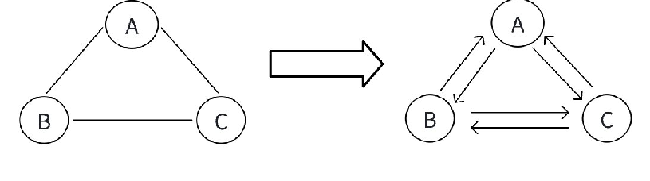
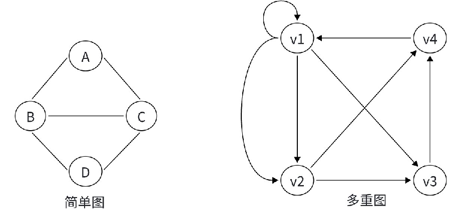

# 图的定义

图是较线性表和树更为复杂的数据结构。

- 线性表中，除第一个和最后一个元素外，每个元素只有一个唯一的前驱和唯一的后继结点，元素和元素之间是一对一的关系；
- 在树形结构中，数据元素之间有着明显的层次关系，每个元素有唯一的双亲，但可能有多个孩子，元素和元素之间是一对多的关系；
- 而图形结构中，元素和元素之间的关系更加复杂，结点和结点之间的**关系是任意**的，任意两个结点之间都可能相关，图中元素和元素之间是多对多的关系。

图 $G$ 是由顶点集 $V$ 和边集 $E$ 组成，记为 $G = (V, E)$，其中 $V(G)$ 表示图 $G$ 中顶点的有限非空集；$E(G)$ 表示图 $G$ 中顶点之间的关系（边）集合。

若 $V = \{v_1, v_2, \ldots, v_n\}$，则用 $|V|$ 表示图 $G$ 中顶点的个数，也称图 $G$ 的阶，$E = \{(u, v)| u \in V, v \in V\}$，用 $|E|$ 表示图 $G$ 中边的条数。

例如柯南的关系网：


但一般的图结构是结点和边：


# 图的类型

## 无向图和有向图

图根据边的类型，可以分为**无向图和有向图**。


其中无向图的边可以看成2条方向相反的有向边，这可以将无向图转换成有向图。



## 简单图与多重图

自环：自己指向自己的一条边。  


重边: 图中存在两个或两个以上完全相同的边。  


简单图：若图中没有重边和自环，为简单图。  

多重图：若图中存在重边或自环，为多重图。  


## 稠密图和稀疏图

有很少条边（如 $e < n \log_2 n$）的图称为稀疏图，反之称为稠密图。


# 图的相关概念

和[树概念及结构](https://blog.csdn.net/m0_73693552/article/details/143655251)一样，这个数据结构的概念多，而且繁琐。

## 顶点的度

顶点 $v$ 的度是指与它相**关联的边的条数**，记作 $\deg(v)$（不同的资料记法不同）。**由该顶点发出**的边称为顶点的**出度**，**到达该顶点**的边称为顶点的**入度**。

- 无向图中，顶点的度等于该顶点的入度($\text{indeg}(v)$)和出度($\text{outdeg}(v)$)，即 $\deg(v) = \text{indeg}(v) = \text{outdeg}(v)$。
- 有向图中，顶点的度等于该顶点的入度与出度之和，其中顶点 $v$ 的入度 $\text{indeg}(v)$ 是以 $v$ 为终点的有向边的条数，顶点 $v$ 的出度 $\text{outdeg}(v)$ 是以 $v$ 为起始点的有向边的条数，$\deg(v) = \text{indeg}(v) + \text{outdeg}(v)$。


## 路径

在图 $G= (V, E)$ 中，若从顶点 $v_i$ 出发，沿一些边经过某些顶点 $v_{p1}, v_{p2}, \dots, v_{pm}$，到达顶点 $v_j$，则称顶点序列 $(v_i, v_{p1}, v_{p2}, \dots, v_{pm}, v_j)$ 为从顶点 $v_i$ 到顶点 $v_j$ 的路径。


注意: 两个顶点间的路径可能不唯一。

## 简单路径与回路

若路径上各顶点 $v_1, v_2, v_3, \dots, v_m$ 均不重复，则称这样的路径为简单路径。若路径上第一个顶点 $v_1$ 和最后一个顶点 $v_m$ 相同，则称这样的路径为回路或环。


## 带权路径长度

某些图的边具有**与边相关的数值**，称其为该边的权值。这些权值可以表示两个顶点间的距离、花费的代价、所需的时间等。一般将该种带权图称为网络。

这些数值一般具有某种抽象含义，因此可能为负数。


对于不带权的图，一条路径的路径长度是指该路径上的边的条数。  
对于带权的图，一条路径的路径长度是指该路径上各个边权值的总和。


## 子图

设图 $G = \{V, E\}$ 和图 $G' = \{V', E'\}$，若 $V' \subseteq V$ 且 $E' \subseteq E$，则称 $G'$ 是 $G$ 的子图。若有 $V(G') = V(G)$ 的子图 $G'$，则称 $G'$ 为 $G$ 的生成子图。

相当于就是在原来图的基础上，拿出来一些顶点和边，组成一个新的图。但是要注意，拿出来的点和边要能构成一个图才行。


$G1_1$ 和 $G1_2$ 为无向图 $G1$ 的子图，$G1_1$ 为 $G1$ 的生成子图。  
$G2_1$ 和 $G2_2$ 为有向图 $G2$ 的子图，$G2_1$ 为 $G2$ 的生成子图。

## 连通图与连通分量

在无向图中，若从顶点 $v_1$ 到顶点 $v_2$ 有路径，则称顶点 $v_1$ 与顶点 $v_2$ 是连通的。如果图 $G$ 中任意一对顶点都是连通的，则图 $G$ 称为连通图，否则称为非连通图。

- 假设一个图有 $n$ 个顶点，如果边数小于 $n-1$，那么此图一定是非连通图。  
- 极大连通子图：无向图中，拿出一个子图，这个子图包含尽可能多的点和边。  
- 连通分量：无向图中的极大连通子图称为连通分量。


# 图的存储

图的存储有两种：邻接矩阵和邻接表：

- 其中，邻接表的存储方式与**树的孩子表示法完全**一样。因此，用 `vector` 数组以及**链式前向量**就能实现。
- 而**邻接矩阵**就是用一个二维数组，其中 $ \text{edges}[i][j] $ 存储顶点 $ i $ 与顶点 $ j $ 之间，边的信息。

图的遍历分两种：DFS 和 BFS，和树的遍历方式以及实现方式完全一样。

## 邻接矩阵

邻接矩阵，指用一个矩阵（即二维数组）存储图中的信息（即各个顶点之间的邻接关系），存储顶点之间邻接关系的矩阵称为邻接矩阵。

对于带权图而言，若顶点 $ v_i $ 和 $ v_j $ 之间有边相连，则邻接矩阵中对应项存放着该边对应的权值，若顶点 $ v_i $ 和 $ v_j $ 不相连，则用 $ \infty $ 来代表这两个顶点之间不存在边。

对于不带权的图，可以创建一个二维的 `bool` 类型的数组，来标记顶点 $ v_i $ 和 $ v_j $ 之间有边相连。


矩阵中元素个数为 $n\times n$，即空间复杂度为 $O(n^2)$ ， $n$ 为顶点个数，和实际边的条数无关，**适合存储稠密图**。

```cpp
void get_pct(vector<vector<int>>&edges) {
	int n, m;
	cin >> n >> m; // 读⼊结点个数以及边的个数
	edges.resize(n + 1, vector<int>(m + 1));
	for (int i = 1; i <= m; i++) {
		int a, b, c; cin >> a >> b >> c;
		// a - b 有一条边，权值为 c
		edges[a][b] = c;
		// 如果是⽆向边，需要反过来再存⼀下
		edges[b][a] = c;
	}
}

```

## vector数组

和树的存储一模一样，只不过如果存在边权的话，`vector` 数组里面放一个结构体或者是 `pair` 即可。

```cpp
void get_pct(vector<vector<pair<int,int>>>& edges) {
	int n, m;
	cin >> n >> m; // 读⼊结点个数以及边的个数
	edges.resize(n + 1);
	for (int i = 1; i <= m; i++)
	{
		int a, b, c; cin >> a >> b >> c;
		// a - b 有一条边，权值为 c
		edges[a].push_back({ b, c });

		// 如果是⽆向边，需要反过来再存⼀下
		edges[b].push_back({ a, c });
	}
}
```

## 链式前向星（量）

链式前向量和链式前向星是**同一种数据结构的不同名称**，它们指的是同一种高效存储图（尤其适用于稀疏图）的方法。

和树的存储⼀模⼀样，只不过如果存在边权的话，我们多创建⼀维数组，⽤来存储边的权值即可。

```cpp
const int N = 1e5 + 10;
// 链式前向星
int h[N], 
e[N * 2], 
ne[N * 2], 
w[N * 2], id;
int n, m;
// 其实就是把 b 头插到 a 所在的链表后⾯
void add(int a, int b, int c) {
	id++;//申请空间
	e[id] = b;
	w[id] = c; // 多存⼀个权值信息
	ne[id] = h[a];
	h[a] = id;
}
int main()
{
	cin >> n >> m; // 读⼊结点个数以及边的个数
	for (int i = 1; i <= m; i++) {
		int a, b, c; cin >> a >> b >> c;
		// a 和 b 之间有⼀条边，权值为 c
		add(a, b, c); add(b, a, c);
	}
	return 0;
}
```

# 图的遍历

## 邻接矩阵dfs和bfs


## 邻接表dfs和bfs


## 链式前向星dfs和bfs
