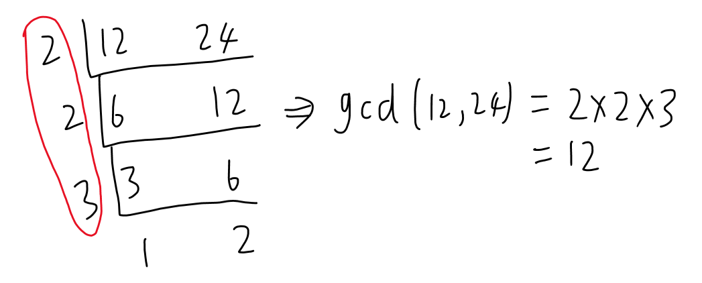

# 约数和倍数
如果 $a$ 除以 $b$ 没有余数，那么 $a$ 就是 $b$ 的倍数，$b$ 就是 $a$ 的约数，记作 $b|a$。  约数在其他地方也称因数。

对于一个整数 $x$，若 $d$ 是 $x$ 的约数，那么 $\frac{x}{d}$ 也是 $x$ 的约数。也就是说，除了完全平方数，约数都是成对出现的。因此，可以用试除法求一个整数的所有约数。

## 试除法求单个数的约数

枚举 $1 \sim \sqrt{x}$ 之间的整数，判断是否能整除 $x$。

试除法也能求出一个整数的约数个数以及约数总和。

试除法参考：

```cpp
void get_d(int x, vector<int>&ans){
    for(int i=1;i<=x/i;i++){//枚举1到sqrt(x)
        if(x%i==0){
            ans.push_back(i);
            if(i!=x/i)
                ans.push(x/i);
        }
    }
}
```

时间复杂度：

- 枚举到 $\sqrt{n}$，因此时间复杂度为 $O(\sqrt{N})$。

因此，一个整数 $n$ 的约数个数的上限为 $2\sqrt{n}$。

## 求每个数的约数集合

如果用试除法分别求每一个数的约数，时间复杂度过高（$O(n\sqrt{n})$）。

可以反过来想，对于每个数 $d$，$[1,n]$ 中以 $d$ 为约数的数就是 $d$ 的倍数，也就是 $d, 2d, 3d...\frac{n}{d}d$。因此可以用倍数法求出 $[1,n]$ 每个数的约数集合。

```cpp
int n;
void get_d(vector<int>&d){
    for (int i = 1; i <= n; i++) // 枚举所有约数
        for (int j = 1; j <= n / i; j++) // 约数的倍数
            d[i * j].push_back(i);
}
```

时间复杂度：

$n$ 倍的调和数，约为$O(n\log n)$。

第1层循环$i=\{1,2,3,\cdots,n\}$时，第2层循环$j$分别是$\{n,\frac{n}{2},\frac{n}{3},\cdots,1\}$，所以循环总的运行次数是$n(1+\frac{1}{2}+\frac{1}{3}+\cdots+\frac{1}{n})$，括号内是个调和级数，当$n$比较大时，大致等于$\ln n+\gamma$，$\gamma\approx 0.5772$是欧拉 - 马歇罗尼常数。所以总的时间复杂度$O(n(\ln n+\gamma))$，近似为$O(n\log n)$。

## 唯一分解定理

**算术基本定理**又称**唯一分解定理**：

- 任何一个大于 $1$ 的自然数 $n$，都可以唯一分解成有限个质数的乘积。
   $$ n = p_1^{\alpha_1} \times p_2^{\alpha_2} \times p_3^{\alpha_3} \ldots \times p_k^{\alpha_k}$$
- 这里 $p_1 < p_2 < p_3 < \ldots < p_k$ 均为质数，其中指数 $\alpha_i$ 是正整数。这样的分解称为 $n$ 的标准分解式。
- 求解质数详细见[数论——质数和合数及求质数-CSDN博客](https://blog.csdn.net/m0_73693552/article/details/148370107?spm=1001.2014.3001.5501)。

### 分解质因数

分解质因数就是将一个合数用质因数相乘的形式表示出来，例如 $360 = 2^3 \times 3^2 \times 5^1$。

试除法分解质因数：$n$ 的所有因数中，不会有两个大于 $\sqrt{n}$。

因此，枚举 $[2, \sqrt{n}]$ 中所有的数，如果能整除 $n$ 就一直除下去。如果最后剩下的数大于 $1$，那就是大于 $\sqrt{n}$ 的因子。

小优化：如果我们提前打出来一个素数表，枚举所有素数的话，时间复杂度能进一步降低。但求指定范围内的素数本身就消耗时间，在数据量小时直接枚举 $[2, \sqrt{n}]$ 会更合适。

```cpp
void deprime(int x,vector<int>&ans){
    for(int i=2;i<=x/i;i++){//枚举到sqrt(x)，这里也可以枚举质数
        int cnt=0;
        while(x%i==0){
            x/=i;
            ++cnt;
        }
        ans[i]+=cnt;
    }
    if(x>1)//有可能它本身就是质数或分解到最后变成质数
        ans[x]++;
}
```

### 分解阶乘的质因数

[P2043 质因子分解 - 洛谷](https://www.luogu.com.cn/problem/P2043)

先求阶乘再分解不现实，但可以依次分解$N!$的每一项，统计次数即可。这题数据量比较小可以直接枚举，但[P10495 阶乘分解 - 洛谷](https://www.luogu.com.cn/problem/P10495)就需要先筛选出质数再分解。

```cpp
#include<bits/stdc++.h>
using namespace std;

void ac() {
    int N; cin >> N;
    vector<int>num(N + 1, 0);
    
    //基于唯一分解定理的试除法
    for (int i = 2; i <= N; i++) {
        int x = i;
        for (int j = 2; j <= i / j; j++) {
            int cnt = 0;
            while (x % j == 0) {
                x /= j;
                ++cnt;
            }
            num[j] += cnt;
        }
        if (x > 1)
            num[x]++;
    }
    for (int i = 2; i <= N; i++) {
        if (num[i])
            cout << i << ' ' << num[i] << '\n';
    }
}

int main() {
    int T=1;
    //cin >> T;
    while (T--)
        ac();
    return 0;
}
```

[P10495 阶乘分解 - 洛谷](https://www.luogu.com.cn/problem/P10495)

先求质数，再用质数分解阶乘，否则最后一个样例会超时。

还有一种正难则反的思路：对每个质数或这个质数的若干次幂，统计有多少个数包含它。

例如$n=10$，对质数2，$\lfloor\frac{10}{2}\rfloor=5$，$\lfloor\frac{10}{2^2}\rfloor=2$，$\lfloor\frac{10}{2^3}\rfloor=1$，所以$10!$的质因数次幂之一是$2^8$。这种方法可以理解为以$2^x$个数为一组，其中必定有1个数是$2^x$乘多少得到的合数。

例如`{1,2,3,4}`，`{5,6,7,8}`，都至少有2个是$2^2$乘谁构成的合数，正好等于$\lfloor\frac{10}{2^{2}}\rfloor$。

```cpp
#include<bits/stdc++.h>
using namespace std;

vector<int>p;
vector<bool>vis(1e6 + 1, 0);

//欧拉筛
void prim() {
    int n = 1e6;
    for (int i = 2; i <= n; i++) {
        if (!vis[i])
            p.push_back(i);
        for (size_t j = 0; 1ull * i * p[j] <= n; j++) {
            vis[i * p[j]] = 1;
            if (i % p[j] == 0)
                break;
        }
    }
}

//优化唯一分解定理
void ac() {
    int N; cin >> N;
    vector<int>num(N + 1, 0);
    for (int i = 2; i <= N; i++) {
        int x = i;
        for (int j = 0; p[j] * p[j] <= x; j++) {//质数的平方不能超过x
            int cnt = 0;
            while (x % p[j] == 0) {
                x /= p[j];
                ++cnt;
            }
            num[p[j]] += cnt;
        }
        if (x > 1)
            num[x]++;
    }
    for (size_t i = 2; i < num.size(); i++)
        if (num[i])
            cout << i << ' ' << num[i] << '\n';
}

//正难则反
typedef unsigned long long ULL;
void ac2() {
    int N; cin >> N;
    for (size_t i = 0, cnt; i < p.size() && p[i] <= N; i++) {//枚举质数
        cnt = 0;
        for (ULL j = p[i]; j <= N; j *= p[i])//枚举质数次幂
            cnt += N / j;
        cout << p[i] << ' ' << cnt << endl;
    }
}

int main() {
    int T = 1;
    prim();
    //cin >> T;
    while (T--)
        //ac();//优化唯一分解定理
        ac2();//正难则反
    return 0;
}
```


## 约数个数定理和约数和定理

> 这2个定理最常用的是结合质数筛（欧拉筛）配合积性函数，打表约数个数以及约数和，整体时间复杂度是$O(n)$。

### 约数个数定理

由唯一分解定理得：$n = p_1^{\alpha_1} \times p_2^{\alpha_2} \times p_3^{\alpha_3} \ldots \times p_k^{\alpha_k}$。

若用 $d$ 表示某一个数约数的个数，那么有：
$d(n) = (\alpha_1 + 1)(\alpha_2 + 1)\cdots(\alpha_n + 1)=\prod_{i=1}^k (\alpha_i + 1)$。

即每个质因数幂都有$\{0,1,2,\cdots,\alpha_i\}$这$\alpha_i+1$种情况，根据乘法原理一共有$\prod_{i=1}^k (\alpha_i + 1)$种情况。

例如12的约数`{1,2,3,4,6,12}`，且$12=2^{2}\times 3$，约数个数正好是$(2+1)(1+1)=6$。

所以试除法**求单个数的约数个数**：

- 第一种方式：枚举 $1 \sim \sqrt{x}$ 之间的整数，看哪些数能被$x$整除。
- 第二种方式：在借助唯一分解定理分解质因数的过程中，利用约数个数定理的公式可以直接计算出某个数的约数个数。

### 约数和定理

由唯一分解定理得：$n = p_1^{\alpha_1} \times p_2^{\alpha_2} \times p_3^{\alpha_3} \ldots \times p_k^{\alpha_k}$。

若用 $f$ 表示某一个数约数和，那么有：$f(n) = \prod_{i=1}^k \sum_{j=0}^{\alpha_i} p_i^{j}$。

例如$12=2^{2}\times 3$，$f(12)=(2^0+2^1+2^2)(1+3^1)=28$。

所以试除法**求单个数的约数之和**。

- 第一种方式：枚举 $1 \sim \sqrt{x}$ 之间的整数，将能被$x$整除的约数加起来。

例如$1+12+2+6+3+4=28$。

- 第二种方式：在借助唯一分解定理分解质因数的过程中，利用约束和定理的公式可以直接计算出某个数的约数总数。


## 约数有关OJ枚举

分解阶乘的质因数：

1. [P2043 质因子分解 - 洛谷](https://www.luogu.com.cn/problem/P2043)
2. [P10495 阶乘分解 - 洛谷](https://www.luogu.com.cn/problem/P10495)

上文有描述，这里不再重复。

### 求一个数的约数之和

[约数之和](https://ac.nowcoder.com/acm/problem/22196)

1. 试除法枚举。
2. 约数和定理。

```cpp
#include<bits/stdc++.h>
using namespace std;

typedef long long LL;
void ac() {//试除法枚举
    LL n;
    cin >> n;
    LL sum = 0;
    for (LL i = 1; i <= n / i; i += 1) {
        if (n % i == 0) {
            sum += i;
            if (i != n / i)
                sum += n / i;
        }
    }
    cout << sum;
}

void ac2() {//约数和定理
    LL n; cin >> n;
    vector<int>p(n + 1, 0);
    //分解质因数
    for (LL i = 2; i <= n / i; i += 1) {
        int cnt = 0;
        while (n % i == 0) {
            ++cnt;
            n /= i;
        }
        p[i] += cnt;
    }
    if (n > 1)
        p[n]++;

    //约数和定理
    LL sum = 0,ans=1;
    for (int i = 2,pp=0; i <= n;i++) {
        if (p[i]) {
            pp = i;
            sum += 1;//0次方
            for (int j = 1; j <= p[i]; j++) {
                sum += pp;
                pp *= i;
            }
            ans *= sum;
            sum = 0;
        }
    }
    cout << ans;
}

int main() {
    int T = 1;
    //cin >> T;
    while (T--)
        //ac();
        ac2();
    return 0;
}
```

### 求1到n的所有数的约数个数之和

[约数个数的和](https://ac.nowcoder.com/acm/problem/14682)

这题数据量很大（$10^8$），开数组很容易内存超限。

但可以通过正难则反的思想投机取巧：对每个数$x$，在$[1,n]$中，可以分成$\frac{n}{x}$组，每组有1个数，它的约数之一是$x$。

举个例子，$n=20$，$x=5$，此时$[1,20]$可分成4组：`{1,2,3,4,5}`、`{6,7,8,9,10}`、`{11,12,13,14,15}`和`{16,17,18,19,20}`，其中`{5,10,15,20}`的约数都有1个5，正好是4个。

所以这题要求的约数个数之和是$\Sigma_{i=1}^{n}\frac{n}{i}$。

```cpp
#include<bits/stdc++.h>
using namespace std;

void ac() {
    int n; cin >> n;
    int cnt = 0;
    for (int i = 1; i <= n / 2; i++) {
        cnt += n / i;
    }
    //后半部分的n/i全是1，直接除不划算，所以直接通过公式求和即可
    cout << cnt + n - n / 2;
}

int main() {
    int T = 1;
    //cin >> T;
    while (T--)
        ac();
    return 0;
}
```

# 最大公约数gcd和最小公倍数lcm

这2个概念都是基于2个或2个以上的数。

【最大公约数和最小公倍数】  

最大公约数（Greatest Common Divisor），常缩写为 gcd。有的资料也称最大公因数。  

- 一组整数的公约数，是指**同时是这组数中每一个数的约数的数**。例如`{6,8,12}`的公约数有1、2。
- 一组整数的最大公约数，是指所有公约数里面最大的一个。 例如`{12,8,16}`的最大公约数是4。

最小公倍数（Least Common Multiple），常缩写为 lcm。  

- 一组整数的公倍数，是指**同时是这组数中每一个数的倍数的数**。  
- 一组整数的最小公倍数，是指所有正的公倍数里面，最小的一个数。  

求两个数的 gcd 与 lcm 时，有如下性质：  

- 对于两个数 $a$ 和 $b$，$\mathrm{gcd(a, b)} \times \mathrm{lcm(a, b)} = a \times b$。也就是最大公约数乘以最小公倍数等于两个数的乘积。  

因此，一般先求最大公约数，然后用这个性质求最小公倍数。

## 求gcd的方法

求gcd可通过模板题[B3736 [信息与未来 2018\] 最大公约数 - 洛谷](https://www.luogu.com.cn/problem/B3736)进行验证。

### 短除法

这是最古老的求 gcd 的方法。原理是枚举$a$ 、$b$ 可能的公约数并不断缩小$a$ 、$b$ 的值，当$a$ 、$b$ 再无法枚举公约数时，将所有枚举过的公约数和最后的$a$ 、$b$ 作乘，即为$\mathrm{gcd(a,b)}$。



这个方法一般不用代码实现，更多用于平时验算时使用。

### 欧几里得算法

> 在数论里很重要的3个算法：[快速幂算法](https://blog.csdn.net/m0_73693552/article/details/145602911)，欧几里得算法，（[质数](https://blog.csdn.net/m0_73693552/article/details/148370107)的）线性筛算法。这3个算法算是数论中很基础的算法，应用会非常多。

欧几里得算法也称**辗转相除法**，可以求出两个整数的最大公约数。

算法流程：

设 $a > b$：

- 如果 $b$ 是 $a$ 的约数，那么 $b$ 就是两者的最大公约数。
- 如果 $b$ 不是 $a$ 的约数，那么 $\mathrm{gcd}(a, b) = \mathrm{gcd}(b, a \bmod b)$。

因为 $a \bmod b$ 会不断减小，因此可以用递归或循环进行求解。

例如求$\mathrm{gcd}(8,14)$：
$\mathrm{gcd}(8,14)\rightarrow \mathrm{gcd}(14,8)\rightarrow \mathrm{gcd}(8,6)\rightarrow \mathrm{gcd}(6,2)\rightarrow \mathrm{gcd}(2,0)\rightarrow 2$。

非递归算法实现：

```cpp
int gcd(int a, int b) {//int可更换成long long或__int128
    int r = a % b;
    while (r) {//当r为0时，说明此时的b是最开始的a和b的约数
        a = b;
        b = r;
        r = a % b;
    }
    return b;
}
```

递归算法实现：

```cpp
int gcd(int a,int b){
    return b ? gcd(b, a % b) : a;
}
```

证明这个算法的正确性，只需证明$\mathrm{gcd}(a, b) = \mathrm{gcd}(b, a \bmod b)$即可：

首先是证明这个结论：$d|a$，$d|b$可得$d|(ax+by)$。例如$2|12$，$2|10$，$2|(12x+10y)\rightarrow 2\times (6x+10y)$，无论$x$、$y$有多大，$ax$和$by$都能提取出约数$d$。

$d|(ax+by)=d|(\frac{a}{d}x+\frac{b}{d}y)$。这个等式后续用于证明欧几里得算法。

已知 $a\%b=c$ 即 $a\div b=k\cdots c$。所以$kb+c=a$，$c=a-kb(k=\frac{a}{b})$。

因此$\mathrm{gcd}(b, a \bmod b)=\mathrm{gcd}(b, a-kb)=d$，

证明$\mathrm{gcd}(a, b) = \mathrm{gcd}(b, a \bmod b)$，先证明左边等于右边：

假设$\mathrm{gcd}(a,b)=d$，则$\mathrm{gcd}(a,b)\rightarrow d|a,\ d|b\rightarrow \ d|(1a-kb)$，
因$d|(a-1kb)$，故$d|b,\ d|a\bmod b$，因此$\mathrm{gcd}(a,b)\rightarrow \mathrm{gcd}(b,a\bmod b)$。

后证明右边等于左边：

$d|b,\ d|(a-kb)\rightarrow d|(kb+a-kb)=d|a$，
所以$d|b,\ d|(a-kb)=d|b, d|a\rightarrow \mathrm{gcd}(b,a\bmod b)=\mathrm{gcd}(a,b)$。

证明完毕。

这个算法的时间复杂度是$O(\log \min(a,b))$。

[B3736 [信息与未来 2018\] 最大公约数 - 洛谷](https://www.luogu.com.cn/problem/B3736)参考程序：

```cpp
#include<bits/stdc++.h>
using namespace std;

int gcd(int a, int b) {//int可更换成long long或__int128
    int r = a % b;
    while (r) {//当r为0时，说明b是a的约数
        a = b;
        b = r;
        r = a % b;
    }
    return b;
}

int main() {
    int a, b, c;
    cin >> a >> b >> c;
	cout << gcd(gcd(a,b), c);
	return 0;
}
```

还有一种更相减损术，但平时用的不是很多，这里就不举例。

### 秦九韶算法优化求模运算

[小红的 gcd](https://ac.nowcoder.com/acm/problem/275615)

这个题要求gcd的数，长度太大无法使用c语言自带的数据结构去存储，因此需要用字符串去存储，也就是说要通过高精度计算去求gcd。

但用传统的欧几里得算法，在这个题会超时。

**秦九韶算法**是一种将一元 $n$ 次多项式的求值问题转化为 $n$ 个一次式的算法。其大大简化了计算过程，即使在现代，利用计算机解决多项式的求值问题时，秦九韶算法依然是最优的算法（不知道现在是否有更好的算法）。

一个 $n$ 次多项式：
$$f(x) = a_n x^n + a_{n-1} x^{n-1} + a_{n-2} x^{n-2} + \cdots + a_1 x^1 + a_0 x^0$$
可以改写成：

$$f(x) = (a_n x^{n-1} + a_{n-1} x^{n-2} + a_{n-2} x^{n-3} + \cdots + a_1)x + a_0 \\
= ((a_n x^{n-2} + a_{n-1} x^{n-3} + a_{n-2} x^{n-4} + \cdots + a_2)x + a_1)x + a_0 \\
\quad \cdot \\
\quad \cdot \\
\quad \cdot \\
= (\cdot((a_n x + a_{n-1})x + a_{n-2})x + \cdots + a_2)x + a_1)x + a_0$$

例如：对于一个整数 987654321，可以拆成：
$$((((((9 \times 10 + 8) \times 10 + 7) \times 10 + 6) \times 10 + 5) \times 10 + 4) \times 10 + 3) \times 10 + 2) \times 10 + 1$$

这个算法可以在$O(n)$的时间复杂度内求一元 $n$ 次多项式的值。

对于高精度的数取模，就可以分阶段取模。因为方程只涉及加法和乘法，所以可以在计算一个括号内的值时顺便取模。例如$x=((9\times 10)+8)\bmod M$，这个值可以直接参与后续的运算：$(10x+7)\bmod M$等。

对[小红的 gcd](https://ac.nowcoder.com/acm/problem/275615)需要秦九韶算法配合欧几里得算法来求。

```cpp
#include<bits/stdc++.h>
using namespace std;
typedef long long LL;

LL gcd(string& aa, LL b) {
	LL a = 0,r=0;
	for (auto& x : aa) {//先通过秦九韶算法求aa%b
		a = a * 10 + x - '0';
		a %= b;
	}
    //然后就是一般的欧几里得算法
	r = a % b;
	while (r) {
		a = b; b = r; r = a % b;
	}
	return b;
}

int main() {
	string a;
	LL b;
	cin >> a >> b;
	cout << gcd(a, b);
	return 0;
}
```

### 二进制算法

因为高精度除法（取模）不容易实现，需要做高精度运算时，可以考虑用二进制算法。

若 $a = b$，$\text{gcd}(a, b) = a$；否则，分情况讨论：

1. $a$ 和 $b$ 均为偶数，$\text{gcd}(a, b) = 2 \times \text{gcd}(a/2, b/2)$；

2. $a$ 为偶数$b$ 为奇数，$\text{gcd}(a, b) = \text{gcd}(a/2, b)$；
3. $a$ 为奇数$b$ 为偶数，$\text{gcd}(a, b) = \text{gcd}(a, b/2)$；

3. $a$ 和 $b$ 均为奇数，$\text{gcd}(a, b) = \text{gcd}(\text{abs}(a - b), \text{min}(a,b))$。
4. $b=0$，则$a$是最终解。$a=0$，则$b$是最终解。

循环实现：

```cpp
int gcd2(int a, int b) {//int 可换成别的大整数类
    int ans = 1;
    while (a > 0 && b > 0) {
        if (a % 2 == 0 && b % 2 == 0) {
            ans *= 2;
            a /= 2;
            b /= 2;
        }
        else if (a % 2 == 0)
            a /= 2;
        else if (b % 2 == 0)
            b /= 2;
        else if (a > b)
            a -= b;
        else
            b -= a;
    }
    return ans * (a <= 0 ? b : a);
}
```

递归实现：

```cpp
int gcd(int a, int b) {
    if (a <= 0)//终止条件
        return b;
    if (b <= 0)
        return a;
    if (a % 2 == 0 && b % 2 == 0)
        return 2 * gcd(a / 2, b / 2);
    else if (a % 2 == 0)
        return gcd(a / 2, b);
    else if (b % 2 == 0)
        return gcd(a, b / 2);
    else
        return a > b ? gcd(a - b, b) : gcd(b - a, a);//避免负数问题
}
```

但绝大部分情况是数据量偏小，而且二进制并不好处理2个数互质的情况，因此一般不用。


### 唯一分解定理求gcd和lcm

> 唯一分解定理还在追我(bushi)。

#### 唯一分解定理求gcd

可以先分解2个因数，再求gcd。

即求$\mathrm{gcd}(a,b)$，可以先根据唯一分解定理将$a$、$b$分解：

$a=p_1^{\alpha_1} \times p_2^{\alpha_2} \times p_3^{\alpha_3} \ldots \times p_k^{\alpha_k}$

$b=p_1^{\beta_1} \times p_2^{\beta_2} \times p_3^{\beta_3} \ldots \times p_k^{\beta_k}$

则$\gcd(a,b)=p_1^{\min(\alpha_1,\beta_1)}\times p_2^{\min(\alpha_2,\beta_2)}\times\cdots \times p_k^{\min(\alpha_k,\beta_k)}$。

例如$\mathrm{gcd}(18,12)=2^{\mathrm{min}(1,2)}\times 3^{\mathrm{min}(2,1)}=2\times 3=6$。

这个公式可以这样理解：$\mathrm{gcd}(a,b)$是能同时被$a$、$b$整除的最大整数，所以$\mathrm{gcd}(a,b)$必须包含$a$、$b$公有的质因数也就是$p_i^x$。

取最小值是因为若$x>\alpha_1$，则最后的$\mathrm{gcd}(a,b)$不能被$a$整除，同理若$x>\beta_1$，则最后的$\mathrm{gcd}(a,b)$不能被$b$整除。

这个公式还能推广到若干个数的情况：

$$\mathrm{gcd}(a_1,a_2,\ldots,a_n)=\prod_p p_i^{\min(\alpha_1,\alpha_2,\ldots,\alpha_n)}$$。

例如$\mathrm{gcd}(24,36,60)$，根据唯一分解定理，

$24=2^3\times 3^1$，

$36=2^2\times 3^2$，

$60=2^2\times 3^1\times 5^1$，

所以$\mathrm{gcd}(24,36,60)=2^{\mathrm{min}(3,2,2)}\times 3^{\mathrm{min}(1,2,1)}\times 5^{\mathrm{min}(0,0,1)}=2^2\times 3^1\times 5^0=12$。

#### 唯一分解定理求lcm

即求$\mathrm{lcm(a,b)}$，可以先根据唯一分解定理将$a$、$b$分解：

$a=p_1^{\alpha_1} \times p_2^{\alpha_2} \times p_3^{\alpha_3} \ldots \times p_k^{\alpha_k}$

$b=p_1^{\beta_1} \times p_2^{\beta_2} \times p_3^{\beta_3} \ldots \times p_k^{\beta_k}$

则$\mathrm{lcm(a,b)}=p_1^{\max(\alpha_1,\beta_1)}\times p_2^{\max(\alpha_2,\beta_2)}\times\cdots \times p_k^{\max(\alpha_k,\beta_k)}$。

例如$\mathrm{lcm(12,18)}=2^{\mathrm{max}(1,2)}\times 3^{\mathrm{max}(2,1)}=2^2\times 3^9=36$。

这个公式可以这样理解：$\mathrm{lcm(a,b)}$是能同时$a$、$b$被整除的最小整数，所以$\mathrm{lcm(a,b)}$必须包含$a$、$b$公有的质因数也就是$p_i^x$。

当$x$比$\alpha_i$、$\beta_i$都小时，$\mathrm{lcm(a,b)}$就不能被$a$、$b$整除，因此取$\mathrm{max}$。

这个公式同样能推广：

$$\mathrm{lcm}(a_1,a_2,\ldots,a_n)=\prod_p p_i^{\max(\alpha_1,\alpha_2,\ldots,\alpha_n)}$$。

例如$\mathrm{lcm(8,12,15)}=2^{\mathrm{max(3,2,0)}}\times 3^{\mathrm{max(0,1,1)}}\times5^{\mathrm{max(0,0,1)}}=2^3\times 3^1\times 5^1=120$。

## 求gcd或lcm相关OJ

模板题：[B3736 [信息与未来 2018\] 最大公约数 - 洛谷](https://www.luogu.com.cn/problem/B3736)

秦九韶算法优化：[小红的 gcd](https://ac.nowcoder.com/acm/problem/275615)

这2个在上文有说明，这里不再重复。

### 蓝桥真题 宝石组合

[P10426 [蓝桥杯 2024 省 B\] 宝石组合 - 洛谷](https://www.luogu.com.cn/problem/P10426)

首先是这个很唬人的公式。遇到这种公式一般都可以分解，或用于代入枚举。

$S = H_aH_bH_c \cdot \frac{\mathrm{LCM}(H_a,H_b,H_c)}{\mathrm{LCM}(H_a,H_b) \cdot \mathrm{LCM}(H_a,H_c) \cdot \mathrm{LCM}(H_b,H_c)}$

根据唯一分解定理得到：

$H_a=\prod_{p}p_i^{a_i}$，$H_b=\prod_{p}p_i^{b_i}$，$H_c=\prod_{p}p_i^{c_i}$，

配合唯一分解定理推导的$\text{gcd}$和$\text{lcm}$的公式，得：

$$S=\prod_{p}p_i^{a_i+b_i+c_i+\mathrm{max(a_i,b_i,c_i)}-\mathrm{max(a_i,b_i)}-\mathrm{max(a_i,c_i)}-\mathrm{max(b_i,c_i)}}$$，这里$a_i$、$b_i$、$c_i$分别表示质因数$p_i$的指数。

因为未知数有3个，所以这里能做的也只有假设。假设$a_i\leq b_i\leq c_i$（$a_i\geq b_i\geq c_i$也行），则$\mathrm{max(a_i,b_i,c_i)}=a_i$。

此时公式简化为$S=\prod_{p}p_i^{a_i+b_i+c_i+c_i-b_i-c_i-c_i}=\prod_{p}p_i^{a_i}=\prod_{p}p_i^{\mathrm{min(a_i,b_i,c_i)}}=\mathrm{gcd(a,b,c)}$。

因此这个题就变成了选3个宝石，这些宝石的最小公倍数最大。

所以就有了一种特别暴力的解法：创建一个二维数组`g[i]`，表示以`i`为约数的数的集合。之后枚举所有宝石的数值，根据它们的约数对号入座。最后逆向枚举所有约数，拥有3个成员的那个约数的前3个成员就是答案。

例如样例：

```
5
1 2 3 4 9
```

按照约数对号入座：

```
1:[1,2,3,4,9]
2:[2,4]
3:[3,9]
4:[4]
...
9:[9]
```

很明显只有1符合要求，因此答案就是`{1,2,3}`。

总的时间复杂度是$O(n\sqrt{n})$，总的数据量是$10^5$，程序的运行次数的数量级为$10^7$，可以在1秒内实现。

```cpp
#include<bits/stdc++.h>
using namespace std;

void ac() {
    int n;
    cin >> n;
    vector<int>a(n, 0);
    for (auto& x : a)
        cin >> x;
    sort(a.begin(), a.end());
    vector<vector<int> >g(a[a.size()-1] + 1);
    for (auto& x : a) {//对每个数，按照各自有的约数对号入座
        int sq = sqrt(x);
        for (int i = 1; i <= sq; i++) {
            if (x % i == 0) {
                g[i].push_back(x);
                if (x / i != i)
                    g[x / i].push_back(x);
            }
        }
    }
    //逆序枚举所有约数，只要找到第1个有3个以上的成员，则前3个就是答案
    for (int i = a[a.size()-1]; i > 0; i--) {
        if (g[i].size() >= 3) {
            cout << g[i][0] << ' ' << g[i][1] << ' ' << g[i][2];
            return;
        }
    }
}

int main() {
    int T = 1;
    //cin >> T;
    while (T--)
        ac();
    return 0;
}
```

