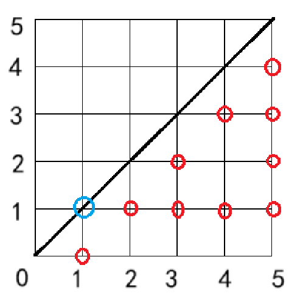
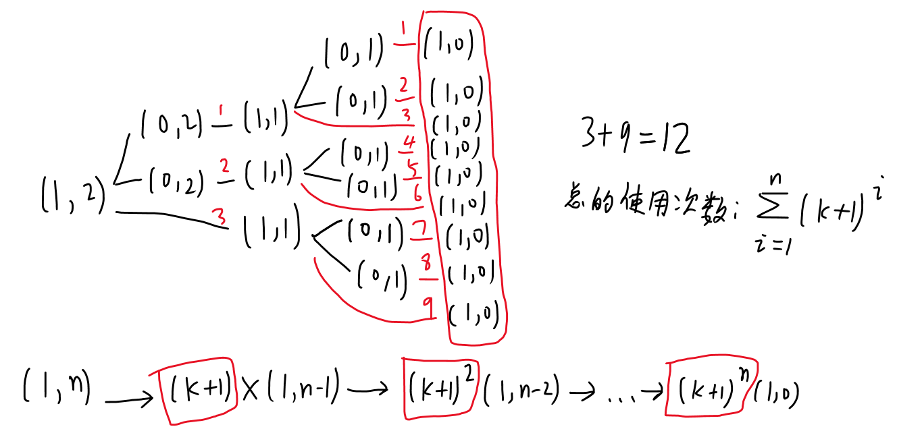
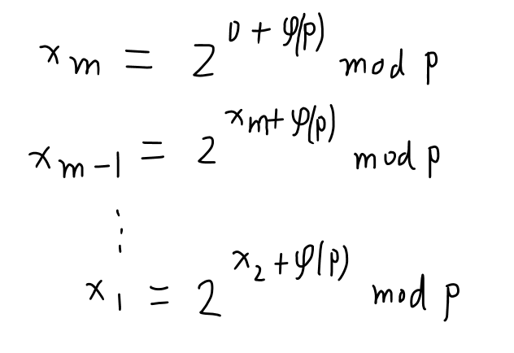
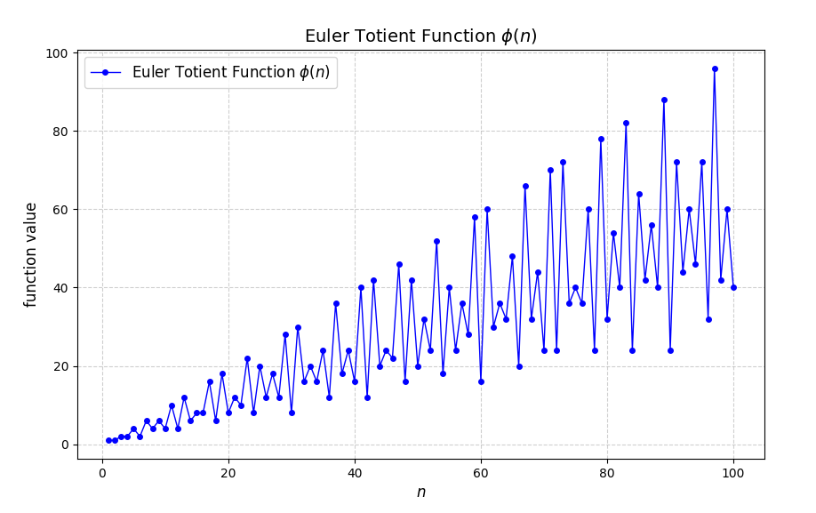

# 学习路线

学习同余相关的问题，需要先掌握[快速幂算法的原理](https://blog.csdn.net/m0_73693552/article/details/145602911)，求最大公[约数](https://blog.csdn.net/m0_73693552/article/details/148380647)（特别是欧几里得算法），以及如何求[质数](https://blog.csdn.net/m0_73693552/article/details/148370107)（特别是欧拉筛）。

之后围绕某个或某些具体问题和需求学习某个知识点。

* 想知道`[1,n]`中和$n$互质的数有多少个，需要了解**欧拉函数**的特性以及求欧拉函数值。

* 在求最大公约数时有可能遇到数值特别大（比如200位整数），除了秦九韶算法配合取模，还可以用**欧拉定理**进行欧拉降幂。学习欧拉定理还需要知道欧拉函数。

* 带除法和取模的公式（例如 $\frac{a_1(1-q^n)}{1-q}\bmod P$ ）和同余式（ $\frac{a}{b}\equiv c\pmod p$ ），因为分母不能像乘法、加法那样能先 $\%P$ ，得到的结果再 $\%P$ ，此时需要将分母转换成**乘法逆元**参与运算。
  转换的方法有**费马小定理**、**递推求逆元**和解**同余方程** $ax\equiv 1\pmod P$ 。

* （线性）同余方程的一般形式是$ax\equiv c\pmod b$，解这个方程需要转换成解**不定方程**$ax+by=c$。

  解不定方程需要了解**裴蜀定理**，配合**扩展欧几里得算法**解不定方程。

* 同余方程的未知数作为指数时称之为高次同余方程，例如$a^x\equiv b\pmod p$，解**高次同余方程**需要了解BSGS（baby step giant step）算法。

* 但有的题需要求不止一个同余方程，而是有限个同余方程组成的**同余方程组**，其中求**线性同余方程组**的公共解需要使用**中国剩余定理**。

同余问题涉及的知识点繁多，有的还具有关联性，还有很多的公式要记（这些都是数学，一些公式只需要会用即可），这里只记录我学过的部分，有的知识点没证明，后续可能会补充。其中列举的题目整体偏难，没学过对应的知识点的话很难下手，还带有复杂的分类讨论、知识嵌套。

# 欧拉函数和积性函数

> 数论从这里开始就和高中以前的数学没太大关系了。

【欧拉函数】

$a$ 与 $b$ 互质：说明 $a$ 与 $b$ 的最大公约数是 $1$。

对于一个数 $n$，在 $1 \sim n$ 中，与 $n$ 互质的数的个数，就是欧拉函数，用 $\varphi(n)$ 表示。
比如：$\varphi(1) = 1$，$\varphi(2) = 1$（2和1互质，2和2的最大公约数是2），$\varphi(3) = 2$，$\varphi(4) = 2$，$\varphi(5) = 4\ldots$

【积性函数】

若函数 $f(n)$ 满足：$f(1) = 1$，且 $f(xy) = f(x)f(y)$，$x, y \in N^*$ 都成立。则 $f(n)$ 为积性函数。例如$f(x)=x$就满足$f(ab)=f(a)f(b)$。

## 欧拉函数的性质和证明

1. 若 $p$ 为质数，则 $\varphi(p^k) = (p - 1)p^{k-1}$；
2. 欧拉函数为积性函数：$\varphi(xy) = \varphi(x)\varphi(y)$，其中 $\mathrm{gcd(x,y)} = 1$。

   > 若在数论中判断出某个概念对应的函数为积性函数，则可以用欧拉筛在$O(n)$复杂度内，将所有的函数求出。

第1个性质的证明：
> 因为质数的约数只有1和它本身，之前的所有数都和它互质。
>
> 在[数论——约数和倍数-CSDN博客](https://blog.csdn.net/m0_73693552/article/details/148380647?spm=1001.2014.3001.5501)有提到，若将`[1,n]`从1开始按照某个数`p`进行分组，其中最后一个数就是`p`的倍数。所以虽然自变量是$p^k$，但可以按照$p$个为1组进行划分，最多可分成$p^{k-1}$组，每组除了最后1个都与$p^k$互质，一共有$(p-1)p^{k-1}$个数与$p^k$互质。
>
> 例如$3^2$可划分成`[1,2,3]`、`[4,5,6]`和`[7,8,9]`，除了3、6、9，其他基本都和$3^2$互质。
>
> 其中$k\in \{1,2,\ldots\}$。

2. 欧拉函数为积性函数：$\varphi(xy) = \varphi(x)\varphi(y)$，其中 $\mathrm{gcd(x,y)} = 1$。性质证明（更推荐直接记结论）：

> 证明参考：
> 1. **中国剩余定理（CRT）**：因为 $\gcd(a,b)=1$，所以模 $ab$ 的剩余系可以唯一分解为模 $a$ 和模 $b$ 的剩余系的组合。
> 2. **互质数的性质**：一个数 $x$ 与 $ab$ 互质，当且仅当 $x$ 同时与 $a$ 和 $b$ 互质。
> 3. **计数**：在 $1$ 到 $ab$ 的范围内，与 $a$ 互质的数有 $\varphi(a)$ 个，与 $b$ 互质的数有 $\varphi(b)$ 个。由于 $a$ 和 $b$ 互质，独立选择后总共有 $\varphi(a)\varphi(b)$ 个数与 $ab$ 互质。
>
> 详细证明：
>
> 1. 构造双射：
>    - 设 $U_a = \{x \mid 1 \leq x \leq a, \gcd(x,a)=1\}$，$U_b = \{y \mid 1 \leq y \leq b, \gcd(y,b)=1\}$。
>    - 由于 $\gcd(a,b)=1$，根据中国剩余定理，存在唯一的 $z \bmod ab$ 使得：
>      $z \equiv x \bmod a, \quad z \equiv y \bmod b$.
> 2. 互质关系的保持：
>    - 若 $\gcd(z,ab)=1$，则 $\gcd(z,a)=1$ 且 $\gcd(z,b)=1$，即 $z \equiv x \in U_a$ 和 $z \equiv y \in U_b$。
>    - 反之，若 $x \in U_a$ 且 $y \in U_b$，则对应的 $z$ 满足 $\gcd(z,ab)=1$。
> 3. 计数：
>    - $U_a$ 有 $\varphi(a)$ 个元素，$U_b$ 有 $\varphi(b)$ 个元素。
>    - 由于 $(x,y)$ 的组合唯一对应一个 $z$，所以与 $ab$ 互质的数共有 $\varphi(a)\varphi(b)$ 个。
>
> 因此，$\varphi(ab) = \varphi(a)\varphi(b)$。
>
>
> 4. 举例验证
>
> - 设 $a=3$（$\varphi(3)=2$），$b=4$（$\varphi(4)=2$），$\gcd(3,4)=1$。
> - 计算 $\varphi(12)$：
>   - 与 $12$ 互质的数：$1,5,7,11$，共 $4$ 个。
>   - 验证：$\varphi(3)\varphi(4)=2 \times 2=4$，与 $\varphi(12)=4$ 一致。
>
>
> 5. 非互质情况的反例
>
> 欧拉函数不是完全积性函数。例如：
> - $a=2$（$\varphi(2)=1$），$b=4$（$\varphi(4)=2$），但 $\varphi(8)=4 \neq \varphi(2)\varphi(4)=2$。
>

## 试除法求单个欧拉函数值

计算公式：
$\varphi(n) = n \times \frac{p_1 - 1}{p_1} \times \frac{p_2 - 1}{p_2} \times \cdots \times \frac{p_k - 1}{p_k}$

推导过程：
由算术基本定理得：$n = p_1^{\alpha_1} \times p_2^{\alpha_2} \times \cdots \times p_k^{\alpha_k}$，

$\varphi(n) = \prod_{i=1}^k \varphi(p_i^{\alpha_i}) =\prod_{i=1}^k (p_i - 1)p_i^{\alpha_i-1}=\prod_{i=1}^k p_i^{\alpha_i}(1 - \frac{1}{p_i}) = n \times \prod_{i=1}^k (1 - \frac{1}{p_i})$。

代码实现：
```cpp
int phi(int x) {//试除法求欧拉函数
    int ret = x;
    for(int i = 2; i <= x / i; i++) {
        if(x % i == 0) {
            ret = ret / i * (i - 1);//不先乘，防止溢出
            while(x % i == 0)
                x /= i;
        }
    }
    if(x > 1)
        ret = ret / x * (x - 1);
    return ret;
}
```

时间复杂度：$O(\sqrt{N})$。

## 欧拉筛求欧拉函数值

> 建议先看[数论——质数和合数及求质数-CSDN博客](https://blog.csdn.net/m0_73693552/article/details/148370107?spm=1001.2014.3001.5501)，至少把欧拉筛学会。

原理：
- 质数 $i$：$\varphi(i) = i - 1$

- 合数 $x = i \times p_j$，$p_j$是质数：
  - 若 $p_j$ 整除 $i$（$i\bmod p_j=0$）：$\varphi(x) = p_j \times \varphi(i)$
  
    > $x=i\times p_j$，$i$和$x$除了多一个$p_j$，其他的质因子都是一样的。
    >
    > 所以利用试除法得到的公式：
    > $\varphi(i)=i\times \prod_{k=1}^n\frac{p_k-1}{p_k}$，
    >
    > 而$\varphi(x)=x\times \prod_{k=1}^n\frac{p_k-1}{p_k}=p_j\times i\times\prod_{k=1}^n\frac{p_k-1}{p_k}=p_j\times \varphi(i)$，
  
  - 否则：$\varphi(x) = \varphi(p)\times \varphi(i)=(p_j - 1) \times \varphi(i)$（$\text{gcd}(p,i)=1$，则欧拉函数为积性函数）。

代码实现（其实就是欧拉筛的基础上修改）：
```cpp
//欧拉筛，3个形参分别是欧拉函数表phi，质数表vis，存质数的数组p
void get_phi(vector<int>& phi, vector<bool>& vis, vector<int>& p) {
    phi[1] = 1;
    for (size_t i = 2; i < vis.size(); i++) {
        if (!vis[i]) {
            phi[i] = i - 1;//见欧拉函数的性质1，k=1的情况
            p.push_back(i);
        }
        //1ull是防止溢出
        for (size_t j = 0; 1ull * i * p[j] < vis.size(); j++) {
            vis[i * p[j]] = true;
            if (i % p[j] == 0) {
                phi[i * p[j]] = p[j] * phi[i];//见上文公式
                break;
            }
            phi[i * p[j]] = (p[j] - 1) * phi[i];//利用欧拉函数的积性函数的特性
        }
    }
}
```

时间复杂度：$O(n)$。

## 欧拉函数OJ示例

### 仪仗队 - 洛谷

[P2158 [SDOI2008\] 仪仗队 - 洛谷](https://www.luogu.com.cn/problem/P2158)

对每个人，只有横、纵坐标互质才能被左下角的人看到（严格来说正切值不重复才能被看到）。

若只看图形的一半的话会发现，除了下标为1的列，其他的列符合条件的结点数正好是欧拉函数值。



所以这题的答案是从1到$n-1$的欧拉函数值求和，乘2再加1，多加的1是因为对角线上还有1个互质的点。即$2(\Sigma_{i=1}^{n-1}\varphi(i))+1$。但要注意的是，当只有1个人时答案应该为0，因为原点默认看不见。

```cpp
#include<bits/stdc++.h>
using namespace std;

vector<int>phi,p;
vector<bool>vis;

void Euler() {//欧拉筛改装，用于求欧拉函数值
    phi[1] = 1;
    size_t n = vis.size() - 1;
    for (size_t i = 2; i <= n; i++) {
        if (!vis[i]) {
            p.push_back(i);
            phi[i] = i - 1;
        }
        for (size_t j = 0; 1ull * i * p[j] <= n; j++) {
            vis[p[j] * i] = 1;
            if (i % p[j] == 0) {
                phi[i * p[j]] = p[j] * phi[i];
                break;
            }
            phi[i * p[j]] = (p[j] - 1) * phi[i];
        }
    }
}

int main() {
    int n;
    cin >> n;
    if (n == 1) {//n=1的情况
        cout << 0;
        return 0;
    }
    phi.resize(n + 1, 0);
    vis.resize(n + 1, 0);
    Euler();
    int sum = 0;
    for (int i = 1; i < n; i++)
        sum += phi[i];
    cout << 2 * sum + 1;
    return 0;
}
```

### GCD - 洛谷

[P2568 GCD - 洛谷](https://www.luogu.com.cn/problem/P2568)

> 数学的题一般都需要根据他给的公式啥的去推导。

设$\mathrm{gcd(x,y)}=d$，根据题意，$d$是质数。

则$\mathrm{gcd(d\frac{x}{d},d\frac{y}{d})}= d\times\mathrm{gcd(\frac{x}{d},\frac{y}{d})}=d$，$\mathrm{gcd(\frac{x}{d},\frac{y}{d})}=1$。

因此$\text{gcd}(x,y)$可以拆分成$d\times\text{gcd}(\frac{x}{d},\frac{y}{d})$，之后统计满足$\mathrm{gcd(\frac{x}{d},\frac{y}{d})}=1$的数对$(\frac{x}{d},\frac{y}{d})$的数量，再枚举不同的质数，统计和质数匹配的数对的数量即可。

首先是求满足$\mathrm{gcd(\frac{x}{d},\frac{y}{d})}=1$的数对$(\frac{x}{d},\frac{y}{d})$的数量：

* $\frac{x}{d}$和$\frac{y}{d}$的可选项有$\{1,2,\dots,\frac{n}{d}\}$，且$\frac{x}{d}$固定后，$\frac{y}{d}$也随之固定。而且$(\frac{x}{d}>\frac{y}{d})$和$(\frac{x}{d}<\frac{y}{d})$是2种不同的情况，但这2种情况可通过交换$\frac{x}{d}$和$\frac{y}{d}$得到。因此可以固定$\frac{x}{d}$的值，再去找小于$\frac{x}{d}$的$\frac{y}{d}$的值并统计数量，再乘2得到所有的情况数。

* 推荐先找$\frac{x}{d}>\frac{y}{d}$这种情况，因为这种情况下可通过求欧拉函数的前缀和的方式得到。但因为是前缀和，所以对$\frac{x}{d}=1$这种情况会多统计1次，所以需要减去1。
  例如用于存储欧拉函数的前缀和数组是`psum[i]`，欧拉函数值的数组是`phi[i]`，
  则`psum[i]=psum[i-1]+phi[i]`，则在指定系数范围`[1,i]`内可选的数对数量是`2*psum[i]-1`。

```
psum[2]:2,
可选数对(1,1)(2,1)(1,2)，总的可选数量2*2-1=3
psum[3]:4,
可选数对(1,1)(2,1)(3,2)(3,1)(1,2)(2,3)(1,3)，总的可选数量2*4-1=3
```

然后就是枚举质数，将不同的质数的所有情况进行统计。因为题目要求$x$和$y$小于$n$，所以可选的数对中，系数$\frac{x}{d}$和$\frac{y}{d}$能选的最大的数值是$\lfloor\frac{n}{d}\rfloor$，因此对质数$d$，符合要求的数对数是`2*psum[n/d]-1`。

最后是参考程序。

```cpp
#include<bits/stdc++.h>
using namespace std;

int main() {
    typedef long long LL;
    int n;
    cin >> n;
    vector<LL>phi(n + 1, 0), p, psum(n + 1, 0);
    vector<bool>vis(n + 1, 0);

    //求欧拉函数值
	phi[1] = 1;
    for (size_t i = 2, N = n; i <= N; i++) {
        if (!vis[i]) {
            p.push_back(i);
            phi[i] = i - 1;
        }
        for (size_t j = 0; 1ull * i * p[j] <= n; j++) {
            vis[i * p[j]] = true;
            if (i % p[j] == 0) {
                phi[i * p[j]] = p[j] * phi[i];
                break;
            }
            phi[i * p[j]] = (p[j] - 1) * phi[i];
        }
    }
    //求欧拉函数值的前缀和
    for (int i = 1; i <= n; i++)
        psum[i] = psum[i - 1] + phi[i];

    LL cnt = 0;
    for (int i = 0; i < p.size(); i++) {
        cnt += 2 * psum[n / p[i]] - 1;
    }
    cout << cnt;
    return 0;
}
```

### 蓝桥杯 2023 国 Java B 互质

[P12216 [蓝桥杯 2023 国 Java B\] 互质 - 洛谷](https://www.luogu.com.cn/problem/P12216)

```py
MOD = 1000000007
ans = 1
for i in range(2022):
    ans = (ans*2023)%MOD

print(ans*1632%MOD)

```


# 同余式和乘法逆元

如果两个整数 $a, b$ 模 $m$ 的余数相同，则称 $a, b$ 模 $m$ 同余，记作：$a\equiv b\pmod m$。

例如：$7\equiv 4\pmod 3$（$7\%3=4\%3=1$，$7\div 3=2\dots1$）。

对$a\equiv b\pmod m$，当且仅当$m\mid (a-b)$，或存在整数$k$使$a=mk+b$。

## 同余式常用的性质

- 同加性：若 $a \equiv b\pmod m$，则 $a + c \equiv b + c\pmod m$（$c$可以为负数）
- 同乘性：若 $a \equiv b\pmod m$，则 $ac \equiv bc\pmod m$

也就是说，对于同余的两个数，执行完相同的加减乘操作后，它们两者还是同余的。
- 但是同余不满足同除性，例如$20 \equiv 2\pmod 3$，左右都除以 10，结果就不是同余的（2 和 0 分别模3，结果不同）。

若只涉及加减乘运算，我们可以边计算边取模。而存在除法的时候，不能随意取模，需要转换成乘法才能随意取模。

【其他性质】

* 自反性：$a \equiv a \pmod{m}$。
* 对称性：若 $a \equiv b \pmod{m}$，则 $b \equiv a \pmod{m}$。
* 传递性：若 $a \equiv b \pmod{m}$，且 $b \equiv c \pmod{m}$，则 $a \equiv c \pmod{m}$。

* 一般情况，$a \equiv b \pmod{m}$，$c \equiv d \pmod{m}$，则有：$ac \equiv bd \pmod{m}$。

* 同幂性：若 $a \equiv b \pmod{m}$，则 $a^n \equiv b^n \pmod{m}$。

* 若 $a \bmod p = x$，$a \bmod q = x$，其中 $p, q$ 互质，则 $a \bmod (pq) = x$。

> 证明：因为 $a \bmod p = x$，$a \bmod q = x$，其中 $p, q$ 互质，
>
> 则一定存在整数 $s, t$，使 $a = sp + x$，$a = tq + x$，所以 $sp = tq$,
>
> 则一定存在整数 $r$，使 $s = rq$,
>
> 所以：$a = rpq + x$，得出：$a \mod (pq) = x$。
>
> 但是，同余不满足同除性，即不满足 $a/n \equiv b/n \pmod{m}$。

## 乘法逆元

- 若 $a, m$ 互质，且满足同余方程 $ax \equiv 1\pmod m$，则称 $x$ 是 $a$ 的模 $m$ 乘法逆元，记作 $a^{-1}\pmod m$。

例如：$8x \equiv 1\pmod 5$，解得 $x = 2, 7, \ldots$。

**应用**

- 如果**涉及除法**，是不满足分配律的。利用乘法逆元就可以解决这一问题。

对于算式 $(\frac{b}{a}) \bmod p$，可以写成 $(b \times a^{-1}) \bmod p$，其中 $a \times a^{-1} \equiv 1\pmod p$。

因此，对于这个除数 $a$，如果能够找到一个数 $x$，使的两者的乘积在模 $m$ 时为 1，即 $ax \equiv 1\pmod p$，那么就可以用 $x$ 替代 $a^{-1}$ 去取模。

例如：$(25\div 5)\bmod 3$，对于 5 而言，$(5\times2)\equiv 1\pmod 3$，因此用 2 代替 5。

原式变为$(25\times 2)\bmod 3 = 50 \bmod 3 = 2$。


# 费马小定理求乘法逆元

【费马小定理】

- 如果 $p$ 为质数，且 $a, p$ 互质，则 $a^{p-1} \equiv 1\pmod p$。

  > 另一个版本：$a^p\equiv a\pmod p$，即利用同余的同乘性。

例如：$2^{5-1} \equiv 1\pmod 5$。

（关于证明，需要用到同余类和剩余系的概念，非常繁琐，这里不做证明。）

## 费马小定理 + 快速幂求乘法逆元

> 求乘法逆元的方式，一定要注意每种方式的使用条件。例如这里就要满足费马小定理的约数条件。

- 由费马小定理得，当 $a, p$ 互质，且 $p$ 为质数时，$a^{p-1} \equiv 1\pmod p$，也就是 $a \times a^{p-2} \equiv1 \pmod p$。

那么 $a$ 在模 $p$ 意义下的其中一个乘法逆元就是 $a^{p-2}$，用快速幂就可以快速求出。

例如：$(\frac{25}{5})\bmod 3$，其中 $5$ 在模 $3$ 下的一个乘法逆元为 $5^{3-2} = 5$。因此用 $5$ 代替 $5^{-1}$，原式变为$(25\times 5^{3-2})\bmod 3 = 125 \bmod 3 = 2$。

一般做题的时候，取模的值一般都是质数，比如 1e9 + 7, 1e9 + 9, 998244353，并且 $a$ 一般都比这些模数小，所以可以用费马小定理求逆元。

如果 $p$ 不是质数，需要使用扩展欧几里得算法求逆元。详见不定方程。

## 费马小定理的OJ示例

### 水上舞者索尼娅 - 洛谷

[P11465 水上舞者索尼娅 - 洛谷](https://www.luogu.com.cn/problem/P11465)

> 没玩过炉石，但不影响做题。无非就是用1张牌如何得到最多的牌。

约定$(\text{法力值},\text{香蕉数})$是一张牌的属性。$k$个舞者可以将牌复制。

开始只有1张$(1,n)$，使用后变成$k$张$(0,n)$和1张$(1,n-1)$，其中$(0,n)$的牌使用后会变成$(1,n-1)$。

以样例中$(n,k)=(2,2)$为例，开始只有1张$(1,2)$，使用后变成$k=2$张$(0,2)$和1张$(1,1)$，其中$(0,2)$的牌使用后会变成$(1,1)$。再使用所有的$(1,1)$，得到 2 张$(0,1)$和1 张 $(1,0)$，其中$(1,0)$因为香蕉数为0，所以会自动销毁(bushi，反正玩家得不到)，于是最后变成了6张$(0,1)$，再使用的话只能得到$(1,0)$的牌然后又得不到。

题目问的是使用的次数，这里可以理解为$(1,2)$使用3次后变成3张$(1,1)$，每张$(1,1)$再使用3次变成$(1,0)$后自毁，一共12次（或每个黑色的分支线的数量）。

推广到$(1,n)$的话就是首项为$(k+1)$，公比为$(k+1)$的等比数列的前$n$项和。



数学上的化简：

$S(n)=\frac{(k+1)(1-(k+1)^n)}{1-(k+1)}=\frac{(k+1)^{n+1}-k-1}{k}$。

其中$n$，$k$由样例给出，所以最终结果就是$S(n)\bmod (10^9+7)$。$(k+1)^{n+1}\bmod (10^9+7)$可以通过快速幂算法求解，但$\frac{1}{k}$需要通过乘法逆元转换成乘法参与运算。

因为$10^9+7$是个质数，所以最终结果是
$((k+1)^{n-1}\bmod(10^9+7)-k-1)\times (k^{10^9+7-2}\bmod (10^9+7))$。这个值有可能是负数，所以还需要进行补正操作。

所以这个表达式用代码表示：

```cpp
((quickpow(k+1,n+1,M)-k-1)*(quickpow(k,M-2,M))%M+M)%M;
```

其中`M=1e9+7`。

```cpp
#include<bits/stdc++.h>
using namespace std;

typedef long long LL;
const LL M = 1e9 + 7;

LL quickpow(LL a, LL b, LL M) {
    LL ans = 1;
    while (b) {
        if (b % 2ll)
            ans = ans * a % M;
        a = a * a % M;
        b /= 2ll;
    }
    return ans;
}

void ac() {
    LL n, k;
    cin >> n >> k;
    cout << ((quickpow(k + 1, n + 1, M) - k - 1) * (quickpow(k, M - 2, M))%M + M) % M << endl;
}

int main() {
    int T = 1;
    cin >> T;
    while (T--)
        ac();
    return 0;
}
```

### 序列求和（平方和公式）

[序列求和](https://ac.nowcoder.com/acm/problem/15950)

求的是平方和，直接套公式$\frac{n(n+1)(2n+1)}{6}$即可。

除以6可根据费马小定理转换成快速幂。

```cpp
#include<bits/stdc++.h>
using namespace std;

typedef unsigned long long LL;
const LL M = 1000000007;

LL quickpow(LL a, LL b, LL M) {
    LL ans = 1;
    while (b) {
        if (b % 2)
            ans = ans * a % M;
        a = a * a % M;
        b /= 2;
    }
    return ans;
}

int main() {
    LL n;
    while (cin >> n) {
        cout << (((((n % M) * ((n % M + 1) % M)) % M) * ((2 * n % M + 1) % M) % M * quickpow(6, M - 2, M)) % M + M) % M << endl;
    }
    return 0;
}


```


# 欧拉定理与扩展欧拉定理

【欧拉定理】

- 若 $a, m$ 互质，则 $a^{\varphi(m)} \equiv 1 (\text{mod } m)$。

例如：$a = 3, m = 4$，则 $3^{\varphi(4)} \equiv 3^2 \equiv 1 (\text{mod } 4)$（$3^9\%4=1$）。

> 特殊的，当 $m$ 为质数时，就能得到费马小定理。

* 欧拉定理的推论：若$a,m$互质，则对任意正整数$b$，有$a^b\equiv a^{b\bmod \varphi(m)}\pmod m$。

> 推论可证明：
>
> 设$b=q\varphi(m)+r$，$0\leq r<\varphi(m)$，则$r=b\bmod {\varphi(m)}$，
>
> 于是$a^b\equiv a^{q\varphi(m)+r}\equiv (a^{\varphi(m)})^{q}\times a^r\equiv(1)^q\times a^r\equiv a^r\equiv a^{b\bmod \varphi(m)}\pmod m$。

【扩展欧拉定理】

不需要 $a, m$ 互质，我们有下面结论：

$$a^b \equiv 
\begin{cases} 
a^b (\text{mod } m), & b < \varphi(m), \\
a^{b \text{ mod } \varphi(m) + \varphi(m)} (\text{mod } m), & b \geq \varphi(m),
\end{cases}$$

**应用：欧拉降幂**

对于 $a^b \bmod m$：

- 当指数 $b$ 较小时，直接快速幂即可；
- 当指数 $b$ 较大时，可以先用扩展欧拉定理降幂，然后再跑快速幂。

例如：$a = 2, b = 10, m = 4$，$2^{10} \equiv 2^{(10 \bmod 2+2)} \equiv 2^2 (\bmod 4)$。

## 欧拉定理OJ枚举

### 【模板】扩展欧拉定理 - 洛谷

[P5091 【模板】扩展欧拉定理 - 洛谷](https://www.luogu.com.cn/problem/P5091)

这题要求的是$a^b\bmod m$，但输入的顺序却是$(a,m,b)$。

不出意外，$b$特别大，需要使用欧拉降幂。

首先先**求欧拉函数值**，然后用**秦九韶算法**对$b$取余，当质数降为正常值时即可用普通的**快速幂算法**。需要注意的是$m$特别大，无法开这么大的数组，所以只**能用公式求**$\varphi(m)$。

```cpp
#include<bits/stdc++.h>
using namespace std;

typedef unsigned long long ULL;

int main() {
    ULL a, m, pm = 1, tmp = 0;
    string st;
    cin >> a >> m >> st;
    tmp = pm = m;
    //试除法求phi(m)
    for (ULL i = 2; i <= tmp / i; i++) {
        if (tmp % i == 0) {
            pm = pm / i * (i - 1);
            while (tmp % i == 0)
                tmp /= i;
        }
    }
    if (tmp > 1)
        pm = pm / tmp * (tmp - 1);
    //欧拉定理降幂
    ULL b = 0;
    bool flag = 0;
    for (auto& x : st) {
        b = b * 10 + (x - '0');//秦九韶算法
        if (b > pm) {
            flag = 1;
            b %= pm;
        }
    }
    if (flag)
        b += pm;
    //快速幂
    auto qpow = [&](ULL a, ULL b, ULL m) {
        ULL ans = 1;
        while (b) {
            if (b % 2)
                ans = ans * a % m;
            a = ((a % m) * (a % m)) % m;
            b /= 2;
        }
        return ans;
    };
    cout << qpow(a, b, m);
    return 0;
}

```

### 上帝与集合的正确用法 - 洛谷

[P4139 上帝与集合的正确用法 - 洛谷](https://www.luogu.com.cn/problem/P4139)

> 紫题，但你说他难吧，知识点都是学过的，把模版<kbd>Ctrl</kbd>+<kbd>C</kbd>和<kbd>Ctrl</kbd>+<kbd>V</kbd>到一起就过了；说他简单吧，光是分析过程就不好想，很多时候从0开始还没到1就入土了。

这题求的是$\lim_{n\rightarrow+\infty}a_n\bmod p$的值，即$\lim_{n\rightarrow+\infty}2^{a_{n-1}}\bmod p$。

当$n=1,2,3,\dots,n$时，$a_n=2,2^2,2^{2^2},\dots,2^{2^{2^{2^{\cdot^{\cdot^{\cdot}}}}}}$，即$a_n=2^{a_{n-1}}$，发现求$a_n$可通过$a_{n-1}$间接求解，因此可通过递归求解子问题（或通过分治思想求解），递归边界是$a_0=1$。这也是这题最难想到的地方，其他都是把模板复制粘贴就行。

所以尝试设计递归函数：`int dfs(2,n,p);`（$2^n\bmod p$）

递归函数返回值：`pow(2,dfs(2,n-1,phi[p])+phi[p],p);`（扩展欧拉定理，即
$2^{2^{n-1}\bmod \varphi(p)+\varphi(p)}\bmod p$）

递归边界：`if(n==1) return 0;`

发现递归函数可进行优化：
2 是已知常量可不用上传，$n$不知道要上传多少，一般要求到最后一步的话上传$10^{18}$都有可能，这在1 s 内不可能跑完，更不用说还要先预处理欧拉函数和空间不够的问题。
而第3个参数`phi[p]`，也就是欧拉函数$\varphi(p)$出现了$\varphi(\varphi(p))$的递归结构，

也就是说从最深层次的递归来看，因为递归边界的返回值为0，所以实际的快速幂运算的是
$2^{2^{\cdot^{\cdot^{2^{\varphi(p)}\bmod p}}}\bmod p}$：



$m$是理论的递归深度，$x_1$即为最终答案。

而且：

* 当$p$为奇数时，$\varphi(p)=p-1$（大多数奇数是质数，即使不是也可通过$\varphi(p^k) = (p - 1)p^{k-1}$求解）。
* 当$p$为偶数时，$\varphi(p)\leq \frac{p}{2}$（因为和$p$互质的首先排除奇数）。

所以递归函数简化：

```cpp
int dfs(int p){//int可能无法存储庞大的数据，需要更换
    if(p==1)
        return 0;
    return qpow(2,dfs(phi[p])+phi[p],p);//快速幂+扩展欧拉定理
}
```

递归深度：函数的参数$p$的变化形式是$p\rightarrow \varphi(p)\rightarrow \varphi(\varphi(p))\rightarrow \cdots\rightarrow 1$，可以通过图像大概判断最接近欧拉函数的基本初等函数。

欧拉函数图像：



可以看出，$p\rightarrow \varphi(p)\rightarrow \varphi(\varphi(p))\rightarrow \cdots\rightarrow 1$大致呈现对数的形式，可大概认为递归深度为对数级别，最差情况也是$y=x$，在可接受范围内。

```cpp
#include<bits/stdc++.h>
using namespace std;

typedef unsigned long long ULL;
vector<int>phi(1e7 + 1, 0), prim;
vector<bool>vis(1e7 + 1, 0);

//求欧拉函数表
void Eular() {
    for (size_t i = 2; i < vis.size(); i++) {
        if (!vis[i]) {
            prim.push_back(i);
            phi[i] = i - 1;
        }
        for (size_t j = 0; 1ull * i * prim[j] < vis.size(); j++) {
            vis[i * prim[j]] = true;
            if (i % prim[j] == 0) {
                phi[i * prim[j]] = prim[j] * phi[i];
                break;
            }
            phi[i * prim[j]] = (prim[j] - 1) * phi[i];
        }
    }
}

//快速幂
ULL qpow(ULL a, ULL b, ULL m) {
    ULL ans = 1;
    while (b) {
        if (b % 2)
            ans = ans * a % m;
        a = a * a % m;
        b /= 2;
    }
    return ans;
}

//递归解决子问题
ULL dfs(ULL p) {
    if (p == 1)
        return 0;
    //扩展欧拉定理
    return qpow(2, dfs(phi[p]) + phi[p], p);
}

void ac() {
    ULL p;
    cin >> p;
    cout << dfs(p) << endl;
}

int main() {
    Eular();
    int T = 1;
    cin >> T;
    while (T--)
        ac();
    return 0;
}

```


